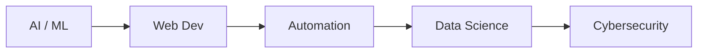
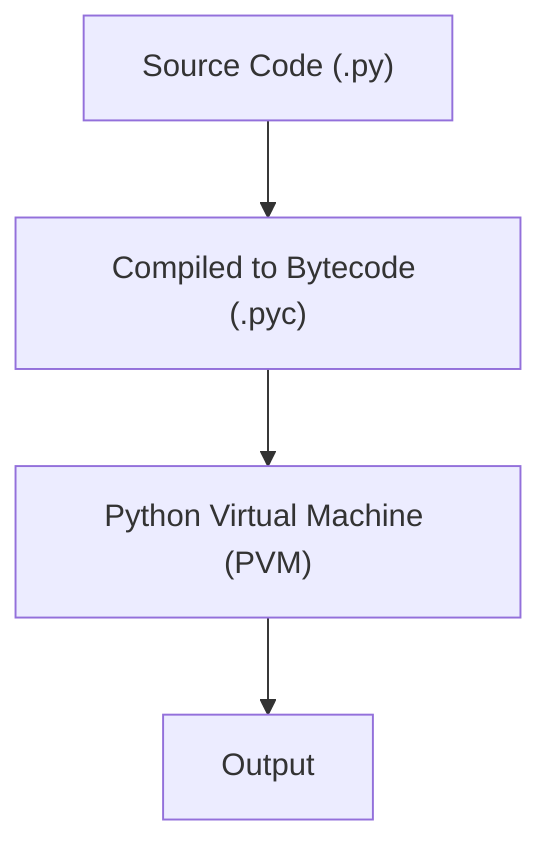

# PYTHON — CHAPTER 0
## Introduction to Programming

> “Before you can speak Python, you need to understand what it means to talk to a computer at all.”

### By the End of This Chapter, You Will Be Able To:
* Explain what programming actually is, in plain terms
* Describe what Python is and why it became so popular
* Name real industries and products built with Python
* Trace what happens, step by step, when a Python file runs
* Explain the difference between interpreted and compiled languages
* Write, save, and run your very first Python program
 
---

### 1. What is Programming?

Imagine you're explaining to a five-year-old how to make a cup of tea. You wouldn't just say "make tea" — you'd have to spell out every single step: fill the kettle, switch it on, wait for it to boil, put a tea bag in a cup, pour the water, wait, add milk if they want it, stir, done. Miss a step, and the tea doesn't get made — or it gets made wrong.

That is exactly what programming is. A computer is like an extremely fast, extremely literal five-year-old: it will do precisely what you tell it, in precisely the order you tell it, and nothing more. It cannot guess your intention, fill in a gap, or say "I think you meant...". Programming is the skill of writing that step-by-step recipe — called an **algorithm** — in a form the computer can follow exactly, called **code**.

#### Every program is built from four ingredients
No matter how advanced a piece of software is — a video game, a banking app, a self-driving car — it's built from combinations of just four basic ingredients. You will meet each of these in detail over the next few chapters, but it helps to see the whole picture now:

| Ingredient | What it does | Real-life equivalent |
| :--- | :--- | :--- |
| **Data** | The information a program works with | The tea, water, milk, sugar |
| **Instructions** | The individual steps to perform | "Boil the water", "add milk" |
| **Decisions** | Choosing what to do based on a condition | "If they want sugar, add one spoon" |
| **Repetition** | Doing something more than once | "Stir until the sugar dissolves" |
 
> [!NOTE]
> **Key Idea**
> A program = Instructions + Data. The instructions describe what to do; the data is what the instructions act on. Everything else you learn — loops, functions, classes — is just a more powerful way of organizing these same four ingredients.
 
#### ✏ Try It Yourself
Before you touch any code, try this on paper: write down, as a numbered list, the exact steps needed to tie a shoelace. Be brutally precise — a computer would get stuck the moment you skip a step like "pick up the left lace." This is the mindset programming demands.

---

### 2. What is Python?

Python is a high-level, general-purpose programming language — "high-level" because it reads much closer to plain English than to the 1s and 0s a processor actually understands, and "general-purpose" because it isn't built for just one job. The same language that a student uses to average exam scores is used by researchers to train AI models and by companies to run production websites serving millions of people.

#### A short history
Python was created by a Dutch programmer named Guido van Rossum, who began working on it in December 1989 as a hobby project to keep himself occupied over the Christmas holidays. The first official release came out in 1991. Guido wanted a language that was powerful enough for serious software, but readable enough that code could almost be understood without a manual.

> [!TIP]
> **Fun Fact**
> Python isn't named after the snake. Guido van Rossum was a fan of the British comedy show "Monty Python's Flying Circus", and wanted a name that was "short, unique, and slightly mysterious." The snake logo came later, once the name had already stuck.
 
#### Why Python became so popular
* **Readability first** — Python was deliberately designed so that code looks almost like structured English, with indentation replacing the curly braces `{ }` used by languages like C or Java.
* **A massive standard library** — Python ships with built-in tools for handling files, dates, math, networking, and more, so you rarely start completely from scratch.
* **An enormous open-source ecosystem** — Beyond the standard library, over half a million third-party packages are freely available through a tool called `pip` — pre-built solutions for almost anything you can imagine, from AI to game development.
* **It's genuinely beginner-friendly** — Many universities teach Python as students' very first language, specifically because it lets you focus on problem-solving instead of fighting confusing syntax.
* **One language, many careers** — The same core language underlies web backends, data analysis, automation scripts, and machine learning — so the skills you build in this course carry directly into multiple career paths.

---

### 3. Where Python is Used

Python's simplicity and rich library ecosystem have made it one of the most widely used languages in the world. Here's what that looks like in practice, industry by industry:

* **Artificial Intelligence & Machine Learning** — libraries like TensorFlow, PyTorch, and scikit-learn make Python the default language for AI research and production models. When you hear about a new chatbot, image generator, or recommendation system, there is a very good chance its core was built in Python.
* **Web Development** — frameworks like Django and Flask/FastAPI power backends for companies such as Instagram, Spotify, and Pinterest. Python handles the "behind the scenes" logic — user accounts, databases, business rules — while the site you see in your browser is built with HTML, CSS, and JavaScript.
* **Automation / Scripting** — Python is widely used to automate repetitive tasks: renaming thousands of files, sending scheduled emails, scraping data from websites, or auto-filling online forms. This is often the very first practical use people find for Python — turning a two-hour manual chore into a script that runs in ten seconds.
* **Data Science** — pandas, NumPy, and Matplotlib make Python a standard tool for cleaning, analyzing, and visualizing data. Analysts at companies like Netflix and Uber use Python daily to understand what their millions of users are doing and why.
* **Cybersecurity** — Python is used to write penetration-testing tools, automate security scans, and analyze malware. Its quick, scriptable nature makes it a favorite for both security researchers and attackers — which is exactly why security professionals need to know it well.
 

 
> [!TIP]
> **Fun Fact**
> Python is one of the core languages used inside Google's search infrastructure, was used by NASA for mission-critical space shuttle software, and Instagram — serving over two billion users — runs one of the largest deployments of Django (a Python web framework) in the world.

---

### 4. How Python Executes Code

Here's something that surprises a lot of beginners: a computer's processor cannot read Python. It cannot read C, Java, or any language humans find comfortable to write in. A processor only understands machine code — long streams of binary 1s and 0s that map directly to electrical signals. So when you run a Python file, something has to bridge that gap between the code you wrote and the machine code your processor demands.

That bridge is the Python interpreter, and it works in two stages:


 
* You write human-readable code in a `.py` file — this is called **source code**.
* The Python interpreter first compiles this source code into an intermediate form called **bytecode** — a low-level, platform-independent set of instructions, usually stored in a `.pyc` file.
* The **Python Virtual Machine**, or **PVM**, reads this bytecode and executes it line by line, translating each instruction into something your specific machine's processor can actually run, and producing the program's output.
 
This is why Python is usually called an interpreted language, even though a compilation step (to bytecode) happens internally. The key difference from a fully compiled language is that all of this happens automatically, invisibly, and at runtime — the moment you type `python hello.py` — rather than as a separate build step you have to manage yourself.
 
> [!NOTE]
> **Under the Hood**
> You'll sometimes see a `__pycache__` folder appear next to your `.py` files after running them — that's Python caching the compiled bytecode so that the next run can skip straight to it, slightly speeding up startup. You can safely ignore or delete this folder; Python will simply regenerate it.

---

### 5. Interpreted vs Compiled Languages

Programming languages are often classified by how their code gets turned into something a machine can run. Understanding this distinction explains a lot about why Python feels and behaves the way it does.

Think of it like translating a speech. A **compiled language** is like translating the entire speech into another language ahead of time, printing it as a booklet, and then handing that finished booklet to the audience — translation happens once, up front, and after that the delivery is fast. An **interpreted language** is like having a live interpreter on stage, translating the speaker's words one sentence at a time, in real time, as the speech is being given.

| Aspect | Compiled Language (e.g. C, C++) | Interpreted Language (e.g. Python) |
| :--- | :--- | :--- |
| **Execution** | Entire program translated to machine code before running | Code is translated and run statement-by-statement |
| **Speed** | Generally faster at runtime | Generally slower at runtime |
| **Error detection** | Errors caught at compile time, before execution | Errors often surface only when that line runs |
| **Portability** | Compiled binary is platform-specific | Same source code runs anywhere with an interpreter |
| **Development speed** | Slower edit-compile-run cycle | Fast to write, test, and iterate |
 
> [!NOTE]
> **Note**
> Python is technically a hybrid: it compiles source code to bytecode first, then interprets that bytecode using the PVM. In everyday use, though, it behaves like an interpreted language — you just run the file and it executes, with no separate build step for you to manage.

---

### 6. Your First Program: "Hello, World!"

By tradition, going back over 50 years, the very first program written in any new language simply displays the text "Hello, World!" on the screen. It's a small, almost ceremonial exercise — but it proves that your setup works, from writing the code to actually seeing a result. In Python, this takes a single line:

```python
print("Hello, World!")
```
 
`print()` is a built-in function that displays whatever is passed inside its parentheses onto the screen. The text inside the quotes — `"Hello, World!"` — is called a **string**, and it's passed to `print()` as an argument.
 
#### Step by step: from blank screen to output
* **1. Open a text editor or IDE** — any plain text editor works, but a code editor like VS Code gives you helpful color highlighting and error detection.
* **2. Type the code** — write `print("Hello, World!")` exactly as shown, including the parentheses and quotation marks.
* **3. Save the file with a .py extension** — for example, `hello.py`. This tells your computer and your editor that it's a Python file.
* **4. Open a terminal in the same folder** — in VS Code, you can do this with Terminal → New Terminal.
* **5. Run the file** — type `python hello.py` (or `python3 hello.py` on macOS/Linux) and press Enter.
 
Running this file from a terminal will produce:
```text
Hello, World!
```
This one line already shows two core ideas you'll use constantly for the rest of this course: calling a function (`print`) and passing it a value (the string `"Hello, World!"`).
 
#### Common first-run errors — and how to fix them

| Error message | What it usually means | Fix |
| :--- | :--- | :--- |
| `'python' is not recognized...` | Python isn't installed, or isn't added to your system PATH | Reinstall Python and check "Add Python to PATH", or try python3 instead of python |
| `SyntaxError: EOL while scanning string literal` | A quotation mark was left unclosed | Make sure every opening `" ` has a matching closing `" ` |
| `NameError: name 'print' is not defined` | print was likely misspelled, e.g. `Print` or `PRINT` | Python is case-sensitive — always use lowercase `print` |
| `No output at all` | The file wasn't saved before running, or the wrong file was run | Save the file first, and double-check the filename in your terminal command |
 
#### ✏ Try It Yourself
1. Modify the program to print your own name instead of "World".
2. Add a second `print()` line below the first, so your program prints two lines of output.
3. Try removing one of the closing quotation marks on purpose, run the file, and read the error Python gives you — getting comfortable reading errors early will save you hours later.

---

### Chapter Summary

#### Key Takeaways
* Programming means giving a computer precise, unambiguous, step-by-step instructions — a computer cannot infer what you meant.
* Python is a high-level, general-purpose language created by Guido van Rossum, valued for its readability and huge ecosystem.
* Python powers real-world work across AI/ML, web development, automation, data science, and cybersecurity.
* Running a `.py` file compiles it to bytecode, then the Python Virtual Machine (PVM) executes that bytecode.
* Python behaves like an interpreted language even though it compiles to bytecode internally — this is why it's sometimes called a hybrid.
* `print("Hello, World!")` is traditionally the first program written in any language, and shows two ideas you'll use everywhere: calling a function and passing it a value.
