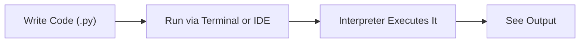

# PYTHON — CHAPTER 1
## Python Basics & Syntax

> “Every expert was once a beginner who refused to give up on line one.”

### By the End of This Chapter, You Will Be Able To:
* Install Python and run code three different ways: REPL, script, IDE
* Create and name variables correctly, and explain dynamic typing
* Identify and convert between Python's core data types
* Use arithmetic, comparison, logical, assignment, and bitwise operators confidently
* Take input from a user and format output cleanly with f-strings
* Write clean, PEP 8-compliant code with useful comments

---

### 1. Installing Python, Running Scripts, and Using an IDE/REPL

Before writing Python code, you need an interpreter installed on your machine. Python can be downloaded free from python.org — on Windows, make sure to check "Add Python to PATH" during installation so it can be run from any terminal. On macOS and most Linux distributions, Python usually comes pre-installed.

#### Three ways to run Python code
* **The REPL (interactive shell)** — typing `python` (or `python3`) in a terminal opens an interactive prompt where you can type one line at a time and see results immediately. Great for quick experiments.
* **Running a script** — writing code in a `.py` file and running it all at once from the terminal with `python filename.py`. This is how real programs are run.
* **An IDE / code editor** — tools like VS Code, PyCharm, or Jupyter Notebook combine writing and running code with helpful features like autocomplete, debugging, and error highlighting.



> [!TIP]
> **Fun Fact**
> The REPL name comes from "Read-Eval-Print Loop" — Python Reads what you type, Evaluates it, Prints the result, and Loops back for your next line. Try opening a terminal and typing `python` right now: you'll see `>>>`, the REPL's prompt, waiting for your first command.

---

### 2. Variables, Naming Conventions & Dynamic Typing

A variable is a name that refers to a value stored in memory. Think of it as a labeled box: the label is the variable name, and whatever you put inside the box is the value. In Python, you create a variable simply by assigning a value to a name — there's no separate declaration step:

```python
name = "Alice"
age = 25
price = 19.99
```

#### Naming rules and conventions
* Names can contain letters, digits, and underscores, but can't start with a digit
* Names are case-sensitive: `age` and `Age` are different variables
* Cannot use Python reserved keywords (`if`, `for`, `class`, etc.) as variable names
* Convention: use `snake_case` for variables and functions (`student_name`, `total_score`)
* Choose descriptive names — favor `student_count` over `sc` or `x`

> [!NOTE]
> **Key Idea — Dynamic Typing**
> Python is dynamically typed: you don't declare a variable's type, and the same variable can be reassigned to a different type later. The type is determined automatically from the value it currently holds.

#### Program 1.1 — Watching a variable change type
```python
x = 10
print(x, type(x))

x = "hello"
print(x, type(x))

x = 3.14
print(x, type(x))
```

Output:
```text
10 <class 'int'>
hello <class 'str'>
3.14 <class 'float'>
```

Notice that `x` is reassigned three times, each time to a different type — and Python never complains. This flexibility is convenient, but it also means you're responsible for keeping track of what a variable currently holds.

#### ✏ Try It Yourself
Create a variable called `city` and assign it your hometown. Print it along with `type(city)`. Then reassign `city` to the number of letters in that city's name (using `len()`) and print it again — watch the type change from `str` to `int`.

---

### 3. Data Types: int, float, str, bool, None

Every value in Python has a type, which determines what operations can be performed on it. The five most fundamental built-in types are:

| Type | Description | Example |
| :--- | :--- | :--- |
| **int** | Whole numbers, positive or negative | `age = 21` |
| **float** | Numbers with a decimal point | `price = 9.99` |
| **str** | Text, written inside quotes | `name = "Ravi"` |
| **bool** | Truth value: `True` or `False` | `is_active = True` |
| **None** | Represents "no value" / absence of a value | `result = None` |

#### Program 1.2 — A type inspector
A small program that reveals the type of several different values at once:
```python
values = [21, 9.99, "Ravi", True, None]

for v in values:
    print(v, "->", type(v))
```

Output:
```text
21 -> <class 'int'>
9.99 -> <class 'float'>
Ravi -> <class 'str'>
True -> <class 'bool'>
None -> <class 'NoneType'>
```

This is a genuinely useful debugging habit: whenever a program behaves unexpectedly, printing `type(variable)` is often the fastest way to find out what's actually going wrong.

---

### 4. Type Casting and Conversion

Type casting means converting a value from one type to another. This is common when, for example, you read a number from user input (which always arrives as a string) and need to do math with it.

| Function | Converts to | Example |
| :--- | :--- | :--- |
| `int(x)` | Integer | `int("42")` → `42` |
| `float(x)` | Floating-point number | `float("3.14")` → `3.14` |
| `str(x)` | String | `str(100)` → `"100"` |
| `bool(x)` | Boolean | `bool(0)` → `False`, `bool(5)` → `True` |

#### Program 1.3 — Adding two numbers typed as text
This program shows why casting matters. Without it, Python would join the two strings together instead of adding the numbers:
```python
num1 = "12"
num2 = "8"

wrong = num1 + num2 # string concatenation, not addition
correct = int(num1) + int(num2)

print("Without casting:", wrong)
print("With casting:", correct)
```

Output:
```text
Without casting: 128
With casting: 20
```

> [!WARNING]
> **Watch Out**
> `int("3.5")` raises a `ValueError` — `int()` can't parse a decimal point directly from a string. Convert to float first, then to int if needed: `int(float("3.5"))`.

---

### 5. Operators

Operators let you combine and compare values. Python groups them into a few families:

#### Arithmetic operators

| Operator | Meaning | Example |
| :--- | :--- | :--- |
| `+` | Addition | `5 + 2` → `7` |
| `-` | Subtraction | `5 - 2` → `3` |
| `*` | Multiplication | `5 * 2` → `10` |
| `/` | Division (always returns a float) | `5 / 2` → `2.5` |
| `//` | Floor division (drops the remainder) | `5 // 2` → `2` |
| `%` | Modulus (remainder) | `5 % 2` → `1` |
| `**` | Exponent | `5 ** 2` → `25` |

#### Comparison operators

| Operator | Meaning | Example |
| :--- | :--- | :--- |
| `==` | Equal to | `5 == 5` → `True` |
| `!=` | Not equal to | `5 != 3` → `True` |
| `>` | Greater than | `5 > 3` → `True` |
| `<` | Less than | `5 < 3` → `False` |
| `>=` | Greater than or equal to | `5 >= 5` → `True` |
| `<=` | Less than or equal to | `5 <= 5` → `True` |

#### Logical operators

| Operator | Meaning | Example |
| :--- | :--- | :--- |
| `and` | True if both sides are True | `(5 > 3) and (2 < 4)` → `True` |
| `or` | True if at least one side is True | `(5 > 3) or (2 > 4)` → `True` |
| `not` | Flips a boolean value | `not True` → `False` |

#### Assignment operators

| Operator | Meaning | Example |
| :--- | :--- | :--- |
| `=` | Assign a value | `x = 5` |
| `+=` | Add and reassign | `x += 3` (same as `x = x + 3`) |
| `-=` `*=` `/=` | Subtract / multiply / divide and reassign | `x -= 2`, `x *= 2`, `x /= 2` |

#### Bitwise operators
Bitwise operators act directly on the binary representation of integers. They're less common in everyday code but show up in low-level or performance-sensitive work:

| Operator | Meaning | Example |
| :--- | :--- | :--- |
| `&` | Bitwise AND | `5 & 3` → `1` |
| `|` | Bitwise OR | `5 | 3` → `7` |
| `^` | Bitwise XOR | `5 ^ 3` → `6` |
| `~` | Bitwise NOT | `~5` → `-6` |
| `<<` | Left shift | `5 << 1` → `10` |
| `>>` | Right shift | `5 >> 1` → `2` |

#### Program 1.4 — A tiny calculator
Putting several operator families to work in one program:
```python
a = 15
b = 4

print("Sum:", a + b)
print("Difference:", a - b)
print("Product:", a * b)
print("Division:", a / b)
print("Floor Division:", a // b)
print("Remainder:", a % b)
print("Is a greater than b?", a > b)
print("Is a even AND b even?", (a % 2 == 0) and (b % 2 == 0))
```

Output:
```text
Sum: 19
Difference: 11
Product: 60
Division: 3.75
Floor Division: 3
Remainder: 3
Is a greater than b? True
Is a even AND b even? False
```

#### ✏ Try It Yourself
Change `a` and `b` in Program 1.4 to two numbers of your choice, predict every line of output on paper first, then run it and check how many you got right.

---

### 6. Input / Output

Programs become interactive once they can take input from a user and display output back. Python provides `input()` and `print()` for exactly this.

```python
name = input("What is your name? ")
print("Hello, " + name + "!")
```

> [!IMPORTANT]
> **Important**
> `input()` always returns a string, even if the user types a number. Wrap it with `int()` or `float()` if you need to do math with it: `age = int(input("Age: "))`.

#### String formatting
There are three common ways to build strings that include variable values. f-strings (Python 3.6+) are the modern, most readable choice:

```python
name = "Meera"
score = 92

# f-string (recommended)
print(f"{name} scored {score} marks")

# .format() method
print("{} scored {} marks".format(name, score))

# % formatting (older style)
print("%s scored %d marks" % (name, score))
```

#### Program 1.5 — A simple BMI calculator
This program combines `input()`, casting, arithmetic, and f-strings — everything covered in this chapter, in one small, genuinely useful program:

```python
weight = float(input("Enter your weight in kg: "))
height = float(input("Enter your height in m: "))

bmi = weight / (height ** 2)

print(f"Your BMI is {bmi:.2f}")
```

Example run (user input shown after the prompts):
```text
Enter your weight in kg: 60
Enter your height in m: 1.65
Your BMI is 22.04
```

> [!TIP]
> **Formatting Tip**
> The `:.2f` inside the f-string above means "format this number as a float, rounded to 2 decimal places." Try `f"{bmi:.0f}"` or `f"{bmi:.4f}"` to see how the decimal count changes.

---

### 7. Comments and Code Style (PEP 8 Basics)

Comments are notes in your code that Python ignores when running — they exist purely to explain your code to other people (and to your future self).

```python
# This is a single-line comment

"""
This is a multi-line comment,
often used as a docstring at the
top of a file or function.
"""
```

PEP 8 is Python's official style guide. Following it makes your code readable and consistent with the rest of the Python community — important once you start working on shared codebases, and something interviewers and reviewers do notice.

#### PEP 8 basics
* Use 4 spaces per indentation level (not tabs)
* Keep lines to a maximum of about 79 characters where practical
* Use `snake_case` for variables and functions, `CapWords` for classes
* Put spaces around operators: `x = 5 + 2`, not `x=5+2`
* Use two blank lines between top-level function/class definitions

#### Before and after: the same program, two ways
Both programs below do exactly the same thing. Only one of them is code you'd want to inherit from a teammate:

```python
# Hard to read
def calc(a,b,c):
 x=a+b
 y=x*c
 return y

# PEP 8 style — easy to read
def calculate_total(price, tax, quantity):
 subtotal = price + tax
 total = subtotal * quantity
 return total
```

Both versions run identically. But the second one tells you what it does just from reading it, which is the entire point of good style — code is read far more often than it's written.

---

### Mini Project: Personal Profile Card

Let's bring everything from this chapter together in one small program. It takes a few pieces of information from the user, converts types where needed, and prints a neatly formatted "profile card" using f-strings.

```python
# profile_card.py
name = input("Enter your name: ")
age = int(input("Enter your age: "))
city = input("Enter your city: ")
is_student = input("Are you a student? (yes/no): ").lower() == "yes"

print("\n----- PROFILE CARD -----")
print(f"Name     : {name}")
print(f"Age      : {age}")
print(f"City     : {city}")
print(f"Student  : {is_student}")
print("-------------------------")
```

Example run:
```text
Enter your name: Kiran
Enter your age: 20
Enter your city: Hyderabad
Are you a student? (yes/no): yes

----- PROFILE CARD -----
Name     : Kiran
Age      : 20
City     : Hyderabad
Student  : True
-------------------------
```

#### ✏ Try It Yourself
Extend the profile card: add a `favorite_language` field, and a line that prints "Years until you turn 30: " using simple arithmetic on age. Try changing the layout so the card is surrounded by a border of `*` characters.

---

### Chapter Summary

#### Key Takeaways
* Python code can be run through the REPL, as a saved script, or inside an IDE — each suits a different kind of task.
* Variables are created by assignment, with no separate declaration step; Python is dynamically typed, so a variable's type can change on reassignment.
* The five core built-in types are `int`, `float`, `str`, `bool`, and `None`.
* `input()` always returns a string — cast it with `int()` or `float()` before doing math with it.
* f-strings are the modern, recommended way to build strings that include variable values, and support formatting like `:.2f` for decimals.
* PEP 8 is Python's style guide: 4-space indentation, `snake_case` names, and spacing around operators make code easier for others (and future you) to read.
