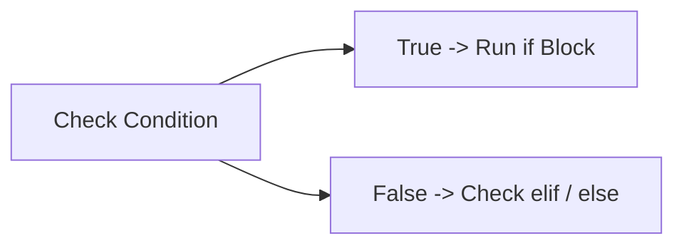

# PYTHON — CHAPTER 2
## Control Flow

> “A program that always does the same thing, the same way, isn't very useful. Control flow is how code makes decisions.”

### By the End of This Chapter, You Will Be Able To:
* Make decisions in code using if / elif / else
* Repeat actions using for loops and while loops
* Control a loop precisely with break, continue, and pass
* Read and write nested loops and conditionals
* Use range(), enumerate(), and zip() to loop more powerfully
* Recognize and apply common loop patterns: accumulator, counter, search

---

### 1. if / elif / else Conditionals

Every program you've written so far has run top to bottom, one line after another, no matter what. Control flow is what breaks that straight line — it's how a program looks at the world and decides what to do next. Conditionals are the simplest form of control flow: they let a program run different code depending on whether something is True or False.

```python
age = 20

if age < 13:
    print("Child")
elif age < 20:
    print("Teenager")
else:
    print("Adult")

# Output: Adult
```

* `if` checks a condition; its block runs only when that condition is True
* `elif` ("else if") checks another condition, only if the previous ones were False
* `else` runs when none of the above conditions were True — it has no condition of its own
* Python uses indentation (not braces) to mark which lines belong to a block



#### Program 2.1 — A simple grade classifier
```python
score = 78

if score >= 90:
    grade = "A"
elif score >= 75:
    grade = "B"
elif score >= 60:
    grade = "C"
else:
    grade = "F"

print(f"Score: {score} -> Grade: {grade}")
```

Output:
```text
Score: 78 -> Grade: B
```

Notice that Python checks conditions top to bottom and stops at the first True one — even though 78 is also >= 60, it never reaches that elif because 78 >= 75 already matched first. Order matters in an elif chain.

> [!WARNING]
> **Watch Out**
> Indentation is not just style in Python — it's part of the syntax. Inconsistent indentation (mixing tabs and spaces, or wrong indent levels) causes an `IndentationError`.

#### ✏ Try It Yourself
Rewrite Program 2.1 so it also prints "Great job!" whenever the grade is A or B, using a second if check with the `or` operator (`grade == "A" or grade == "B"`).

---

### 2. for Loops and while Loops

Loops let you repeat a block of code multiple times without writing it out repeatedly.

#### for loops — iterate over a known sequence
A for loop runs its block once for each item in a sequence (like a list, string, or range of numbers):

```python
fruits = ["apple", "banana", "cherry"]
for fruit in fruits:
    print(fruit)
```

Output:
```text
apple
banana
cherry
```

#### while loops — repeat until a condition becomes False
A while loop keeps running its block as long as its condition stays True. It's used when you don't know in advance how many times you'll need to repeat:

```python
count = 0
while count < 3:
    print("Count is", count)
    count += 1
```

Output:
```text
Count is 0
Count is 1
Count is 2
```

> [!WARNING]
> **Watch Out — Infinite Loops**
> A while loop's condition must eventually become False, or it will run forever. Always make sure something inside the loop moves it toward that end (like `count += 1` above).

#### Program 2.2 — A simple countdown
A classic while loop use case, ending with a message once the countdown is done:

```python
seconds = 5

while seconds > 0:
    print(seconds)
    seconds -= 1

print("Liftoff!")
```

Output:
```text
5
4
3
2
1
Liftoff!
```

---

### 3. break, continue, and pass

These three keywords give you finer control over how a loop runs:

| Keyword | Effect | Example use |
| :--- | :--- | :--- |
| **break** | Immediately exits the loop entirely | Stop searching once the item is found |
| **continue** | Skips the rest of the current iteration, moves to the next one | Skip processing invalid entries |
| **pass** | Does nothing — a placeholder so empty code is still valid syntax | Stub out a function/loop body you'll fill in later |

#### Program 2.3 — break and continue together
```python
for num in range(10):
    if num == 5:
        break # stop the loop completely
    if num % 2 == 0:
        continue # skip even numbers, go to next iteration
    print(num)
```

Output:
```text
1
3
```

Trace it by hand: 0 is even, so continue skips it. 1 is odd, so it prints. 2 is even, skipped. 3 is odd, prints. 4 is even, skipped. Then `num == 5` triggers break, and the loop stops before it ever gets the chance to print 5.

---

### 4. Nested Loops and Conditionals

Loops and conditionals can be placed inside one another. This is common when working with grids, tables, or combinations of two lists — but nesting adds complexity, so keep an eye on indentation and readability.

#### Program 2.4 — A small diagonal pattern
```python
for row in range(3):
    for col in range(3):
        if row == col:
            print("*", end=" ")
        else:
            print(".", end=" ")
    print() # move to the next line after each row
```

Output:
```text
* . .
. * .
. . *
```

> [!NOTE]
> **Key Idea**
> Each level of nesting adds one more indentation level. The inner loop completes all of its iterations before the outer loop moves to its next iteration — that's why the pattern fills in one full row at a time.

#### ✏ Try It Yourself
Modify Program 2.4 to print a 5x5 grid instead of 3x3, and change the condition so it draws an X shape instead of a diagonal (hint: you'll need a second condition for the other diagonal, `row + col == size - 1`).

---

### 5. range(), enumerate(), and zip() in Loops

#### range() — generate a sequence of numbers
`range()` is commonly used with for loops when you need to repeat something a set number of times, or need the index itself.

```python
range(5)        # 0, 1, 2, 3, 4
range(2, 6)     # 2, 3, 4, 5
range(0, 10, 2) # 0, 2, 4, 6, 8 (start, stop, step)
```

#### enumerate() — get both index and value
When you need an item's position while looping over it, `enumerate()` is cleaner than manually tracking a counter variable:

```python
colors = ["red", "green", "blue"]
for index, color in enumerate(colors):
    print(index, color)
```

Output:
```text
0 red
1 green
2 blue
```

#### zip() — loop over multiple sequences together
`zip()` pairs up items from two or more sequences by position, so you can loop over them in lockstep:

```python
names = ["Asha", "Ravi"]
scores = [88, 92]
for name, score in zip(names, scores):
    print(f"{name}: {score}")
```

Output:
```text
Asha: 88
Ravi: 92
```

#### Program 2.5 — A class roster with rankings
Combining `enumerate()` and `zip()` to build a formatted, ranked roster:

```python
names = ["Asha", "Ravi", "Meera"]
scores = [92, 88, 95]

for rank, (name, score) in enumerate(zip(names, scores), start=1):
    print(f"{rank}. {name} — {score} marks")
```

Output:
```text
1. Asha — 92 marks
2. Ravi — 88 marks
3. Meera — 95 marks
```

> [!NOTE]
> **Note**
> `enumerate(..., start=1)` tells Python to begin counting from 1 instead of the default 0 — handy whenever a count needs to match how humans naturally number things.

---

### 6. Common Loop Patterns

Most loops you write will fall into a handful of recurring patterns. Recognizing them makes it much faster to write new loops from scratch.

#### Accumulator pattern — build up a running total
```python
numbers = [4, 8, 15, 16, 23]
total = 0
for n in numbers:
    total += n
print(total) # 66
```

#### Counter pattern — count how many items match a condition
```python
words = ["cat", "dog", "cow", "ant"]
count = 0
for w in words:
    if w.startswith("c"):
        count += 1
print(count) # 2
```

#### Search pattern — find the first match, then stop
```python
names = ["Kiran", "Divya", "Arjun"]
target = "Arjun"
found = False
for name in names:
    if name == target:
        found = True
        break
print(found) # True
```

---

### Mini Project: Number Guessing Game

This chapter's project brings together while loops, conditionals, break, and the accumulator/counter mindset — a genuinely fun program that's also a rite of passage for every new Python programmer.

```python
# guessing_game.py
import random

secret = random.randint(1, 20)
attempts = 0

while True:
    guess = int(input("Guess a number between 1 and 20: "))
    attempts += 1
    
    if guess < secret:
        print("Too low!")
    elif guess > secret:
        print("Too high!")
    else:
        print(f"Correct! You got it in {attempts} attempts.")
        break
```

Example run:
```text
Guess a number between 1 and 20: 10
Too low!
Guess a number between 1 and 20: 15
Too high!
Guess a number between 1 and 20: 13
Correct! You got it in 3 attempts.
```

The `while True:` loop runs forever on purpose — the only way out is the `break` inside the `else` branch, once the guess is correct. This is a very common pattern for "keep asking until the user gets it right."

#### ✏ Try It Yourself
Add a maximum of 5 attempts to the guessing game: track attempts, and if it reaches 5 without a correct guess, break out of the loop and print the secret number as a "Game Over" message.

---

### Chapter Summary

#### Key Takeaways
* Conditionals (`if` / `elif` / `else`) let a program choose between different blocks of code based on True/False conditions, checked top to bottom.
* `for` loops iterate over a known sequence; `while` loops repeat until a condition becomes False — watch for infinite loops.
* `break` exits a loop entirely; `continue` skips to the next iteration; `pass` is a no-op placeholder.
* Nested loops run the inner loop completely for every single iteration of the outer loop.
* `range()`, `enumerate()`, and `zip()` are the three most common tools for controlling and enriching what a loop iterates over.
* Most real loops follow one of three patterns: accumulator (running total), counter (count matches), or search (find and stop).
