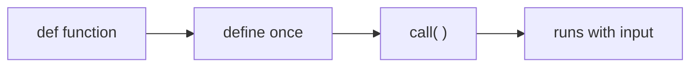
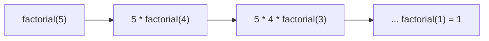

# PYTHON — CHAPTER 4
## Functions

> “Don't repeat yourself — write it once, name it well, and call it whenever you need it.”

### By the End of This Chapter, You Will Be Able To:
* Define and call your own functions to organize code into reusable, testable pieces
* Use positional, keyword, default, and variable-length arguments (*args, **kwargs) with confidence
* Distinguish return values from side effects, and know when a function needs to return something
* Understand variable scope — local, global, and nonlocal — and avoid common scope bugs
* Write concise lambda functions for short, throwaway logic
* Understand recursion, write simple recursive functions, and know when iteration is the better choice
* Document functions properly using docstrings and standard conventions

---

### 1. Defining and Calling Functions

A function is a named, reusable block of code. Instead of copy-pasting the same logic everywhere, you define it once with `def`, and call it by name whenever you need it — with different inputs each time.

```python
def greet(name):
    print(f"Hello, {name}!")

greet("Asha")
greet("Ravi")
```

Output:
```text
Hello, Asha!
Hello, Ravi!
```

* `def` starts a function definition, followed by the function name and parentheses.
* `name` inside the parentheses is a parameter — a placeholder for whatever value gets passed in.
* `"Asha"` and `"Ravi"` are arguments — the actual values supplied when calling the function.
* The function body is indented; it only runs when the function is called, not when it's defined.



> [!WARNING]
> **Watch Out**
> Defining a function does not run it. `def greet(name): ...` only creates the function — nothing prints until you actually call `greet("Asha")`. Beginners often expect output right after the `def` block and are confused when nothing happens.

---

### 2. Positional, Keyword, Default & Variable-Length Arguments

Python gives you several ways to pass data into a function, each suited to different situations.

#### Positional and keyword arguments
```python
def describe_pet(name, animal_type):
    print(f"{name} is a {animal_type}.")

describe_pet("Rex", "dog")                  # positional — order matters
describe_pet(animal_type="cat", name="Milo") # keyword — order doesn't matter
```

Output:
```text
Rex is a dog.
Milo is a cat.
```

#### Default arguments
```python
def describe_pet(name, animal_type="dog"):
    print(f"{name} is a {animal_type}.")

describe_pet("Rex")          # uses the default: "dog"
describe_pet("Milo", "cat")  # overrides the default
```

Output:
```text
Rex is a dog.
Milo is a cat.
```

> [!NOTE]
> **Note**
> Parameters with defaults must come after parameters without defaults in the function signature — `def f(a, b=1)` is valid, `def f(a=1, b)` is a `SyntaxError`.

#### Variable-length arguments: *args and **kwargs
Sometimes you don't know in advance how many arguments will be passed. `*args` collects extra positional arguments into a tuple; `**kwargs` collects extra keyword arguments into a dictionary.

```python
def total_bill(*items):
    print(items) # a tuple of every value passed in
    return sum(items)

print(total_bill(120, 45, 30))

def build_profile(**details):
    print(details) # a dict of every keyword=value passed in

build_profile(name="Asha", age=21, city="Hyderabad")
```

Output:
```text
(120, 45, 30)
195
{'name': 'Asha', 'age': 21, 'city': 'Hyderabad'}
```

> [!NOTE]
> **Key Idea**
> Remember the shape each one produces: `*args` → tuple of positional values, `**kwargs` → dictionary of keyword values. The names `args` and `kwargs` are convention, not required — it's the `*` and `**` that matter.

#### ✏ Try It Yourself
Write a function `calculate_average(*numbers)` that returns the average of any number of arguments passed to it, e.g. `calculate_average(4, 8, 6)` should return `6.0`.

---

### 3. Return Values vs. Side Effects

A function can hand back a result using `return`, or it can just do something (print, modify a list, write a file) without returning anything meaningful. Knowing the difference is essential — it decides whether you can actually use what the function "produced".

```python
def add_side_effect(a, b):
    print(a + b) # only prints — does not return a usable value

def add_return(a, b):
    return a + b # hands the result back to the caller

result1 = add_side_effect(3, 4) # prints 7, but result1 is None
result2 = add_return(3, 4)     # result2 is 7 — usable!

print(result1) # None
print(result2) # 7
```

Output:
```text
7
None
7
```

> [!WARNING]
> **Watch Out**
> A function with no explicit return statement returns `None` by default. If you try to use the "result" of a print-only function in further calculations, you'll silently get `None` and confusing errors downstream.

> [!NOTE]
> **Real-World Use**
> ATM withdrawal logic returns the new balance (a return value) but also prints a receipt (a side effect) — real functions often do both, but it's the return value you build further logic on.

---

### 4. Scope — Local, Global & Nonlocal

Scope determines where a variable can be seen and used. Getting scope wrong is one of the most common sources of bugs for new programmers, so it's worth slowing down here.

#### Local scope
```python
def calculate():
    total = 100 # local variable — only exists inside calculate()
    print(total)

calculate()
# print(total) # NameError: total is not defined out here
```

#### Global scope
```python
counter = 0 # global variable

def increment():
    global counter # tells Python: use the global counter, don't create a local one
    counter += 1

increment()
increment()
print(counter) # 2
```

> [!WARNING]
> **Watch Out**
> Without the `global` keyword, `counter += 1` inside the function would raise an `UnboundLocalError` — Python assumes any variable you assign to inside a function is local, unless told otherwise.

#### Nonlocal scope (nested functions)
```python
def outer():
    message = "hi"
    def inner():
        nonlocal message # refers to outer()'s message, not global
        message = "hello"
    inner()
    print(message) # hello

outer()
```

> [!NOTE]
> **Key Idea**
> The rule of thumb: local is the default (a function's own variables), global reaches all the way out to module level, and nonlocal reaches one level out — to the enclosing function, not the global scope.

---

### 5. Lambda Functions

A lambda is a small, unnamed function written in a single line — useful for short logic that's only needed once, especially as an argument to another function like `sorted()` or `max()`.

```python
# Regular function
def square(n):
    return n ** 2

# Same thing as a lambda
square_lambda = lambda n: n ** 2

print(square(5))        # 25
print(square_lambda(5)) # 25
```

#### Lambdas with sorted() and max()
```python
students = [("Asha", 92), ("Ravi", 78), ("Meera", 85)]

by_marks = sorted(students, key=lambda s: s[1], reverse=True)
print(by_marks)
```

Output:
```text
[('Asha', 92), ('Meera', 85), ('Ravi', 78)]
```

> [!NOTE]
> **Note**
> A lambda can only contain a single expression, not statements like if/else blocks or loops. If the logic needs more than one line, write a regular `def` function instead — that's what it's for.

---

### 6. Recursion Basics & Recursion vs. Iteration

A recursive function calls itself to solve a smaller version of the same problem, until it reaches a base case simple enough to answer directly. Every recursive function needs exactly two things: a base case (when to stop) and a recursive case (how to shrink the problem).

```python
def factorial(n):
    if n == 0 or n == 1: # base case — stop here
        return 1
    return n * factorial(n - 1) # recursive case — shrink the problem

print(factorial(5)) # 5 * 4 * 3 * 2 * 1
```

Output:
```text
120
```

#### Tracing the call stack


Each call waits for the next one to finish before it can multiply and return — so the calls stack up (`factorial(5)` waiting on `factorial(4)`, which waits on `factorial(3)`, and so on) until `factorial(1)` finally returns 1 and the stack unwinds.

> [!WARNING]
> **Watch Out**
> Forgetting the base case — or writing one that's never actually reached — causes infinite recursion, which eventually crashes with a `RecursionError: maximum recursion depth exceeded`. Always double-check that every recursive call moves closer to the base case.

#### Recursion vs. iteration
```python
# Same result, iterative version
def factorial_iterative(n):
    result = 1
    for i in range(2, n + 1):
        result *= i
    return result

print(factorial_iterative(5)) # 120
```

> [!NOTE]
> **Key Idea**
> Recursion often reads more naturally for problems that are inherently self-similar (tree traversal, nested folders, mathematical definitions), while iteration is usually faster and uses less memory for simple repeated counting. When either works cleanly, iteration is usually the safer default.

#### ✏ Try It Yourself
Write a recursive function `fibonacci(n)` that returns the nth Fibonacci number (0, 1, 1, 2, 3, 5, 8, ...), where `fibonacci(0) = 0` and `fibonacci(1) = 1` are the base cases.

---

### 7. Docstrings & Function Documentation

A docstring is a string literal placed as the first line inside a function, describing what it does. Unlike a regular comment, it becomes part of the function's metadata and can be viewed with `help()` — good practice for any function others (or future you) will read.

```python
def calculate_bmi(weight_kg, height_m):
    """
    Calculate Body Mass Index (BMI).
    Args:
        weight_kg (float): weight in kilograms
        height_m (float): height in meters
    Returns:
        float: the calculated BMI, rounded to 1 decimal place
    """
    bmi = weight_kg / (height_m ** 2)
    return round(bmi, 1)

print(calculate_bmi(70, 1.75))
print(calculate_bmi.__doc__) # prints the docstring itself
```

Output:
```text
22.9
```

> [!NOTE]
> **Note**
> The Args / Returns convention shown above is one common style (Google style). What matters more than the exact format is consistency: always describe what the function does, what it expects, and what it gives back.

> [!NOTE]
> **Real-World Use**
> Login/authentication systems, calculator engines, and ATM operations are all built from small, well-documented functions like `check_password()`, `calculate_interest()`, and `withdraw_amount()` — each doing one clear job.

---

### 8. Mini Project: Simple ATM Simulator

This project brings the whole chapter together: functions with default arguments, a return value vs. side effect distinction, global state for the balance, and clear docstrings.

```python
# atm_simulator.py

balance = 1000 # global starting balance

def check_balance():
    """Return the current account balance."""
    return balance

def deposit(amount):
    """Add amount to the global balance and return the new balance."""
    global balance
    balance += amount
    return balance

def withdraw(amount, fee=0):
    """
    Withdraw amount (plus an optional fee) from the global balance.
    Returns the new balance, or None if funds are insufficient.
    """
    global balance
    total_deduction = amount + fee
    if total_deduction > balance:
        print("Insufficient funds.")
        return None
    balance -= total_deduction
    return balance

print("Starting balance:", check_balance())
print("After deposit:", deposit(500))
print("After withdrawal:", withdraw(200, fee=5))
print("Over-withdraw attempt:", withdraw(5000))
```

Output:
```text
Starting balance: 1000
After deposit: 1500
After withdrawal: 1295
Insufficient funds.
Over-withdraw attempt: None
```

#### ✏ Try It Yourself
Add a `transaction_history = []` list and a helper function that appends a description string (e.g. `"Deposited 500"`) to it after every deposit/withdrawal, then a `print_history()` function to display it all.

---

### Chapter Summary

#### Key Takeaways
* **Functions** are defined with `def` and only run when called — packaging logic so it can be reused instead of repeated.
* **Arguments** can be positional, keyword, given defaults, or collected as `*args` (tuple) / `**kwargs` (dict) for flexible inputs.
* `return` hands back a usable value; a function with no return (or side-effect-only code) gives back `None`.
* **Scope rules**: local variables live inside their function, global reaches module-level, and nonlocal reaches one level out to an enclosing function.
* **Lambdas** are single-expression, unnamed functions — handy as a `key=` argument to `sorted()`/`max()`, but not a replacement for regular functions with real logic.
* **Recursion** needs a base case and a recursive case that shrinks the problem; iteration is usually the safer, more efficient default when either approach works.
* **Docstrings** document what a function does, its arguments, and its return value — write them for every function others will read.
