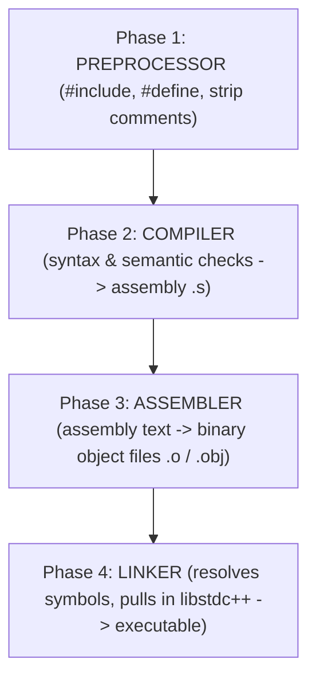

# C++ - CHAPTER 1
## C++ Foundations and the Development Environment

> “A compiler is not a translator you argue with. It is a contract you learn to write.” — A First Lesson in Toolchains

### Learning Objectives
By the end of this chapter, you will be able to:
* Trace the four distinct phases of the C++ compilation process (Preprocessing, Compilation, Assembly, and Linking).
* Structure, write, and execute a standard Modern C++ program.
* Understand the role of entry points (`main()`) and return codes.
* Differentiate between compiler errors and linker errors.
* Configure and run code using modern build tools.

---

### Introduction
Welcome to C++. You are about to embark on a journey to learn one of the most powerful, enduring, and widely used programming languages in the history of computer science. Many modern languages, like Python or JavaScript, are designed to hide the complexities of the computer hardware from you. C++ takes the opposite approach: it hands you the keys to the machine. As Bjarne Stroustrup explains in *A Tour of C++*, the language is built on the principle of "zero-overhead abstraction." You pay only for what you use, and by learning C++, you are learning how a computer fundamentally operates.

### Why This Topic Matters
Before writing complex algorithms, you must understand what C++ is, how it communicates with the hardware, and how to set up the environment required to translate human-readable code into machine instructions. Mastering the build process and basic syntax now prevents hours of frustration later.

### Real-World Connection
When you play a AAA video game, trade stocks on a high-frequency exchange, or use a web browser, C++ is running under the hood. Browsers like Chrome (V8 engine), operating systems, and game engines like Unreal Engine rely heavily on C++ for its zero-overhead abstractions and raw speed.

### Prerequisites
* Basic computer literacy.
* A text editor (e.g., VS Code) and a terminal.
* No prior programming experience required, though helpful.

---

### Chapter Roadmap
* Concept 1: C++ Origins, Ecosystem, and Use Cases
* Concept 2: The Compilation Pipeline
* Concept 3: Anatomy of a C++ Program and Entry Points
* Concept 4: Build Systems Overview
* Learning Support Elements
* Debugging and Problem Solving
* Practical Application & Mini Project
* Practice and Evaluation
* Chapter Conclusion

---

> [!NOTE]
> **Real-Life Analogy: The Publishing House**
> Imagine you have handwritten a manuscript. Before a reader can hold a finished book, four separate departments must touch your pages. The copy-editor pastes in the standard front matter you referenced and strikes out your margin notes — that is the preprocessor handling `#include` and stripping comments. The typesetter converts your prose into printing plates specific to one press — that is the compiler producing assembly for one CPU architecture. The press operator stamps the plates into physical signatures — that is the assembler producing object files. Finally, the bindery stitches every signature together with the index and the cover into one volume — that is the linker producing your executable.
> 
> The important lesson is that each department fails differently. A missing chapter reference is caught by the copy-editor. A grammatical mistake is caught by the typesetter. But a signature that was never printed at all is only discovered at the bindery — which is exactly why a missing function definition surfaces as a linker error, long after your syntax was accepted as correct.

---

### Real-World Applications

| Domain | How this chapter's ideas appear in practice |
| :--- | :--- |
| **Game Development** | Unreal Engine builds millions of lines through a custom build tool layered over the same four-phase pipeline; understanding link stages is how engineers cut hour-long builds to minutes. |
| **Operating Systems** | Kernel modules are compiled to object files and linked against a fixed ABI; a linker symbol mismatch is the single most common build failure. |
| **Browsers** | Chrome's V8 engine is C++ compiled ahead of time, then it in turn compiles JavaScript at runtime — a compiler inside a compiled program. |
| **Finance** | High-frequency trading firms pin exact compiler versions and flags in their build system because a different optimiser can change latency by microseconds. |
| **Embedded Systems** | Cross-compilation targets a CPU different from the build machine, which makes the separation of compile and link phases explicit and unavoidable. |
| **Cloud Computing** | Container images bake a reproducible toolchain so the same source yields a byte-identical binary on every build agent. |

---

### Core Learning Sections

#### CONCEPT 1: Introduction to C++ and its Ecosystem, and Use Cases
*Sub-topics Covered: 1.1 History and Evolution, 1.2 Where is C++ Used?*

**Intuitive Explanation:** Languages like Python or Java run inside virtual machines or interpreters, relying on an intermediary layer to translate code while the program executes. C++ compiles directly into raw machine code (binary instructions) understood natively by your computer's CPU. This direct hardware access gives C++ unmatched execution speed.

##### 1.1 History and Evolution
C++ began as "C with Classes" to introduce object-oriented features to C while retaining low-level memory control. Over the decades, standard committees have modernized the language through major milestones: C++98, C++11 (the modern renaissance introducing move semantics and smart pointers), C++17, C++20 (introducing concepts and ranges), and C++23.

##### 1.2 Where is C++ Used?
* **Game Development:** Engines like Unreal Engine rely entirely on C++ for real-time physics and rendering performance.
* **Systems Engineering:** Operating system components, database engines (MySQL, PostgreSQL), and file systems.
* **Finance:** High-frequency trading platforms where microsecond execution delays cost millions of dollars.

---

#### CONCEPT 2: The Compilation Pipeline
*Sub-topics Covered: 1.3 Preprocessing, 1.4 Compilation, 1.5 Assembler, 1.6 Linker*

**Intuitive Explanation:** Writing a C++ program is like writing a recipe in English. Your CPU only speaks binary (0s and 1s). The **Compilation Pipeline** is the factory assembly line that translates your human-readable source code into executable machine instructions.

##### 1.3 Phase 1: Preprocessing
Before compiling, the Preprocessor scans your code for lines starting with `#` (directives like `#include` or `#define`). It strips out comments, pastes header file contents directly into your source file, and resolves macros.

##### 1.4 Phase 2: Compilation
The compiler takes the preprocessed text and translates it into intermediate assembly code specific to your CPU architecture (such as x86 or ARM assembly), performing rigorous syntax checks along the way.

##### 1.5 Phase 3: Assembler
The assembler translates the assembly code into binary **Object Files** (files ending in `.o` or `.obj`), containing machine instructions that the CPU can process.

##### 1.6 Phase 4: Linker
Most programs span multiple files or rely on external libraries. The **Linker** stitches all individual object files together, resolves cross-file function calls, attaches standard library code, and generates the final executable binary (`.exe` on Windows or a binary executable on Unix/Linux).



---

#### CONCEPT 3: Anatomy of a C++ Program and Entry Points
*Sub-topics Covered: 1.7 Header Inclusion, 1.8 The main() Entry Point, 1.9 Namespaces and Standard Output*

**Intuitive Explanation:** Every movie needs a title sequence, a director, and a starting scene. A C++ program needs headers to provide tools, a `main()` function where execution begins, and instructions telling the computer what to display on the screen.

##### 1.7 Header Inclusion (`#include`)
To use pre-built components (like console input/output), you must import header files using `#include`. For standard library modules, angle brackets are used (e.g., `#include <iostream>`).

##### 1.8 The `main()` Entry Point
The operating system looks for a function named `main` to start executing your program. If `main` is missing, the linker throws a fatal error. By convention, a successful program returns `0` to the operating system upon completion.

##### 1.9 Namespaces and Standard Output (`std::cout`)
C++ organizes its standard library inside a namespace called `std` to prevent naming collisions with your own code. We access console printing using `std::cout` paired with the insertion operator `<<`.

##### Code Example: The Classic Hello World
```cpp
#include <iostream> // 1.7: Imports input/output stream library

// 1.8: The mandatory program entry point
int main() {
    // 1.9: Prints text to the console via standard output
    std::cout << "Hello, Modern C++ World!\n";
    // Returns 0 to indicate successful execution to the operating system
    return 0;
}
```

##### Expected Output:
```text
Hello, Modern C++ World!
```

##### Line-by-Line Explanation:
* `#include <iostream>`: Preprocessor directive that pulls in the Input/Output Stream library so we can write to the console.
* `int main()`: The mandatory starting point of every C++ executable. The `int` indicates it returns an integer status code.
* `std::cout`: Stands for "character output," representing the standard console display stream.
* `<<`: The insertion operator that pushes text data into the output stream.
* `\n`: Escape sequence representing a newline character.
* `return 0;`: Sends a success signal back to the operating system shell.

---

#### CONCEPT 4: Build Systems Overview
*Sub-topics Covered: 1.10 Build Systems (Make, CMake)*

##### 1.10 Build Systems
When your project grows from a single file to hundreds of source files, compiling them manually via command-line flags becomes impossible. **Build Systems** (like Make, Ninja, and CMake) automate the compilation graph, tracking which files have changed and recompiling only what is necessary to save time.

---

### Learning Support Elements

> [!TIP]
> **Tips: Use Modern Compilers**
> Always ensure your development environment supports Modern C++ (C++20 or C++23). Enable compiler warning flags (`-Wall -Wextra -Werror` on GCC/Clang or `/W4` on MSVC) to catch potential bugs early during compilation.

> [!NOTE]
> **Important Notes: Return Codes in main()**
> While omitting `return 0;` at the end of `main()` is technically legal in C++ (the compiler automatically inserts it for `main` only), it is considered best practice to explicitly write `return 0;` to maintain clarity and uniformity across all functions.

> [!WARNING]
> **Warnings: Never Rely on Undefined Behavior**
> C++ gives you raw hardware control. Violating language rules (such as reading uninitialized memory) results in **Undefined Behavior**, meaning the compiler makes no guarantees about what your program will do—it might crash, print garbage data, or appear to work on your machine while failing catastrophically in production.

#### Common Misconceptions
* **Misconception:** "A compiler error and a linker error are the same thing."
* **Reality:** Compiler errors happen when syntax or type rules are violated within a single file. Linker errors happen *after* compilation when the compiler cannot find the physical definition or body of a function or variable referenced across your project files.

#### Best Practices
* **Master Your Toolchain:** Spend time configuring your IDE (Visual Studio, VS Code, CLion) and compiler toolchains (GCC, Clang, MSVC) properly before embarking on large coding projects.
* **Keep Headers Clean:** Only include header files that are strictly required by your source file to minimize compilation time.

---

### Debugging and Problem Solving

#### Build Error: Undefined Reference (Linker Error)
* **Message:** `undefined reference to 'SomeFunction()'`
* **Cause:** You declared a function in a header or source file and called it, but you forgot to link the corresponding `.cpp` implementation file during the build process, or the function body was never written.
* **Fix:** Verify that all implementation files are included in your build configuration (e.g., `CMakeLists.txt`) and that function names match precisely.

---

### Practical Application & Mini Project

#### Mini Project: Environment & System Diagnostics Validator
When setting up a new development environment or onboarding onto an enterprise codebase, engineers frequently write diagnostic validator scripts. These scripts verify that the compiler toolchain, standard library headers, and runtime formatting tools operate correctly before heavy development begins.

```cpp
#include <iostream>
#include <format> // Requires C++20

class Diagnostics {
public:
    static void RunSystemCheck() {
        std::cout << "--- C++ Toolchain Diagnostics ---\n";
        // Print C++ Standard version info based on standard macros
        long cxx_standard = __cplusplus;
        std::cout << std::format("Active C++ Standard Macro: {}\n", cxx_standard); 
        std::cout << "Compiler environment verified successfully.\n";
    }
};

int main() {
    std::cout << "=== CHAPTER 1 INITIALIZATION ===\n\n";
    Diagnostics::RunSystemCheck();
    std::cout << "\nEnvironment setup complete. Ready for core development.\n";
    return 0;
}
```

##### Expected Output:
```text
(Note: Exact numeric value for __cplusplus depends on compiler version, e.g., 202002L for C++20)
=== CHAPTER 1 INITIALIZATION ===

--- C++ Toolchain Diagnostics ---
Active C++ Standard Macro: 202002L
Compiler environment verified successfully.

Environment setup complete. Ready for core development.
```

##### Line-by-Line Explanation:
* `#include <format>`: Imports the modern C++20 formatting library.
* `long cxx_standard = __cplusplus;`: Captures the preprocessor macro indicating which C++ language standard the compiler is actively enforcing.
* `std::cout << std::format(...)`: Utilizes modern C++20 type-safe string formatting to print diagnostic details cleanly.

---

### Practice and Evaluation

#### Quick Check Questions
* What are the four distinct phases of the C++ compilation pipeline?
* What is the mandatory entry point function required in every C++ executable?
* What is the difference between a compiler error and a linker error?
* What role does the preprocessor play before compilation begins?

#### Coding Exercises
* Write a program that prints your full name and favorite programming language on two separate lines using `std::cout` and `\n`.
* Compile and run your first program using your command-line compiler (e.g., `g++` or `clang++`) without relying on an IDE button.

#### Interview Questions & Answers

1. **(Junior) What is the role of the Linker in the C++ build process?**
   * **Answer:** The linker takes all individual binary object files (`.o` or `.obj`) generated by the assembler, resolves cross-file function calls and external library references, and stitches them together into a single cohesive executable binary.

2. **(Junior) Why is `int main()` required to return an integer?**
   * **Answer:** By convention, the integer returned by `main()` serves as an exit status code communicated back to the operating system shell. A return value of `0` signals successful execution, while any non-zero value indicates that an error occurred.

3. **(Junior) What is the Preprocessor?**
   * **Answer:** The preprocessor is a text-processing phase that runs before actual compilation. It processes directives starting with `#` (such as `#include` and `#define`), strips comments, and expands macros.

4. **(Mid-Level) Explain the difference between a compiler error and a linker error.**
   * **Answer:** Compiler errors occur when code violates syntax, grammar, or type rules within a single translation unit (file). Linker errors occur *after* successful compilation when the linker cannot locate the physical definition of a referenced function or variable across the linked object files or libraries.

5. **(Mid-Level) Why does C++ separate interface declarations (header files) from implementation definitions (source files)?**
   * **Answer:** Separating declarations from implementations enables separate compilation. If you change an internal implementation detail in a `.cpp` file, only that single file needs to be recompiled, drastically reducing build times in large projects.

6. **(Mid-Level) What is Undefined Behavior in C++, and why is it dangerous?**
   * **Answer:** Undefined behavior occurs when code violates language specifications (e.g., buffer overflows or using uninitialized variables). The C++ standard imposes no requirements on how the program behaves when UB occurs. It can lead to severe security vulnerabilities, silent data corruption, or unpredictable application crashes.

7. **(Senior) How do header guards or `#pragma once` prevent the One Definition Rule (ODR) violation?**
   * **Answer:** The One Definition Rule states that objects and functions can only have one definition across a program. If a header file is included multiple times transitively, header guards (`#ifndef` / `#define`) or `#pragma once` ensure the preprocessor ignores duplicate inclusions, preventing multiple definition linker errors.

8. **(Senior) What are translation units in C++?**
   * **Answer:** A translation unit is the ultimate input to the compiler—consisting of a single preprocessed source file (`.cpp`) along with all the header files recursively included within it. The compiler processes each translation unit independently into an object file.

9. **(Senior) How do build systems like CMake abstract compiler-specific toolchains?**
   * **Answer:** CMake reads a high-level configuration script (`CMakeLists.txt`) and generates native build files (such as Makefiles for Make or solutions for Visual Studio), allowing cross-platform compilation without tying developers to a single proprietary IDE.

10. **(Senior) Why does C++ favor static typing and direct machine code compilation over dynamic runtime interpretation?**
    * **Answer:** Direct compilation eliminates runtime virtual machine overhead, garbage collection pauses, and dynamic dispatch penalties. This allows C++ to achieve deterministic, high-performance execution speed and precise memory control required for systems engineering and real-time hardware applications.

---

### Chapter Conclusion
Chapter 1 has laid the foundational bedrock of your C++ journey. You now understand that C++ is a compiled language designed for maximum hardware performance. You have explored the four-stage compilation pipeline—Preprocessing, Compilation, Assembly, and Linking—and learned how to structure an executable around the mandatory `main()` entry point. Armed with toolchain awareness and diagnostic practices, you are fully prepared to advance into core language syntax.

#### Key Takeaways
* **Compilation Pipeline:** Code flows from preprocessor text expansion to compiler assembly, object file assembly, and final linker execution.
* **Entry Point:** Every executable requires a valid `int main()` function.
* **Linker Awareness:** Differentiate between syntax compiler errors and missing-symbol linker errors.
* **Toolchain Mastery:** Configure modern build environments and enable strict compiler warnings early.

#### What to Learn Next
Now that your environment is configured and you understand how code becomes an executable, we move to **Chapter 2: Fundamental Types, Variables, and Initialization**, where you will learn how to store and manipulate data in memory.

---

### Progressive Code Examples: Four Tiers

#### TIER 1 · BEGINNER
##### Your First Program
**Goal:** Prove the toolchain works end to end: source text becomes a running process.

```cpp
#include <iostream>

int main() {
    std::cout << "Hello, Modern C++ World!\n";
    return 0;
}
```

##### Expected Output
```text
Hello, Modern C++ World!
```

> **What this tier adds:** Nothing yet — this is the baseline. If this compiles and runs, all four build phases succeeded.

---

#### TIER 2 · INTERMEDIATE
##### Interrogating the Compiler
**Goal:** Make the program report which standard the compiler actually applied.

```cpp
#include <iostream>

int main() {
    std::cout << "C++ standard macro : " << __cplusplus << '\n';
    std::cout << "Compiled on         : " << __DATE__ << ' ' << __TIME__ << '\n';

#if __cplusplus >= 202002L
    std::cout << "Mode               : C++20 or later\n";
#else
    std::cout << "Mode               : older than C++20\n";
#endif
    return 0;
}
```

##### Expected Output
```text
C++ standard macro : 202002
Compiled on         : Aug 2 2026 09:41:15
Mode               : C++20 or later
```

> **What this tier adds:** Introduces preprocessor macros and conditional compilation — code the compiler never sees because the preprocessor removed it first.

---

#### TIER 3 · ADVANCED
##### Three Files, One Executable
**Goal:** Make the compile/link split visible by physically separating declaration from definition.

```cpp
// ---------- geometry.hpp (the DECLARATION) ----------
#pragma once
double circleArea(double radius);
```

```cpp
// ---------- geometry.cpp (the DEFINITION) ----------
#include "geometry.hpp"
constexpr double kPi = 3.141592653589793;

double circleArea(double radius) {
    return kPi * radius * radius;
}
```

```cpp
// ---------- main.cpp (the USER) ----------
#include <iostream>
#include "geometry.hpp"

int main() {
    std::cout << "Area of r=2.0 : " << circleArea(2.0) << '\n';
    return 0;
}

// Build: g++ -std=c++20 -c geometry.cpp -o geometry.o
//        g++ -std=c++20 -c main.cpp -o main.o
//        g++ geometry.o main.o -o app
//
// Now delete geometry.cpp from the link line and observe:
// undefined reference to `circleArea(double)'
// The COMPILER was satisfied by the header. The LINKER was not.
```

##### Expected Output
```text
Area of r=2.0 : 12.5664
```

> **What this tier adds:** Demonstrates the single most important build concept: a declaration satisfies the compiler, but only a definition satisfies the linker.

---

#### TIER 4 · PROFESSIONAL
##### A Reproducible Build
**Goal:** Automate the graph so the build is identical on every machine, every time.

```cmake
# ---------- CMakeLists.txt ----------
cmake_minimum_required(VERSION 3.20)
project(GeometryDemo LANGUAGES CXX)

set(CMAKE_CXX_STANDARD 20)
set(CMAKE_CXX_STANDARD_REQUIRED ON)
set(CMAKE_CXX_EXTENSIONS OFF) # portable, not GNU-flavoured

add_library(geometry STATIC geometry.cpp)
target_include_directories(geometry PUBLIC ${CMAKE_CURRENT_SOURCE_DIR})

add_executable(app main.cpp)
target_link_libraries(app PRIVATE geometry)

target_compile_options(app PRIVATE
    -Wall -Wextra -Wpedantic -Wshadow -Wconversion)

# Build: cmake -S . -B build && cmake --build build
```

##### Expected Output
```text
[ 25%] Building CXX object CMakeFiles/geometry.dir/geometry.cpp.o
[ 50%] Linking CXX static library libgeometry.a
[ 75%] Building CXX object CMakeFiles/app.dir/main.cpp.o
[100%] Linking CXX executable app
```

> **What this tier adds:** Replaces hand-typed commands with a declared dependency graph, pins the standard, and turns warnings on permanently — the three things every professional C++ project does on day one.

---

### Common Mistakes and How to Fix Them

| The mistake | Why it happens | What you see (class) | The fix |
| :--- | :--- | :--- | :--- |
| **Writing a function in a header but never defining it** | The compiler accepts the declaration, so the code looks finished | `undefined reference to 'f()'` *(LINKER)* | Add the `.cpp` definition and include that object file in the link command |
| **Forgetting `#include <iostream>`** | `std::cout` looks like a keyword rather than a library facility | `'cout' is not a member of 'std'` *(COMPILER)* | Include the header that declares what you use — every single time |
| **Expecting the preprocessor to understand C++** | `#define` looks like a constant declaration | Bizarre errors far from the macro *(COMPILER)* | Use `constexpr` for constants; the preprocessor only substitutes text |
| **Compiling without warnings enabled** | The default build is silent, so silence feels like success | Nothing — until a runtime bug *(LOGIC)* | Always build with `-Wall -Wextra -Wpedantic` from day one |
| **Editing a header and rebuilding only the `.cpp`** | The dependency is invisible in a manual command line | Stale behaviour, or crashes at run time *(RUNTIME)* | Use a build system; CMake tracks header dependencies automatically |

---

### Chapter Mind Map

```mermaid
graph TD
    Root["CHAPTER 1 — C++ FOUNDATIONS"] --> Origins["Origins & Ecosystem"]
    Root --> Pipeline["The Compilation Pipeline"]
    Root --> Anatomy["Anatomy of a Program"]
    Root --> BuildSystem["Build Systems"]
    Root --> Errors["Error Classes"]

    Origins --> C98["C with Classes -> C++98 -> C++11 -> C++17 -> C++20 -> C++23"]
    Origins --> ZeroOverhead["Zero-overhead abstraction principle"]
    Origins --> Native["Compiled to native code (no VM, no interpreter)"]
    Origins --> Domains["Domains: games, systems, finance, embedded"]

    Pipeline --> Phase1["1. Preprocessing: #include, #define, comment removal"]
    Pipeline --> Phase2["2. Compilation: source -> assembly, syntax errors here"]
    Pipeline --> Phase3["3. Assembly: assembly -> .o / .obj object files"]
    Pipeline --> Phase4["4. Linking: object files + libs -> executable"]

    Anatomy --> Headers["#include <iostream> ..... bring in declarations"]
    Anatomy --> Entry["int main() ..... OS entry point"]
    Anatomy --> NS["std:: namespace ..... collision-free naming"]
    Anatomy --> Stream["std::cout << ..... stream insertion"]
    Anatomy --> Ret["return 0; ..... success status to the shell"]

    BuildSystem --> Make["Make / Ninja ..... dependency-driven rebuilds"]
    BuildSystem --> CMake["CMake ..... generator for platform-specific builds"]

    Errors --> CompErr["Compiler error ..... one file, syntax or semantics"]
    Errors --> LinkErr["Linker error ..... across files, missing definition"]
```



---

> [!TIP]
> **Prepare for your Chapter Exam!**
> You have completed reading Chapter 1. Head to the **Take Chapter Quiz** assessment below to test your knowledge and unlock Chapter 2!
