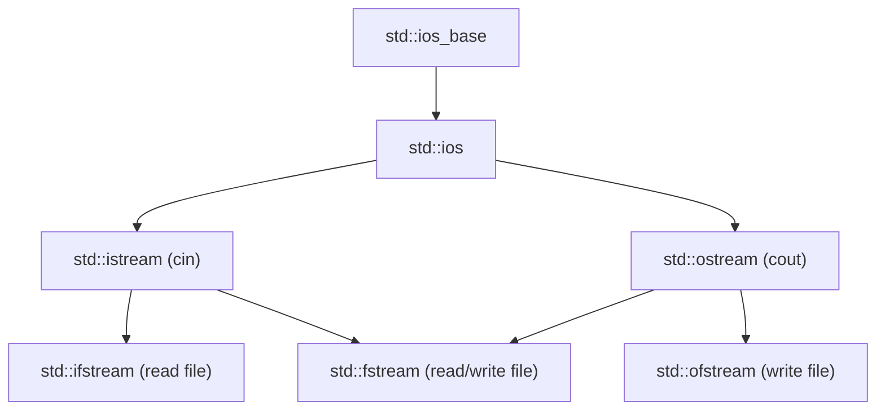
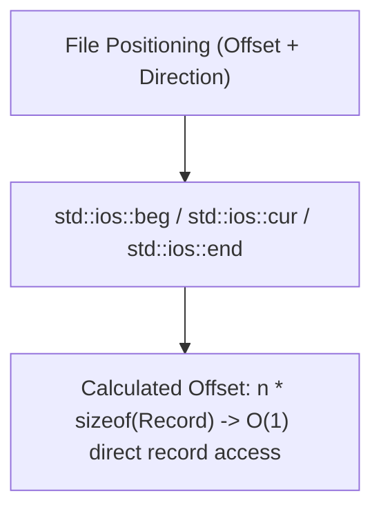

# C++ - CHAPTER 10
## File I/O and Streams

> “Memory forgets everything the moment the process ends. A file is how a program remembers.” — A First Lesson in Persistence

### Learning Objectives
By the end of this chapter, you will be able to:
* Understand the C++ stream inheritance hierarchy (`std::istream`, `std::ostream`, `std::fstream`).
* Open, read from, and write to text files safely using `std::ifstream` and `std::ofstream`.
* Inspect and manage stream state flags to handle missing files or parsing errors.
* Perform binary file input/output using raw data blocks (`read()` and `write()`).
* Navigate arbitrary positions within files using random access pointer methods (`seekg()`, `seekp()`).

---

### Introduction
So far, all the data your programs have handled has been transient—it lives in RAM and vanishes the exact millisecond the program shuts down. Real-world software requires persistence: games need to save player progress, servers need to log transactions, and enterprise applications need to load configurations from disk. In C++, input and output operations are abstracted through a powerful concept known as **Streams**.

### Why This Topic Matters
Mastering file streams enables your programs to interact with the physical file system securely. Poor file management can lead to locked resources, corrupted data files, or severe security vulnerabilities (such as path traversal). Modern C++ handles file I/O using RAII principles, ensuring that files are automatically and safely closed when stream objects go out of scope, even if exceptions occur.

---

### Chapter Roadmap
* Concept 1: The C++ Stream Architecture
* Concept 2: Opening Files and Managing State Flags
* Concept 3: Formatted and Unformatted File I/O
* Concept 4: Random Access and File Positioning
* Learning Support Elements
* Debugging and Problem Solving
* Practical Application & Mini Project
* Practice and Evaluation
* Chapter Conclusion

---

> [!NOTE]
> **Real-Life Analogy: The Post Office Conveyor**
> A stream is a conveyor belt, not a container. Data travels along it in one direction and, once past, is gone. `std::cout` is a belt heading out to the screen; `std::cin` is a belt bringing characters in from the keyboard; an `std::ofstream` is a belt heading into a file on disk. Because they are all belts, the same `<<` and `>>` operators drive every one of them, which is why printing to the console and writing to a file are almost the same code.
> 
> Opening a file is asking for a belt to be connected. The request can fail — the address may not exist, or you may not have permission — and a program that starts loading before checking the connection is a sorting office shovelling parcels onto a belt that ends in mid-air. That is why `is_open()` is checked immediately.
> 
> The stream state flags are the belt's warning lights. `eofbit` means the last parcel has passed. `failbit` means a parcel arrived in the wrong shape — you asked for a number and got a word. `badbit` means the belt itself broke. Critically, once a light is on, the belt stops accepting work until you clear it, which is exactly why a failed extraction causes every subsequent read to silently do nothing.

---

### Real-World Applications

| Domain | How this chapter's ideas appear in practice |
| :--- | :--- |
| **Databases** | Storage engines seek to computed byte offsets in a data file — random access positioning is the foundation of every page-based store. |
| **Game Development** | Save files and asset packs are opened in binary mode; text mode would corrupt them by translating byte sequences. |
| **Machine Learning** | Datasets are streamed from disk in batches because they do not fit in RAM, and a stream is exactly the right abstraction for that. |
| **Cyber Security** | Log files are append-only streams, and their integrity depends on correct flushing and open-mode selection. |
| **Embedded Systems** | Firmware writes telemetry to flash through the same stream interface, letting the same code target a file or a serial port. |
| **Cloud Computing** | Configuration parsing at service start-up is a text stream read, and the failure path determines whether the service starts at all. |

---

### Core Learning Sections

#### CONCEPT 1: The C++ Stream Architecture
*Sub-topics Covered: 10.1 Stream Classes, 10.2 std::ifstream, 10.3 std::ofstream, 10.4 std::fstream*

**Intuitive Explanation:** Think of a stream as an abstraction pipeline. Water flows through a physical pipe from a reservoir to your house. In C++, data flows through a software stream from a source (like a keyboard or a file on disk) to your program's variables, or vice versa. You don't need to know the complex underlying disk architecture; you just open the pipe and let data flow.

##### 1.1 Stream Classes & 10.2-10.4 Stream Types
C++ unifies input and output across consoles, strings, and files using a robust object hierarchy rooted in `std::ios_base` and `std::ios`.
* `std::ifstream`: Derived from `std::istream`, used exclusively for reading data from files on disk.
* `std::ofstream`: Derived from `std::ostream`, used exclusively for writing data to files on disk.
* `std::fstream`: A dual-purpose stream capable of both reading and writing to the same file simultaneously (`std::fstream file("db.dat", std::ios::in | std::ios::out);`).

---

#### CONCEPT 2: Opening Files and Managing State Flags
*Sub-topics Covered: 10.5 Opening Files, 10.6 Stream State Flags, 10.7 Error Checking*

##### 10.5 Opening Files & 10.7 Error Checking
You can open a file either by passing the filename directly into the stream's constructor or by calling `.open()`.
* **Strict Rule:** Always check `if (!file)` or `if (!file.is_open())` immediately after opening.

##### 10.6 Stream State Flags
* `good()`: The stream is operational with no errors.
* `eof()`: The stream has reached the End-Of-File marker.
* `fail()`: A logical error occurred (e.g., type mismatch during reading).
* `bad()`: A severe hardware or system-level memory failure occurred.



---

#### CONCEPT 3: Formatted and Unformatted File I/O
*Sub-topics Covered: 10.8 Insertion and Extraction Operators, 10.9 Line-by-Line Reading (std::getline), 10.10 Binary I/O (read and write)*

##### 10.8 & 10.9 Text Reading (`<<`, `>>`, `std::getline`)
Use `<<` and `>>` for token-formatted file I/O. Use `while (std::getline(file, line))` to capture full text lines including spaces.

##### 10.10 Binary I/O (`read()` and `write()`)
For high-performance or serialized storage, stream raw memory blocks directly to disk:
```cpp
file.write(reinterpret_cast<const char*>(&data), sizeof(data));
file.read(reinterpret_cast<char*>(&data), sizeof(data));
```

##### Code Example: Writing and Reading a Text Log
```cpp
#include <iostream>
#include <fstream>
#include <string>

int main() {
    std::string filename = "system_log.txt";

    // 1. Writing to a file using std::ofstream
    {
        std::ofstream outfile(filename);
        if (!outfile.is_open()) {
            std::cerr << "Error: Could not open file for writing.\n";
            return 1;
        }
        outfile << "LOG ENTRY 01: System initialized successfully.\n";
        outfile << "LOG ENTRY 02: User authentication module loaded.\n";
        // File automatically closes here when outfile goes out of scope (RAII)
    }

    // 2. Reading from a file using std::ifstream
    std::ifstream infile(filename);
    if (!infile.is_open()) {
        std::cerr << "Error: Could not open file for reading.\n";
        return 1;
    }

    std::string line;
    std::cout << "--- Reading from " << filename << " ---\n";
    // 10.9: Reading line by line preserving spaces
    while (std::getline(infile, line)) {
        std::cout << line << "\n";
    }

    // File automatically closes when infile goes out of scope
    return 0;
}
```

##### Expected Output:
```text
--- Reading from system_log.txt ---
LOG ENTRY 01: System initialized successfully.
LOG ENTRY 02: User authentication module loaded.
```

---

#### CONCEPT 4: Random Access and File Positioning
*Sub-topics Covered: 10.11 File Pointers (seekg and seekp), 10.12 Position Queries (tellg and tellp)*

##### 10.11 File Pointers (`seekg` and `seekp`)
Files maintain internal markers pointing to the byte location where the next read or write operation will occur.
* `seekg()`: Moves the "get" pointer (for reading).
* `seekp()`: Moves the "put" pointer (for writing).
* Directives: `std::ios::beg` (beginning), `std::ios::cur` (current), `std::ios::end` (end).

##### 10.12 Position Queries (`tellg` and `tellp`)
`tellg()` and `tellp()` return the exact byte offset of the current read/write pointer.



---

### Learning Support Elements

> [!TIP]
> **Tips: RAII File Management**
> Never manually call `.close()` unless you have a specific architectural requirement. Rely on C++ scope rules (RAII). When a stream variable goes out of scope, its destructor invokes `.close()` automatically.

> [!NOTE]
> **Important Notes: Truncation by Default**
> Opening an `std::ofstream` automatically truncates the target file to zero length. If you want to append data, explicitly pass the append flag: `std::ofstream file("log.txt", std::ios::app);`.

> [!WARNING]
> **Warnings: Binary vs. Text Mode**
> When writing to text files on Windows, newline characters (`\n`) are automatically converted to carriage return/line feed pairs (`\r\n`). When performing binary I/O, always open files using `std::ios::binary` to prevent corrupting data blocks.

#### Common Misconceptions
* **Misconception:** "Checking `file.eof()` loop conditions safely prevents reading past the end of a file."
* **Reality:** The EOF flag is only triggered *after* an attempted read operation fails because it hit the end. Checking `while(!file.eof())` often processes the final line twice. The correct idiom is `while (std::getline(file, line))`.

#### Best Practices
* **Always Verify Stream Opening:** Never assume a file exists or that permissions are valid. Always check `if (!file)` immediately after opening.
* **Clear State Flags After Recovery:** If a stream enters an error state (like `fail()`), call `file.clear()` to reset the flags before retrying.

---

### Debugging and Problem Solving

#### Runtime Error: Silent File Read Failures
* **Cause:** Attempted to read numbers from a text file using extraction (`infile >> val`), but the file contained unexpected strings. The stream entered a `fail()` state and locked up.
* **Fix:** Check stream states, implement fallback validation, and call `infile.clear()` to reset error flags if parsing recovery is attempted.

---

### Practical Application & Mini Project

#### Mini Project: Persistent Employee Database System
This project integrates file streams, text serialization, loop validation, and RAII safety into a record-management workflow.

```cpp
#include <iostream>
#include <fstream>
#include <string>
#include <vector>
#include <format>

struct Employee {
    int id;
    std::string name;
    double salary;
};

class EmployeeDatabase {
private:
    std::string db_filename;
public:
    EmployeeDatabase(std::string filename) : db_filename(filename) {}

    // Save a list of employees to disk (Text Serialization)
    void SaveRecords(const std::vector<Employee>& employees) const {
        std::ofstream outfile(db_filename);
        if (!outfile) {
            std::cerr << "CRITICAL: Could not open database for writing.\n";
            return;
        }
        for (const auto& emp : employees) {
            // Format: ID,Name,Salary
            outfile << emp.id << "," << emp.name << "," << emp.salary << "\n";
        }
        std::cout << "[Database] Successfully saved records to disk.\n";
    }

    // Load records from disk into memory
    std::vector<Employee> LoadRecords() const {
        std::vector<Employee> employees;
        std::ifstream infile(db_filename);
        if (!infile) {
            std::cout << "[Database] No existing database found. Starting fresh.\n";
            return employees;
        }
        std::string line;
        while (std::getline(infile, line)) {
            size_t comma1 = line.find(',');
            size_t comma2 = line.find(',', comma1 + 1);
            if (comma1 != std::string::npos && comma2 != std::string::npos) {
                Employee emp;
                emp.id = std::stoi(line.substr(0, comma1));
                emp.name = line.substr(comma1 + 1, comma2 - (comma1 + 1));
                emp.salary = std::stod(line.substr(comma2 + 1));
                employees.push_back(emp);
            }
        }
        std::cout << "[Database] Successfully loaded records from disk.\n";
        return employees;
    }
};

int main() {
    std::cout << "=== PERSISTENT EMPLOYEE DATABASE ===\n\n";
    std::string db_file = "employees.csv";
    EmployeeDatabase db(db_file);

    // 1. Load existing records (if any)
    std::vector<Employee> staff = db.LoadRecords();

    // 2. Add new records if database is empty
    if (staff.empty()) {
        staff.push_back({101, "Alice Smith", 75000.0});
        staff.push_back({102, "Bob Jones", 62000.0});
        staff.push_back({103, "Charlie Davis", 88000.0}); 
        db.SaveRecords(staff);
    }

    // 3. Display current records
    std::cout << "\nCurrent Staff Roster:\n";
    for (const auto& emp : staff) {
        std::cout << std::format("ID: {} | Name: {:<15} | Salary: ${:.2f}\n", emp.id, emp.name, emp.salary);
    }
    std::cout << "\nProgram execution completed safely.\n";
    return 0;
}
```

##### Expected Output:
```text
=== PERSISTENT EMPLOYEE DATABASE ===

[Database] Successfully loaded records from disk.

Current Staff Roster:
ID: 101 | Name: Alice Smith     | Salary: $75000.00
ID: 102 | Name: Bob Jones       | Salary: $62000.00
ID: 103 | Name: Charlie Davis   | Salary: $88000.00

Program execution completed safely.
```

---

### Practice and Evaluation

#### Quick Check Questions
* What is the primary difference between `std::ifstream` and `std::ofstream`?
* Why is checking `while(!file.eof())` considered an antipattern in C++?
* What flag must you pass when opening an output file if you want to append data instead of overwriting?
* How does RAII govern file stream management in C++?

#### Coding Exercises
* Write a program that prompts the user to type a sentence, writes that sentence into a text file named `user_input.txt`, and then reads the file back to print it to the console.
* Create a program that opens an existing text file and counts the total number of lines it contains.

#### Interview Questions & Answers

1. **(Junior) What is the C++ stream hierarchy for file I/O?**
   * **Answer:** C++ file I/O is built on stream classes: `std::ifstream` is derived from `std::istream` for reading input files, `std::ofstream` is derived from `std::ostream` for writing output files, and `std::fstream` supports simultaneous bidirectional read/write operations.

2. **(Junior) How do you check if a file opened successfully?**
   * **Answer:** You can evaluate the stream object directly in a conditional statement (e.g., `if (!file)`) or call `if (!file.is_open())`.

3. **(Junior) What happens when you open an `std::ofstream` file without specifying any flags?**
   * **Answer:** By default, opening an `std::ofstream` applies the `std::ios::out` and `std::ios::trunc` flags, immediately truncating the target file if it exists.

4. **(Mid-Level) Why is checking `file.eof()` as a loop condition for reading files problematic?**
   * **Answer:** The `eof` flag is only set *after* a read operation attempts to read past the end of the file, causing the final read loop to process duplicated or garbage data.

5. **(Mid-Level) How does RAII apply to file stream management in C++?**
   * **Answer:** File stream objects manage OS file handles inside their constructors and destructors. When a stream object goes out of scope, its destructor automatically invokes `.close()`.

6. **(Mid-Level) What is the difference between text mode and binary mode when opening files?**
   * **Answer:** In text mode, newline characters (`\n`) undergo platform-specific translations (such as mapping to `\r\n` on Windows). In binary mode (`std::ios::binary`), bytes are transferred raw and uninterpreted.

7. **(Senior) How do `seekg()` and `tellg()` work for random access file processing?**
   * **Answer:** `tellg()` returns the current byte offset of the input stream's read pointer. `seekg()` repositions that read pointer to a specific byte offset relative to `beg`, `cur`, or `end`.

8. **(Senior) What are stream state flags (good, fail, bad, eof), and how do you recover from a fail state?**
   * **Answer:** Stream state flags track operational health. To recover from `fail()`, you must clear the error flags using `stream.clear()` and discard corrupted input using `stream.ignore()`.

9. **(Senior) Why might you prefer `std::fstream` over separate input and output streams?**
   * **Answer:** `std::fstream` allows bidirectional access, enabling you to read, modify, and rewrite records in-place within the same file handle.

10. **(Senior) How do custom exception masks interact with C++ file streams?**
    * **Answer:** You can configure streams to throw exceptions upon encountering specific failure states by calling `stream.exceptions(std::ios::failbit | std::ios::badbit);`.

---

### Chapter Conclusion
File I/O and streams bridge the gap between volatile RAM and persistent disk storage in C++. By utilizing `std::ifstream`, `std::ofstream`, and RAII principles, you can read and write data safely and efficiently.

#### Key Takeaways
* **RAII Safety:** Let stream destructors handle file closures automatically by respecting scope boundaries.
* **Always Validate:** Check `if (file)` immediately after opening any file stream.
* **Correct Loop Idiom:** Use `while (std::getline(file, line))` rather than `eof()` checks for text parsing.
* **Binary Integrity:** Always use `std::ios::binary` when streaming raw data blocks.

#### What to Learn Next
In **Chapter 11**, we will explore **Multithreading and Concurrency**, learning how to leverage modern multi-core hardware.

---

### Progressive Code Examples: Four Tiers

#### TIER 1 · BEGINNER
##### Write It, Then Read It Back
**Goal:** Make data outlive the process that created it.

```cpp
#include <iostream>
#include <fstream>
#include <string>

int main() {
    {
        std::ofstream out("notes.txt"); // creates or truncates
        out << "Modern C++\n";
        out << "File I/O basics\n";
    } // destructor closes the file here

    std::ifstream in("notes.txt");
    std::string line;
    while (std::getline(in, line)) {
        std::cout << "read: " << line << '\n';
    }
    return 0;
}
```

##### Expected Output
```text
read: Modern C++
read: File I/O basics
```

> **What this tier adds:** Baseline. The inner scope exists so the file is closed before it is reopened for reading — RAII, applied to a file handle.

---

#### TIER 2 · INTERMEDIATE
##### Appending Safely
**Goal:** Check that the file actually opened, and add to it instead of destroying it.

```cpp
#include <iostream>
#include <fstream>
#include <string>
#include <ctime>

bool appendLog(const std::string& path, const std::string& message) {
    std::ofstream log(path, std::ios::app); // app: never truncates
    if (!log.is_open()) {                  // ALWAYS check
        std::cerr << "cannot open " << path << '\n';
        return false;
    }
    const std::time_t now = std::time(nullptr);
    log << now << " | " << message << '\n';
    return log.good(); // did the write succeed?
}

int main() {
    appendLog("app.log", "service started");
    appendLog("app.log", "config loaded");

    std::ifstream in("app.log");
    for (std::string line; std::getline(in, line); )
        std::cout << line << '\n';
    return 0;
}
```

##### Expected Output
```text
1785412875 | service started
1785412875 | config loaded
```

> **What this tier adds:** Introduces open modes, is_open() as a mandatory check, cerr for diagnostics, and good() to confirm the write itself did not fail after the open succeeded.

---

#### TIER 3 · ADVANCED
##### Parsing CSV Without Crashing
**Goal:** Read structured records from imperfect real-world text.

```cpp
#include <iostream>
#include <fstream>
#include <sstream>
#include <string>
#include <vector>

struct Student { std::string name; int roll{}; double marks{}; };

std::vector<Student> load(const std::string& path, int& skipped) {
    std::vector<Student> out;
    std::ifstream in(path);
    if (!in) { skipped = -1; return out; }

    std::string line;
    std::getline(in, line); // discard the header row

    int lineNo = 1;
    while (std::getline(in, line)) {
        ++lineNo;
        if (line.empty()) continue;
        std::istringstream ss(line);
        std::string name, rollText, marksText;
        if (!std::getline(ss, name,      ',')) { ++skipped; continue; }
        if (!std::getline(ss, rollText,  ',')) { ++skipped; continue; }
        if (!std::getline(ss, marksText     )) { ++skipped; continue; }

        try {
            out.push_back({name, std::stoi(rollText), std::stod(marksText)});
        } catch (const std::exception&) {
            std::cerr << "  line " << lineNo << ": bad number, skipped\n";
            ++skipped;
        }
    }
    return out;
}

int main() {
    int skipped = 0;
    const auto students = load("students.csv", skipped);
    for (const auto& s : students)
        std::cout << s.roll << "  " << s.name << "  " << s.marks << '\n';
    std::cout << "loaded " << students.size() << ", skipped " << skipped << '\n';
    return 0;
}
```

##### Expected Output
```text
  line 4: bad number, skipped
101  Ananya  88.5
102  Bhaskar  91
104  Divya  76.25
loaded 3, skipped 1
```

> **What this tier adds:** Introduces istringstream for per-line parsing, and the principle that one malformed row must never destroy an entire import. Errors are reported and counted, not fatal.

---

#### TIER 4 · PROFESSIONAL
##### Binary Records and Random Access
**Goal:** Reach record number N without reading the N-1 records before it.

```cpp
#include <iostream>
#include <fstream>
#include <cstring>

struct Record { // fixed size: no pointers, no std::string
    int id{};
    char name[32]{};
    double balance{};
};

void writeAll(const std::string& path) {
    std::ofstream out(path, std::ios::binary | std::ios::trunc);
    const char* names[] = {"Ananya", "Bhaskar", "Chetan", "Divya", "Eshan"};
    for (int i = 0; i < 5; ++i) {
        Record r;
        r.id = 100 + i;
        std::strncpy(r.name, names[i], sizeof(r.name) - 1);
        r.balance = 1000.0 * (i + 1);
        out.write(reinterpret_cast<const char*>(&r), sizeof(Record));
    }
}

bool readNth(const std::string& path, int n, Record& out) {
    std::ifstream in(path, std::ios::binary);
    if (!in) return false;

    in.seekg(static_cast<std::streamoff>(n) * sizeof(Record), std::ios::beg);
    in.read(reinterpret_cast<char*>(&out), sizeof(Record));
    return in.gcount() == sizeof(Record); // a full record was read
}

int main() {
    writeAll("accounts.dat");

    Record r;
    if (readNth("accounts.dat", 3, r)) // 4th record, zero-based
        std::cout << "record 3 -> " << r.id << "  " << r.name
                  << "  " << r.balance << '\n';

    std::ifstream in("accounts.dat", std::ios::binary | std::ios::ate);
    std::cout << "file size   : " << in.tellg() << " bytes\n";
    std::cout << "record size : " << sizeof(Record) << " bytes\n";
    return 0;
}
```

##### Expected Output
```text
record 3 -> 103  Divya  4000
file size   : 240 bytes
record size : 48 bytes
```

> **What this tier adds:** Binary mode, reinterpret_cast for raw bytes, seekg with a computed offset, gcount() to verify a short read, and ios::ate to measure the file. This is the mechanism underneath every database index.

---

### Common Mistakes and How to Fix Them

| The mistake | Why it happens | What you see (class) | The fix |
| :--- | :--- | :--- | :--- |
| **Not checking `is_open()`** | The constructor did not complain | The program silently saves nothing *(LOGIC)* | Check `is_open()` immediately after every open |
| **Opening with `ios::out` when appending was intended** | `out` is the obvious mode for writing | The existing file is truncated *(DATA LOSS)* | Use `std::ios::app` to add to a file |
| **Reading with `>>` when the field contains spaces** | `>>` is the operator used everywhere else | Only the first word is read *(LOGIC)* | Use `std::getline` for whole lines or delimited fields |
| **Treating `eofbit` and `failbit` as the same thing** | Both stop the loop | Malformed input is mistaken for a clean end *(LOGIC)* | Test `eof()`, `fail()` and `bad()` separately when it matters |
| **Continuing to read after a failed extraction** | The stream object still exists | Every later read silently does nothing *(RUNTIME)* | Call `clear()`, then `ignore()` the offending characters |
| **Writing a struct containing `std::string` to a binary file** | It compiles and appears to work | A pointer is written, not the text *(UNDEFINED)* | Only write trivially copyable types; serialise strings explicitly |

---

### Chapter Mind Map

```mermaid
graph TD
    Root["CHAPTER 10 — FILE I/O AND STREAMS"] --> Arch["Stream Architecture"]
    Root --> Open["Opening Files"]
    Root --> Flags["State Flags"]
    Root --> ReadWrite["Reading & Writing"]
    Root --> Random["Random Access"]

    Arch --> BaseCls["ios_base -> ios -> istream / ostream -> fstream family"]
    Arch --> Formatting["<< insertion, >> extraction"]

    Open --> ModeTypes["ifstream (read), ofstream (write), fstream (both)"]
    Open --> OpenModes["Modes: in, out, app, trunc, ate, binary"]
    Open --> OpenCheck["ALWAYS check is_open() before using the stream"]

    Flags --> StatusBits["good / eof / fail / bad"]
    Flags --> ResetFlags["clear() resets state after a recoverable failure"]

    ReadWrite --> TextIO["Formatted: << and >>, token oriented"]
    ReadWrite --> LineIO["getline() for whole lines"]
    ReadWrite --> BinaryIO["Unformatted: read() / write() for binary blocks"]

    Random --> SeekPointers["seekg / tellg for reading; seekp / tellp for writing"]
    Random --> Offsets["Fixed-size records enable O(1) record addressing"]
```



---

> [!TIP]
> **Prepare for your Chapter Exam!**
> You have completed reading Chapter 10. Head to the **Take Chapter Quiz** assessment below to test your knowledge and unlock Chapter 11!
