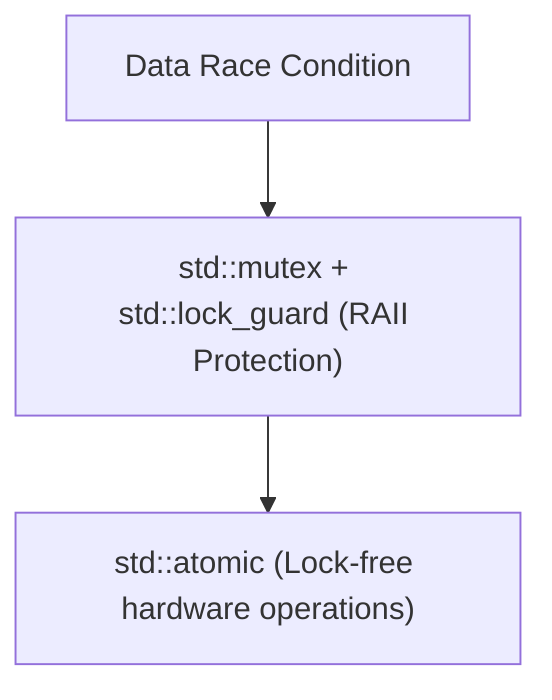

# C++ - CHAPTER 11
## Multithreading and Concurrency

> “Two threads sharing one variable without a lock is not a bug you can test for. It is a bug you can only design out.” — A First Lesson in Concurrency

### Learning Objectives
By the end of this chapter, you will be able to:
* Launch and manage concurrent threads using `std::thread`.
* Prevent data corruption using mutual exclusion (`std::mutex` and `std::lock_guard`).
* Understand and prevent deadlocks and race conditions.
* Coordinate thread execution using condition variables (`std::condition_variable`).
* Easily manage asynchronous computations using `std::async` and `std::future`.

---

### Introduction
For decades, computer performance scaled by increasing clock speeds—chips simply ran faster and faster. However, physical heat limits brought that era to a halt. Today, hardware scaling happens through **multi-core processors**. A modern laptop or server features 4, 8, or even 32 independent processing cores. If your C++ program only uses a single execution thread, it is using a fraction of your computer's true power, leaving expensive hardware idle. Concurrency allows your software to execute multiple tasks simultaneously across multiple CPU cores.

### Why This Topic Matters
Writing concurrent software is both powerful and notoriously dangerous. When multiple threads share access to the same memory, subtle bugs like data races, deadlocks, and undefined behavior can corrupt data in ways that are nearly impossible to reproduce or debug. Mastering modern C++ concurrency primitives (`std::thread`, `std::mutex`, `std::async`) allows you to write blazing-fast, parallel applications while maintaining absolute memory safety.

---

### Chapter Roadmap
* Concept 1: Introduction to Threads
* Concept 2: Synchronization and Mutexes
* Concept 3: Thread Communication (`std::condition_variable`)
* Concept 4: Asynchronous Futures and Tasks
* Learning Support Elements
* Debugging and Problem Solving
* Practical Application & Mini Project
* Practice and Evaluation
* Chapter Conclusion

---

> [!NOTE]
> **Real-Life Analogy: The Shared Kitchen**
> One cook in a kitchen never collides with anyone. Add three cooks and the kitchen gets faster — until two of them reach for the single chopping board at the same moment. Neither is doing anything wrong individually; the problem is that the board is shared and its use was never coordinated. That is a data race, and it is why a program can pass a thousand tests and fail once in production.
> 
> A mutex is a single key hanging by the chopping board: whoever holds it uses the board, everyone else waits. `std::lock_guard` is the discipline of a key that returns itself to the hook the moment you leave the station — even if you leave because the fire alarm went off. That is RAII applied to locking, and it is why a `lock_guard` cannot be forgotten the way a manual `unlock()` can.
> 
> A condition variable is the bell the prep cook rings when ingredients are ready. Without it, the grill cook would have to keep walking over to check — that is busy-waiting, and it burns an entire CPU doing nothing. With it, the grill cook sleeps until the bell rings. And a future is the ticket you take when you order: you continue with other work and redeem the ticket later for the result, blocking only at the moment you actually need it.
> 
> Deadlock is two cooks each holding one of the two keys the other needs, both waiting politely forever. The standard fix — always acquire keys in the same agreed order — is not clever, but it is correct, and correctness is the only currency concurrency accepts.

---

### Real-World Applications

| Domain | How this chapter's ideas appear in practice |
| :--- | :--- |
| **Game Development** | Rendering, physics and audio run on separate threads; a frame is only correct if their synchronisation points are exact. |
| **Machine Learning** | Data loading overlaps with GPU compute so the accelerator never idles waiting on disk — a classic producer-consumer queue. |
| **Databases** | Concurrency control, latches and lock ordering are the entire subject of a transaction manager. |
| **Cloud Computing** | Web servers assign a thread or a coroutine per request; thread pools exist because thread creation is expensive. |
| **Finance** | Market data feeds are consumed on dedicated threads with lock-free queues because a millisecond of lock contention is a real loss. |
| **Operating Systems** | The scheduler, interrupt handlers and kernel locks are concurrency at its most unforgiving — a race here corrupts the machine. |

---

### Core Learning Sections

#### CONCEPT 1: Introduction to Threads
*Sub-topics Covered: 11.1 What is Concurrency?, 11.2 Launching Threads (std::thread), 11.3 Joining vs. Detaching (join, detach)*

##### 11.1 What is Concurrency?
Concurrency is the execution of multiple instruction sequences at the same time. While a single-core CPU rapidly switches back and forth between tasks (context switching) to create the illusion of parallelism, a multi-core CPU executes multiple threads physically and simultaneously on different hardware cores.

##### 11.2 Launching Threads (`std::thread`)
Introduced natively in C++11, the `<thread>` library allows you to spawn operating system threads directly. You pass a function pointer or lambda expression into a `std::thread` constructor.

##### Syntax
```cpp
#include <thread>
void MyTask() { /* work */ }
std::thread worker(MyTask);
```

##### 11.3 Joining vs. Detaching (`join`, `detach`)
* `join()`: Blocks the calling thread (usually `main`) until the worker thread completely finishes its execution.
* `detach()`: Disconnects the thread from the `std::thread` object, allowing it to run independently in the background.

> [!WARNING]
> **Watch Out: The std::terminate Trap**
> If a `std::thread` object goes out of scope while it is still joinable (meaning neither `join()` nor `detach()` was called), C++ invokes `std::terminate()`, instantly crashing your application.

---

#### CONCEPT 2: Synchronization and Mutexes
*Sub-topics Covered: 11.4 Data Races, 11.5 Mutexes (std::mutex), 11.6 RAII Locks (std::lock_guard), 11.7 Deadlocks and Prevention*

##### 11.4 Data Races & 11.5 Mutexes (`std::mutex`)
A data race occurs when two or more threads concurrently access the same memory location, at least one access is a write, and there is no synchronization. A Mutex (Mutual Exclusion) is used to protect shared data (`mtx.lock()` and `mtx.unlock()`).

##### 11.6 RAII Locks (`std::lock_guard`)
Manually calling `.lock()` and `.unlock()` is dangerous because if an exception is thrown inside the critical section, `.unlock()` is skipped. Modern C++ uses RAII wrappers like `std::lock_guard` to lock a mutex upon creation and automatically unlock it when it goes out of scope.

##### Syntax
```cpp
std::lock_guard<std::mutex> lock(mtx);
```

##### 11.7 Deadlocks and Prevention
A deadlock occurs when Thread 1 locks Mutex A and waits for Mutex B, while Thread 2 locks Mutex B and waits for Mutex A. You prevent deadlocks by always acquiring locks in a consistent, uniform order across all threads (or using `std::scoped_lock`).



---

#### CONCEPT 3: Thread Communication (`std::condition_variable`)
*Sub-topics Covered: 11.8 Condition Variables*

##### 11.8 Condition Variables
A condition variable (`std::condition_variable`) allows one or more threads to sleep safely until another thread signals them that a specific condition has become true (`cv.notify_one()`, `cv.wait(lock, predicate)`), eliminating wasteful CPU polling loops.

##### Syntax
```cpp
#include <condition_variable>
std::condition_variable cv;
std::mutex cv_mtx;

std::unique_lock<std::mutex> lock(cv_mtx);
cv.wait(lock, [] { return ready_flag == true; });
```

---

#### CONCEPT 4: Asynchronous Futures and Tasks
*Sub-topics Covered: 11.9 Asynchronous Tasks (std::async), 11.10 Futures and Promises (std::future)*

##### 11.9 `std::async` & 11.10 `std::future`
When you want to run a function in the background and eventually retrieve its return value without manually managing raw `std::thread` objects, use `std::async`. It launches a task and returns a `std::future` object. Calling `future.get()` pauses execution until the background thread finishes and delivers the value.

##### Code Example: Multi-threaded Counter with Mutex Protection
```cpp
#include <iostream>
#include <thread>
#include <mutex>
#include <vector>

int shared_counter = 0;
std::mutex counter_mutex;

void IncrementCounter(int iterations) {
    for (int i = 0; i < iterations; ++i) {
        // 11.6: std::lock_guard uses RAII to lock and unlock the mutex safely
        std::lock_guard<std::mutex> lock(counter_mutex);
        ++shared_counter;
    }
}

int main() {
    const int num_threads = 4;
    const int increments_per_thread = 25000;
    std::vector<std::thread> workers;
    workers.reserve(num_threads);

    std::cout << "Launching " << num_threads << " threads...\n";
    for (int i = 0; i < num_threads; ++i) {
        workers.emplace_back(IncrementCounter, increments_per_thread);
    }

    for (auto& worker : workers) {
        worker.join();
    }

    int expected_total = num_threads * increments_per_thread;
    std::cout << "Expected Counter: " << expected_total << "\n";
    std::cout << "Actual Counter:   " << shared_counter << "\n";
    return 0;
}
```

##### Expected Output:
```text
Launching 4 threads...
Expected Counter: 100000
Actual Counter:   100000
```

---

### Learning Support Elements

> [!TIP]
> **Tips: Use `std::async` for Simplicity**
> When performing asynchronous background tasks where you simply need to fetch a return value later, prefer `std::async` over raw `std::thread` management. It handles thread pooling and future plumbing automatically.

> [!NOTE]
> **Important Notes: Hardware Concurrency Limits**
> You can query your CPU's physical core capacity at runtime using `std::thread::hardware_concurrency()`. Spawning hundreds of threads on a 4-core machine degrades performance due to constant OS context-switching overhead. Match your worker pool size to your core count.

> [!WARNING]
> **Warnings: Avoid Manual Mutex Locking**
> Never write explicit `.lock()` and `.unlock()` statements unless absolutely required by advanced architecture. Always prefer RAII wrappers (`std::lock_guard` or `std::unique_lock`) to guarantee exception safety.

#### Common Misconceptions
* **Misconception:** "Multithreading always makes a program run faster."
* **Reality:** If threads spend all their time fighting for the same mutex locks (lock contention) or transferring data between CPU caches, multi-threading can actually be significantly *slower* than single-threaded code.

#### Best Practices
* **Minimize Critical Section Size:** Keep the code inside your mutex locks as short as possible. Only protect the exact lines touching shared data; perform heavy computations outside the lock.
* **Establish Lock Ordering:** If your threads require multiple mutexes, always acquire them in the exact same global order across your entire codebase to prevent deadlocks.

---

### Debugging and Problem Solving

#### Runtime Error: Data Race / Undefined Behavior
* **Cause:** Two threads modify a shared variable simultaneously without a mutex lock. Symptoms include intermittent crashes, impossible values, or values that change randomly between runs.
* **Fix:** Wrap all accesses to the shared variable in a `std::lock_guard` connected to a dedicated mutex.

---

### Practical Application & Mini Project

#### Mini Project: Multi-Threaded Task Queue and Worker Pool Simulation
This project brings together threads, mutexes, condition variables, and RAII locks to build a fully synchronized producer-consumer task processor.

```cpp
#include <iostream>
#include <thread>
#include <mutex>
#include <condition_variable>
#include <queue>
#include <vector>
#include <chrono>
#include <format>

class TaskQueue {
private:
    std::queue<int> tasks;
    std::mutex mtx;
    std::condition_variable cv;
    bool stop_flag = false;
public:
    void PushTask(int task_id) {
        {
            std::lock_guard<std::mutex> lock(mtx);
            tasks.push(task_id);
        }
        cv.notify_one(); // Wake up one waiting worker thread
    }

    bool PopTask(int& out_task_id) {
        std::unique_lock<std::mutex> lock(mtx); 
        // Wait until there is a task OR the queue is instructed to stop
        cv.wait(lock, [this] { return !tasks.empty() || stop_flag; });
        if (tasks.empty() && stop_flag) {
            return false; // Exit worker thread
        }
        out_task_id = tasks.front();
        tasks.pop();
        return true;
    }

    void Shutdown() {
        {
            std::lock_guard<std::mutex> lock(mtx);
            stop_flag = true;
        }
        cv.notify_all(); // Wake up all sleeping workers to exit
    }
};

void WorkerThread(int worker_id, TaskQueue& queue) {
    int task_id = 0;
    while (queue.PopTask(task_id)) {
        std::cout << std::format("[Worker {}] Processing task #{}\n", worker_id, task_id);
        std::this_thread::sleep_for(std::chrono::milliseconds(50)); // Simulate work
    }
    std::cout << std::format("[Worker {}] Shutting down.\n", worker_id);
}

int main() {
    std::cout << "=== MULTITHREADED WORKER POOL SYSTEM ===\n\n";
    TaskQueue task_queue;
    const int num_workers = 3;

    std::vector<std::thread> pool;
    pool.reserve(num_workers);
    for (int i = 0; i < num_workers; ++i) {
        pool.emplace_back(WorkerThread, i + 1, std::ref(task_queue));
    }

    for (int i = 1; i <= 10; ++i) {
        task_queue.PushTask(i);
    }

    std::this_thread::sleep_for(std::chrono::milliseconds(200));
    task_queue.Shutdown();

    for (auto& worker : pool) {
        worker.join();
    }
    std::cout << "\nAll worker threads joined successfully. Program complete.\n";
    return 0;
}
```

##### Expected Output:
```text
=== MULTITHREADED WORKER POOL SYSTEM ===

[Worker 1] Processing task #1
[Worker 2] Processing task #2
[Worker 3] Processing task #3
[Worker 1] Processing task #4
[Worker 2] Processing task #5
[Worker 3] Processing task #6
[Worker 1] Processing task #7
[Worker 2] Processing task #8
[Worker 3] Processing task #9
[Worker 1] Processing task #10
[Worker 1] Shutting down.
[Worker 2] Shutting down.
[Worker 3] Shutting down.

All worker threads joined successfully. Program complete.
```

---

### Practice and Evaluation

#### Quick Check Questions
* What is the difference between calling `.join()` and `.detach()` on a `std::thread`?
* Why is raw manual mutex locking discouraged in favor of `std::lock_guard`?
* What problem does a `std::condition_variable` solve compared to polling loops?
* What does `std::async` return, and how do you retrieve its result?

#### Coding Exercises
* Write a program that spawns two threads. Thread 1 counts from 1 to 5, and Thread 2 counts from 6 to 10. Use `std::mutex` and `std::cout` to ensure their output statements do not interleave and garble on the console.
* Use `std::async` to launch a function that calculates the sum of numbers from 1 to 100 in the background, and retrieve the result using `.get()`.

#### Interview Questions & Answers

1. **(Junior) What is the difference between concurrency and parallelism?**
   * **Answer:** Concurrency is about *managing* multiple tasks at the same time (rapid context-switching). Parallelism is about *executing* multiple tasks at the exact same physical instant across multiple CPU cores.

2. **(Junior) What happens if a `std::thread` object is destroyed while still joinable?**
   * **Answer:** C++ enforces that every thread must be explicitly joined or detached before its destructor runs. If a joinable thread object goes out of scope, the destructor calls `std::terminate()`.

3. **(Junior) What is a Data Race?**
   * **Answer:** A data race occurs when two or more concurrent threads access the same memory address without synchronization, and at least one access is a write operation.

4. **(Mid-Level) How does `std::lock_guard` provide exception safety during multi-threaded programming?**
   * **Answer:** `std::lock_guard` implements RAII. It acquires the mutex lock in its constructor and automatically releases the lock in its destructor when going out of scope.

5. **(Mid-Level) What is a Deadlock, and what are the necessary conditions for it to occur?**
   * **Answer:** A deadlock is a state where two or more threads are blocked forever, waiting for each other to release locks (Coffman conditions: Mutual Exclusion, Hold and Wait, No Preemption, Circular Wait).

6. **(Mid-Level) Why do condition variable `.wait()` calls require a mutex and a lambda predicate check?**
   * **Answer:** Condition variables can occasionally experience "spurious wakeups". The mutex protects shared state, and the lambda predicate re-checks the condition upon waking up.

7. **(Senior) What is the difference between `std::lock_guard` and `std::unique_lock`?**
   * **Answer:** `std::lock_guard` is a lightweight, strictly scoped lock. `std::unique_lock` is more flexible: it allows deferred locking, manual unlocking/relocking, and transfer into condition variable `.wait()` operations.

8. **(Senior) Explain False Sharing in multi-threaded systems and how to avoid it.**
   * **Answer:** False sharing occurs when two independent threads modify separate variables that happen to reside on the same CPU cache line (typically 64 bytes). Avoid it using `alignas(64)`.

9. **(Senior) How do `std::promise` and `std::future` work together?**
   * **Answer:** A `std::promise` and `std::future` form a two-end communication channel. The producer thread sets a value into `std::promise`, while the consumer thread blocks on `std::future` until the value is ready.

10. **(Senior) What are atomic operations (`std::atomic`), and when should you use them instead of mutexes?**
    * **Answer:** `std::atomic` provides lock-free, thread-safe operations on fundamental data types at the hardware instruction level, avoiding operating system scheduling overhead.

---

### Chapter Conclusion
Multithreading and concurrency unlock the true multi-core power of modern hardware. By launching threads with `std::thread`, protecting critical sections with mutexes and `std::lock_guard`, coordinating workers via condition variables, and orchestrating tasks with futures, you can build high-performance parallel architectures.

#### Key Takeaways
* **Always Join or Detach:** Never let a `std::thread` object go out of scope while joinable.
* **Protect Shared Data:** Always pair shared mutable state with a mutex or atomic type.
* **Embrace RAII Locks:** Use `std::lock_guard` or `std::unique_lock` to guarantee mutex release during exceptions.
* **Prevent Deadlocks:** Maintain a uniform global locking order across all threads.

#### What to Learn Next
In **Chapter 12**, we will explore **Move Semantics, Rvalue References, and Perfect Forwarding**.

---

### Progressive Code Examples: Four Tiers

#### TIER 1 · BEGINNER
##### Two Things at Once
**Goal:** Launch a second stream of execution and wait for it.

```cpp
#include <iostream>
#include <thread>
#include <chrono>

void worker(int id) {
    for (int i = 1; i <= 3; ++i) {
        std::cout << "worker " << id << " step " << i << '\n';
        std::this_thread::sleep_for(std::chrono::milliseconds(50));
    }
}

int main() {
    std::thread t1(worker, 1);
    std::thread t2(worker, 2);

    t1.join(); // wait for t1 to finish
    t2.join(); // wait for t2 to finish

    std::cout << "both workers done\n";
    std::cout << "hardware threads: "
              << std::thread::hardware_concurrency() << '\n';
    return 0;
}
```

##### Expected Output
```text
worker 1 step 1
worker 2 step 1
worker 2 step 2
worker 1 step 2
...
both workers done
hardware threads: 8
```

> **What this tier adds:** Baseline. Note that the output lines themselves interleave unpredictably — even `std::cout` is a shared resource.

---

#### TIER 2 · INTERMEDIATE
##### The Race, and the Lock That Ends It
**Goal:** Produce a wrong answer on purpose, then make it right.

```cpp
#include <iostream>
#include <thread>
#include <vector>
#include <mutex>
#include <atomic>

constexpr int kThreads   = 4;
constexpr int kPerThread = 250000;

int unsafeCounter = 0;
int lockedCounter = 0;
std::atomic<int> atomicCounter{0};
std::mutex       mtx;

template <typename Work>
void runConcurrently(Work work) {
    std::vector<std::thread> pool;
    for (int i = 0; i < kThreads; ++i) pool.emplace_back(work);
    for (auto& t : pool) t.join();
}

int main() {
    runConcurrently([] {
        for (int i = 0; i < kPerThread; ++i) {
            int seen = unsafeCounter;               // 1. READ
            std::atomic_signal_fence(std::memory_order_seq_cst); // barrier
            unsafeCounter = seen + 1;               // 3. WRITE
        }                                           // DATA RACE
    });

    runConcurrently([] {
        for (int i = 0; i < kPerThread; ++i) {
            std::lock_guard<std::mutex> g(mtx);     // scoped lock
            ++lockedCounter;
        }
    });

    runConcurrently([] {
        for (int i = 0; i < kPerThread; ++i) ++atomicCounter; // lock-free
    });

    const int expected = kThreads * kPerThread;
    std::cout << "expected : " << expected      << '\n';
    std::cout << "unsafe   : " << unsafeCounter << '\n';
    std::cout << "mutex    : " << lockedCounter << '\n';
    std::cout << "atomic   : " << atomicCounter << '\n';
    return 0;
}
```

##### Expected Output
```text
expected : 1000000
unsafe   : 417382 <- wrong, and different on every run
mutex    : 1000000
atomic   : 1000000
```

> **What this tier adds:** Introduces `lock_guard`'s scoped locking and `std::atomic` as the lock-free alternative for a single value.

---

#### TIER 3 · ADVANCED
##### Producer and Consumer
**Goal:** Let one thread sleep until another has work for it, instead of spinning.

```cpp
#include <iostream>
#include <thread>
#include <queue>
#include <mutex>
#include <condition_variable>

std::queue<int>          q;
std::mutex               m;
std::condition_variable  cv;
bool                     finished = false;

void producer() {
    for (int i = 1; i <= 5; ++i) {
        {
            std::lock_guard<std::mutex> g(m);
            q.push(i);
            std::cout << "produced " << i << '\n';
        }
        cv.notify_one(); // wake one waiter
        std::this_thread::sleep_for(std::chrono::milliseconds(30));
    }
    { std::lock_guard<std::mutex> g(m); finished = true; }
    cv.notify_all();
}

void consumer() {
    while (true) {
        std::unique_lock<std::mutex> lk(m); // unique_lock: cv can release it
        cv.wait(lk, [] { return !q.empty() || finished; }); // PREDICATE

        while (!q.empty()) {
            std::cout << "  consumed " << q.front() << '\n';
            q.pop();
        }
        if (finished) return;
    }
}

int main() {
    std::thread p(producer), c(consumer);
    p.join(); c.join();
    std::cout << "pipeline drained\n";
    return 0;
}
```

##### Expected Output
```text
produced 1
  consumed 1
produced 2
  consumed 2
...
pipeline drained
```

> **What this tier adds:** The predicate form of `wait()` is not optional: spurious wakeups are permitted by the standard. `unique_lock` is required because the condition variable must be able to unlock and relock.

---

#### TIER 4 · PROFESSIONAL
##### Tasks, Not Threads
**Goal:** Express work to be computed elsewhere and collect it later, without managing threads by hand.

```cpp
#include <iostream>
#include <future>
#include <vector>
#include <numeric>
#include <chrono>

long long partialSum(const std::vector<int>& data,
                       std::size_t from, std::size_t to) {
    return std::accumulate(data.begin() + from, data.begin() + to, 0LL);
}

int main() {
    std::vector<int> data(8'000'000);
    std::iota(data.begin(), data.end(), 1); // 1, 2, 3, ...

    const unsigned n = std::max(2u, std::thread::hardware_concurrency());
    const std::size_t chunk = data.size() / n;

    auto start = std::chrono::steady_clock::now();

    std::vector<std::future<long long>> futures;
    for (unsigned i = 0; i < n; ++i) {
        const std::size_t from = i * chunk;
        const std::size_t to   = (i + 1 == n) ? data.size() : from + chunk;
        futures.push_back(std::async(std::launch::async,
                                     partialSum, std::cref(data), from, to));
    }

    long long total = 0;
    for (auto& f : futures) total += f.get(); // blocks only here

    const auto ms = std::chrono::duration_cast<std::chrono::milliseconds>(
                        std::chrono::steady_clock::now() - start).count();

    std::cout << "workers : " << n << '\n';
    std::cout << "total   : " << total << '\n';
    std::cout << "elapsed : " << ms << " ms\n";
    return 0;
}
```

##### Expected Output
```text
workers : 8
total   : 32000004000000
elapsed : 9 ms
```

> **What this tier adds:** No mutex appears anywhere, because each task writes to its own result. `std::cref` avoids copying the vector into every task, and `std::launch::async` forces real parallelism.

---

### Common Mistakes and How to Fix Them

| The mistake | Why it happens | What you see (class) | The fix |
| :--- | :--- | :--- | :--- |
| **Sharing a variable between threads without a lock** | Increment looks like one operation | Lost updates, results vary per run *(UNDEFINED)* | Guard with `std::mutex`, or use `std::atomic` for a single value |
| **Calling `unlock()` manually** | It mirrors `lock()` symmetrically | The mutex stays locked if an exception unwinds *(DEADLOCK)* | Use `std::lock_guard` or `std::scoped_lock` |
| **Destroying a joinable `std::thread`** | The thread finished, so it feels done | `std::terminate` is called *(RUNTIME)* | Always `join()` or `detach()` before the thread object is destroyed |
| **Acquiring two mutexes in different orders** | Each function looks correct on its own | Intermittent deadlock *(RUNTIME)* | Impose a global lock order, or use `std::scoped_lock` for both at once |
| **Calling `cv.wait()` without a predicate** | There is nothing to wait for until notified | Spurious wakeup proceeds with no data *(LOGIC)* | `cv.wait(lock, []{ return condition; })` |
| **Holding a lock across blocking I/O** | The critical section 'includes' the write | All threads serialise behind slow I/O *(PERFORMANCE)* | Copy what you need, release the lock, then perform the I/O |

---

### Chapter Mind Map

```mermaid
graph TD
    Root["CHAPTER 11 — MULTITHREADING AND CONCURRENCY"] --> Threads["Threads"]
    Root --> Problem["Core Problem: Data Race"]
    Root --> Sync["Synchronisation"]
    Root --> Comm["Communication"]
    Root --> Async["Asynchronous Tasks"]

    Threads --> Launch["std::thread launches a callable"]
    Threads --> JoinDetach["join() wait / detach() run independent"]
    Threads --> Hardware["hardware_concurrency() hints available cores"]

    Problem --> DataRace["Data race = unsynchronised concurrent access"]
    Problem --> CritSection["Critical section = code that must be indivisible"]

    Sync --> Mutex["std::mutex, lock() / unlock()"]
    Sync --> LockGuard["std::lock_guard ..... RAII, scope-bound"]
    Sync --> ScopedLock["std::scoped_lock ..... deadlock-avoiding"]
    Sync --> Atomic["std::atomic ..... lock-free primitives"]

    Comm --> CondVar["std::condition_variable: wait / notify_one"]
    Comm --> Predicate["ALWAYS wait with a predicate (spurious wakeups)"]

    Async --> AsyncLaunch["std::async launches work -> std::future"]
    Async --> FutureGet["future.get() blocks until value is ready"]
```



---

> [!TIP]
> **Prepare for your Chapter Exam!**
> You have completed reading Chapter 11. Head to the **Take Chapter Quiz** assessment below to test your knowledge and unlock Chapter 12!
