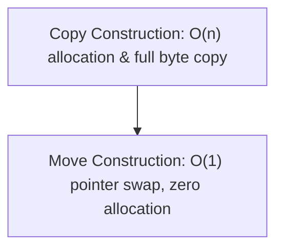
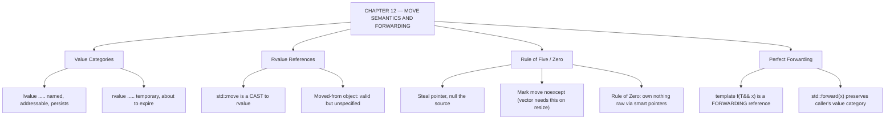

# C++ - CHAPTER 12
## Move Semantics, Rvalue References, and Perfect Forwarding

> “Copying is what you do when someone else still needs it. Moving is what you do when nobody does.” — A First Lesson in Ownership Transfer

### Learning Objectives
By the end of this chapter, you will be able to:
* Distinguish between Lvalues and Rvalues at the memory level.
* Understand and declare Rvalue References (`T&&`) and `std::move`.
* Implement Move Constructors and Move Assignment Operators using the Rule of Five.
* Understand Perfect Forwarding and how `std::forward` preserves argument categories in templates.

---

### Introduction
Imagine you own a massive library containing a million books, and you want to give ownership of this library to your friend. In old-school programming, doing this meant your computer would painstakingly copy every single book, shelf by shelf, into a brand-new building (a deep copy). This process is slow, wastes massive amounts of RAM, and bottlenecks high-performance systems. Modern C++ introduced a revolutionary concept: **Move Semantics**. Instead of copying the books, you simply hand your friend the keys to the building. You don't duplicate the data; you transfer ownership of the underlying memory pointers in constant time.

### Why This Topic Matters
Before C++11, passing heavy objects like `std::string` or `std::vector` into functions triggered expensive, unavoidable memory allocations and copies. Move semantics changed the paradigm of systems programming entirely. It allows temporary objects to "surrender" their resources to new owners instantly without copying a single byte. Mastering move semantics is what separates writing working C++ code from writing lightning-fast, production-grade software.

---

### Chapter Roadmap
* Concept 1: Lvalues and Rvalues
* Concept 2: Rvalue References and `std::move`
* Concept 3: Move Constructors and the Rule of Five
* Concept 4: Perfect Forwarding and `std::forward`
* Learning Support Elements
* Debugging and Problem Solving
* Practical Application & Mini Project
* Practice and Evaluation
* Chapter Conclusion

---

> [!NOTE]
> **Real-Life Analogy: Selling the House Versus Rebuilding It**
> You own a fully furnished house and someone else needs to own it. There are two ways to accomplish this. The first is to construct an identical house next door, manufacture a duplicate of every item of furniture, and place each one in the matching room. That is a copy: correct, complete, and enormously expensive.
> 
> The second is to hand over the deed. The house does not move an inch. Not one chair is duplicated. Ownership simply transfers, and your name comes off the title. That is a move, and it costs a few pointer assignments regardless of whether the house holds ten items or ten million.
> 
> The critical detail is what happens to you afterwards. You must be left in a valid state — no longer the owner, holding nothing, but still a legally coherent person who can be given a different house later. That is the meaning of 'valid but unspecified' for a moved-from object, and it is why a move constructor must null out the source's pointer rather than leave it aliasing the transferred memory.
> 
> An lvalue is a house with an address someone could visit again. An rvalue is a temporary marquee erected for one afternoon — nobody will look for it tomorrow, so taking its contents harms no one. `std::move` does not move anything; it is purely the paperwork that reclassifies a house as 'about to be vacated', authorising the cheaper path. And `std::forward` is the estate agent who passes your instruction onward without accidentally converting a sale into a rebuild.

---

### Real-World Applications

| Domain | How this chapter's ideas appear in practice |
| :--- | :--- |
| **Machine Learning** | Returning a multi-gigabyte tensor from a function is free with move semantics and catastrophic without them. |
| **Game Development** | Asset handles and scene nodes are moved into containers during level loading, avoiding duplicate allocation of large buffers. |
| **Finance** | Order objects are moved through processing pipelines so that no stage copies a message it merely forwards. |
| **Databases** | Result sets and row batches are moved between query operators; copying them would dominate execution time. |
| **Networking** | Buffers are moved from the receive path into the parse path, so a packet's bytes are allocated once for its whole lifetime. |
| **Cloud Computing** | `std::unique_ptr` is move-only by design, which is exactly how single-ownership resources cross API boundaries safely. |

---

### Core Learning Sections

#### CONCEPT 1: Lvalues and Rvalues
*Sub-topics Covered: 12.1 What is an Lvalue?, 12.2 What is an Rvalue?, 12.3 Value Categories Overview*

**Intuitive Explanation:** Think of an **Lvalue** as a house with a permanent postal address. It has a name, it occupies persistent memory, and you can reference it repeatedly (e.g., a standard variable `int x = 10;`). Think of an **Rvalue** as a temporary package sitting on a delivery truck curb. It has no name, it lives only for a fraction of a second during an expression, and once you use it, it vanishes.

##### 12.1 What is an Lvalue?
An Lvalue (locator value) is an expression that refers to a persistent object in memory. You can take its address using the address-of operator (`&`).

##### 12.2 What is an Rvalue?
An Rvalue is a temporary expression that does not persist beyond the single line of code where it is evaluated (like literals `42`, `3.14`, or temporary objects `a + b`).

---

#### CONCEPT 2: Rvalue References and `std::move`
*Sub-topics Covered: 12.4 Rvalue References (T&&), 12.5 The Purpose of std::move, 12.6 Safe Stealing*

##### 12.4 Rvalue References (`T&&`)
An Rvalue reference (`T&&`) binds exclusively to temporary rvalues. It signals to the compiler: "This object is about to die; its resources are free for the taking."

##### 12.5 `std::move`
`std::move(obj)` is an unconditional cast that converts an Lvalue into an Rvalue reference, granting permission for its resources to be stolen.

> [!WARNING]
> **Watch Out: The Moved-From State**
> After you apply `std::move` to an object, its internal pointer is typically set to `nullptr` or an empty state. The object is *not* destroyed—it still exists in memory—but its contents are undefined. Do not read from a moved-from object unless reassigned.

---

#### CONCEPT 3: Move Constructors and the Rule of Five
*Sub-topics Covered: 12.7 Move Constructors, 12.8 Move Assignment Operators, 12.9 The Rule of Five*

##### 12.7 Move Constructors & 12.8 Move Assignment
Instead of copying a temporary object's Heap data byte-by-byte, a Move Constructor steals the pointer directly, sets the temporary's pointer to `nullptr`, and completes in constant time ($O(1)$).

##### 12.9 The Rule of Five
The Rule of Five states that if your class manages manual Heap resources and requires a custom implementation of any of the following five special member functions, you almost certainly need to explicitly define all five:
1. Destructor
2. Copy Constructor
3. Copy Assignment Operator
4. Move Constructor
5. Move Assignment Operator



---

#### CONCEPT 4: Perfect Forwarding and `std::forward`
*Sub-topics Covered: 12.10 Universal References, 12.11 Perfect Forwarding, 12.12 std::forward*

##### 12.10 Universal References (`T&&` in templates)
When a template parameter uses `T&&` (`template <typename T> void Wrapper(T&& arg)`), it is a **forwarding reference**. It can bind to both lvalues and rvalues depending on what is passed into it.

##### 12.11 & 12.12 Perfect Forwarding & `std::forward`
`std::forward<T>(arg)` is used inside template wrappers to conditionally cast an argument back to its original category, preserving move semantics across function call boundaries.

##### Code Example: Custom Move-Enabled Buffer
```cpp
#include <iostream>
#include <algorithm>

class SimpleBuffer {
private:
    size_t size;
    int* data;
public:
    // Constructor
    SimpleBuffer(size_t s) : size(s), data(new int[s]) {
        std::cout << "[Constructor] Allocated buffer of size " << size << "\n";
    }
    // Destructor
    ~SimpleBuffer() {
        delete[] data;
    }
    // 12.7: Move Constructor
    SimpleBuffer(SimpleBuffer&& other) noexcept 
        : size(other.size), data(other.data) {
        std::cout << "[Move Constructor] Stealing buffer resources.\n";
        other.size = 0;
        other.data = nullptr; // Nullify source so destructor doesn't delete it
    }
    // 12.8: Move Assignment Operator
    SimpleBuffer& operator=(SimpleBuffer&& other) noexcept {
        if (this != &other) {
            delete[] data; // Clean up our own current memory
            size = other.size;
            data = other.data;
            other.size = 0;
            other.data = nullptr;
            std::cout << "[Move Assignment] Stealing buffer resources.\n";
        }
        return *this;
    }

    // Disable copy for demonstration clarity
    SimpleBuffer(const SimpleBuffer&) = delete;
    SimpleBuffer& operator=(const SimpleBuffer&) = delete;
    size_t GetSize() const { return size; }
};

int main() {
    std::cout << "Creating buffer 1...\n";
    SimpleBuffer buf1(1000);

    std::cout << "\nMoving buffer 1 into buffer 2 via std::move...\n";
    SimpleBuffer buf2(std::move(buf1)); 

    std::cout << "\nStatus Check:\n";
    std::cout << "Buf1 size (should be 0):    " << buf1.GetSize() << "\n";
    std::cout << "Buf2 size (should be 1000): " << buf2.GetSize() << "\n";
    return 0;
}
```

##### Expected Output:
```text
Creating buffer 1...
[Constructor] Allocated buffer of size 1000

Moving buffer 1 into buffer 2 via std::move...
[Move Constructor] Stealing buffer resources.

Status Check:
Buf1 size (should be 0):    0
Buf2 size (should be 1000): 1000
```

---

### Learning Support Elements

> [!TIP]
> **Tips: Mark Move Operations as `noexcept`**
> Always mark your Move Constructors and Move Assignment Operators as `noexcept`. Standard library containers (like `std::vector`) inspect whether a type's move operations are `noexcept` before deciding whether to move or copy items during resizing.

> [!NOTE]
> **Important Notes: The Rule of Zero**
> While the Rule of Five governs classes that manually manage raw resources, modern C++ best practice encourages the **Rule of Zero**: design your classes so they manage no raw resources directly, instead relying on smart pointers (`std::unique_ptr`) and standard containers (`std::vector`).

> [!WARNING]
> **Warnings: Using a Moved-From Object**
> Once an object has been moved from via `std::move`, its internal pointers are nullified. Never read from a moved-from object unless reassigned.

#### Common Misconceptions
* **Misconception:** "`std::move` actually moves data in memory."
* **Reality:** `std::move` does not move anything. It is purely a cast operator that turns an Lvalue into an Rvalue reference, giving permission for another function to steal its data.

---

### Debugging and Problem Solving

#### Runtime Error: Segmentation Fault on Moved-From Object
* **Cause:** You called `std::move(my_obj)` to pass an object into a function, but afterward, your code attempted to access `my_obj.some_field()`. Because the move operation stripped its internal pointers, accessing them results in a segfault.
* **Fix:** Treat any variable passed into `std::move` as dead; do not reference it again unless reinitialized.

---

### Practical Application & Mini Project

#### Mini Project: High-Performance Packet Queue Manager
In game engines and high-frequency trading systems, rendering frames or processing network packets requires moving massive data buffers across queues. Implementing robust move semantics ensures zero-copy transfers across system boundaries.

```cpp
#include <iostream>
#include <vector>
#include <string>
#include <utility>
#include <format>

class NetworkPacket {
private:
    int packet_id;
    std::vector<char> payload;
public:
    NetworkPacket(int id, size_t payload_size) 
        : packet_id(id), payload(payload_size, 'X') {
        std::cout << std::format("[Packet {}] Allocated on Heap.\n", packet_id);
    }

    ~NetworkPacket() = default;

    // Move Constructor
    NetworkPacket(NetworkPacket&& other) noexcept
        : packet_id(other.packet_id), payload(std::move(other.payload)) {
        std::cout << std::format("[Packet {}] MOVED successfully.\n", packet_id);
        other.packet_id = 0;
    }

    // Move Assignment Operator
    NetworkPacket& operator=(NetworkPacket&& other) noexcept {
        if (this != &other) {
            packet_id = other.packet_id;
            payload = std::move(other.payload);
            other.packet_id = 0;
            std::cout << std::format("[Packet {}] ASSIGNED via move.\n", packet_id);
        }
        return *this;
    }

    NetworkPacket(const NetworkPacket&) = delete;
    NetworkPacket& operator=(const NetworkPacket&) = delete;

    int GetId() const { return packet_id; }
    size_t GetPayloadSize() const { return payload.size(); }
};

class PacketProcessor {
private:
    std::vector<NetworkPacket> inbound_queue;
public:
    void EnqueuePacket(NetworkPacket&& packet) {
        inbound_queue.push_back(std::move(packet));
        std::cout << "Packet successfully enqueued.\n";
    }

    void ProcessQueue() {
        std::cout << "\n--- Processing Inbound Queue ---\n";
        for (auto& pkt : inbound_queue) {
            std::cout << std::format("Processing Packet ID: {} with payload size: {} bytes\n", 
                                     pkt.GetId(), pkt.GetPayloadSize());
        }
        inbound_queue.clear();
    }
};

int main() {
    std::cout << "=== NETWORK PACKET PIPELINE ===\n\n";
    PacketProcessor processor;
    processor.EnqueuePacket(NetworkPacket(404, 5000));
    processor.ProcessQueue();
    std::cout << "\nPipeline shutdown complete.\n";
    return 0;
}
```

##### Expected Output:
```text
=== NETWORK PACKET PIPELINE ===

[Packet 404] Allocated on Heap.
[Packet 404] MOVED successfully.
Packet successfully enqueued.

--- Processing Inbound Queue ---
Processing Packet ID: 404 with payload size: 5000 bytes

Pipeline shutdown complete.
```

---

### Practice and Evaluation

#### Quick Check Questions
* What is the fundamental difference between an Lvalue and an Rvalue?
* Does `std::move` physically move data in memory? Explain.
* Why should move constructors be marked `noexcept`?
* What is the Rule of Five?

#### Coding Exercises
* Write a custom class representing a dynamic integer array. Implement a Move Constructor and a Move Assignment Operator, and test them by moving an object into another.
* Write a function that accepts an `std::string` by value, modifies it, and returns it. Verify how move semantics optimize the return value without triggering deep copies.

#### Interview Questions & Answers

1. **(Junior) What is an Rvalue reference, and how is it denoted?**
   * **Answer:** An Rvalue reference is a reference bound exclusively to temporary, expiring objects (rvalues). It is denoted by a double ampersand (`T&&`).

2. **(Junior) What does `std::move` do?**
   * **Answer:** `std::move` is a static cast that unconditionally converts an Lvalue expression into an Rvalue reference. It does not move any data itself.

3. **(Junior) Why are copy operations expensive for containers like `std::vector`, and how do move operations solve this?**
   * **Answer:** Copy operations require allocating a new block of memory on the Heap and duplicating every element over ($O(N)$). Move operations simply copy the underlying memory pointer ($O(1)$).

4. **(Mid-Level) Explain the Rule of Five.**
   * **Answer:** The Rule of Five dictates that if a class requires a custom user-defined Destructor, Copy Constructor, or Copy Assignment Operator due to managing manual resources, it almost certainly requires explicit implementation of all five (including Move Constructor and Move Assignment).

5. **(Mid-Level) What is a "moved-from" state?**
   * **Answer:** A moved-from state is the condition of an object after its internal resources have been stolen. While the object remains legally valid and destructible, its internal data values are unspecified.

6. **(Mid-Level) What is Return Value Optimization (RVO / NRVO)?**
   * **Answer:** RVO is a compiler optimization where the compiler eliminates temporary object creation and copying entirely by constructing a function's return value directly in the caller's memory location.

7. **(Senior) What are Forwarding References (Universal References)?**
   * **Answer:** A forwarding reference is a template parameter declared as `T&&` where `T` is subject to template type deduction, binding to both lvalues and rvalues via reference collapsing rules.

8. **(Senior) What is `std::forward`, and why is it necessary in template wrappers?**
   * **Answer:** `std::forward` is a conditional cast used with forwarding references to restore an argument's original value category (preserving rvalueness) when passing it down to subsequent functions.

9. **(Senior) Why do STL containers like `std::vector` check `noexcept` on move constructors during resizing?**
   * **Answer:** When a vector reallocates memory, it needs to move existing elements. If a move operation could throw, the vector cannot safely roll back. Marking move constructors `noexcept` assures the vector that moving is infallible.

10. **(Senior) How do move semantics impact exception safety guarantees?**
    * **Answer:** Move operations typically leave source objects in a valid but empty state, executing simple pointer assignments that do not throw, making it much easier to achieve the Strong Exception Safety Guarantee.

---

### Chapter Conclusion
Move semantics and rvalue references represent one of the most powerful performance leaps in Modern C++. By understanding value categories, leveraging `std::move`, implementing move constructors following the Rule of Five, and mastering perfect forwarding, you can write C++ applications that eliminate redundant data duplication.

#### Key Takeaways
* **Steal, Don't Copy:** Use move semantics to transfer ownership of Heap memory instantly in $O(1)$ time.
* **Mark `noexcept`:** Always declare move constructors and assignment operators as `noexcept` to unlock container optimizations.
* **Rule of Zero:** Prefer using smart pointers and STL containers so you don't have to write manual move code at all.
* **Beware Moved-From Objects:** Never read from a variable after passing it into `std::move` unless reassigned.

#### What to Learn Next
In **Chapter 13**, we will explore **Custom Memory Management, Allocators, and Low-Level Optimization**.

---

### Progressive Code Examples: Four Tiers

#### TIER 1 · BEGINNER
##### Where Did the String Go?
**Goal:** Observe a move actually emptying its source.

```cpp
#include <iostream>
#include <string>
#include <utility>

int main() {
    std::string original = "a fairly long string that owns heap memory";
    std::string copied = original; // COPY: both are full

    std::cout << "after copy -> original size: " << original.size()
              << ", copied size: " << copied.size() << '\n';

    std::string moved = std::move(original); // MOVE: ownership transfers
    std::cout << "after move -> original size: " << original.size()
              << ", moved size: " << moved.size() << '\n';

    original = "reassigned and perfectly usable again";
    std::cout << "reassigned -> " << original << '\n';
    return 0;
}
```

##### Expected Output
```text
after copy -> original size: 41, copied size: 41
after move -> original size: 0, moved size: 41
reassigned -> reassigned and perfectly usable again
```

> **What this tier adds:** Baseline. The last line matters as much as the middle one: moved-from does not mean broken.

---

#### TIER 2 · INTERMEDIATE
##### Instrumenting Copy Versus Move
**Goal:** Make the compiler's choice audible.

```cpp
#include <iostream>
#include <vector>
#include <utility>

struct Tracer {
    int id;
    explicit Tracer(int i) : id{i} { std::cout << "  construct " << id << '\n'; }
    Tracer(const Tracer& o) : id{o.id} { std::cout << "  COPY      " << id << '\n'; }
    Tracer(Tracer&& o) noexcept : id{o.id} { o.id = -1;
                                             std::cout << "  MOVE      " << id << '\n'; }
    ~Tracer() = default;
};

int main() {
    Tracer a{1};
    std::cout << "from lvalue:\n";
    Tracer b = a; // lvalue -> copy

    std::cout << "from std::move:\n";
    Tracer c = std::move(a); // cast to rvalue -> move

    std::cout << "from temporary:\n";
    Tracer d = Tracer{4}; // temporary -> elided entirely in C++17

    std::cout << "a.id is now " << a.id << '\n';
    return 0;
}
```

##### Expected Output
```text
  construct 1
from lvalue:
  COPY      1
from std::move:
  MOVE      1
from temporary:
  construct 4
a.id is now -1
```

> **What this tier adds:** Shows overload resolution choosing between copy and move by value category, and introduces copy elision — the optimisation that makes 'return by value' free.

---

#### TIER 3 · ADVANCED
##### The Rule of Five, Done Correctly
**Goal:** Write a class that owns raw memory and handles every one of the five operations.

```cpp
#include <iostream>
#include <algorithm>
#include <utility>

class Buffer {
public:
    explicit Buffer(std::size_t n) : size_{n}, data_{new int[n]{}} {}
    ~Buffer() { delete[] data_; }                               // 1

    Buffer(const Buffer& o)                                     // 2
        : size_{o.size_}, data_{new int[o.size_]} {
        std::copy(o.data_, o.data_ + o.size_, data_);
        std::cout << "  deep copy of " << size_ << " ints\n";
    }

    Buffer& operator=(const Buffer& o) {                        // 3
        if (this != &o) { Buffer tmp(o); swap(tmp); } // copy-and-swap
        return *this;
    }

    Buffer(Buffer&& o) noexcept                                 // 4
        : size_{o.size_}, data_{o.data_} {
        o.data_ = nullptr; // CRITICAL: source must not delete it
        o.size_ = 0;
        std::cout << "  moved (no allocation)\n";
    }

    Buffer& operator=(Buffer&& o) noexcept {                    // 5
        if (this != &o) {
            delete[] data_;
            data_ = o.data_; size_ = o.size_;
            o.data_ = nullptr; o.size_ = 0;
        }
        return *this;
    }

    void swap(Buffer& o) noexcept {
        std::swap(size_, o.size_); std::swap(data_, o.data_);
    }
    std::size_t size() const noexcept { return size_; }
private:
    std::size_t size_{};
    int*        data_{};
};

int main() {
    Buffer a{1000};
    Buffer b = a;            // copy ctor
    Buffer c = std::move(a); // move ctor
    std::cout << "a=" << a.size() << " b=" << b.size()
              << " c=" << c.size() << '\n';
    return 0;
}
```

##### Expected Output
```text
  deep copy of 1000 ints
  moved (no allocation)
a=0 b=1000 c=1000
```

> **What this tier adds:** Nulling the source pointer is the line that prevents a double free. Copy-and-swap gives the copy assignment a strong exception guarantee for free, and both move operations are noexcept so containers will use them.

---

#### TIER 4 · PROFESSIONAL
##### Perfect Forwarding
**Goal:** Write a wrapper that adds zero copies regardless of what it is handed.

```cpp
#include <iostream>
#include <string>
#include <utility>
#include <memory>

struct Widget {
    std::string label;
    explicit Widget(const std::string& s) : label{s} {
        std::cout << "  Widget(const&) copy from lvalue\n";
    }
    explicit Widget(std::string&& s) : label{std::move(s)} {
        std::cout << "  Widget(&&)      move from rvalue\n";
    }
};

// T&& here is a FORWARDING reference, not an rvalue reference
template <typename T, typename... Args>
std::unique_ptr<T> makeThing(Args&&... args) {
    return std::unique_ptr<T>(new T(std::forward<Args>(args)...));
}

int main() {
    std::string name = "persistent";

    std::cout << "makeThing with lvalue:\n";
    auto a = makeThing<Widget>(name);

    std::cout << "makeThing with rvalue:\n";
    auto b = makeThing<Widget>(std::string{"temporary"});
    return 0;
}
```

##### Expected Output
```text
makeThing with lvalue:
  Widget(const&) copy from lvalue
makeThing with rvalue:
  Widget(&&)      move from rvalue
```

> **What this tier adds:** This is the machinery behind make_unique, make_shared and emplace_back. Variadic templates plus forwarding references plus std::forward mean a wrapper costs nothing over calling the constructor directly.

---

### Common Mistakes and How to Fix Them

| The mistake | Why it happens | What you see (class) | The fix |
| :--- | :--- | :--- | :--- |
| **Not nulling the source pointer in a move constructor** | The data was successfully transferred | Double free when both destructors run *(UNDEFINED)* | Set the source pointer to `nullptr` and its size to 0 |
| **Using a moved-from object's value** | The variable is still in scope | Unspecified value *(LOGIC)* | Only assign to or destroy a moved-from object |
| **Forgetting `std::forward` in a forwarding wrapper** | The parameter is declared `T&&`, so it looks like an rvalue | Silent copies instead of moves *(PERFORMANCE)* | `std::forward<T>(arg)` at every pass-through site |
| **Omitting `noexcept` on move operations** | It seems like a detail | `std::vector` copies instead of moving on resize *(PERFORMANCE)* | Mark move constructor and move assignment `noexcept` |
| **Writing `std::move` on a return statement** | It looks like it would help | Defeats copy elision, producing slower code | Return the local directly; the compiler already elides the copy |
| **Defining a destructor but not the move operations** | Only cleanup was needed | Move operations are implicitly suppressed *(PERFORMANCE)* | Rule of Five — or better, Rule of Zero: own nothing raw |

---

### Chapter Mind Map



---

> [!TIP]
> **Prepare for your Chapter Exam!**
> You have completed reading Chapter 12. Head to the **Take Chapter Quiz** assessment below to test your knowledge and unlock Chapter 13!
