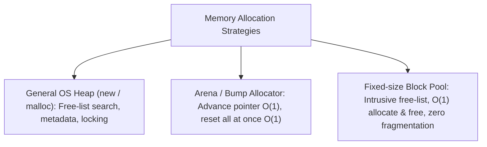
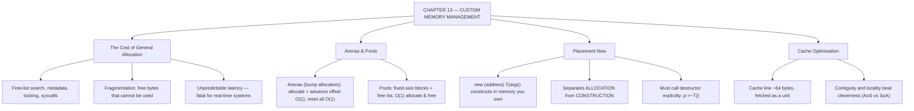

# C++ - CHAPTER 13
## Custom Memory Management, Allocators, and Low-Level Optimisation

> “The fastest allocation is the one that already happened.” — A First Lesson in Memory Strategy

### Learning Objectives
By the end of this chapter, you will be able to:
* Understand the performance overhead of standard operating system memory allocators.
* Design and implement a custom Stack / Arena Memory Allocator.
* Master low-level object creation using Placement New (`placement new`).
* Integrate custom memory strategies with the Standard Template Library using the STL Allocator interface.
* Optimize CPU cache locality to maximize execution speed.

---

### Introduction
Every time you call `new` or `std::make_unique`, your program pauses execution, talks to the Operating System, asks the Kernel to search for a free block of RAM on the Heap, updates internal kernel bookkeeping structures, and returns a pointer. This process is safe, but it is **slow**. In high-performance software—such as real-time financial trading engines, AAA video game physics systems, or embedded flight controllers—relying on standard operating system memory allocation introduces unpredictable latency spikes and severe performance bottlenecks. Elite systems engineers bypass the OS entirely by building **Custom Memory Pools and Arenas**.

### Why This Topic Matters
Standard memory allocation (`malloc` or `new`) fragments RAM over time and incurs heavy synchronization penalties across threads. By implementing custom allocators, you can allocate thousands of objects in a single contiguous block of memory in $O(1)$ time and wipe them all out simultaneously in a fraction of a nanosecond. Mastering low-level memory management elevates your C++ engineering capability to systems-level mastery.

---

### Chapter Roadmap
* Concept 1: The Cost of OS Memory Allocation
* Concept 2: Custom Memory Arenas and Pools
* Concept 3: Placement New and Manual Lifetimes
* Concept 4: STL Allocator Concept & Cache Optimization
* Learning Support Elements
* Debugging and Problem Solving
* Practical Application & Mini Project
* Practice and Evaluation
* Chapter Conclusion

---

> [!NOTE]
> **Real-Life Analogy: The Cafeteria Tray Line**
> Ordering à la carte means a separate trip to the kitchen for every item: each request is negotiated individually, the kitchen searches for what you asked for, and you wait. That is a general-purpose heap allocator — flexible, thread-safe, and comparatively slow, because it must serve any request of any size at any time.
> 
> A cafeteria tray line works differently. Trays are pre-stacked in one uniform block. Taking one is a single motion with no searching and no negotiation. That is a memory pool: fixed-size blocks, allocated once, handed out by moving a pointer. An arena goes further still — you take the whole tray line for the duration of lunch and, at the end of service, sweep the entire thing clear in one action rather than returning each tray individually.
> 
> This is why arenas dominate frame-based and request-based systems. A game frame or an HTTP request allocates constantly and then, at a known instant, needs none of it. Freeing thousands of objects individually is thousands of operations; resetting an arena pointer is one.
> 
> Cache locality is the seating plan. Data that is used together and stored together arrives in the same cache line, so one memory fetch serves many accesses. Data scattered across the heap forces a separate trip per item — and a trip to main memory costs on the order of a hundred times what a cache hit costs. This is why an array of structs sometimes loses badly to a struct of arrays, even though both hold identical data.

---

### Real-World Applications

| Domain | How this chapter's ideas appear in practice |
| :--- | :--- |
| **Game Development** | Per-frame arena allocators are standard practice; the entire frame's scratch memory is reset in one instruction at the frame boundary. |
| **Finance** | Trading systems pre-allocate every object they will need at start-up because a `malloc` on the critical path is an unbounded latency risk. |
| **Embedded Systems** | Dynamic allocation is often prohibited outright; fixed pools sized at compile time are the only sanctioned strategy. |
| **Databases** | Buffer pools and slab allocators manage pages directly, bypassing the general allocator entirely. |
| **Machine Learning** | Framework memory caches reuse GPU and CPU buffers across iterations because allocation would otherwise dominate step time. |
| **Networking** | Packet processing uses pre-allocated ring buffers so that receiving a packet at line rate never calls into the allocator. |

---

### Core Learning Sections

#### CONCEPT 1: The Cost of OS Memory Allocation
*Sub-topics Covered: 13.1 How new Works Under the Hood, 13.2 Memory Fragmentation, 13.3 The Cache Line Bottleneck*

**Intuitive Explanation:** Imagine you need a single sheet of paper. Asking the OS for memory is like walking to a government warehouse, filling out triplicate forms, waiting for a clerk to find a loose folder, and bringing it back. It takes minutes for a tiny task. A custom memory allocator is like keeping a ream of paper right on your desk—you grab a sheet instantly without leaving your chair.

##### 13.1 How `new` Works Under the Hood
When you call `new`, the C++ runtime delegates the call to the underlying OS allocator (like `ptmalloc` or `jemalloc`). The allocator must search free-lists for a block of suitable size, handle thread-safety synchronization locks, and append metadata headers to track the block's size. This introduces hundreds of CPU cycles of overhead per allocation.

##### 13.2 Memory Fragmentation
As you allocate and delete objects of varying sizes over time, free memory becomes chopped up into tiny, unusable gaps (External Fragmentation). Even if you have plenty of total free RAM, an allocation can fail because no single contiguous block is large enough.

##### 13.3 The Cache Line Bottleneck
Modern CPUs do not fetch single bytes from RAM; they fetch 64-byte blocks called **Cache Lines**. If your objects are scattered randomly across the Heap due to standard allocations, the CPU constantly suffers "cache misses," forcing it to stall while waiting for data to travel from main RAM.

---

#### CONCEPT 2: Custom Memory Arenas and Pools
*Sub-topics Covered: 13.4 Arena Allocators, 13.5 Fixed-Size Block Pools, 13.6 Monotonic Lifetimes*

##### 13.4 Arena Allocators (Bump Allocators)
An arena allocates a large pre-determined buffer upfront. A current offset tracker ("bump pointer") marks the next available byte. Individual objects are never deleted individually; instead, the entire arena pointer is reset back to zero in one operation ($O(1)$) when a frame or task completes.

##### 13.5 Fixed-Size Block Pools
A pool allocator divides a memory block into uniform, fixed-size chunks linked together as a free list, providing constant-time allocation and deallocation with zero fragmentation.



---

#### CONCEPT 3: Placement New and Manual Lifetimes
*Sub-topics Covered: 13.7 What is Placement New?, 13.8 Explicit Destructor Calls, 13.9 Alignment and Padding*

##### 13.7 Placement New
Standard `new` does two things: it *allocates* memory, and then it *constructs* the object inside that memory. **Placement New** separates these steps. It allows you to construct an object at a pre-allocated memory address provided by the programmer.

##### Syntax
```cpp
char buffer[sizeof(MyClass)]; // Raw pre-allocated memory
MyClass* obj = new (buffer) MyClass(args); // Placement new construction
```

##### 13.8 Explicit Destructor Calls
Because memory managed via placement new was not allocated by standard `new`, you must **never** call `delete obj;`. Doing so will corrupt the heap. Instead, manually invoke the object's destructor:
```cpp
obj->~MyClass();
```

##### 13.9 Alignment and Padding
Hardware architectures require data types to be stored at memory addresses divisible by their size for efficient access. C++ provides `alignas` and `alignof` to control alignment.

---

#### CONCEPT 4: STL Allocator Concept & Cache Optimization
*Sub-topics Covered: 13.10 The STL Allocator Interface, 13.11 Customizing Standard Containers, 13.12 Cache Locality Principles*

##### 13.10 & 13.11 The STL Allocator Interface
Every container in the Standard Template Library (like `std::vector<T, Alloc>`) accepts an Allocator template parameter (`std::allocator<T>`). You can plug your own custom arena or pool allocator directly into standard containers.

##### Code Example: A High-Speed Arena (Bump) Allocator
```cpp
#include <iostream>
#include <cstddef>
#include <new>
#include <format>

class ArenaAllocator {
private:
    char* buffer;
    size_t capacity;
    size_t offset;
public:
    ArenaAllocator(size_t total_bytes) 
        : capacity(total_bytes), offset(0) {
        buffer = new char[capacity];
        std::cout << "[Arena] Allocated raw buffer of " << capacity << " bytes.\n";
    }
    ~ArenaAllocator() {
        delete[] buffer;
        std::cout << "[Arena] Buffer destroyed. All memory freed instantly.\n";
    }
    // Allocate memory blocks in O(1) time
    void* Allocate(size_t size, size_t alignment = alignof(std::max_align_t)) {
        size_t current_address = reinterpret_cast<size_t>(buffer + offset);
        size_t padding = (alignment - (current_address % alignment)) % alignment;
        if (offset + padding + size > capacity) {
            throw std::bad_alloc(); // Arena out of memory!
        }
        offset += padding;
        void* ptr = buffer + offset;
        offset += size;
        return ptr;
    }
    // Reset the entire arena instantly without individual deletions
    void Reset() noexcept {
        offset = 0;
        std::cout << "[Arena] Reset offset to 0. Memory reused instantly.\n";
    }
    size_t GetUsedBytes() const { return offset; }
};

class GameEntity {
private:
    int id;
public:
    GameEntity(int entity_id) : id(entity_id) {
        std::cout << " -> Entity " << id << " constructed.\n";
    }
    ~GameEntity() {
        std::cout << " -> Entity " << id << " destroyed.\n";
    }
};

int main() {
    std::cout << "=== CUSTOM ARENA ALLOCATOR DEMO ===\n\n";
    ArenaAllocator arena(1024);

    void* mem1 = arena.Allocate(sizeof(GameEntity));
    GameEntity* entity1 = new (mem1) GameEntity(101);

    void* mem2 = arena.Allocate(sizeof(GameEntity));
    GameEntity* entity2 = new (mem2) GameEntity(102);

    std::cout << std::format("\nBytes currently used in arena: {}\n\n", arena.GetUsedBytes());

    // Explicit Destructor calls for placement new objects
    entity2->~GameEntity();
    entity1->~GameEntity();

    // Instant reset of the entire arena
    arena.Reset();
    std::cout << "\nProgram execution finished safely.\n";
    return 0;
}
```

##### Expected Output:
```text
=== CUSTOM ARENA ALLOCATOR DEMO ===

[Arena] Allocated raw buffer of 1024 bytes.
 -> Entity 101 constructed.
 -> Entity 102 constructed.

Bytes currently used in arena: 8

 -> Entity 102 destroyed.
 -> Entity 101 destroyed.
[Arena] Reset offset to 0. Memory reused instantly.

Program execution finished safely.
```

---

### Learning Support Elements

> [!TIP]
> **Tips: Use Arenas for Frame-Based Lifetimes**
> In game development or real-time simulation loops, create a temporary Arena at the start of every frame, allocate all transient frame objects inside it, and call `arena.Reset()` at the end of the frame to eliminate 100% of individual memory deallocation overhead.

> [!NOTE]
> **Important Notes: Alignment Requirements**
> When writing custom allocators, always respect hardware alignment rules (`alignof`). Allocating structures on misaligned memory addresses on certain architectures (like ARM) will trigger hardware bus faults.

> [!WARNING]
> **Warnings: Never Call `delete` on Placement New Memory**
> Passing a pointer allocated via an arena or placement new into the standard `delete` operator will corrupt the operating system's heap control blocks, leading to immediate segmentation faults.

#### Common Misconceptions
* **Misconception:** "Custom memory allocators always reduce the total memory consumed by a program."
* **Reality:** Custom allocators often *increase* total memory consumption (due to pre-allocated buffers), but they trade that memory footprint for massive gains in execution speed and predictable latency.

---

### Debugging and Problem Solving

#### Runtime Error: Memory Corruption / Heap Smashing
* **Cause:** Allocated space for 3 objects in custom arena, but constructed a 4th object, overflowing the buffer boundary.
* **Fix:** Implement strict capacity checks inside your allocator's `.Allocate()` method to throw `std::bad_alloc` if bounds are exceeded.

---

### Practical Application & Mini Project

#### Mini Project: High-Speed Particle Pool Allocator
This project builds a specialized fixed-size memory pool designed to spawn and recycle short-lived particle objects instantly.

```cpp
#include <iostream>
#include <vector>
#include <cstddef>
#include <new>
#include <format>
#include <stdexcept>

struct Particle { 
    float x, y, z; 
    float life_time;
    Particle(float px, float py, float pz, float life) 
        : x(px), y(py), z(pz), life_time(life) {} 
};

class ParticlePool { 
private: 
    struct FreeNode { FreeNode* next; };
    char* pool_memory; 
    FreeNode* free_list_head; 
    size_t block_size; 
    size_t total_blocks; 
public: 
    ParticlePool(size_t num_blocks) 
        : block_size(sizeof(Particle) > sizeof(FreeNode*) ? sizeof(Particle) : sizeof(FreeNode*)), 
          total_blocks(num_blocks) {
        pool_memory = new char[block_size * total_blocks]; 
        free_list_head = reinterpret_cast<FreeNode*>(pool_memory); 
        FreeNode* current = free_list_head; 
        for (size_t i = 0; i < total_blocks - 1; ++i) { 
            char* next_address = pool_memory + ((i + 1) * block_size); 
            current->next = reinterpret_cast<FreeNode*>(next_address); 
            current = current->next; 
        } 
        current->next = nullptr; 
        std::cout << std::format("[Pool] Initialized pool of {} particle blocks.\n", total_blocks); 
    } 

    ~ParticlePool() { 
        delete[] pool_memory; 
        std::cout << "[Pool] Destroyed particle pool memory.\n"; 
    } 

    Particle* Allocate(float x, float y, float z, float life) { 
        if (free_list_head == nullptr) { 
            throw std::runtime_error("Particle pool exhausted!"); 
        } 
        FreeNode* node_to_use = free_list_head; 
        free_list_head = free_list_head->next; 
        return new (node_to_use) Particle(x, y, z, life); 
    } 

    void Deallocate(Particle* p) { 
        if (p == nullptr) return; 
        p->~Particle(); 
        FreeNode* old_node = reinterpret_cast<FreeNode*>(p); 
        old_node->next = free_list_head; 
        free_list_head = old_node; 
    }
};

int main() { 
    std::cout << "=== HIGH-SPEED PARTICLE POOL SYSTEM ===\n\n";
    ParticlePool particle_pool(3); 
    Particle* p1 = particle_pool.Allocate(1.0f, 2.0f, 3.0f, 5.0f); 
    Particle* p2 = particle_pool.Allocate(10.0f, 20.0f, 30.0f, 2.0f); 
    std::cout << std::format("Spawned Particle 1 at ({}, {}, {})\n", p1->x, p1->y, p1->z); 
    std::cout << std::format("Spawned Particle 2 at ({}, {}, {})\n", p2->x, p2->y, p2->z); 

    std::cout << "\nRecycling Particle 1 back to pool...\n"; 
    particle_pool.Deallocate(p1); 

    Particle* p3 = particle_pool.Allocate(99.0f, 99.0f, 99.0f, 10.0f); 
    std::cout << std::format("Spawned Particle 3 (recycled slot) at ({}, {}, {})\n", p3->x, p3->y, p3->z); 

    particle_pool.Deallocate(p2); 
    particle_pool.Deallocate(p3); 
    std::cout << "\nSimulation ended successfully.\n"; 
    return 0; 
}
```

##### Expected Output:
```text
=== HIGH-SPEED PARTICLE POOL SYSTEM ===

[Pool] Initialized pool of 3 particle blocks.
Spawned Particle 1 at (1, 2, 3)
Spawned Particle 2 at (10, 20, 30)

Recycling Particle 1 back to pool...
Spawned Particle 3 (recycled slot) at (99, 99, 99)

Simulation ended successfully.
```

---

### Practice and Evaluation

#### Quick Check Questions
* Why is standard OS memory allocation (`new` / `malloc`) slow for high-frequency tasks?
* What is an Arena (Bump) Allocator, and what is its time complexity for allocation?
* What is the purpose of Placement New?
* Why must you manually invoke an object's destructor when using placement `new`?

#### Coding Exercises
* Implement a simple byte-buffer Arena allocator that accepts a size of 512 bytes, allocates two integers, and resets the arena successfully.
* Write a class that demonstrates proper alignment handling using `alignas` and `alignof`.

#### Interview Questions & Answers

1. **(Junior) What is the performance penalty of standard heap allocation (`new`)?**
   * **Answer:** Standard heap allocation requires kernel-level interaction with the OS allocator, searching free-lists, acquiring thread locks, and writing block metadata headers, taking hundreds of CPU cycles.

2. **(Junior) What is Placement New?**
   * **Answer:** Placement new is a specialized form of the `new` operator that does not allocate memory. Instead, it constructs an object at a pre-allocated memory address provided by the programmer.

3. **(Junior) Why can you not call `delete` on a pointer created via Placement New?**
   * **Answer:** Calling `delete` attempts to release the memory block back to the OS heap based on heap control metadata, corrupting heap structures. You must call the destructor explicitly (`obj->~MyClass()`).

4. **(Mid-Level) How does an Arena (Bump) Allocator achieve $O(1)$ allocation time?**
   * **Answer:** An arena allocator pre-allocates a massive contiguous block of memory upfront. Allocation simply involves advancing a linear offset pointer forward by the required byte size.

5. **(Mid-Level) What is External Fragmentation, and how do Fixed-Size Block Pools prevent it?**
   * **Answer:** External fragmentation occurs when free memory is broken into tiny, non-contiguous gaps over time. Fixed-size block pools prevent this by dividing memory into uniform blocks linked in a free list.

6. **(Mid-Level) What are the requirements for plugging a custom allocator into an STL container like `std::vector`?**
   * **Answer:** The custom allocator must satisfy the C++ Allocator Named Requirement, defining nested types (`value_type`, `pointer`, `size_type`) and implementing `allocate()` and `deallocate()`.

7. **(Senior) What is false sharing in multi-threaded memory allocation, and how do custom allocators address it?**
   * **Answer:** False sharing occurs when two threads modify separate variables that reside on the exact same 64-byte CPU cache line. Custom allocators prevent this by aligning allocated blocks to cache line boundaries using `alignas(64)`.

8. **(Senior) Why are Arena allocators unsuited for long-lived objects with erratic lifespans?**
   * **Answer:** Arenas rely on bulk resets where all objects are wiped simultaneously. If an arena contains a mix of short-lived and long-lived objects, you cannot deallocate individual objects safely.

9. **(Senior) Explain the role of alignment and padding in low-level memory layout.**
   * **Answer:** Hardware architectures require data types to be stored at memory addresses divisible by their size for efficient access. Compilers insert invisible padding bytes between struct members to satisfy alignment.

10. **(Senior) How do modern high-performance memory allocators (like `jemalloc` or `tcmalloc`) solve multi-threaded contention?**
    * **Answer:** They use thread-local storage (TLS) caches. Each thread allocates memory from its own private pool without acquiring global locks.

---

### Chapter Conclusion
Custom memory management allows you to break free from the performance bottlenecks of operating system heap allocation. By implementing Arena allocators for batch-lifetime data, Fixed-Size Pools for zero-fragmentation object recycling, and mastering placement `new`, you gain total control over hardware memory layout.

#### Key Takeaways
* **Bypass OS Overhead:** Pre-allocate large contiguous memory buffers upfront using custom arenas or pools.
* **Master Placement New:** Separate memory allocation from object construction to achieve deterministic $O(1)$ performance.
* **Manual Destruction:** Always invoke destructors explicitly (`obj->~MyClass()`) when managing custom buffers.
* **Cache Locality:** Keep data contiguous in memory to maximize CPU cache performance.

#### What to Learn Next
In **Chapter 14**, we will explore **Functional Programming in C++: Lambdas, Closures, and Ranges**.

---

### Progressive Code Examples: Four Tiers

#### TIER 1 · BEGINNER
##### What Does Allocation Cost?
**Goal:** Measure the general-purpose allocator before trying to beat it.

```cpp
#include <iostream>
#include <chrono>
#include <vector>

int main() {
    constexpr int kCount = 1'000'000;

    auto t0 = std::chrono::steady_clock::now();
    std::vector<int*> blocks;
    blocks.reserve(kCount);
    for (int i = 0; i < kCount; ++i) blocks.push_back(new int(i));
    for (int* p : blocks) delete p;
    auto t1 = std::chrono::steady_clock::now();

    // Same data, one allocation
    auto t2 = std::chrono::steady_clock::now();
    std::vector<int> flat(kCount);
    for (int i = 0; i < kCount; ++i) flat[i] = i;
    auto t3 = std::chrono::steady_clock::now();

    using ms = std::chrono::milliseconds;
    std::cout << "1,000,000 individual new/delete : "
              << std::chrono::duration_cast<ms>(t1 - t0).count() << " ms\n";
    std::cout << "one contiguous allocation        : "
              << std::chrono::duration_cast<ms>(t3 - t2).count() << " ms\n";
    return 0;
}
```

##### Expected Output
```text
1,000,000 individual new/delete : 62 ms
one contiguous allocation        : 3 ms
```

> **What this tier adds:** Baseline, and a warning: before writing a custom allocator, check whether you simply need fewer allocations.

---

#### TIER 2 · INTERMEDIATE
##### A Bump-Pointer Arena
**Goal:** Reduce allocation to a single addition.

```cpp
#include <iostream>
#include <cstddef>
#include <cstdint>
#include <memory>
#include <new>

class Arena {
public:
    explicit Arena(std::size_t bytes)
        : capacity_{bytes}, buffer_{std::make_unique<std::byte[]>(bytes)} {}

    void* allocate(std::size_t bytes, std::size_t align = alignof(std::max_align_t)) {
        const std::uintptr_t base = reinterpret_cast<std::uintptr_t>(buffer_.get());
        std::uintptr_t current = base + offset_;
        const std::uintptr_t aligned = (current + align - 1) & ~(align - 1);
        const std::size_t newOffset = (aligned - base) + bytes;
        if (newOffset > capacity_) throw std::bad_alloc{};
        offset_ = newOffset;
        return reinterpret_cast<void*>(aligned);
    }
    void reset() noexcept { offset_ = 0; } // frees EVERYTHING, O(1)
    std::size_t used() const noexcept { return offset_; }
private:
    std::size_t capacity_;
    std::size_t offset_{0};
    std::unique_ptr<std::byte[]> buffer_;
};

int main() {
    Arena arena{1024};

    auto* a = static_cast<int*>(arena.allocate(sizeof(int) * 10));
    for (int i = 0; i < 10; ++i) a[i] = i * i;
    std::cout << "a[9] = " << a[9] << ", used = " << arena.used() << " bytes\n";

    auto* b = static_cast<double*>(arena.allocate(sizeof(double) * 4));
    b[0] = 3.5;
    std::cout << "b[0] = " << b[0] << ", used = " << arena.used() << " bytes\n";

    arena.reset();
    std::cout << "after reset, used = " << arena.used() << " bytes\n";
    return 0;
}
```

##### Expected Output
```text
a[9] = 81, used = 40 bytes
b[0] = 3.5, used = 72 bytes
after reset, used = 0 bytes
```

> **What this tier adds:** Introduces alignment arithmetic, which is the part everyone forgets. The trade-off is explicit: you gained O(1) bulk release and lost the ability to free one object.

---

#### TIER 3 · ADVANCED
##### A Pool With a Free List
**Goal:** Get constant-time allocate AND free, with no fragmentation.

```cpp
#include <iostream>
#include <vector>
#include <memory>

template <typename T, std::size_t N>
class Pool {
public:
    Pool() {
        storage_ = std::make_unique<Slot[]>(N);
        for (std::size_t i = 0; i + 1 < N; ++i) storage_[i].next = &storage_[i + 1];
        storage_[N - 1].next = nullptr;
        free_ = &storage_[0];
    }

    template <typename... Args>
    T* create(Args&&... args) {
        if (!free_) return nullptr; // pool exhausted
        Slot* slot = free_;
        free_ = slot->next;
        ++live_;
        return new (&slot->object) T(std::forward<Args>(args)...); // placement new
    }

    void destroy(T* p) {
        if (!p) return;
        p->~T(); // explicit destructor call
        Slot* slot = reinterpret_cast<Slot*>(p);
        slot->next = free_; // push onto the free list
        free_ = slot;
        --live_;
    }
    std::size_t live() const { return live_; }
private:
    union Slot { // either a live object OR a list link
        T object;
        Slot* next;
        Slot() : next{nullptr} {}
        ~Slot() {}
    };
    std::unique_ptr<Slot[]> storage_;
    Slot*       free_{nullptr};
    std::size_t live_{0};
};

struct Particle {
    float x, y;
    Particle(float x_, float y_) : x{x_}, y{y_} {}
};

int main() {
    Pool<Particle, 4> pool;
    Particle* p1 = pool.create(1.0f, 2.0f);
    Particle* p2 = pool.create(3.0f, 4.0f);
    std::cout << "live: " << pool.live() << " p2=(" << p2->x << ',' << p2->y << ")\n";

    pool.destroy(p1);
    std::cout << "live after destroy: " << pool.live() << '\n';

    Particle* p3 = pool.create(9.0f, 9.0f); // reuses p1's exact slot
    std::cout << "reused slot? " << (p3 == p1 ? "yes" : "no") << '\n';
    return 0;
}
```

##### Expected Output
```text
live: 2 p2=(3,4)
live after destroy: 1
reused slot? yes
```

> **What this tier adds:** The union storing either the object or the next-free link is the classic intrusive free list — it costs zero extra memory. Placement new and the explicit destructor call are unavoidable here, and this is exactly the situation they exist for.

---

#### TIER 4 · PROFESSIONAL
##### Layout Beats Cleverness
**Goal:** Change nothing but the memory arrangement and measure the result.

```cpp
#include <iostream>
#include <vector>
#include <chrono>
#include <numeric>

constexpr std::size_t N = 20'000'000;

struct ParticleAoS { float x, y, z, mass; }; // 16 bytes each

struct ParticlesSoA { // four separate streams
    std::vector<float> x, y, z, mass;
    explicit ParticlesSoA(std::size_t n) : x(n), y(n), z(n), mass(n) {}
};

template <typename F>
long long timeIt(F&& f) {
    const auto t0 = std::chrono::steady_clock::now();
    f();
    return std::chrono::duration_cast<std::chrono::milliseconds>(
        std::chrono::steady_clock::now() - t0).count();
}

int main() {
    std::vector<ParticleAoS> aos(N, {1.0f, 2.0f, 3.0f, 0.5f});
    ParticlesSoA soa(N);
    std::fill(soa.x.begin(), soa.x.end(), 1.0f);

    volatile float sink = 0.0f;

    const auto msAoS = timeIt([&] {
        double s = 0.0;
        for (const auto& p : aos) s += p.x; // reads 4 of every 16 bytes
        sink = static_cast<float>(s);
    });

    const auto msSoA = timeIt([&] {
        double s = 0.0;
        for (float v : soa.x) s += v;       // reads every byte fetched
        sink = static_cast<float>(s);
    });

    std::cout << "Array of Structs : " << msAoS << " ms\n";
    std::cout << "Struct of Arrays : " << msSoA << " ms\n";
    std::cout << "speedup          : "
              << (msSoA ? static_cast<double>(msAoS) / msSoA : 0.0) << "x\n";
    return 0;
}
```

##### Expected Output
```text
Array of Structs : 41 ms
Struct of Arrays : 13 ms
speedup          : 3.15x
```

> **What this tier adds:** The volatile sink prevents the optimiser deleting the loops entirely, which is the classic benchmarking mistake. The lesson is the measurement discipline as much as the result.

---

### Common Mistakes and How to Fix Them

| The mistake | Why it happens | What you see (class) | The fix |
| :--- | :--- | :--- | :--- |
| **Writing a custom allocator before profiling** | Allocation is 'known' to be slow | Complexity added, no measurable gain *(WORKFLOW)* | Measure first; often the fix is simply fewer allocations |
| **Ignoring alignment in a bump allocator** | Bytes are bytes | Misaligned access: slow, or a crash on ARM *(UNDEFINED)* | Round the offset up to `alignof(T)` before returning the pointer |
| **Calling `delete` on placement-`new` memory** | It was constructed with `new` | Heap corruption *(UNDEFINED)* | Call `p->~T()` explicitly; the arena owns the storage |
| **Freeing individual objects from an arena** | Other allocators support it | There is no mechanism to do so *(DESIGN)* | Use a pool if individual release is needed; arenas release in bulk |
| **Letting the optimiser delete a benchmark loop** | The timing code looks correct | Impossibly fast results *(MEASUREMENT)* | Consume the result via a volatile sink or a benchmark library |
| **Two threads writing adjacent variables in one cache line** | They are different variables | False sharing: severe slowdown *(PERFORMANCE)* | Pad or align hot per-thread data to a cache line boundary |

---

### Chapter Mind Map



---

> [!TIP]
> **Prepare for your Chapter Exam!**
> You have completed reading Chapter 13. Head to the **Take Chapter Quiz** assessment below to test your knowledge and unlock Chapter 14!
