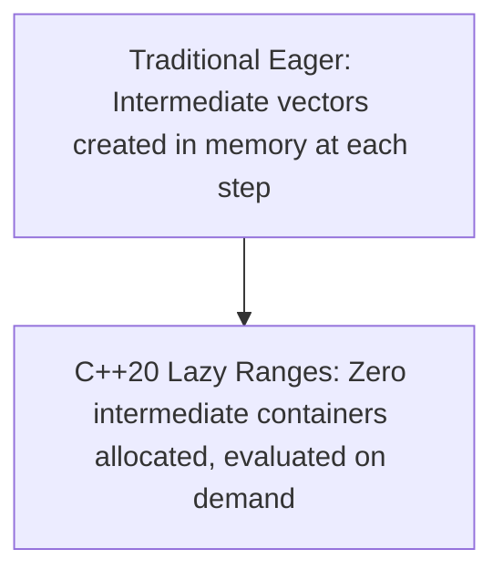
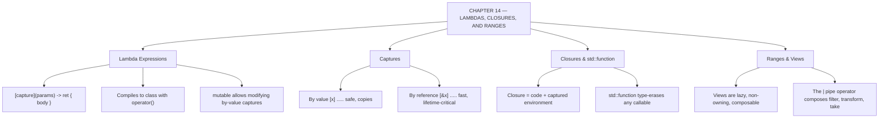

# C++ - CHAPTER 14
## Functional Programming: Lambdas, Closures, and Ranges

> “Describe what you want computed. Let the library decide when to compute it.” — A First Lesson in Declarative Style

### Learning Objectives
By the end of this chapter, you will be able to:
* Master advanced Lambda expressions, capture clauses, and mutable lambdas.
* Understand Closures and type-erased callable objects using `std::function`.
* Leverage the C++20 Ranges Library to build lazy, composable data pipelines using the pipe operator (`|`).
* Optimize data transformations using standard functional algorithms and projections.

---

### Introduction
For decades, C++ was viewed strictly as an object-oriented and procedural language. However, modern software engineering heavily relies on **Functional Programming**—a paradigm where code is built using pure, stateless functions, data transformations, and declarative pipelines rather than heavy, mutating loops. C++ has evolved to embrace this paradigm fully. With the introduction of Lambda expressions and the revolutionary C++20 Ranges library, you can now write code that reads like natural language: filtering, transforming, and querying collections with breathtaking elegance and zero performance penalty.

### Why This Topic Matters
Imperative loops (for loops packed with temporary state variables and index counters) are prone to off-by-one errors and hide the true intent of your algorithm. Functional pipelines using C++20 Ranges allow you to declare *what* you want to achieve rather than micromanaging *how* the computer loops through memory. Mastering lambdas and ranges transforms verbose, messy codebases into clean, expressive, and easily testable architectures.

---

### Chapter Roadmap
* Concept 1: Advanced Lambda Expressions and Captures
* Concept 2: Closures and `std::function`
* Concept 3: The C++20 Ranges Library and Views
* Concept 4: Composable Pipelines and Projections
* Learning Support Elements
* Debugging and Problem Solving
* Practical Application & Mini Project
* Practice and Evaluation
* Chapter Conclusion

---

> [!NOTE]
> **Real-Life Analogy: The Assembly Line and the Sticky Note**
> A lambda is a sticky note with instructions written on it, handed to a machine that will carry them out later. It has no name, it lives exactly where it is needed, and it can be read at a glance alongside the code that uses it. That is why predicates for `sort` and `find_if` are almost always lambdas rather than functions defined a hundred lines away.
> 
> The capture clause is what the note is allowed to refer to. Capturing by value photocopies the referenced information onto the note itself, so it stays correct even after the original is gone. Capturing by reference writes down where to look instead — faster and always current, but worthless if the original has been thrown away by the time the note is read. That single distinction is the entire dangling-capture bug class.
> 
> Ranges turn a series of separate machines into one continuous assembly line. Traditionally, filtering a million items produced a million-item intermediate pile, which was then transformed into a second pile, from which you took five. Three full passes and two piles of waste. A range view is lazy: nothing moves until you pull from the end of the line, and then only enough work is done to satisfy what you actually pulled. Ask for five results and only enough items are processed to produce five.

---

### Real-World Applications

| Domain | How this chapter's ideas appear in practice |
| :--- | :--- |
| **Machine Learning** | Data preprocessing pipelines are naturally expressed as composed transformations over a dataset view. |
| **Finance** | Filtering a live tick stream for a symbol and mapping to a derived value is a lazy pipeline that avoids materialising intermediates. |
| **Game Development** | Entity queries — 'all visible enemies within range' — read as a filter chain rather than a nested loop with flags. |
| **Databases** | Query operators are conceptually the same composition; a range view pipeline is a query plan expressed in C++. |
| **Cloud Computing** | Log processing filters and projects records without loading the entire file into memory. |
| **Robotics** | Sensor fusion applies a chain of transforms to a sample stream, with lambdas making each stage local and readable. |

---

### Core Learning Sections

#### CONCEPT 1: Advanced Lambda Expressions and Captures
*Sub-topics Covered: 14.1 Lambda Architecture, 14.2 Advanced Capture Modes, 14.3 Mutable Lambdas and Generic Lambdas*

**Intuitive Explanation:** A lambda expression is an anonymous function—a mini-routine you write inline right where you need it, without having to declare a separate named function somewhere else in your file. Think of a capture clause as packing a lunchbox: you look at the surrounding room, grab the variables you need, pack them inside the lunchbox, and walk away to execute your computation.

##### 14.1 Lambda Architecture
Under the hood, the compiler translates every lambda expression into a unique, unnamed class (called a **closure object**) that overloads the function call operator `operator()`.

##### 14.2 Advanced Capture Modes
The capture bracket `[...]` dictates how external variables enter the lambda scope:
* `[=]`: Captures all used local variables by value (copies).
* `[&]`: Captures all used local variables by reference.
* `[x, &y]`: Captures `x` by value and `y` by reference explicitly.

##### 14.3 Mutable Lambdas and Generic Lambdas
By default, variables captured by value inside a lambda are read-only (`const`). If you want to modify captured copies inside the lambda, append the `mutable` keyword. Generic lambdas use `auto` parameters: `[](auto x, auto y) { return x + y; }`.

```cpp
int counter = 0; 
auto increment = [counter]() mutable {
    return ++counter; // Allowed because of 'mutable'
};
```

---

#### CONCEPT 2: Closures and `std::function`
*Sub-topics Covered: 14.4 What is a Closure?, 14.5 Type Erasure with std::function*

##### 14.4 What is a Closure?
A closure is the runtime instance created when a lambda expression is evaluated. It bundles the function's executable instructions together with the captured state variables.

##### 14.5 Type Erasure with `std::function`
Located in `<functional>`, `std::function` is a polymorphic wrapper that can store, copy, and invoke *any* callable target (lambdas, function pointers, or functors) with a matching signature.

##### Syntax
```cpp
#include <functional>
std::function<int(int, int)> callback = [](int a, int b) { return a + b; };
```

---

#### CONCEPT 3: The C++20 Ranges Library and Views
*Sub-topics Covered: 14.6 The Evolution of Ranges, 14.7 Range Views and Lazy Evaluation, 14.8 Common Range Views (filter, transform)*

**Intuitive Explanation:** Traditional STL algorithms required you to pass pairs of iterators (`vec.begin()`, `vec.end()`). The C++20 Ranges Library allows you to pass the container directly. Moreover, **Views** introduce **Lazy Evaluation**: they don't compute anything upfront. They act as lightweight pipelines that process items on-the-fly only when you explicitly loop through them.

##### 14.8 Common Range Views
* `std::views::filter(predicate)`: Selects only elements matching a condition.
* `std::views::transform(function)`: Converts each element into a new form.
* `std::views::take(n)`: Limits the sequence to the first $N$ elements.



---

#### CONCEPT 4: Composable Pipelines and Projections
*Sub-topics Covered: 14.9 The Pipe Operator (|), 14.10 Range Projections*

##### 14.9 The Pipe Operator (`|`)
Using the pipe operator borrowed from Unix shell scripting, you can chain multiple range views together into a readable data processing pipeline:

```cpp
auto result = numbers | std::views::filter(is_even) | std::views::transform(square);
```

##### 14.10 Range Projections
Range algorithms accept a projection argument—a member pointer or function applied to elements before comparison or processing, eliminating wrapper lambdas.

##### Code Example: Functional Pipeline with C++20 Ranges
```cpp
#include <iostream>
#include <vector>
#include <ranges>
#include <algorithm>

int main() {
    std::vector<int> numbers = {1, 2, 3, 4, 5, 6, 7, 8, 9, 10};
    std::cout << "Original Numbers: ";
    for (int n : numbers) std::cout << n << " ";
    std::cout << "\n";

    // C++20 Functional Pipeline: 
    // 1. Filter out odd numbers (keep even numbers)
    // 2. Transform by multiplying each remaining number by 10
    // 3. Take only the first 3 results
    auto processed_pipeline = numbers 
        | std::views::filter([](int n) { return n % 2 == 0; }) 
        | std::views::transform([](int n) { return n * 10; }) 
        | std::views::take(3);

    std::cout << "Processed Pipeline Output: ";
    for (int val : processed_pipeline) {
        std::cout << val << " ";
    }
    std::cout << "\n";
    return 0;
}
```

##### Expected Output:
```text
Original Numbers: 1 2 3 4 5 6 7 8 9 10 
Processed Pipeline Output: 20 40 60
```

---

### Learning Support Elements

> [!TIP]
> **Tips: Explicitly Capture Variables**
> Avoid using wildcards like `[=]` or `[&]` when writing complex lambdas. Explicitly list the variables you are capturing (e.g., `[x, &y]`). This prevents unintentional scope pollution and makes thread-safety boundaries clear.

> [!NOTE]
> **Important Notes: Lazy Evaluation Mechanics**
> Range views do not store data; they evaluate elements on demand. If the underlying container is modified after defining a view but before iterating over it, the view will evaluate against the modified data.

> [!WARNING]
> **Warnings: Dangling References in Lambdas**
> If a lambda captures a local variable by reference (`[&]`) and that lambda outlives the scope in which the local variable was created, the local variable will be destroyed, resulting in a dangling reference and severe undefined behavior.

#### Common Misconceptions
* **Misconception:** "Functional pipelines using C++20 ranges are slower than manual for loops because of abstraction overhead."
* **Reality:** Modern optimizing compilers inline lambda expressions and unroll range view iterators so aggressively that generated assembly code is often identical to—or faster than—hand-written imperative loops.

#### Best Practices
* **Embrace Declarative Code:** Use algorithms and ranges instead of manual index loops to express business logic clearly.
* **Use `std::function` Sparingly:** `std::function` incurs type-erasure and dynamic dispatch overhead. If performance is critical, use templates or `auto`.

---

### Debugging and Problem Solving

#### Compiler Error: Complex Template Diagnostic Trace in Ranges
* **Cause:** Made a syntax typo in a lambda expression or passed an incompatible view adaptor into a pipe sequence.
* **Fix:** Break the pipe expression down into intermediate `auto` variables (e.g., `auto filtered = vec | views::filter(...);`) to isolate which segment is triggering the error.

---

### Practical Application & Mini Project

#### Mini Project: Financial Transaction Stream Processor
This project builds a functional pipeline that ingests raw bank transactions, filters out fraudulent items, transforms currencies, and computes analytics using C++20 ranges and lambdas.

```cpp
#include <iostream>
#include <vector>
#include <string>
#include <ranges>
#include <algorithm>
#include <numeric>
#include <format>

struct Transaction {
    int id;
    std::string category;
    double amount;
    bool is_flagged;
};

class TransactionProcessor {
public:
    static void AnalyzeTransactions(const std::vector<Transaction>& transactions) {
        std::cout << "--- Financial Stream Analytics ---\n";

        // 1. Functional Pipeline using C++20 Ranges
        auto valid_stream = transactions 
            | std::views::filter([](const Transaction& t) { return !t.is_flagged; }) 
            | std::views::filter([](const Transaction& t) { return t.category != "Luxury"; }) 
            | std::views::transform([](const Transaction& t) { return t.amount * 1.05; }); // Apply 5% fee adjustment

        // 2. Compute aggregate statistics using standard algorithms on the range view
        double total_revenue = std::accumulate(valid_stream.begin(), valid_stream.end(), 0.0);
        auto [min_it, max_it] = std::minmax_element(valid_stream.begin(), valid_stream.end());

        std::cout << std::format("Total Processed Transactions: {}\n", std::ranges::distance(valid_stream));
        std::cout << std::format("Adjusted Total Revenue:      ${:.2f}\n", total_revenue);
        if (min_it != valid_stream.end() && max_it != valid_stream.end()) {
            std::cout << std::format("Lowest Adjusted Transaction:  ${:.2f}\n", *min_it);
            std::cout << std::format("Highest Adjusted Transaction: ${:.2f}\n", *max_it);
        }
    }
};

int main() {
    std::cout << "=== FUNCTIONAL DATA PIPELINE DEMO ===\n\n";
    std::vector<Transaction> ledger = {
        {101, "Groceries",   150.0,  false},
        {102, "Luxury",      2500.0, false},
        {103, "Utilities",   85.5,   false},
        {104, "Electronics", 450.0,  true}, // Flagged fraudulent
        {105, "Groceries",   65.0,   false}
    };

    TransactionProcessor::AnalyzeTransactions(ledger);
    std::cout << "\nPipeline analysis completed successfully.\n";
    return 0;
}
```

##### Expected Output:
```text
=== FUNCTIONAL DATA PIPELINE DEMO ===

--- Financial Stream Analytics ---
Total Processed Transactions: 3
Adjusted Total Revenue:      $315.78
Lowest Adjusted Transaction:  $68.25
Highest Adjusted Transaction: $157.50

Pipeline analysis completed successfully.
```

---

### Practice and Evaluation

#### Quick Check Questions
* What is the role of the capture clause `[...]` in a lambda expression?
* Why is `mutable` required if you want to modify a variable captured by value inside a lambda?
* What is lazy evaluation in the context of C++20 range views?
* How do you chain multiple range operations together?

#### Coding Exercises
* Write a generic lambda that accepts two arguments and returns their product. Test it with integers and floating-point numbers.
* Create a vector of integers, use `std::views::filter` to keep only numbers greater than 10, and print them using a range-based `for` loop.

#### Interview Questions & Answers

1. **(Junior) What is a Lambda expression in C++?**
   * **Answer:** A lambda expression is an anonymous inline function object that can capture variables from its surrounding scope and be executed immediately or passed as a callback into algorithms.

2. **(Junior) What is the difference between capturing by value `[=]` and capturing by reference `[&]`?**
   * **Answer:** Capturing by value creates a local copy of external variables inside the lambda closure object. Capturing by reference grants direct access to the original external variables in memory.

3. **(Junior) What is `std::function`, and when should you use it?**
   * **Answer:** `std::function` is a polymorphic wrapper capable of storing, copying, and invoking any callable target matching a specific signature using type erasure.

4. **(Mid-Level) Explain Lazy Evaluation in C++20 Ranges.**
   * **Answer:** Lazy evaluation means that range views do not process elements or allocate intermediate memory when the pipeline is defined. Computation is delayed until elements are actively requested during iteration.

5. **(Mid-Level) What are Generic Lambdas?**
   * **Answer:** Introduced in C++14, generic lambdas allow parameter types to be declared using `auto` (`[](auto x, auto y) { return x + y; }`).

6. **(Mid-Level) How do Range Projections simplify sorting and searching algorithms?**
   * **Answer:** Projections allow range-based algorithms (like `std::ranges::sort`) to accept a member pointer or accessor function directly as an argument, applying it to elements before comparison.

7. **(Senior) What causes a dangling reference bug when using lambda captures?**
   * **Answer:** A dangling reference occurs when a lambda captures local variables by reference (`[&]`) and outlives the scope in which those local variables were created.

8. **(Senior) How does the compiler optimize lambda expressions under the hood?**
   * **Answer:** The compiler generates a unique, anonymous closure class for each lambda, allowing aggressive inlining of the `operator()` call.

9. **(Senior) What is the difference between `std::ranges::sort` and traditional `std::sort`?**
   * **Answer:** `std::ranges::sort` accepts ranges directly (eliminating `.begin()` and `.end()`), supports projections, and constrains inputs using concepts.

10. **(Senior) How do concepts constrain template parameters in the C++20 Ranges library?**
    * **Answer:** C++20 ranges use concepts (like `std::ranges::range`) to enforce requirements at compile time, resulting in clean compiler error messages when invalid types are passed.

---

### Chapter Conclusion
Functional programming features in modern C++—ranging from advanced lambda closures to the C++20 Ranges library—allow you to write declarative, expressive, and high-performance data pipelines.

#### Key Takeaways
* **Explicit Captures:** Always list lambda capture variables explicitly to maintain clean scope boundaries.
* **Embrace Lazy Views:** Use C++20 range views and the pipe operator (`|`) to build zero-allocation processing pipelines.
* **Avoid Dangling References:** Never capture local stack variables by reference if a lambda outlives its creating scope.
* **Declarative Intent:** Focus on *what* data transformations to perform rather than *how* to manage manual loop indices.

#### What to Learn Next
In **Chapter 15**, we will explore **Design Patterns, Clean Architecture, and Best Practices in Modern C++**, bringing together everything you have learned into professional system design.

---

### Progressive Code Examples: Four Tiers

#### TIER 1 · BEGINNER
##### A Function Without a Name
**Goal:** Write the comparison rule where it is used, instead of elsewhere in the file.

```cpp
#include <iostream>
#include <vector>
#include <algorithm>

int main() {
    std::vector<int> v{45, 12, 78, 33, 90, 67};

    std::sort(v.begin(), v.end(),
              [](int a, int b) { return a > b; }); // descending

    for (int x : v) std::cout << x << ' ';
    std::cout << '\n';

    const auto firstBig = std::find_if(v.begin(), v.end(),
                                       [](int x) { return x < 50; });
    if (firstBig != v.end())
        std::cout << "first value under 50: " << *firstBig << '\n';
    return 0;
}
```

##### Expected Output
```text
90 78 67 45 33 12 
first value under 50: 45
```

> **What this tier adds:** Baseline. The rule sits three characters from the algorithm that uses it, which is the entire readability argument for lambdas.

---

#### TIER 2 · INTERMEDIATE
##### Captures, and Why They Matter
**Goal:** See by-value and by-reference capture behave differently, and safely.

```cpp
#include <iostream>
#include <functional>

int main() {
    int counter = 10;

    auto byValue     = [counter]() { return counter; };
    auto byReference = [&counter]() { return counter; };
    auto mutableCopy = [counter]() mutable { return ++counter; };

    counter = 99; // changes AFTER the lambdas were created

    std::cout << "by value     : " << byValue()     << " (snapshot of 10)\n";
    std::cout << "by reference : " << byReference() << " (sees 99)\n";
    std::cout << "mutable copy : " << mutableCopy() << " (its own 10, now 11)\n";
    std::cout << "mutable copy : " << mutableCopy() << " (state persists)\n";
    std::cout << "outer counter: " << counter      << " (untouched)\n";
    return 0;
}
```

##### Expected Output
```text
by value     : 10 (snapshot of 10)
by reference : 99 (sees 99)
mutable copy : 11 (its own 10, now 11)
mutable copy : 12 (state persists)
outer counter: 99 (untouched)
```

> **What this tier adds:** Introduces mutable, shows that a by-value capture is a snapshot taken at creation rather than at call, and names the dangling-capture bug explicitly.

---

#### TIER 3 · ADVANCED
##### Closures Stored and Passed Around
**Goal:** Treat behaviour as data that can be kept in a container.

```cpp
#include <iostream>
#include <functional>
#include <map>
#include <string>
#include <memory>

std::function<int()> makeCounter(int start) {
    auto state = std::make_shared<int>(start); // shared: outlives the call
    return [state]() { return (*state)++; };   // the CLOSURE owns it
}

int main() {
    auto c1 = makeCounter(100);
    auto c2 = makeCounter(0);

    std::cout << c1() << ' ' << c1() << ' ' << c1() << '\n';
    std::cout << c2() << ' ' << c2() << '\n';
    std::cout << "c1 continues: " << c1() << '\n';

    // A dispatch table of behaviours
    std::map<std::string, std::function<double(double, double)>> ops{
        {"add",  [](double a, double b) { return a + b; }},
        {"sub",  [](double a, double b) { return a - b; }},
        {"mul",  [](double a, double b) { return a * b; }},
        {"pow2", [](double a, double)   { return a * a; }},
    };

    for (const auto& [name, fn] : ops)
        std::cout << name << "(6, 3) = " << fn(6, 3) << '\n';
    return 0;
}
```

##### Expected Output
```text
100 101 102
0 1
c1 continues: 103
add(6, 3) = 9
mul(6, 3) = 18
pow2(6, 3) = 36
sub(6, 3) = 3
```

> **What this tier adds:** The shared_ptr capture is what lets the closure's state survive the function that created it — capturing the local int by reference would have dangled. std::function makes heterogeneous lambdas storable in one container, at the cost of an indirect call.

---

#### TIER 4 · PROFESSIONAL
##### A Lazy Pipeline
**Goal:** Describe a transformation and let the library decide how much work to do.

```cpp
#include <iostream>
#include <vector>
#include <ranges>
#include <numeric>
#include <string>
#include <algorithm>

struct Employee { std::string name; std::string dept; int salary; };

int main() {
    std::vector<int> data(1'000'000);
    std::iota(data.begin(), data.end(), 1);

    int inspected = 0;
    auto pipeline = data
        | std::views::filter([&](int n) { ++inspected; return n % 7 == 0; })
        | std::views::transform([](int n) { return n * n; })
        | std::views::take(5);

    std::cout << "pipeline built. elements inspected so far: "
              << inspected << '\n';

    std::cout << "first five squares of multiples of 7: ";
    for (int v : pipeline) std::cout << v << ' ';
    std::cout << "\nelements inspected after iterating: " << inspected << '\n';

    // Projections: sort by a member without writing a comparator
    std::vector<Employee> staff{
        {"Ananya", "Eng", 95000}, {"Bhaskar", "Sales", 72000},
        {"Chetan", "Eng", 88000}, {"Divya",   "Eng",  110000}};

    std::ranges::sort(staff, std::greater{}, &Employee::salary);

    for (const auto& e : staff | std::views::filter(
             [](const Employee& e) { return e.dept == "Eng"; }))
        std::cout << e.name << " " << e.salary << '\n';

    return 0;
}
```

##### Expected Output
```text
pipeline built. elements inspected so far: 0
first five squares of multiples of 7: 49 196 441 784 1225 
elements inspected after iterating: 42
Divya 110000
Ananya 95000
Chetan 88000
```

> **What this tier adds:** Laziness is proven, not asserted, by the inspection counter. Projections remove the comparator boilerplate entirely, and the whole thing reads as a description of intent rather than a set of loops.

---

### Common Mistakes and How to Fix Them

| The mistake | Why it happens | What you see (class) | The fix |
| :--- | :--- | :--- | :--- |
| **Returning a lambda that captured a local by reference** | The capture was correct when written | Dangling reference on call *(UNDEFINED)* | Capture by value, or capture a `shared_ptr` to the state |
| **Using `[&]` or `[=]` out of habit** | It saves listing each variable | Accidental capture with unclear lifetime *(LOGIC)* | List captures explicitly; the list documents the dependency |
| **Expecting a by-value capture to see later changes** | The variable is right there in scope | The lambda uses a snapshot from creation time *(LOGIC)* | Capture by reference if you need the current value |
| **Using `std::function` in a hot loop** | It is the obvious type for 'a callable' | Indirect call plus possible allocation *(PERFORMANCE)* | Use `auto` or a template parameter so the call can be inlined |
| **Keeping a view after its source container is modified** | The view looks like an independent object | Dangling view *(UNDEFINED)* | Views do not own data; keep the source alive and unmodified |
| **Expecting a range pipeline to execute when defined** | It reads like a sequence of statements | Nothing happens until iteration *(LOGIC)* | That laziness is the feature — iterate, or materialise |

---

### Chapter Mind Map



---

> [!TIP]
> **Prepare for your Chapter Exam!**
> You have completed reading Chapter 14. Head to the **Take Chapter Quiz** assessment below to test your knowledge and unlock Chapter 15!
