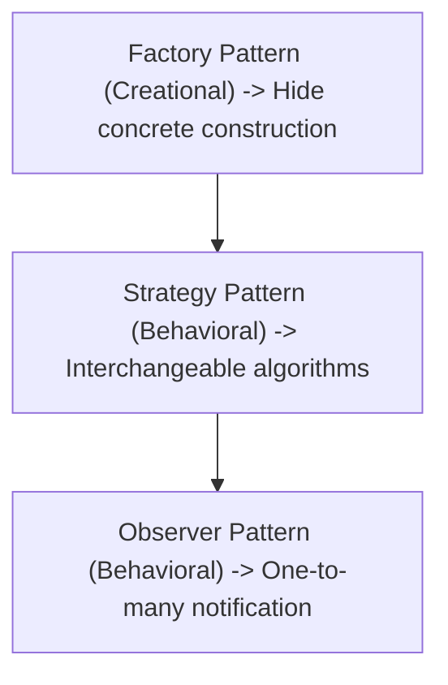
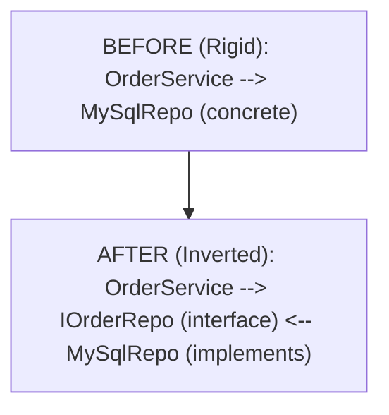
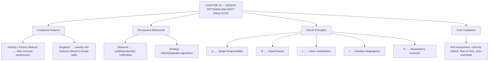

# C++ - CHAPTER 15
## Design Patterns, Clean Architecture, and Best Practices

> “Patterns are not rules to apply. They are names for solutions you would eventually have discovered anyway.” — A First Lesson in Software Design

### Learning Objectives
By the end of this chapter, you will be able to:
* Implement foundational Creational Design Patterns (Singleton, Factory Method).
* Apply Structural and Behavioral Patterns (Observer, Strategy).
* Enforce the SOLID principles of object-oriented design in C++.
* Adopt the C++ Core Guidelines to write modern, safe, and maintainable code.

---

### Introduction
Throughout this textbook, you have journeyed from the absolute fundamentals of variables and memory addresses to advanced templates, multithreading, move semantics, custom memory arenas, and functional pipelines. You now possess the syntax and tools of a C++ master. However, writing syntactically correct code is only half the battle. The true mark of a senior software engineer is the ability to structure codebases that are scalable, testable, modular, and maintainable over decades. This final chapter explores **Design Patterns** and **Clean Architecture**, bringing together everything you have learned into professional system design.

### Why This Topic Matters
As codebases grow to hundreds of thousands of lines, tightly coupled code becomes brittle and impossible to modify without breaking other features. Design patterns are proven architectural blueprints for recurring software design challenges. Combined with the **SOLID principles** and the official **C++ Core Guidelines**, architectural best practices ensure your software remains robust, secure, and clean.

---

### Chapter Roadmap
* Concept 1: Creational Design Patterns
* Concept 2: Behavioral and Structural Patterns
* Concept 3: SOLID Principles in C++
* Concept 4: Modern C++ Core Guidelines and Best Practices
* Learning Support Elements
* Debugging and Problem Solving
* Practical Application & Mini Project
* Practice and Evaluation
* Chapter Conclusion

---

> [!NOTE]
> **Real-Life Analogy: The City's Building Codes**
> No architect designs a staircase from first principles. There is a known ratio of rise to run that is safe and comfortable, and it has a name. Nobody regards using it as unoriginal — it is simply what a competent architect knows. Design patterns are those named solutions for software: a Factory is 'a licensed contractor who builds the right thing so you do not have to know how', a Singleton is 'the building's one and only main electrical panel', an Observer is 'the fire alarm broadcast every floor subscribes to', and a Strategy is 'interchangeable heating systems behind one thermostat interface'.
> 
> SOLID is the building code that keeps a structure maintainable rather than merely standing. Single Responsibility says one room, one purpose — a kitchen that is also a bathroom serves neither well. Open/Closed says you should be able to add a wing without demolishing the existing walls. Liskov says any door that fits the doorframe must actually open. Interface Segregation says do not force every tenant to accept keys to rooms they will never enter. Dependency Inversion says the building should depend on the abstract idea of 'a power supply', not on one specific generator model, so it can switch to the grid without rewiring.
> 
> The Core Guidelines are the site foreman's habits — the small, repeated decisions that separate a project that is pleasant to work on in year three from one that everybody avoids touching.

---

### Real-World Applications

| Domain | How this chapter's ideas appear in practice |
| :--- | :--- |
| **Game Development** | Observer drives event systems; Strategy swaps AI behaviours; Factory constructs entities from data files. |
| **Cloud Computing** | Dependency inversion is what makes services testable — the handler depends on an interface, and tests inject a fake. |
| **Databases** | Pluggable storage engines and query operators are Strategy and Factory at architectural scale. |
| **Finance** | Pricing models are strategies behind one interface, so a new model ships without touching the valuation engine. |
| **Robotics** | Hardware abstraction layers apply dependency inversion so the same control code runs in simulation and on the real machine. |
| **Cyber Security** | Clean layering limits the blast radius of a vulnerability by keeping trust boundaries explicit in the type system. |

---

### Core Learning Sections

#### CONCEPT 1: Creational Design Patterns
*Sub-topics Covered: 15.1 What are Design Patterns?, 15.2 The Singleton Pattern (Meyer's Singleton), 15.3 The Factory Method*

**Intuitive Explanation:** Creational patterns deal with object creation mechanisms, trying to create objects in a manner suitable to the situation. Instead of scattering `new` keywords everywhere across your application—which hardcodes dependencies—creational patterns abstract object creation, giving your system flexibility.

##### 15.1 What are Design Patterns?
Design patterns are general, reusable solutions to commonly occurring software design problems, originally cataloged by the "Gang of Four" (GoF).

##### 15.2 The Singleton Pattern (Meyer's Singleton)
The Singleton pattern ensures that a class has only one instance globally and provides a global point of access to it. In Modern C++, the thread-safe **Meyer's Singleton** is the definitive standard:

```cpp
class Logger {
public:
    static Logger& GetInstance() {
        static Logger instance; // Thread-safe initialization in C++11 and later
        return instance;
    }
    Logger(const Logger&) = delete;
    Logger& operator=(const Logger&) = delete;
private:
    Logger() = default;
};
```

##### 15.3 The Factory Method
A creational pattern that uses a centralized creation function or class to instantiate derived objects based on runtime input parameters, decoupling client code from concrete class implementations.

---

#### CONCEPT 2: Behavioral and Structural Patterns
*Sub-topics Covered: 15.4 The Observer Pattern, 15.5 The Strategy Pattern, 15.6 Structural Decoupling*

##### 15.4 The Observer Pattern
Defines a one-to-many dependency between objects so that when one object (the Subject) changes state, all its dependents (Observers) are notified and updated automatically.

##### 15.5 The Strategy Pattern
Defines a family of algorithms, encapsulates each one into a separate class, and makes them interchangeable at runtime.

##### Syntax
```cpp
class PaymentStrategy {
public:
    virtual void Pay(double amount) = 0;
    virtual ~PaymentStrategy() = default;
};
```



---

#### CONCEPT 3: SOLID Principles in C++
*Sub-topics Covered: 15.7 Single Responsibility, 15.8 Open/Closed, 15.9 Liskov Substitution, 15.10 Interface Segregation, 15.11 Dependency Inversion*

* **S — Single Responsibility Principle (SRP):** A class should have only one reason to change.
* **O — Open/Closed Principle (OCP):** Open for extension, closed for modification.
* **L — Liskov Substitution Principle (LSP):** Derived classes must be substitutable for base classes without breaking behavior.
* **I — Interface Segregation Principle (ISP):** Clients should not be forced to depend on interfaces they do not use.
* **D — Dependency Inversion Principle (DIP):** Depend upon abstractions, not concrete implementations.



---

#### CONCEPT 4: Modern C++ Core Guidelines and Best Practices
*Sub-topics Covered: 15.12 The C++ Core Guidelines, 15.13 RAII Enforcement, 15.14 Zero Overhead Principle*

##### 15.12-15.14 Core Guidelines & RAII & Zero-Overhead
Maintained by Bjarne Stroustrup and Herb Sutter, the C++ Core Guidelines distill decades of practice: RAII everywhere, `const` by default, the Rule of Zero, and zero-overhead abstractions.

##### Code Example: Factory and Strategy Patterns in Action
```cpp
#include <iostream>
#include <memory>
#include <string>

// --- 1. STRATEGY PATTERN INTERFACE ---
class RenderStrategy {
public:
    virtual void Render() const = 0;
    virtual ~RenderStrategy() = default;
}; 

class OpenGLRenderer : public RenderStrategy {
public:
    void Render() const override {
        std::cout << "Rendering graphics using OpenGL pipeline.\n";
    }
};

class VulkanRenderer : public RenderStrategy {
public:
    void Render() const override {
        std::cout << "Rendering graphics using high-performance Vulkan pipeline.\n";
    }
};

// --- 2. FACTORY METHOD PATTERN ---
class RendererFactory {
public:
    enum class Type { OpenGL, Vulkan };
    static std::unique_ptr<RenderStrategy> CreateRenderer(Type type) {
        switch (type) {
            case Type::OpenGL:
                return std::make_unique<OpenGLRenderer>();
            case Type::Vulkan:
                return std::make_unique<VulkanRenderer>();
            default:
                throw std::invalid_argument("Unknown renderer type.");
        }
    }
};

int main() {
    std::cout << "=== DESIGN PATTERNS DEMO (FACTORY & STRATEGY) ===\n\n";
    // Client code requests a renderer via the Factory without knowing concrete class names
    auto renderer1 = RendererFactory::CreateRenderer(RendererFactory::Type::OpenGL);
    auto renderer2 = RendererFactory::CreateRenderer(RendererFactory::Type::Vulkan);

    renderer1->Render();
    renderer2->Render();
    std::cout << "\nDemonstration completed successfully.\n";
    return 0;
}
```

##### Expected Output:
```text
=== DESIGN PATTERNS DEMO (FACTORY & STRATEGY) ===

Rendering graphics using OpenGL pipeline.
Rendering graphics using Vulkan pipeline.

Demonstration completed successfully.
```

---

### Learning Support Elements

> [!TIP]
> **Tips: Favour Composition Over Inheritance**
> While inheritance is powerful, overusing deep inheritance hierarchies leads to fragile codebases. Whenever possible, design systems using composition (having objects contain other objects) combined with the Strategy pattern.

> [!NOTE]
> **Important Notes: Meyer's Singleton Thread Safety**
> In C++11 and later, local static variables inside functions are guaranteed by the C++ Standard to be initialized in a thread-safe manner. Meyer's Singleton (`static MyClass instance;`) requires zero manual mutex locking and is completely leak-free.

> [!WARNING]
> **Warnings: Avoid Global State**
> While Singletons provide global access, overuse of global state creates hidden dependencies between modules. Use Singletons sparingly and only for genuinely system-wide resources (like logging or configuration managers).

#### Common Misconceptions
* **Misconception:** "Design patterns should be applied to every class in a project to make it professional."
* **Reality:** Forcing complex design patterns onto simple problems results in over-engineering. Apply patterns only when they solve genuine architectural decoupling challenges.

---

### Debugging and Problem Solving

#### Architectural Smells: Tight Coupling and God Objects
* **Symptom:** Changing a minor field in one class breaks compilation across half the codebase.
* **Cause:** Violation of the Single Responsibility Principle and Dependency Inversion Principle.
* **Fix:** Introduce abstract interfaces and use Dependency Injection to decouple subsystems.

---

### Practical Application & Mini Project

#### Mini Project: Extensible Enterprise Notification Engine
In enterprise notification engines (such as cloud messaging backends), messages must be dispatched across multiple communication channels dynamically based on user preferences.

```cpp
#include <iostream>
#include <memory>
#include <string>
#include <vector>
#include <format>

// --- 1. STRATEGY INTERFACE ---
class INotificationStrategy {
public:
    virtual void SendMessage(const std::string& recipient, const std::string& message) const = 0;
    virtual ~INotificationStrategy() = default;
};

class EmailNotification : public INotificationStrategy {
public:
    void SendMessage(const std::string& recipient, const std::string& message) const override {
        std::cout << std::format("[EMAIL] To: {} | Msg: '{}'\n", recipient, message);
    }
};

class SMSNotification : public INotificationStrategy {
public:
    void SendMessage(const std::string& recipient, const std::string& message) const override {
        std::cout << std::format("[SMS] To: {} | Msg: '{}'\n", recipient, message);
    }
};

class PushNotification : public INotificationStrategy {
public:
    void SendMessage(const std::string& recipient, const std::string& message) const override {
        std::cout << std::format("[PUSH] To: {} | Msg: '{}'\n", recipient, message);
    }
};

// --- 2. FACTORY PATTERN ---
class NotificationFactory {
public:
    enum class Channel { Email, SMS, Push };
    static std::unique_ptr<INotificationStrategy> CreateChannel(Channel channel) {
        switch (channel) {
            case Channel::Email: return std::make_unique<EmailNotification>();
            case Channel::SMS:   return std::make_unique<SMSNotification>();
            case Channel::Push:  return std::make_unique<PushNotification>();
            default: throw std::invalid_argument("Unknown notification channel.");
        }
    }
};

// --- 3. SYSTEM DISPATCHER ---
class NotificationDispatcher {
private:
    std::vector<std::unique_ptr<INotificationStrategy>> active_channels;
public:
    void RegisterChannel(std::unique_ptr<INotificationStrategy> channel) {
        active_channels.push_back(std::move(channel));
    }

    void Broadcast(const std::string& recipient, const std::string& message) const {
        std::cout << "--- Broadcasting Notification Pipeline ---\n";
        for (const auto& channel : active_channels) {
            channel->SendMessage(recipient, message);
        }
    }
};

int main() {
    std::cout << "=== ENTERPRISE NOTIFICATION ENGINE ===\n\n";
    NotificationDispatcher dispatcher;

    // Register channels dynamically using the Factory
    dispatcher.RegisterChannel(NotificationFactory::CreateChannel(NotificationFactory::Channel::Email));
    dispatcher.RegisterChannel(NotificationFactory::CreateChannel(NotificationFactory::Channel::SMS));
    dispatcher.RegisterChannel(NotificationFactory::CreateChannel(NotificationFactory::Channel::Push));

    // Broadcast message to user
    dispatcher.Broadcast("alice@example.com", "Your security verification code is 4920.");
    std::cout << "\nNotification dispatch completed successfully.\n";
    return 0;
}
```

##### Expected Output:
```text
=== ENTERPRISE NOTIFICATION ENGINE ===

--- Broadcasting Notification Pipeline ---
[EMAIL] To: alice@example.com | Msg: 'Your security verification code is 4920.'
[SMS] To: alice@example.com | Msg: 'Your security verification code is 4920.'
[PUSH] To: alice@example.com | Msg: 'Your security verification code is 4920.'

Notification dispatch completed successfully.
```

---

### Practice and Evaluation

#### Quick Check Questions
* What is Meyer's Singleton, and why is it thread-safe in Modern C++?
* What problem does the Strategy Pattern solve compared to conditional branching (`switch`/`if-else`)?
* Name the five principles that make up the acronym SOLID.
* What is the primary benefit of the Dependency Inversion Principle?

#### Coding Exercises
* Implement a simple Factory pattern for a geometric shape interface (`Shape`) with derived classes `Circle` and `Square`.
* Write a Meyer's Singleton logging class that writes messages to the console.

#### Interview Questions & Answers

1. **(Junior) What is the Singleton Design Pattern, and what are its drawbacks?**
   * **Answer:** A Singleton ensures a class has only one instance globally and provides a global access point. Drawbacks include introducing global state, hiding dependencies, and complicating unit testing.

2. **(Junior) Explain the Open/Closed Principle (OCP).**
   * **Answer:** OCP states that software entities should be open for extension but closed for modification.

3. **(Junior) What is Dependency Injection?**
   * **Answer:** Dependency Injection is a design technique where an object receives its required dependencies from an external source rather than creating them internally.

4. **(Mid-Level) How does Meyer's Singleton achieve thread safety without explicit mutexes?**
   * **Answer:** Meyer's Singleton defines the instance as a local static variable inside a static getter function. C++11 guarantees thread-safe initialization of function-local static variables.

5. **(Mid-Level) Explain the Liskov Substitution Principle (LSP).**
   * **Answer:** LSP states that objects of a superclass should be replaceable with objects of its subclasses without breaking application behavior.

6. **(Mid-Level) What is the difference between the Factory Method and Abstract Factory patterns?**
   * **Answer:** Factory Method creates objects of a single family. Abstract Factory provides an interface for creating families of related or dependent objects.

7. **(Senior) How do smart pointers facilitate Clean Architecture and enforce the SOLID principles?**
   * **Answer:** Smart pointers enforce RAII and unambiguous ownership semantics, satisfying Dependency Inversion when accepting abstract base interfaces.

8. **(Senior) What are the main objectives of the C++ Core Guidelines?**
   * **Answer:** The C++ Core Guidelines aim to help developers write modern, type-safe, and resource-safe C++ code, eliminating undefined behavior and leaks.

9. **(Senior) Why can excessive use of `virtual` functions hurt CPU performance?**
   * **Answer:** Every `virtual` call requires a pointer dereference and a `vtable` lookup, which can defeat CPU branch prediction and prevent compiler inlining optimizations.

10. **(Senior) How does the Interface Segregation Principle (ISP) prevent fat interfaces?**
    * **Answer:** ISP dictates breaking large, monolithic interface classes down into small, cohesive, highly specialized interfaces.

---

### Chapter Conclusion
Design patterns, Clean Architecture principles, and the C++ Core Guidelines represent the pinnacle of software engineering craftsmanship. By structuring systems using creational and behavioral patterns, adhering to SOLID principles, and enforcing RAII memory safety, you write software that is clean, maintainable, and robust.

#### Key Takeaways
* **Design with Intent:** Apply patterns where they solve modularity challenges; avoid over-engineering.
* **Embrace SOLID:** Build extensible systems through abstraction and dependency inversion.
* **Follow the Core Guidelines:** Let static analysis and RAII protect your codebase against memory bugs.
* **Write Clean Code:** Prioritize readability, expressiveness, and zero-overhead performance in every system you engineer.

---

### Progressive Code Examples: Four Tiers

#### TIER 1 · BEGINNER
##### Strategy: Swappable Behaviour
**Goal:** Change what an object does without changing what it is.

```cpp
#include <iostream>
#include <functional>
#include <vector>
#include <string>

class Checkout {
public:
    using Discount = std::function<double(double)>;
    explicit Checkout(Discount policy) : policy_{std::move(policy)} {}
    double total(double subtotal) const { return policy_(subtotal); }
private:
    Discount policy_;
};

int main() {
    Checkout none   { [](double s) { return s; } };
    Checkout festive{ [](double s) { return s * 0.80; } };
    Checkout member { [](double s) { return s > 5000 ? s - 750 : s * 0.95; } };

    const double cart = 6000.0;
    std::cout << "no discount : " << none.total(cart)    << '\n';
    std::cout << "festive 20% : " << festive.total(cart) << '\n';
    std::cout << "member      : " << member.total(cart)  << '\n';
    return 0;
}
```

##### Expected Output
```text
no discount : 6000
festive 20% : 4800
member      : 5250
```

> **What this tier adds:** Baseline. Adding a new pricing rule requires no change to Checkout at all — that is the Open/Closed Principle, met in its lightest possible form.

---

#### TIER 2 · INTERMEDIATE
##### Factory: Constructing Without Naming
**Goal:** Let the caller ask for a capability rather than a concrete class.

```cpp
#include <iostream>
#include <memory>
#include <string>
#include <unordered_map>
#include <functional>

class Exporter {
public:
    virtual ~Exporter() = default;
    virtual std::string render(const std::string& data) const = 0;
};

class JsonExporter final : public Exporter {
public:
    std::string render(const std::string& d) const override {
        return "{\"value\":\"" + d + "\"}";
    }
};

class CsvExporter final : public Exporter {
public:
    std::string render(const std::string& d) const override {
        return "value\n" + d;
    }
};

class ExporterFactory {
public:
    using Creator = std::function<std::unique_ptr<Exporter>()>;
    void registerType(const std::string& key, Creator c) {
        creators_[key] = std::move(c);
    }
    std::unique_ptr<Exporter> create(const std::string& key) const {
        const auto it = creators_.find(key);
        return it == creators_.end() ? nullptr : it->second();
    }
private:
    std::unordered_map<std::string, Creator> creators_;
};

int main() {
    ExporterFactory factory;
    factory.registerType("json", [] { return std::make_unique<JsonExporter>(); });
    factory.registerType("csv",  [] { return std::make_unique<CsvExporter>(); });

    for (const std::string& fmt : {"json", "csv", "xml"}) {
        auto e = factory.create(fmt);
        std::cout << fmt << " -> "
                  << (e ? e->render("42") : "[unsupported]") << '\n';
    }
    return 0;
}
```

##### Expected Output
```text
json -> {"value":"42"}
csv -> value
42
xml -> [unsupported]
```

> **What this tier adds:** A registry-based factory means adding a format touches exactly one registration line — no switch statement anywhere grows a new case. The unknown key returns nullptr rather than throwing, which the caller handles explicitly.

---

#### TIER 3 · ADVANCED
##### Observer Without Leaks
**Goal:** Broadcast to subscribers that may disappear at any time.

```cpp
#include <iostream>
#include <memory>
#include <vector>
#include <string>
#include <algorithm>

class Observer {
public:
    virtual ~Observer() = default;
    virtual void onPrice(const std::string& symbol, double price) = 0;
};

class Display final : public Observer {
public:
    explicit Display(std::string id) : id_{std::move(id)} {}
    void onPrice(const std::string& s, double p) override {
        std::cout << "  [" << id_ << "] " << s << " = " << p << '\n';
    }
private:
    std::string id_;
};

class Ticker {
public:
    void subscribe(const std::shared_ptr<Observer>& o) {
        observers_.push_back(o); // stored WEAKLY
    }
    void publish(const std::string& symbol, double price) {
        // Prune dead observers while notifying the live ones
        observers_.erase(
            std::remove_if(observers_.begin(), observers_.end(),
                           [&](const std::weak_ptr<Observer>& w) {
                               if (auto o = w.lock()) { o->onPrice(symbol, price); return false; }
                               return true; // expired -> remove
                           }),
            observers_.end());
    }
    std::size_t liveCount() const { return observers_.size(); }
private:
    std::vector<std::weak_ptr<Observer>> observers_;
};

int main() {
    Ticker ticker;
    auto permanent = std::make_shared<Display>("main");
    ticker.subscribe(permanent);

    {
        auto temporary = std::make_shared<Display>("popup");
        ticker.subscribe(temporary);
        std::cout << "both subscribed:\n";
        ticker.publish("INFY", 1543.20);
    } // popup is destroyed here, with no unsubscribe call

    std::cout << "after popup closed:\n";
    ticker.publish("INFY", 1550.00);
    std::cout << "live subscribers: " << ticker.liveCount() << '\n';
    return 0;
}
```

##### Expected Output
```text
both subscribed:
  [main] INFY = 1543.2
  [popup] INFY = 1543.2
after popup closed:
  [main] INFY = 1550
live subscribers: 1
```

> **What this tier adds:** Storing observers as shared_ptr would keep every subscriber alive forever — a classic listener leak. weak_ptr plus lock() makes unsubscription automatic and impossible to forget.

---

#### TIER 4 · PROFESSIONAL
##### SOLID in One Program
**Goal:** Assemble a small system where every dependency points at an abstraction.

```cpp
#include <iostream>
#include <memory>
#include <string>
#include <vector>
#include <optional>

struct Order { int id; std::string customer; double amount; };

class IOrderRepository {
public:
    virtual ~IOrderRepository() = default;
    virtual void save(const Order&) = 0;
    virtual std::optional<Order> findById(int id) const = 0;
};

class IAuditLog {
public:
    virtual ~IAuditLog() = default;
    virtual void record(const std::string& message) = 0;
};

class OrderService {
public:
    OrderService(IOrderRepository& repo, IAuditLog& log)
        : repo_{repo}, log_{log} {}

    void place(const Order& o) {
        if (o.amount <= 0) { log_.record("rejected order " + std::to_string(o.id)); return; }
        repo_.save(o);
        log_.record("saved order " + std::to_string(o.id));
    }
    std::optional<Order> lookup(int id) const { return repo_.findById(id); }
private:
    IOrderRepository& repo_; // D: depend on abstractions
    IAuditLog&         log_;  // I: two small interfaces, not one fat one
};

class InMemoryRepository final : public IOrderRepository {
public:
    void save(const Order& o) override { orders_.push_back(o); }
    std::optional<Order> findById(int id) const override {
        for (const auto& o : orders_) if (o.id == id) return o;
        return std::nullopt;
    }
private:
    std::vector<Order> orders_;
};

class ConsoleAuditLog final : public IAuditLog {
public:
    void record(const std::string& m) override { std::cout << "  audit: " << m << '\n'; }
};

int main() {
    InMemoryRepository repo;
    ConsoleAuditLog    log;
    OrderService       service{repo, log};

    service.place({1, "Ananya",  2500.0});
    service.place({2, "Bhaskar",   -5.0});

    if (const auto found = service.lookup(1))
        std::cout << "found order 1 for " << found->customer
                  << " (" << found->amount << ")\n";
    if (!service.lookup(2))
        std::cout << "order 2 was never saved, as expected\n";
    return 0;
}
```

##### Expected Output
```text
  audit: saved order 1
  audit: rejected order 2
found order 1 for Ananya (2500)
order 2 was never saved, as expected
```

> **What this tier adds:** Every SOLID letter is visible: one responsibility per class, extension by new implementations rather than modification, substitutable derived types, two narrow interfaces instead of one broad one, and business logic that has never heard of a database. This is the shape of a codebase that is still pleasant in year three.

---

### Common Mistakes and How to Fix Them

| The mistake | Why it happens | What you see (class) | The fix |
| :--- | :--- | :--- | :--- |
| **Applying a pattern that the problem does not need** | Patterns are associated with good design | Indirection with no benefit *(DESIGN)* | Add the pattern when the second variation appears, not before |
| **Reaching for Singleton by default** | There is only one of them right now | Global state, hidden coupling, untestable code *(DESIGN)* | Pass the dependency in; construct one instance at the composition root |
| **Depending on a concrete class in business logic** | It is the only implementation that exists | Nothing can be tested in isolation *(DESIGN)* | Depend on an interface; inject the implementation at the edge |
| **One class that validates, saves, formats and emails** | It keeps related work together | Every change touches the same file *(DESIGN)* | Single Responsibility: split by reason to change, not by topic |
| **A derived class that throws where the base promised not to** | The signature still matches | Substitution breaks at run time *(LOGIC)* | Liskov: honour the base class's behavioural contract, not just its types |
| **A wide interface that most implementers stub out** | One interface seems simpler than four | Empty overrides everywhere *(DESIGN)* | Interface Segregation: several narrow interfaces instead |

---

### Chapter Mind Map



---

> [!TIP]
> **Prepare for your Chapter Exam!**
> You have completed reading Chapter 15. Head to the **Take Chapter Quiz** assessment below to test your knowledge and unlock your course certification!
