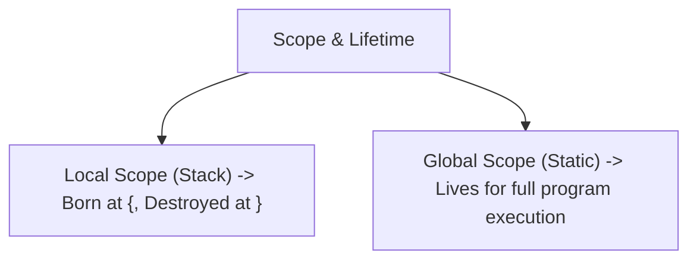
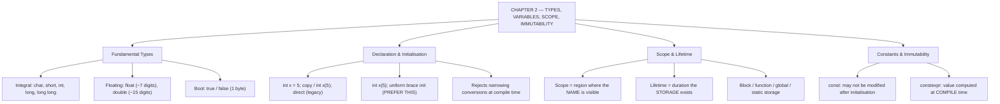

# C++ - CHAPTER 2
## Types, Variables, Scope, and Immutability

> “A variable is not a box you put a value in. It is a promise about how many bits you intend to spend.” — A First Lesson in Data Representation

### Learning Objectives
By the end of this chapter, you will be able to:
* Master C++ fundamental built-in data types (`int`, `double`, `char`, `bool`) and their physical byte sizes.
* Differentiate between legacy initialization styles and Modern C++ Uniform Brace Initialization (`{}`).
* Understand variable scope, block lifetime, and linkage rules.
* Enforce immutability using `const` keyword declarations.

---

### Introduction
Every application you build revolves around data. Whether it is a player's health points, a financial transaction amount, a user's login status, or a 3D coordinate vector, data must be stored in the computer's memory. In low-level languages like C++, you do not just throw data into a black box; you explicitly define the exact type of data and how much physical memory it occupies. This precision is what allows C++ programs to execute with extreme efficiency and predictable memory footprints.

### Why This Topic Matters
Choosing the wrong data type can lead to critical failures, such as numeric overflows (where a number exceeds its maximum storage limit and wraps around to a negative value) or silent data truncation. Understanding fundamental types, variable lifetimes, and modern initialization techniques ensures your software is both memory-efficient and mathematically sound.

---

### Chapter Roadmap
* Concept 1: Built-In Fundamental Types
* Concept 2: Variable Declaration and Initialization
* Concept 3: Scope and Lifetime
* Concept 4: Constants and Immutability
* Learning Support Elements
* Debugging and Problem Solving
* Practical Application & Mini Project
* Practice and Evaluation
* Chapter Conclusion

---

> [!NOTE]
> **Real-Life Analogy: The Hardware Store's Drawer Wall**
> Picture the wall of small parts drawers behind the counter of a hardware store. Each drawer has a fixed physical size and a printed label. A drawer sized for washers cannot hold a length of pipe — not because of a rule, but because the space physically is not there. A drawer labelled 'M4 bolts' that actually contains screws will cause the next person to grab the wrong thing without realising it.
> 
> Fundamental types are those drawers. `char` is a tiny drawer of exactly one byte; `double` is a large one of eight. Declaring a variable reserves the drawer. Initialising it puts something known inside. If you skip initialisation, C++ hands you the drawer exactly as the previous occupant left it — full of whatever debris happened to be in that memory. That debris is the famous 'garbage value', and it is not a bug in the language; it is the language refusing to spend time cleaning a drawer you might immediately refill anyway.
> 
> `const` is the store owner's padlock: the drawer's contents are fixed at the moment it is sealed, and any attempt to change them is stopped at the counter — at compile time — rather than discovered later by an angry customer.

---

### Real-World Applications

| Domain | How this chapter's ideas appear in practice |
| :--- | :--- |
| **Embedded Systems** | On a microcontroller with 2 KB of RAM, choosing `uint8_t` over `int` is not a style preference — it is the difference between a program that fits and one that does not. |
| **Finance** | Money is never stored in `float`; accumulated binary rounding error in a `double` is why trading systems use fixed-point integers or decimal libraries. |
| **Machine Learning** | Half-precision and `bfloat16` formats exist because trading precision for memory bandwidth is what makes large models trainable at all. |
| **Databases** | Column type selection in a storage engine mirrors C++ type selection exactly: narrower types mean more rows per cache line and faster scans. |
| **Cyber Security** | Signed/unsigned confusion and integer overflow remain a leading root cause of exploitable buffer-length bugs in production C++. |
| **Networking** | Protocol headers specify exact bit widths, so fixed-width types from `<cstdint>` are mandatory when serialising packets. |

---

### Core Learning Sections

#### CONCEPT 1: Built-In Fundamental Types
*Sub-topics Covered: 2.1 Integers, 2.2 Floating-Point Types, 2.3 Characters, 2.4 Booleans*

**Intuitive Explanation:** Think of memory as a massive grid of mailboxes (bytes). Different types of data require different box sizes. A boolean only needs a tiny slot (1 bit/byte), while a massive floating-point decimal needs a larger container. C++ provides a set of built-in fundamental types tailored to these physical storage requirements.

##### 2.1 Integers (`int`, `short`, `long`, `long long`)
Used to store whole numbers (both positive and negative). The exact byte size of an `int` depends on the CPU architecture, but it is guaranteed to be at least 2 bytes (typically 4 bytes on modern 32-bit and 64-bit systems).
* `short`: At least 2 bytes.
* `int`: At least 4 bytes.
* `long` / `long long`: At least 4 and 8 bytes respectively.

##### 2.2 Floating-Point Types (`float`, `double`)
Used to store real numbers containing fractional decimal parts.
* `float`: Single precision (typically 4 bytes, ~7 digits of precision).
* `double`: Double precision (typically 8 bytes, ~15 digits of precision). *Best practice:* Always prefer `double` over `float` unless memory is severely constrained.

##### 2.3 Characters (`char`)
Stores single text characters mapped to numeric ASCII values (e.g., `'A'` is stored internally as `65`). It occupies exactly 1 byte of memory.

##### 2.4 Booleans (`bool`)
Stores truth values evaluated strictly as `true` or `false`. It occupies 1 byte in memory.

---

#### CONCEPT 2: Variable Declaration and Initialization
*Sub-topics Covered: 2.5 Copy and Direct Initialization, 2.6 Uniform Brace Initialization ({}), 2.7 Narrowing Conversions*

**Intuitive Explanation:** Creating a variable is like reserving a specific storage box in the warehouse and giving it a name label. How you put the initial item into that box determines whether the operation is safe or prone to hidden data loss.

##### 2.5 Copy and Direct Initialization (Legacy)
* Copy Initialization: `int x = 5;`
* Direct Initialization: `int x(5);`
Both styles have been used for decades, but they suffer from subtle type conversion loopholes.

##### 2.6 Uniform Brace Initialization (`{}`)
Introduced in C++11, Uniform Initialization (or list initialization) uses curly braces `{}` to initialize variables uniformly across all contexts.

##### Syntax
```cpp
int score{100};
```

##### 2.7 Narrowing Conversions
Brace initialization strictly prohibits **Narrowing Conversions**—situations where you attempt to shove a data type that is too large into a smaller container (e.g., putting a decimal into an integer: `int x{3.14};`). The compiler will immediately halt and throw a fatal compilation error, preventing silent data loss.

---

#### CONCEPT 3: Scope and Lifetime
*Sub-topics Covered: 2.8 Local Scope and Block Lifetime, 2.9 Global Variables*

##### 2.8 Local Scope and Block Lifetime
A variable's **scope** defines where in your code the variable name is visible. A variable's **lifetime** defines how long it physically exists in RAM. Local variables declared inside a function or a code block `{ ... }` come into existence when execution enters the block and are permanently destroyed when execution exits the block.

##### 2.9 Global Variables
Variables declared outside of any function have global scope, existing for the entire duration of the program execution. *Best Practice:* Avoid global variables whenever possible, as they make debugging extremely difficult by allowing any function to modify state unpredictably.



---

#### CONCEPT 4: Constants and Immutability
*Sub-topics Covered: 2.10 The const Specifier*

##### 2.10 The `const` Specifier
If you want to ensure a variable's value can never be modified after its initial setup (such as the maximum number of players in a lobby), you prefix its declaration with `const`.

##### Syntax
```cpp
const int max_players{4};
```
* Attempting to modify a `const` variable later in the code results in a hard compilation error.

##### Code Example: Fundamental Types and Uniform Initialization
```cpp
#include <iostream>
#include <type_traits>

int main() {
    // 2.6: Modern C++ Uniform Brace Initialization
    int player_health{100};
    double item_weight{12.75};
    char rank_tier{'S'};
    bool is_game_active{true};

    // 2.10: Immutability via const
    const int max_inventory_slots{20};

    std::cout << "Player Health: " << player_health << "\n";
    std::cout << "Item Weight: " << item_weight << " kg\n";
    std::cout << "Rank Tier: " << rank_tier << "\n";
    std::cout << "Game Active: " << std::is_same_v<decltype(is_game_active), bool> << "\n";
    std::cout << "Max Inventory Slots: " << max_inventory_slots << "\n";

    // max_inventory_slots = 30; // COMPILER ERROR: Assignment of read-only variable
    return 0;
}
```

##### Expected Output:
```text
Player Health: 100
Item Weight: 12.75 kg
Rank Tier: S
Game Active: 1
Max Inventory Slots: 20
```

##### Line-by-Line Explanation:
* `int player_health{100};`: Allocates 4 bytes on the Stack and initializes it to 100 using modern brace initialization.
* `const int max_inventory_slots{20};`: Locks the variable in memory, prohibiting any future modifications.
* `std::cout << ...`: Streams variable values to the console.

---

### Learning Support Elements

> [!TIP]
> **Tips: Use Brace Initialization Everywhere**
> Adopt Uniform Brace Initialization (`int x{5};`) as your default coding standard for all variable declarations. It standardizes syntax and protects you from accidental narrowing conversions.

> [!NOTE]
> **Important Notes: Uninitialized Local Variables**
> Unlike Python or Java, C++ does not automatically set local fundamental variables to zero. If you write `int score;` without initializing it, the variable contains random garbage data left in that RAM address. Always initialize your variables upon declaration.

> [!WARNING]
> **Warnings: Floating-Point Rounding Errors**
> Floating-point types (`float` and `double`) cannot precisely represent every fractional decimal number due to binary IEEE 754 encoding limits. Never use `==` to compare two floating-point numbers directly; instead, check if their difference falls within an epsilon threshold.

#### Common Misconceptions
* **Misconception:** "An `int` is always 4 bytes on every computer architecture."
* **Reality:** The C++ standard only guarantees minimum sizes for fundamental types. An `int` can be 2 bytes on 16-bit embedded microcontrollers or 4 bytes on 32/64-bit desktop systems.

#### Best Practices
* **Const-Correctness:** Make every variable `const` by default unless you know its value needs to change later in execution.
* **Prefer `double`:** Use `double` instead of `float` for floating-point calculations to avoid unnecessary precision loss.

---

### Debugging and Problem Solving

#### Compiler Error: Narrowing Conversion Failure
* **Message:** `error: narrowing conversion of '3.14159...' from 'double' to 'int' inside { }`
* **Cause:** You used uniform brace initialization (`int x{3.14};`) and attempted to assign a floating-point decimal to an integer, which causes fractional data loss.
* **Fix:** Explicitly cast the value using `static_cast<int>(3.14)` if truncation is intended, or change the variable type to `double`.

---

### Practical Application & Mini Project

#### Mini Project: Data Type Memory Inspector
In system profiling utilities or diagnostic scripts, engineers frequently need to inspect the physical memory footprint of fundamental types across different hardware architectures to ensure memory efficiency.

```cpp
#include <iostream>
#include <format>

class TypeInspector {
public:
    static void InspectSizes() {
        std::cout << "--- Hardware Memory Footprint Inspection ---\n";
        std::cout << std::format("Size of char: {} byte(s)\n", sizeof(char));
        std::cout << std::format("Size of short: {} byte(s)\n", sizeof(short));
        std::cout << std::format("Size of int: {} byte(s)\n", sizeof(int));
        std::cout << std::format("Size of long: {} byte(s)\n", sizeof(long));
        std::cout << std::format("Size of long long: {} byte(s)\n", sizeof(long long));
        std::cout << std::format("Size of float: {} byte(s)\n", sizeof(float));
        std::cout << std::format("Size of double: {} byte(s)\n", sizeof(double));
        std::cout << std::format("Size of bool: {} byte(s)\n", sizeof(bool));
    }
};

int main() {
    std::cout << "=== CHAPTER 2 UTILITY: TYPE INSPECTOR ===\n\n";
    TypeInspector::InspectSizes();
    std::cout << "\nInspection completed successfully.\n";
    return 0;
}
```

##### Expected Output: *(Note: Exact byte sizes may vary depending on compiler and CPU architecture)*
```text
=== CHAPTER 2 UTILITY: TYPE INSPECTOR ===

--- Hardware Memory Footprint Inspection ---
Size of char: 1 byte(s)
Size of short: 2 byte(s)
Size of int: 4 byte(s)
Size of long: 8 byte(s)
Size of long long: 8 byte(s)
Size of float: 4 byte(s)
Size of double: 8 byte(s)
Size of bool: 1 byte(s)

Inspection completed successfully.
```

##### Line-by-Line Explanation:
* `sizeof(...)`: A compile-time operator that returns the physical size in bytes of a data type or variable.
* `std::format(...)`: Formats the byte sizes cleanly using C++20 formatting strings.

---

### Practice and Evaluation

#### Quick Check Questions
* What is the primary advantage of Uniform Brace Initialization (`{}`) over legacy assignment initialization?
* How many bytes does a standard `bool` occupy in memory?
* What is a narrowing conversion, and how does modern C++ handle it during brace initialization?
* Why is `double` preferred over `float` for general floating-point calculations?

#### Coding Exercises
* Declare a `const double` representing the value of Pi (`3.1415926535`). Write a program that calculates the area of a circle given a radius of `5.0`.
* Write a program that declares uninitialized local variables and prints them to observe uninitialized garbage data behavior.

#### Interview Questions & Answers

1. **(Junior) What are fundamental data types in C++?**
   * **Answer:** Fundamental data types are built-in primitives provided directly by the language, including integers (`int`, `short`, `long`), floating-point numbers (`float`, `double`), characters (`char`), and booleans (`bool`).

2. **(Junior) What is Uniform Brace Initialization, and why was it introduced in C++11?**
   * **Answer:** Uniform brace initialization uses curly braces `{}` to initialize variables. It was introduced to provide a consistent initialization syntax across all contexts and to catch accidental narrowing conversions at compile time.

3. **(Junior) What is a Narrowing Conversion?**
   * **Answer:** A narrowing conversion is an implicit type conversion where data can lose precision or value during conversion—such as converting a `double` or a large `long` into an `int` or a `short`.

4. **(Mid-Level) Why does C++ not initialize local fundamental variables to zero by default?**
   * **Answer:** To preserve maximum execution speed. Automatically zero-initializing every local variable on the stack would incur a performance penalty, adhering to C++'s zero-overhead principle. Developers are expected to initialize variables explicitly.

5. **(Mid-Level) What is the difference in precision between `float` and `double`?**
   * **Answer:** `float` is single-precision (typically 4 bytes, providing roughly 7 decimal digits of precision), while `double` is double-precision (typically 8 bytes, providing roughly 15 decimal digits of precision).

6. **(Mid-Level) What is variable scope versus variable lifetime?**
   * **Answer:** Scope defines the region of code where a variable's name is visible and accessible. Lifetime defines the physical duration that the variable occupies memory during program execution.

7. **(Senior) Why is comparing floating-point numbers using `==` dangerous?**
   * **Answer:** Because floating-point numbers are stored using binary approximations (IEEE 754 standard), arithmetic operations often introduce tiny rounding errors. Two numbers that mathematically should be identical may differ by a minuscule fraction, causing exact `==` comparisons to fail unexpectedly.

8. **(Senior) How does the `sizeof` operator work, and when is it evaluated?**
   * **Answer:** `sizeof` is a compile-time operator (except for variable-length arrays, which are non-standard) that returns the size in bytes of a type or object. Because it is evaluated entirely at compile time, it incurs zero runtime performance cost.

9. **(Senior) What are signed versus unsigned integers, and what happens on overflow?**
   * **Answer:** Signed integers can store both positive and negative numbers by utilizing the most significant bit as a sign bit. Unsigned integers store only positive numbers, doubling their maximum positive range. Signed integer overflow results in Undefined Behavior in C++, while unsigned integer overflow wraps around modulo $2^N$ predictably according to the standard.

10. **(Senior) What is const-correctness, and why is it vital in large codebases?**
    * **Answer:** Const-correctness is the practice of declaring objects and parameters as `const` whenever they should not be modified. It prevents accidental mutations, clarifies intent for other developers, and enables compiler optimizations.

---

### Chapter Conclusion
Fundamental types, variables, and initialization form the building blocks of all data processing in C++. By understanding type sizes, leveraging Modern C++ Uniform Brace Initialization to catch narrowing conversions, managing variable scope and lifetime, and utilizing `const` for immutability, you write safer, cleaner, and more efficient code.

#### Key Takeaways
* **Brace Initialization:** Always use `{}` for variable initialization to prevent silent narrowing conversions.
* **Avoid Garbage Data:** Always initialize local variables upon declaration.
* **Const-Correctness:** Make variables immutable by default using `const`.
* **Precision Matters:** Prefer `double` over `float` for real number calculations.

#### What to Learn Next
Now that you know how to store data in fundamental types and variables, you need to know how to perform operations on them. In Chapter 3, we explore **Operators, Type Deduction (auto), and Input/Output Streams**.

---

### Progressive Code Examples: Four Tiers

#### TIER 1 · BEGINNER
##### Declaring and Initialising
**Goal:** Reserve storage of a known width and put a known value in it.

```cpp
#include <iostream>

int main() {
    int age{20};
    double gpa{8.75};
    char grade{'A'};
    bool enrolled{true};

    std::cout << "Age      : " << age << '\n';
    std::cout << "GPA      : " << gpa << '\n';
    std::cout << "Grade    : " << grade << '\n';
    std::cout << "Enrolled : " << enrolled << '\n';
    return 0;
}
```

##### Expected Output
```text
Age      : 20
GPA      : 8.75
Grade    : A
Enrolled : 1
```

> **What this tier adds:** Baseline. Note that bool prints as 1, not 'true' — formatting is a separate concern from storage.

---

#### TIER 2 · INTERMEDIATE
##### Measuring the Drawers
**Goal:** Stop guessing type sizes and ask the compiler instead.

```cpp
#include <iostream>
#include <limits>

int main() {
    std::cout << "type    bytes   min             max\n";
    std::cout << "char    " << sizeof(char) << "       "
              << +std::numeric_limits<char>::min() << "            "
              << +std::numeric_limits<char>::max() << '\n';
    std::cout << "int     " << sizeof(int) << "       "
              << std::numeric_limits<int>::min() << "     "
              << std::numeric_limits<int>::max() << '\n';
    std::cout << "double  " << sizeof(double) << "       digits10 = "
              << std::numeric_limits<double>::digits10 << '\n';
    return 0;
}
```

##### Expected Output
```text
type    bytes   min             max
char    1       -128            127
int     4       -2147483648     2147483647
double  8       digits10 = 15
```

> **What this tier adds:** Introduces `<limits>` and the unary `+` trick that promotes `char` to `int` so it prints as a number rather than a glyph.

---

#### TIER 3 · ADVANCED
##### Scope Versus Lifetime
**Goal:** Show that where a name is visible and how long its storage lives are two different questions.

```cpp
#include <iostream>

int globalCounter = 0; // static storage: whole program

void visit() {
    int automaticCount = 0; // new storage on EVERY call
    static int stickyCount = 0; // ONE storage, survives calls

    ++automaticCount;
    ++stickyCount;
    ++globalCounter;

    std::cout << "automatic=" << automaticCount
              << " static=" << stickyCount
              << " global=" << globalCounter << '\n';
}

int main() {
    for (int i = 0; i < 3; ++i) {
        int blockLocal = i * 10; // born and destroyed each iteration
        visit();
        std::cout << "  blockLocal=" << blockLocal << '\n';
    }
    // blockLocal is not in scope here — the name does not exist.
    return 0;
}
```

##### Expected Output
```text
automatic=1 static=1 global=1
  blockLocal=0
automatic=1 static=2 global=2
  blockLocal=10
automatic=1 static=3 global=3
  blockLocal=20
```

> **What this tier adds:** The automatic counter resets while the static one accumulates — identical scope, completely different lifetime. This is the distinction the chapter is built around.

---

#### TIER 4 · PROFESSIONAL
##### Compile-Time Configuration
**Goal:** Push work out of run time entirely using `constexpr`.

```cpp
#include <iostream>
#include <array>

struct BufferConfig {
    std::size_t blockSize;
    std::size_t blockCount;

    constexpr std::size_t totalBytes() const {
        return blockSize * blockCount;
    }
};

constexpr BufferConfig kConfig{ .blockSize = 256, .blockCount = 64 };

// The size is a compile-time constant, so this is a real fixed array.
static std::array<unsigned char, kConfig.totalBytes()> gPool{};

static_assert(kConfig.totalBytes() == 16384,
              "pool size changed — review the memory budget");

int main() {
    std::cout << "Pool reserved : " << gPool.size() << " bytes\n";
    std::cout << "Blocks        : " << kConfig.blockCount << '\n';
    return 0;
}
```

##### Expected Output
```text
Pool reserved : 16384 bytes
Blocks        : 64
```

> **What this tier adds:** Uses `constexpr`, designated initialisers and `static_assert` so that a mis-sized buffer is a build failure rather than a production incident. Nothing here costs a single CPU cycle at run time.

---

### Common Mistakes and How to Fix Them

| The mistake | Why it happens | What you see (class) | The fix |
| :--- | :--- | :--- | :--- |
| **Reading a local variable before assigning to it** | Other languages zero-initialise, so this feels safe | Garbage values, or different values per run *(UNDEFINED)* | Always initialise at declaration: `int x{};` |
| **Assuming `int` is exactly 4 bytes** | It is 4 bytes on every machine the student has used | Silent overflow on another platform *(LOGIC)* | Use `sizeof`, and fixed-width types from `<cstdint>` when width matters |
| **Using `=` where narrowing must be caught** | `int x = 3.9;` compiles without complaint | `x` is silently `3` *(LOGIC)* | Use braces: `int x{3.9};` becomes a compile error |
| **Comparing floating-point values with `==`** | Mathematically $0.1 + 0.2$ equals $0.3$ | The comparison is false *(LOGIC)* | Compare against an epsilon tolerance appropriate to the magnitude |
| **Declaring everything non-`const` by default** | `const` feels like extra typing for no benefit | Accidental mutation, missed optimisations *(LOGIC)* | `const` by default; remove it only when you actually need to reassign |
| **Mixing signed and unsigned in a comparison** | Both look like 'numbers' | `warning: comparison of integer expressions of different signedness` | Keep the loop counter's type the same as the container's size type |

---

### Chapter Mind Map



---

> [!TIP]
> **Prepare for your Chapter Exam!**
> You have completed reading Chapter 2. Head to the **Take Chapter Quiz** assessment below to test your knowledge and unlock Chapter 3!
