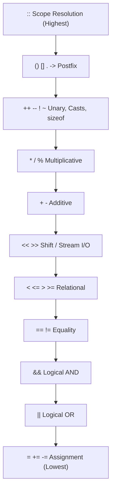
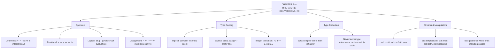

# C++ - CHAPTER 3
## Operators, Conversions, and Input/Output

> “The compiler will happily convert your types for you. It will not tell you what you lost in the exchange.” — A First Lesson in Conversions

### Learning Objectives
By the end of this chapter, you will be able to:
* Master arithmetic, assignment, relational, and logical operators along with operator precedence.
* Understand integer division truncation and type casting (`static_cast`).
* Leverage compile-time type deduction using the `auto` keyword.
* Format console input/output cleanly using stream manipulators (`std::fixed`, `std::setprecision`, `std::setw`).

---

### Introduction
Variables store data in memory, but data is useless if you cannot manipulate, evaluate, or exchange it. Whether you are calculating physics vectors in a game engine, parsing user input from a console, or formatting financial statements, you rely entirely on **Operators** and **Streams**. Furthermore, modern C++ introduces **Type Deduction** (`auto`), allowing the compiler to figure out data types automatically, freeing you from redundant type declarations while preserving absolute type safety.

### Why This Topic Matters
Writing expressions incorrectly—such as falling into operator precedence traps or improper integer division truncation—introduces subtle mathematical bugs that are notoriously difficult to track down. Mastering stream manipulation (`<iomanip>`) and understanding how the compiler deduces types with `auto` ensures your code is both mathematically precise and cleanly formatted.

---

### Chapter Roadmap
* Concept 1: Operators and Precedence
* Concept 2: Type Casting and Integer Truncation
* Concept 3: Type Deduction (`auto`)
* Concept 4: Advanced Input/Output Streams and Manipulators
* Learning Support Elements
* Debugging and Problem Solving
* Practical Application & Mini Project
* Practice and Evaluation
* Chapter Conclusion

---

> [!NOTE]
> **Real-Life Analogy: The Currency Exchange Counter**
> Think of type conversion as a currency exchange counter at an airport. Converting a small denomination into a larger one is lossless — a hundred one-rupee coins become a hundred-rupee note and nothing disappears. That is a widening conversion, such as `int` to `double`.
> 
> Converting the other way is where money vanishes. Hand over a note worth 3.75 units at a counter that only issues whole coins and you walk away with 3. Nobody stole the 0.75 — the destination denomination simply cannot represent it. That is narrowing conversion and integer truncation, and it is why `7 / 2` yields `3` in C++ while `7.0 / 2` yields `3.5`.
> 
> `static_cast` is the moment you sign the exchange slip. The conversion may happen either way, but signing it means you have acknowledged the loss rather than discovering it in your bank statement three weeks later.

---

### Real-World Applications

| Domain | How this chapter's ideas appear in practice |
| :--- | :--- |
| **Graphics & Games** | Pixel and colour arithmetic mixes integers and floats constantly; a single missing cast turns a smooth gradient into visible banding. |
| **Robotics** | Sensor counts are integers, control laws are floating point — integer division bugs here produce a robot that quietly under-steers. |
| **Finance** | Percentage calculations written as `(a / b) * 100` with integral `a` and `b` are one of the most common reporting bugs in production systems. |
| **Databases** | Query planners cost-model with mixed integer and floating arithmetic; precedence and conversion rules determine plan selection. |
| **Cyber Security** | Implicit signed-to-unsigned conversion in a length check is a classic path to a buffer overflow. |
| **Scientific Computing** | Stream manipulators control how many significant digits reach a results file, which directly affects reproducibility of published numbers. |

---

### Core Learning Sections

#### CONCEPT 1: Operators and Precedence
*Sub-topics Covered: 3.1 Arithmetic Operators, 3.2 Relational and Logical Operators, 3.3 Short-Circuit Evaluation, 3.4 Operator Precedence*

**Intuitive Explanation:** Operators are symbols that tell the computer to perform actions on variables and values. Just like mathematical order of operations (PEMDAS), C++ follows strict operator precedence rules to determine which parts of an expression evaluate first.

##### 3.1 Arithmetic Operators
Standard mathematical operators: Addition (`+`), Subtraction (`-`), Multiplication (`*`), Division (`/`), and Modulus (`%` - returns the remainder of integer division).
* *Note:* The modulus operator `%` can *only* be used with integer types.

##### 3.2 Relational and Logical Operators
Used for comparisons and boolean logic:
* **Relational:** Equal (`==`), Not Equal (`!=`), Greater than (`>`), Less than (`<`), etc.
* **Logical:** AND (`&&`), OR (`||`), NOT (`!`).

##### 3.3 Short-Circuit Evaluation
C++ logical operators (`&&` and `||`) use **Short-Circuit Evaluation**. In an expression like `conditionA && conditionB`, if `conditionA` evaluates to false, the compiler immediately skips evaluating `conditionB` because the overall expression can never be true. This prevents null-pointer dereferences or out-of-bounds index checks if ordered correctly.

##### 3.4 Operator Precedence
Multiplication and division always evaluate before addition and subtraction. When in doubt, always use parentheses `()` to enforce explicit evaluation order.



---

#### CONCEPT 2: Type Casting and Integer Truncation
*Sub-topics Covered: 3.5 Integer Division Truncation, 3.6 static_cast*

**Intuitive Explanation:** If you divide an integer by an integer in C++, the computer discards any decimal remainder. If you want a precise floating-point result, at least one of the numbers must be cast to a `double`.

##### 3.5 Integer Division Truncation
When both operands of a division operator are integers (e.g., `5 / 2`), C++ performs integer division, returning `2`, not `2.5`. The fractional component is truncated entirely.

##### 3.6 `static_cast`
Use `static_cast<double>(numerator)` to convert type explicitly prior to mathematical operations.

##### Syntax
```cpp
double result = static_cast<double>(numerator) / denominator;
```

---

#### CONCEPT 3: Type Deduction (`auto`)
*Sub-topics Covered: 3.7 Compile-Time Type Deduction (auto), 3.8 When to Use auto*

**Intuitive Explanation:** Imagine shopping where the cashier automatically knows the exact price tag without you having to spell it out. `auto` tells the compiler: "Look at the value I am assigning to this variable right now, and figure out its data type automatically at compile time."

##### 3.7 Compile-Time Type Deduction (`auto`)
Introduced in C++11, `auto` is not dynamic typing (like Python). The type is fixed permanently at compile time based on the initializer expression.

##### Syntax
```cpp
auto speed = 98.6; // Deduced as a double
```

##### 3.8 When to Use `auto`
*Best Practice:* Use `auto` when types are long, verbose, or obvious from the right-hand side of the assignment (such as iterators or complex templates), but keep explicit types for fundamental primitives when clarity matters.

---

#### CONCEPT 4: Advanced Input/Output Streams and Manipulators
*Sub-topics Covered: 3.9 Console Input (std::cin), 3.10 Stream Manipulators (<iomanip>), 3.11 Reading Strings with Spaces (std::getline)*

##### 3.9 Console Input (`std::cin`)
Used to extract user input from the console terminal using the extraction operator `>>`. Whitespace characters (spaces, tabs, newlines) act as delimiters.

##### 3.10 Stream Manipulators (`<iomanip>`)
You can format console output streams cleanly using formatting manipulators:
* `std::fixed`: Forces floating-point numbers to output in fixed-point notation rather than scientific notation.
* `std::setprecision(n)`: Sets the number of decimal digits displayed.
* `std::setw(n)`: Sets the column width for the next output field.

##### 3.11 Reading Strings with Spaces (`std::getline`)
Because `std::cin >> string_var` stops reading at the first whitespace, entering a full sentence fails to capture spaces. Use `std::getline(std::cin, string_var)` to capture complete text lines.

##### Code Example: Operators, Casting, and Formatting
```cpp
#include <iostream>
#include <iomanip> // Required for stream manipulators

int main() {
    int total_items{5};
    int total_cost_cents{1249}; // Stored as cents to avoid float inaccuracies

    // 3.6: Using static_cast to prevent integer division truncation
    double unit_price_dollars = static_cast<double>(total_cost_cents) / 100.0 / total_items;

    // 3.7: Type deduction with auto
    auto calculated_total = unit_price_dollars * total_items;

    // 3.10: Console formatting output
    std::cout << std::fixed << std::setprecision(2);
    std::cout << "--- Invoice Summary ---\n";
    std::cout << "Items Purchased: " << total_items << "\n";
    std::cout << "Unit Price:      $" << unit_price_dollars << "\n";
    std::cout << "Total Cost:      $" << calculated_total << "\n";

    return 0;
}
```

##### Expected Output:
```text
--- Invoice Summary ---
Items Purchased: 5
Unit Price:      $2.50
Total Cost:      $12.49
```

##### Line-by-Line Explanation:
* `static_cast<double>(total_cost_cents)`: Converts the integer into a double before division, ensuring precise decimal calculations.
* `auto calculated_total`: Automatically deduces the type as double from the arithmetic expression.
* `std::fixed << std::setprecision(2)`: Configures the output stream to display floating-point numbers with exactly two decimal places.

---

### Learning Support Elements

> [!TIP]
> **Tips: Use Parentheses to Clarify Precedence**
> Never rely solely on complex operator precedence tables (such as bitwise vs. logical operators). When in doubt, wrap expressions in parentheses `()` to make evaluation order unambiguous to both compilers and human readers.

> [!NOTE]
> **Important Notes: Stream Extraction Failures**
> If a user types text into `std::cin` when an integer was expected, the stream enters a `fail()` state, locks up, and ignores subsequent input operations. Always validate stream states when accepting untrusted user input.

> [!WARNING]
> **Warnings: Integer Division Truncation Bugs**
> Dividing two integers like `7 / 3` yields `2`. This is the #1 source of unexpected rounding bugs in beginner code. Always cast at least one operand to double if decimals are required.

#### Common Misconceptions
* **Misconception:** "`auto` turns C++ into a dynamically typed language like JavaScript or Python."
* **Reality:** `auto` is strictly a compile-time convenience feature. The variable has a fixed, rigid type determined entirely before runtime; the compiler simply types it out for you.

#### Best Practices
* **Always Initialize Variables:** Combine `auto` with immediate initialization (e.g., `auto x = 5;`). You cannot write `auto x;` because the compiler cannot deduce a type without an initial value.
* **Include `<iomanip>`:** Use stream manipulators to align data in neat columns when generating console tables or reports.

---

### Debugging and Problem Solving

#### Runtime Error: Infinite Input Loop
* **Cause:** A user inputs invalid characters into `std::cin`. The stream enters a fail state, rejecting input extraction and leaving the invalid characters stuck in the input buffer, causing subsequent input reads to fail infinitely.
* **Fix:** Check if `(std::cin.fail())`, call `std::cin.clear()` to reset error flags, and call `std::cin.ignore(10000, '\n')` to flush the bad input out of the buffer.

---

### Practical Application & Mini Project

#### Mini Project: Interactive Point-of-Sale Receipt Generator
In retail point-of-sale systems or command-line utility tools, generating clean, formatted customer receipts requires combining mathematical arithmetic, type casting, stream manipulators, and user input handling.

```cpp
#include <iostream>
#include <iomanip>
#include <string>

class ReceiptGenerator {
public:
    static void GenerateReceipt() {
        std::string item_name;
        int quantity{0};
        double price_per_unit{0.0};

        std::cout << "Enter item name: ";
        std::getline(std::cin, item_name);

        std::cout << "Enter quantity: ";
        std::cin >> quantity;

        std::cout << "Enter price per unit ($): ";
        std::cin >> price_per_unit;

        // Calculations
        double subtotal = static_cast<double>(quantity) * price_per_unit;
        double tax = subtotal * 0.08; // 8% sales tax
        double grand_total = subtotal + tax;

        // Formatted Output
        std::cout << "\n==============================\n";
        std::cout << "       OFFICIAL RECEIPT       \n";
        std::cout << "==============================\n";
        std::cout << std::left << std::setw(15) << "Item" 
                  << std::right << std::setw(5) << "Qty" 
                  << std::setw(10) << "Price" << "\n";
        std::cout << "------------------------------\n";
        std::cout << std::fixed << std::setprecision(2);
        std::cout << std::left << std::setw(15) << item_name 
                  << std::right << std::setw(5) << quantity 
                  << std::setw(10) << price_per_unit << "\n";
        std::cout << "------------------------------\n";
        std::cout << std::left << std::setw(20) << "Subtotal:" << "$" << std::right << std::setw(9) << subtotal << "\n";
        std::cout << std::left << std::setw(20) << "Tax (8%):" << "$" << std::right << std::setw(9) << tax << "\n";
        std::cout << std::left << std::setw(20) << "Grand Total:" << "$" << std::right << std::setw(9) << grand_total << "\n";
        std::cout << "==============================\n";
    }
};

int main() {
    std::cout << "=== CHAPTER 3 MINI PROJECT: POS SYSTEM ===\n\n";
    ReceiptGenerator::GenerateReceipt();
    std::cout << "\nTransaction finalized successfully.\n";
    return 0;
}
```

##### Expected Output: *(Assuming user enters: Item = "Coffee Beans", Quantity = 2, Price = 14.50)*
```text
=== CHAPTER 3 MINI PROJECT: POS SYSTEM ===

Enter item name: Coffee Beans
Enter quantity: 2
Enter price per unit ($): 14.50

==============================
       OFFICIAL RECEIPT       
==============================
Item              Qty     Price
------------------------------
Coffee Beans        2     14.50
------------------------------
Subtotal:           $    29.00
Tax (8%):           $     2.32
Grand Total:        $    31.32
==============================

Transaction finalized successfully.
```

##### Line-by-Line Explanation:
* `std::getline(std::cin, item_name);`: Captures string input that may include spaces (e.g., "Coffee Beans").
* `static_cast<double>(quantity)`: Converts integer quantity to double prior to multiplication to ensure type consistency.
* `std::setw(15)`: Establishes a fixed character column width for neat columnar alignment.
* `std::left / std::right`: Configures text alignment within the established column widths.

---

### Practice and Evaluation

#### Quick Check Questions
* What happens when you divide two integers (`9 / 2`) in C++?
* What is the difference between `std::cin >>` and `std::getline()` when reading strings?
* Is `auto` dynamic typing? Explain.
* What purpose do stream manipulators like `std::fixed` and `std::setprecision` serve?

#### Coding Exercises
* Write a program that asks the user for their temperature in Fahrenheit, converts it to Celsius using the formula $C = (F - 32) \times 5/9$, and prints the result formatted to 1 decimal place.
* Declare three integer variables, use `auto` to deduce their types, and print their average calculated using `static_cast`.

#### Interview Questions & Answers

1. **(Junior) What is integer division truncation?**
   * **Answer:** Integer division truncation occurs when both operands in a division operation are integers. C++ discards the fractional decimal remainder entirely, returning only the whole number quotient.

2. **(Junior) What does `static_cast` do?**
   * **Answer:** `static_cast` performs compile-time type conversions between compatible data types safely and explicitly, such as converting an integer to a double to prevent truncation.

3. **(Junior) What is Short-Circuit Evaluation in logical operators?**
   * **Answer:** Short-circuit evaluation means that in compound logical expressions (using `&&` or `||`), the second operand is skipped if the outcome can be determined solely by evaluating the first operand.

4. **(Mid-Level) How does `auto` type deduction work at compile time?**
   * **Answer:** The compiler inspects the type of the initializer expression on the right-hand side of the assignment and permanently binds the variable to that exact type during compilation. There is zero runtime performance overhead.

5. **(Mid-Level) Why should you prefer `std::getline` over `std::cin >>` when accepting user text input?**
   * **Answer:** `std::cin >>` stops reading at the first whitespace character, making it impossible to capture multi-word strings or sentences. `std::getline` reads the entire input stream line-by-line until encountering a newline character.

6. **(Mid-Level) What happens to a console input stream (`std::cin`) when a type mismatch error occurs?**
   * **Answer:** The stream enters a `fail()` error state, stops accepting further inputs, and leaves the invalid data stuck in the input buffer. It must be cleared using `std::cin.clear()` and flushed using `std::cin.ignore()`.

7. **(Senior) What are the rules of operator precedence and associativity in C++?**
   * **Answer:** Operator precedence determines the order in which different operators are evaluated in an expression (e.g., multiplication before addition). Associativity determines the evaluation order of operators with the same precedence level (either left-to-right or right-to-left).

8. **(Senior) Why can `auto` sometimes lead to unexpected copies if not used carefully?**
   * **Answer:** By default, `auto` strips references and `const` qualifiers. Writing `auto x = obj;` creates a brand-new copy of `obj`. To prevent expensive copies when dealing with large objects, you must explicitly use `auto&` or `const auto&`.

9. **(Senior) What are compound assignment operators, and why are they preferred performance-wise?**
   * **Answer:** Operators like `+=`, `-=`, or `*=` update a variable in place. In complex user-defined classes or iterators, compound operators can be optimized more efficiently than performing separate assignment and arithmetic steps.

10. **(Senior) How do bitwise operators (`&`, `|`, `^`, `<<`, `>>`) differ from logical operators (`&&`, `||`, `!`)?**
    * **Answer:** Bitwise operators manipulate individual bits within integer types at the hardware level. Logical operators evaluate truth values as boolean entities (true/false) and implement short-circuit evaluation.

---

### Chapter Conclusion
Operators, type deduction with `auto`, and input/output streams form the interactive core of C++ programming. By mastering mathematical operators, avoiding integer division truncation traps with `static_cast`, writing concise code using compile-time `auto` deduction, and formatting reports with stream manipulators, you can build responsive, mathematically sound console applications.

#### Key Takeaways
* **Avoid Truncation:** Always cast integers to double using `static_cast` when exact decimal division is required.
* **Embrace `auto`:** Use type deduction for clean, readable code when types are obvious.
* **Stream Formatting:** Use `<iomanip>` manipulators like `std::fixed` and `std::setprecision` for professional console output.
* **Handle Input Safely:** Be mindful of stream fail states when parsing console input.

#### What to Learn Next
Now that you can perform operations, deduce types, and format streams, we proceed to **Chapter 4: Control Flow, Functions, Arrays, and Strings**, where you will learn how to direct program execution paths and manage multi-element collections.

---

### Progressive Code Examples: Four Tiers

#### TIER 1 · BEGINNER
##### A Four-Function Calculator
**Goal:** Apply the arithmetic operators to values the user supplies.

```cpp
#include <iostream>

int main() {
    double a{}, b{};
    std::cout << "Enter two numbers: ";
    std::cin >> a >> b;

    std::cout << a << " + " << b << " = " << a + b << '\n';
    std::cout << a << " - " << b << " = " << a - b << '\n';
    std::cout << a << " * " << b << " = " << a * b << '\n';
    std::cout << a << " / " << b << " = " << a / b << '\n';
    return 0;
}
```

##### Expected Output
```text
Enter two numbers: 7 2
7 + 2 = 9
7 - 2 = 5
7 * 2 = 14
7 / 2 = 3.5
```

> **What this tier adds:** Baseline. Note the division gives 3.5 — because both operands are double.

---

#### TIER 2 · INTERMEDIATE
##### The Integer Division Trap
**Goal:** Reproduce the single most common arithmetic bug, then fix it three different ways.

```cpp
#include <iostream>

int main() {
    int scored{27}, total{40};

    // WRONG: both operands are int, so the division truncates FIRST
    double wrong = (scored / total) * 100;

    // FIX 1 — cast one operand explicitly
    double fix1 = (static_cast<double>(scored) / total) * 100;

    // FIX 2 — reorder so the multiplication happens before the division
    double fix2 = (scored * 100.0) / total;

    // FIX 3 — make the literal a double so the whole expression promotes
    double fix3 = scored / static_cast<double>(total) * 100.0;

    std::cout << "wrong : " << wrong << "%\n";
    std::cout << "fix1  : " << fix1 << "%\n";
    std::cout << "fix2  : " << fix2 << "%\n";
    std::cout << "fix3  : " << fix3 << "%\n";
    return 0;
}
```

##### Expected Output
```text
wrong : 0%
fix1  : 67.5%
fix2  : 67.5%
fix3  : 67.5%
```

> **What this tier adds:** Makes implicit conversion and truncation concrete, and shows that assigning to a double afterwards is far too late to save you.

---

#### TIER 3 · ADVANCED
##### A Formatted Report
**Goal:** Control the presentation layer with stream manipulators.

```cpp
#include <iostream>
#include <iomanip>
#include <string>

void row(const std::string& item, int qty, double price) {
    std::cout << std::left  << std::setw(16) << item
              << std::right << std::setw(6)  << qty
              << std::setw(12) << std::fixed << std::setprecision(2)
              << price
              << std::setw(12) << qty * price << '\n';
}

int main() {
    std::cout << std::left  << std::setw(16) << "ITEM"
              << std::right << std::setw(6)  << "QTY"
              << std::setw(12) << "PRICE"
              << std::setw(12) << "TOTAL" << '\n';
    std::cout << std::string(46, '-') << '\n';

    row("Keyboard",   2,  1499.50);
    row("Monitor",    1, 12750.00);
    row("USB Cable",  5,    99.99);
    return 0;
}
```

##### Expected Output
```text
ITEM               QTY       PRICE       TOTAL
----------------------------------------------
Keyboard             2     1499.50     2999.00
Monitor              1    12750.00    12750.00
USB Cable            5       99.99      499.95
```

> **What this tier adds:** Introduces `setw`, `setprecision`, `fixed`, `left` and `right`. Crucially it shows that `setw` applies to the next item only, while `fixed` and `setprecision` are sticky — the source of many surprised bug reports.

---

#### TIER 4 · PROFESSIONAL
##### Input That Cannot Be Broken
**Goal:** Handle the user typing a word where a number was expected, without an infinite loop.

```cpp
#include <iostream>
#include <limits>
#include <string>

int readInt(const std::string& prompt, int lo, int hi) {
    int value{};
    while (true) {
        std::cout << prompt;
        if (std::cin >> value && value >= lo && value <= hi) {
            std::cin.ignore(std::numeric_limits<std::streamsize>::max(), '\n');
            return value;
        }
        // Extraction failed OR the value was out of range.
        std::cin.clear(); // reset failbit
        std::cin.ignore(std::numeric_limits<std::streamsize>::max(), '\n');
        std::cout << "  Please enter a whole number between "
                  << lo << " and " << hi << ".\n";
    }
}

int main() {
    const int age = readInt("Age (1-120): ", 1, 120);
    std::cout << "Accepted: " << age << '\n';
    return 0;
}
```

##### Expected Output
```text
Age (1-120): twenty
  Please enter a whole number between 1 and 120.
Age (1-120): 300
  Please enter a whole number between 1 and 120.
Age (1-120): 34
Accepted: 34
```

> **What this tier adds:** This is the difference between a demo and a program. `clear()` resets the stream state and `ignore()` discards the offending characters — omit either one and the loop spins forever at 100% CPU.

---

### Common Mistakes and How to Fix Them

| The mistake | Why it happens | What you see (class) | The fix |
| :--- | :--- | :--- | :--- |
| **Dividing two integers and expecting a fraction** | The result is stored in a double, so it feels safe | `0` instead of `0.675` *(LOGIC)* | Cast one operand: `static_cast<double>(a) / b` |
| **Relying on remembered operator precedence** | It usually works, so it is never checked | Subtly wrong expression grouping *(LOGIC)* | Add parentheses; they cost nothing and remove all doubt |
| **Mixing `>>` and `getline` without clearing the newline** | `>>` leaves the trailing newline in the buffer | `getline` immediately returns an empty string *(RUNTIME)* | `cin.ignore(numeric_limits<streamsize>::max(), '\n')` after the `>>` |
| **Not handling a failed extraction** | Users are assumed to type what they were asked for | An infinite loop at 100% CPU *(RUNTIME)* | Check the stream, then call `clear()` and `ignore()` before retrying |
| **Assuming `setprecision` applies once** | `setw` applies once, so it feels consistent | Every later number prints with the same precision *(LOGIC)* | Remember that `fixed` and `setprecision` are sticky; `setw` is not |
| **Using `reinterpret_cast` to silence a compiler error** | It makes the message go away | Corrupted data or a crash *(UNDEFINED)* | Use `static_cast`; if that will not compile, the conversion is genuinely unsafe |

---

### Chapter Mind Map



---

> [!TIP]
> **Prepare for your Chapter Exam!**
> You have completed reading Chapter 3. Head to the **Take Chapter Quiz** assessment below to test your knowledge and unlock Chapter 4!
