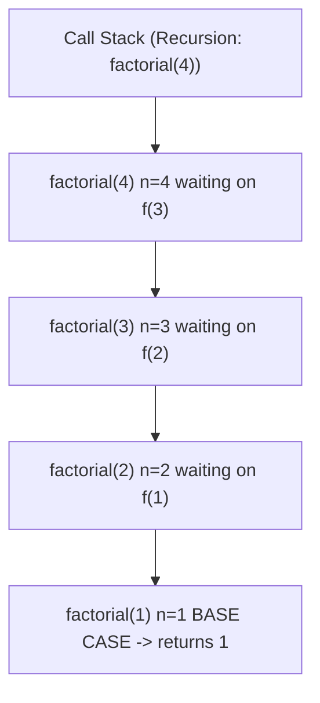

# C++ - CHAPTER 4
## Control Flow, Functions, Arrays, and Strings

> “A function is the only tool we have for making a large program smaller than the sum of its lines.” — A First Lesson in Decomposition

### Learning Objectives
By the end of this chapter, you will be able to:
* Control execution using branching (`if`, `switch`) and iteration (`for`, `while`, `do-while`).
* Define, declare, and overload functions, including recursive paradigms.
* Understand the critical, memory-level difference between pass-by-value and pass-by-reference.
* Replace dangerous legacy C-style arrays with modern `std::array` and `std::string`.

---

### Introduction
Every program you have written so far has run top to bottom, one line after another, no matter what. Control flow is what breaks that straight line — it is how a program looks at the world and decides what to do next. In this chapter, you will transition from writing simple, linear scripts to designing dynamic, responsive C++ architectures. We will also tackle how C++ handles collections of data and text—areas where C++ gives you immense power, but demands strict responsibility to avoid catastrophic memory errors.

### Why This Topic Matters
A program that always does the same thing, the same way, isn't very useful. How you structure your loops and function calls directly impacts your program's performance at the CPU level. Furthermore, mishandling arrays and strings is the number one cause of security vulnerabilities (like buffer overflows) in C++ history. Learning the modern C++ way to handle data is non-negotiable for writing safe, professional software.

---

### Chapter Roadmap
* Concept 1: Branching and Decision Making
* Concept 2: Loops and Iteration
* Concept 3: Functions, Parameters, and Recursion
* Concept 4: Raw Arrays, Modern Arrays, and Strings
* Learning Support Elements
* Debugging and Problem Solving
* Practical Application & Mini Project
* Practice and Evaluation
* Chapter Conclusion

---

> [!NOTE]
> **Real-Life Analogy: The Restaurant Kitchen**
> A busy kitchen does not have one cook doing everything from memory. It has stations. The grill station receives a ticket with parameters — cut, doneness, sauce — performs one well-defined job, and returns a finished plate. The head chef never needs to know how the grill station works internally, only what to send in and what comes back. That is a function: a named station with a parameter list and a return type.
> 
> Branching is the expeditor reading the ticket: if the order says vegetarian, route it to the vegetable station; else route it to the grill. Loops are the line repeating the same station work once per ticket until the queue is empty. `break` is pulling a ticket out of the queue entirely; `continue` is skipping to the next ticket without finishing the current one.
> 
> Arrays are the prep trays: a fixed row of identical compartments, numbered from zero, holding the same kind of item. `std::array` is that tray with its compartment count printed on the side, so nobody has to remember it. `std::string` is a tray of characters that can grow itself when the order turns out to be longer than expected.

---

### Real-World Applications

| Domain | How this chapter's ideas appear in practice |
| :--- | :--- |
| **Operating Systems** | A scheduler is a loop with branching at its heart; every context-switch decision is a conditional evaluated thousands of times per second. |
| **Game Development** | The game loop — input, update, render — is the canonical `while` loop, and frame budget is measured in what fits inside one iteration. |
| **Machine Learning** | Training is nested iteration: epochs over batches over samples; loop structure determines cache behaviour and therefore throughput. |
| **Networking** | Protocol parsers are branch-heavy state machines, commonly expressed as a `switch` over the current state. |
| **Embedded Systems** | Recursion is often banned outright because stack depth must be provable on a device with kilobytes of RAM. |
| **Cyber Security** | Off-by-one errors in array bounds and unterminated C-style strings are the historical root of the buffer overflow class of vulnerabilities. |

---

### Core Learning Sections

#### CONCEPT 1: Branching and Decision Making
*Sub-topics Covered: 4.1 Conditional Statements, 4.2 if and else, 4.3 Nested Conditions, 4.4 switch Statements*

**Intuitive Explanation:** Control flow lets a program run different code depending on whether a condition is true or false. Imagine driving on a highway. An `if`/`else` statement is a fork in the road where you must choose left or right. A `switch` statement is a massive toll plaza with multiple specific lanes—you enter the lane that exactly matches your ticket.

##### 4.1 Conditional Statements
Control flow is how code makes decisions. Conditionals are the simplest form of control flow: they let a program run different code depending on whether an expression evaluates to true or false using relational operators (`==`, `>`, `<`) or logical operators (`&&`, `||`). The CPU looks at the outcome of this boolean statement and decides which memory address to jump to next.

##### 4.2 `if` and `else`
The `if` statement checks a condition; its block runs only when that condition is true.
* If you have a secondary, mutually exclusive condition, you use `else if`. The `else if` chain checks another condition, only if the previous ones were false. C++ checks conditions top to bottom and stops at the first true one.
* The `else` block runs when none of the above conditions were true — it has no condition of its own.

##### 4.3 Nested Conditions
Conditionals can be placed inside one another. This is known as nesting. You use nested conditions when a secondary check should only occur if a primary condition has already succeeded.

##### 4.4 The `switch` Statement and its Strict Rules
When you need to compare a single variable against many possible exact values, a `switch` statement is vastly more readable (and often faster for the CPU to process) than a massive chain of `else if` statements.
* **Rule 1: Integral Types Only.** The condition inside `switch(condition)` must evaluate to an integral type (`int`, `char`, `bool`, or `enum`). You cannot switch on a `std::string`, `float`, or `double`.
* **Rule 2: Constant Cases.** Each case label must be a compile-time constant (like `case 1:` or `case 'A':`).
* **Rule 3: The Fallthrough Danger.** If C++ matches a case, it begins executing code and will continue executing downwards into the other cases unless you explicitly stop it using the `break;` keyword.

##### Code Example: Age and Access Checker
```cpp
#include <iostream>
#include <format>

int main() {
    int user_age{20};

    // 4.1 & 4.2: Basic if / else
    if (user_age >= 18) {
        std::cout << "Access Granted.\n"; 
        // 4.3: Nested Condition
        if (user_age >= 21) {
            std::cout << "Full VIP Access Granted.\n";
        }
    } else {
        std::cout << "Access Denied.\n";
    }

    // 4.4: switch Statement
    int menu_choice{2};
    switch (menu_choice) {
        case 1:
            std::cout << "Starting new game...\n";
            break;
        case 2:
            std::cout << "Loading saved game...\n";
            break; // Exits the switch block here
        case 3:
            std::cout << "Opening settings...\n";
            break;
        default: // Runs if no cases match
            std::cout << "Invalid selection.\n";
            break; 
    }

    return 0;
}
```

##### Expected Output:
```text
Access Granted.
Loading saved game...
```

##### Line-to-Line Explanation
* `int user_age{20};`: Declares an integer variable named `user_age` and initializes it to 20 using modern uniform brace initialization.
* `if (user_age >= 18)`: Evaluates the condition. Since 20 is greater than or equal to 18, the condition evaluates to true, and execution enters the outer `if` block.
* `if (user_age >= 21)`: A nested `if` statement checking if `user_age` (20) is greater than or equal to 21. Skipped because $20 \ge 21$ evaluates to false.
* `switch (menu_choice)`: Evaluates the value of `menu_choice` (2) to jump directly to `case 2:`.
* `break;`: Exits the `switch` statement immediately, preventing execution from falling through into subsequent cases.

---

#### CONCEPT 2: Loops and Iteration
*Sub-topics Covered: 4.5 for Loops, 4.6 while Loops, 4.7 do-while Loops, 4.8 Range-Based for Loops, 4.9 break and continue*

**Intuitive Explanation:** Loops let you repeat a block of code multiple times without writing it out repeatedly. A `while` loop keeps running as long as its condition stays true—used when you don't know in advance how many times you'll need to repeat. A `for` loop is used when you want to iterate over a known sequence or repeat something a set number of times.

##### 4.5 `for` Loops
Used when you know exactly how many times you want to iterate. Contains three distinct phases separated by semicolons: Initialization (runs once), Condition (checked before every loop), and Increment (runs after every loop).

##### 4.6 `while` Loops
Used when you do not know the number of iterations in advance. The condition is checked *before* the loop runs. If the condition is false immediately, the loop runs zero times.

##### 4.7 `do-while` Loops
Similar to a `while` loop, but the condition is checked *after* the code block runs. A `do-while` loop is strictly guaranteed to run at least one time.

> [!WARNING]
> **Watch Out: Missing Semicolon**
> The `do-while` loop is the only loop construct in C++ that strictly requires a semicolon `;` at the very end of the statement (`} while (condition);`). Forgetting it will cause a syntax error.

##### 4.8 Range-Based `for` Loops
Introduced in Modern C++, this is the safest way to loop over arrays. It automatically figures out how many items exist in a collection and extracts them one by one, making it physically impossible to loop out of bounds.

##### 4.9 `break` and `continue`
* `break`: Instantly aborts the loop entirely. The program moves on to whatever code is below the loop.
* `continue`: Aborts the *current* iteration only. It skips the remaining code in the block and jumps right back to the top condition check for the next round.

##### Code Example: Factorial Calculator
```cpp
#include <iostream>

int main() {
    // 4.7: do-while loop for input validation
    int number = 0;
    do {
        std::cout << "Enter a positive number between 1 and 10: ";
        // We hardcode '5' here to simulate user input for the example
        number = 5; 
    } while (number < 1 || number > 10); 

    int factorial = 1;
    // 4.5: Standard for loop to calculate the math
    for (int i = 1; i <= number; i++) {
        // 4.9: Using continue to skip multiplying by 1 (an optimization)
        if (i == 1) {
            continue; 
        }
        factorial = factorial * i;
    }

    std::cout << "The factorial of " << number << " is " << factorial << "\n";
    return 0;
}
```

##### Expected Output:
```text
Enter a positive number between 1 and 10: The factorial of 5 is 120
```

---

#### CONCEPT 3: Functions, Parameters, and Recursion
*Sub-topics Covered: 4.10 Function Declaration, 4.11 Function Definition, 4.12 Parameters and Returns, 4.13 Pass-by-Value, 4.14 Pass-by-Reference, 4.15 Function Overloading, 4.16 Default Arguments, 4.17 Recursion*

**Intuitive Explanation:** Functions embody the rule: "Don't Repeat Yourself." A function is an isolated, reusable block of code. Instead of copying and pasting complex logic, you define it once, and call it by name whenever you need it.

##### 4.10 Function Declaration & 4.11 Definition
A **Declaration** (or Prototype) tells the compiler the function's name, return type, and parameters, but gives no body. C++ reads files top-to-bottom; you must declare a function before `main()` can call it. The **Definition** provides the actual logic block.

##### 4.12 Parameters and Returns
Parameters are input variables. If a function performs an action and returns nothing, the return type is `void`.

##### 4.13 Pass-by-Value vs 4.14 Pass-by-Reference
* **Pass-by-Value (`void Print(int x)`):** Passes a photocopy of your data. Original variable remains untouched.
* **Pass-by-Reference (`void Update(int& x)`):** Passes the exact memory address. Highly performant, but changes modify the original variable. Use `const std::string&` to prevent accidental modification while keeping zero-copy speed.

##### 4.15 Function Overloading & 4.16 Default Arguments
C++ allows multiple functions to share the exact same name if their parameter signatures differ. Default values can also be provided for parameters.

##### 4.17 Recursion
A recursive function calls itself to solve a smaller piece of the same problem. Every recursive function *must* have a Base Case (a condition that stops execution).

##### Code Example: Variable Swapping (Pass-by-Reference)
```cpp
#include <iostream>

// 4.10 & 4.11: Declaration and Definition
// 4.14: Pass-by-Reference (Using &)
void SwapNumbers(int& a, int& b) {
    int temp = a; // Store 'a' safely in a temporary variable
    a = b;        // Overwrite 'a' with 'b'
    b = temp;     // Put the original 'a' (from temp) into 'b'
}

// 4.15: Overloading (Same function name, different parameter types)
void SwapNumbers(double& a, double& b) {
    double temp = a;
    a = b;
    b = temp;
}

int main() {
    int x = 10;
    int y = 99;
    std::cout << "Before Swap: x=" << x << ", y=" << y << "\n";
    SwapNumbers(x, y); 
    std::cout << "After Swap:  x=" << x << ", y=" << y << "\n";
    return 0;
}
```

##### Expected Output:
```text
Before Swap: x=10, y=99
After Swap:  x=99, y=10
```



---

#### CONCEPT 4: Raw Arrays, Modern Arrays, and Strings
*Sub-topics Covered: 4.18 Built-in Arrays, 4.19 Multidimensional Arrays, 4.20 std::array, 4.21 C-Style Strings, 4.22 std::string, 4.23 std::string_view*

##### 4.18 Built-in Arrays (Legacy C-Style)
A raw C-style array (`int arr[5]`) is just a block of memory that does not know its own size. When passed to a function, it instantly loses its shape and decays to a raw pointer. *Avoid these in Modern C++.*

##### 4.20 `std::array` (Modern C++)
A highly optimized, stack-allocated smart array. It remembers its own size and provides an `.at()` method that strictly checks for out-of-bounds errors.

> [!WARNING]
> **Watch Out: Buffer Overflows and `[]`**
> Even with a `std::array`, if you use the raw bracket operator `arr[10]` on an array of size 5, C++ will silently corrupt neighboring memory. Always use `.at(10)` when bounds safety is required, as it safely throws an exception instead of corrupting memory.

##### 4.22 `std::string` & 4.23 `std::string_view`
`std::string` is a dynamically resizing container for text managed on the Heap. `std::string_view` is a lightweight, read-only "window" into an existing string that avoids memory allocations when passing strings into functions.

##### Code Example: Array Averaging & String Formatting
```cpp
#include <iostream>
#include <array>
#include <string>
#include <string_view>

// 4.23: Pass the name as a string_view for high performance
void PrintReport(std::string_view student_name, double average) {
    std::cout << "Student: " << student_name << " | Average: " << average << "\n";
}

int main() {
    // 4.22: Modern string
    std::string name = "Alice Smith";
    // 4.20: Modern std::array
    std::array<int, 4> grades = {85, 90, 92, 88};

    int sum = 0;
    // 4.8: Range-based for loop (Safest way to iterate arrays)
    for (const auto& grade : grades) {
        sum += grade;
    }

    // Calculate average using static_cast to prevent integer division truncation
    double average = static_cast<double>(sum) / grades.size();
    PrintReport(name, average);

    // Demonstration of bounds checking safety
    try {
        int bad_read = grades.at(10); 
    } catch (...) {
        std::cout << "Caught out-of-bounds error safely!\n";
    }

    return 0;
}
```

##### Expected Output:
```text
Student: Alice Smith | Average: 88.75
Caught out-of-bounds error safely!
```

---

### Learning Support Elements

> [!TIP]
> **Tips: The Power of `const auto&`**
> When using range-based for loops on large objects (like an array of strings), always combine the loop with `const auto&` (e.g., `for (const auto& name : student_names)`). It prevents the CPU from wasting time copying every string into a temporary loop variable while protecting the original data from modification.

> [!NOTE]
> **Important Notes: Zero-Based Indexing**
> In C++, arrays and strings are zero-indexed. The very first item in `std::array<int, 5> arr;` is located at `arr[0]`. The final item is located at `arr[4]`. If an array has a size of $N$, valid indices are $0$ to $N-1$.

> [!WARNING]
> **Warnings: Returning a Local Reference**
> A very common beginner mistake is trying to return a reference to a variable created inside a function. Because local variables are destroyed the exact millisecond the function finishes, returning a reference to it gives a "Dangling Reference" pointing to dead memory, causing segfault crashes.

#### Common Misconceptions
* **Misconception:** `std::string` and `char[]` are basically the same thing.
* **Reality:** `char[]` is a raw block of memory that must be manually terminated with a null character (`\0`). `std::string` is a complex, robust object that tracks its own size, automatically resizes itself, and prevents memory leaks.

#### Best Practices: Parameter Passing Rule of Thumb
* **Fundamental Types:** Pass small, fundamental types (`int`, `double`, `bool`, `char`) by **Value** (e.g., `void Calc(int x)`).
* **Modifying Objects:** If the function needs to modify the original object, pass by **Reference** (e.g., `void Update(std::string& text)`).
* **Reading Large Objects:** If the function needs to read a large object without modifying it, pass by **Const Reference** (e.g., `void Print(const std::string& text)`).

---

### Debugging and Problem Solving

#### Compiler Errors vs. Runtime Errors
* **Compiler Error (Missing Header):** `error: 'array' is not a member of 'std'` — Cause: You used `std::array` but forgot `#include <array>`.
* **Compiler Warning (Fallthrough):** `warning: this statement may fall through` — Cause: You wrote a `switch` statement but forgot to put a `break;` at the end of a case.
* **Runtime Error (Out of Bounds Exception):** `terminate called after throwing an instance of 'std::out_of_range'` — Cause: You used `.at()` to access an array or string index that does not exist.

---

### Practical Application & Mini Project

#### Mini Project: Academic Guessing Game with Loop Patterns
This project brings together `while` loops, conditionals, function returns, and pass-by-reference — a classic academic requirement for introductory C++ courses.

```cpp
#include <iostream>

// Process the guess. Pass attempts by reference so it modifies the actual count in main.
bool ProcessGuess(int guess, int secret, int& attempts) {
    attempts++; // Increment the counter pattern 
    if (guess < secret) {
        std::cout << "Too low!\n";
        return true; // Return true to keep playing
    } else if (guess > secret) {
        std::cout << "Too high!\n";
        return true; // Return true to keep playing
    } else {
        std::cout << "Correct! You got it in " << attempts << " attempts.\n";
        return false; // Return false to stop playing
    }
}

int main() {
    int secret_number = 13; // Hardcoded for this example
    int attempts = 0;
    bool is_playing = true;
    int user_guess = 0;

    std::cout << "Guess a number between 1 and 20:\n";
    while (is_playing) {
        std::cout << "> ";
        // For demonstration, simulating user input guesses: 10, 15, then 13
        if (attempts == 0) user_guess = 10;
        else if (attempts == 1) user_guess = 15;
        else user_guess = 13;

        std::cout << user_guess << "\n";
        is_playing = ProcessGuess(user_guess, secret_number, attempts); 

        if (attempts >= 5 && is_playing == true) {
            std::cout << "Game Over! You ran out of attempts.\n";
            break; 
        }
    }
    return 0;
}
```

##### Expected Output:
```text
Guess a number between 1 and 20:
> 10
Too low!
> 15
Too high!
> 13
Correct! You got it in 3 attempts.
```

---

### Practice and Evaluation

#### Quick Check Questions
* What happens if you forget a `break` in a `switch` statement?
* Write the standard syntax for a `for` loop that runs exactly 10 times.
* Why is it dangerous to use `[]` instead of `.at()` for array access?
* If `void UpdateScore(int score)` is called, does the original score variable in `main` change? Why or why not?

#### Coding Exercises
* Write a program using a `for` loop that iterates from 1 to 20. Inside the loop, use an `if`/`else` statement with the modulo operator (`%`) to print "Even" for even numbers and "Odd" for odd numbers.
* Create a `std::array` of 5 integers. Write a function that takes this array by reference and doubles every value inside it. Print the array before and after the function call to prove the original array was modified.

#### Interview Questions & Answers

1. **(Junior) What is the "fallthrough" behavior in a switch statement, and how do you prevent it?**
   * **Answer:** In a switch statement, once a case matches, C++ executes that code and continues blindly executing all the code in every case below it, ignoring the subsequent case conditions. You prevent this by placing a `break;` statement at the end of every case block.

2. **(Junior) What is the fundamental difference between a while loop and a do-while loop?**
   * **Answer:** A `while` loop checks its condition *before* executing the code block, meaning it can run zero times if the condition is false. A `do-while` loop executes the code block first, then checks the condition at the bottom, guaranteeing the loop runs at least once.

3. **(Junior) Explain the difference between Pass-by-Value and Pass-by-Reference.**
   * **Answer:** Pass-by-value copies the variable into the function; modifying it does not affect the original variable. Pass-by-reference (using `&`) passes the exact memory address of the original variable. It is faster (no copying), but any changes made inside the function permanently alter the original variable.

4. **(Junior) What is the purpose of a base case in a recursive function, and what happens if you forget it?**
   * **Answer:** A base case is the simple condition that tells the recursive function to stop calling itself. If forgotten, the function enters infinite recursion, continuously pushing new frames onto the Call Stack until it runs out of memory, causing a fatal Stack Overflow crash.

5. **(Mid-Level) What is function overloading, and what are the strict rules required to implement it?**
   * **Answer:** Function overloading allows multiple functions to share the exact same name. To do this legally, their parameter signatures must differ either by the number of parameters or the data types of the parameters. They cannot differ solely by their return type.

6. **(Mid-Level) Why should modern C++ developers avoid using raw C-style arrays (`int arr[5]`) in favor of `std::array`?**
   * **Answer:** C-style arrays are inherently unsafe. They do not know their own size, silently decay into raw memory pointers when passed to functions, and provide no built-in bounds checking. `std::array` is a zero-overhead object that remembers its size (`.size()`), prevents pointer decay, and provides safe bounds-checking via `.at()`.

7. **(Mid-Level) Why is it safer to use the `.at()` method rather than the bracket operator `[]` when accessing array elements?**
   * **Answer:** The bracket operator `[]` performs no bounds checking. If you access index 10 on an array of size 5, it will silently read or corrupt neighboring memory (buffer overflow). The `.at()` method checks the index first. If it is out of bounds, it safely throws an `out_of_range` exception.

8. **(Senior) What is a "Dangling Reference," and how does returning a reference to a local variable cause it?**
   * **Answer:** A local variable declared inside a function is stored on the Stack and is completely destroyed the moment the function finishes. If a function returns a reference (`&`) to that local variable, it returns a memory address that no longer belongs to the program, resulting in Undefined Behavior.

9. **(Senior) Explain the difference between `std::string` and `std::string_view`. When would you use `std::string_view`?**
   * **Answer:** `std::string` is an object that owns and manages its dynamically allocated text on the Heap. `std::string_view` is a lightweight, non-owning "window" (just a pointer and a length). You use `std::string_view` for function parameters when you only need to read the string, allowing extreme performance with zero copying.

10. **(Senior) What is Small String Optimization (SSO), and how does it improve performance?**
    * **Answer:** Requesting dynamic memory from the OS (the Heap) is a performance bottleneck. To avoid this, modern `std::string` implementations use SSO. They contain a small internal character array (usually 15-22 bytes). If the stored text fits inside this limit, it is placed directly on the ultra-fast Stack.

---

### Chapter Conclusion
Control flow allows your C++ programs to become dynamic and responsive. You can branch logic with `if` and `switch`, and repeat logic efficiently with `for` and `while`. Functions allow you to compartmentalize this logic, and understanding how data is passed to them—by value or by reference—is critical for performance and correctness. Finally, modern C++ provides `std::array` and `std::string` to handle sequences of data and text safely.

#### Key Takeaways
* **Branch Predictability:** Conditionals translate to assembly jump instructions; keep them clean and predictable.
* **References:** Pass heavy objects (like strings) by `const` reference to avoid slow memory copies.
* **Modern Arrays:** Never use raw C-style arrays if `std::array` is available.
* **Bounds Checking:** Always use `.at()` when accessing array indices to protect against buffer overflows.

#### What to Learn Next
In **Chapter 5**, we will remove the training wheels entirely. You will learn about Pointers, manual memory addresses, and how the computer physically separates Stack memory from Heap memory.

---

### Progressive Code Examples: Four Tiers

#### TIER 1 · BEGINNER
##### Decide, Then Repeat
**Goal:** Combine one branch and one loop.

```cpp
#include <iostream>

int main() {
    for (int n = 1; n <= 10; ++n) {
        if (n % 2 == 0) {
            std::cout << n << " is even\n";
        } else {
            std::cout << n << " is odd\n";
        }
    }
    return 0;
}
```

##### Expected Output
```text
1 is odd
2 is even
3 is odd
4 is even
...
10 is even
```

> **What this tier adds:** Baseline. The loop supplies the repetition, the if supplies the decision.

---

#### TIER 2 · INTERMEDIATE
##### A Menu Driven by Functions
**Goal:** Split behaviour into named functions and dispatch with switch.

```cpp
#include <iostream>

double add(double a, double b)      { return a + b; }
double subtract(double a, double b) { return a - b; }
double multiply(double a, double b) { return a * b; }

int main() {
    int choice{1};
    double x{4}, y{6};

    std::cout << "1 Add  2 Subtract  3 Multiply  0 Quit : " << choice << "\n";
    std::cout << "Two numbers: " << x << " " << y << "\n";

    switch (choice) {
        case 1: std::cout << "= " << add(x, y)      << '\n'; break;
        case 2: std::cout << "= " << subtract(x, y) << '\n'; break;
        case 3: std::cout << "= " << multiply(x, y) << '\n'; break;
        default: std::cout << "Unknown option.\n"; break;
    }
    std::cout << "Goodbye.\n";
    return 0;
}
```

##### Expected Output
```text
1 Add  2 Subtract  3 Multiply  0 Quit : 1
Two numbers: 4 6
= 10
Goodbye.
```

> **What this tier adds:** Introduces functions as named stations, do-while for a menu that must run at least once, and switch with break on every arm.

---

#### TIER 3 · ADVANCED
##### Arrays, References, and Recursion Together
**Goal:** Pass a container without copying it, and solve a problem by shrinking it.

```cpp
#include <iostream>
#include <array>

int sumAll(const std::array<int, 6>& data) {
    int total = 0;
    for (int v : data) total += v; // range-for: no index arithmetic
    return total;
}

void doubleAll(std::array<int, 6>& data) {
    for (int& v : data) v *= 2; // note the reference in the loop
}

unsigned long long factorial(unsigned n) {
    if (n <= 1) return 1; // BASE CASE
    return n * factorial(n - 1); // n strictly decreases
}

int main() {
    std::array<int, 6> marks{45, 67, 89, 23, 78, 90};

    std::cout << "sum     : " << sumAll(marks) << '\n';
    doubleAll(marks);
    std::cout << "doubled : ";
    for (int v : marks) std::cout << v << ' ';
    std::cout << "\nsize    : " << marks.size() << '\n';
    std::cout << "10!     : " << factorial(10) << '\n';
    return 0;
}
```

##### Expected Output
```text
sum     : 392
doubled : 90 134 178 46 156 180 
size    : 6
10!     : 3628800
```

> **What this tier adds:** Shows the three parameter modes side by side, and demonstrates that `std::array` keeps its `size()` where a raw array would have decayed to a bare pointer.

---

#### TIER 4 · PROFESSIONAL
##### A Text Statistics Tool
**Goal:** Process real text with `std::string`, `getline` and small single-purpose functions.

```cpp
#include <iostream>
#include <string>
#include <string_view>
#include <cctype>

bool isVowel(char c) {
    c = static_cast<char>(std::tolower(static_cast<unsigned char>(c)));
    return c == 'a' || c == 'e' || c == 'i' || c == 'o' || c == 'u';
}

std::size_t countWords(std::string_view text) {
    std::size_t words = 0;
    bool inWord = false;
    for (char c : text) {
        const bool space = std::isspace(static_cast<unsigned char>(c));
        if (!space && !inWord)     { ++words; inWord = true; }
        else if (space)            { inWord = false; }
    }
    return words;
}

int main() {
    std::string line = "Modern C++ rewards careful thinking";
    std::cout << "Text: " << line << "\n";

    std::size_t vowels = 0;
    for (char c : line) if (isVowel(c)) ++vowels;

    std::cout << "characters : " << line.size() << '\n';
    std::cout << "words      : " << countWords(line) << '\n';
    std::cout << "vowels     : " << vowels << '\n';
    return 0;
}
```

##### Expected Output
```text
Text: Modern C++ rewards careful thinking
characters : 35
words      : 5
vowels     : 10
```

> **What this tier adds:** Introduces `std::string_view` for zero-copy parameters, the unsigned char cast required for correct `<cctype>` usage, and `getline` for whole-line input. Each function does exactly one thing.

---

### Common Mistakes and How to Fix Them

| The mistake | Why it happens | What you see (class) | The fix |
| :--- | :--- | :--- | :--- |
| **Writing `=` instead of `==` in a condition** | The two symbols look almost identical | The condition is always true *(LOGIC)* | Build with `-Wall`; the compiler warns about assignment in a condition |
| **Forgetting `break` in a `switch` case** | Each case looks like a self-contained block | Later cases execute too *(LOGIC)* | Add `break` to every arm, or mark deliberate fall-through with `[[fallthrough]]` |
| **Off-by-one in an array loop** | Size 5 feels like it should have index 5 | Reading past the end *(UNDEFINED)* | Use a range-based `for` loop and stop writing indices at all |
| **A recursive function with no reachable base case** | The base case exists but the argument never reaches it | Segmentation fault from stack overflow *(RUNTIME)* | Prove the argument strictly decreases toward the base case |
| **Passing a raw array and calling `sizeof` on it** | The parameter still looks like an array | `sizeof` returns the pointer size *(LOGIC)* | Use `std::array` or `std::vector`, which carry their own `size()` |
| **Returning a reference or pointer to a local** | The value was correct when the function returned | Garbage or a crash later *(UNDEFINED)* | Return by value; copy elision makes it free |

---

### Chapter Mind Map

```mermaid
graph TD
    Root["CHAPTER 4 — CONTROL FLOW, FUNCTIONS, ARRAYS, STRINGS"] --> Branching["Branching"]
    Root --> Loops["Loops"]
    Root --> Functions["Functions"]
    Root --> Containers["Arrays & Strings"]

    Branching --> IfElse["if / else if / else / nested conditions"]
    Branching --> Switch["switch ..... integral/enum selector, needs break"]
    Branching --> Ternary["ternary ?: ..... expression, not statement"]

    Loops --> ForLoop["for ..... known trip count"]
    Loops --> WhileLoop["while ..... condition tested first"]
    Loops --> DoWhile["do-while ..... body runs at least once"]
    Loops --> RangeFor["range-for ..... for (auto& x : container)"]

    Functions --> PassVal["Pass by value ..... copies the argument"]
    Functions --> PassRef["Pass by reference (T&) ..... no copy, callee modifies"]
    Functions --> PassConstRef["Pass by const reference (const T&) ..... read only"]
    Functions --> Overload["Overloading & Default arguments & Recursion"]

    Containers --> RawArr["Raw array ..... fixed, decays to pointer"]
    Containers --> SmartArr["std::array ..... fixed size, bounds-checkable"]
    Containers --> Str["std::string ..... owning, growable text"]
    Containers --> StrView["std::string_view ..... non-owning read-only window"]
```



---

> [!TIP]
> **Prepare for your Chapter Exam!**
> You have completed reading Chapter 4. Head to the **Take Chapter Quiz** assessment below to test your knowledge and unlock Chapter 5!
