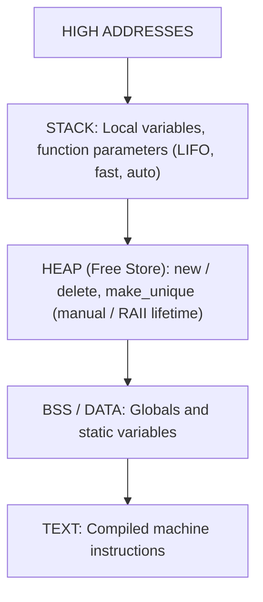
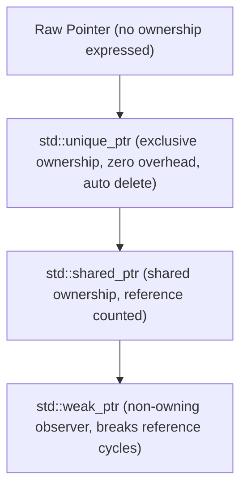
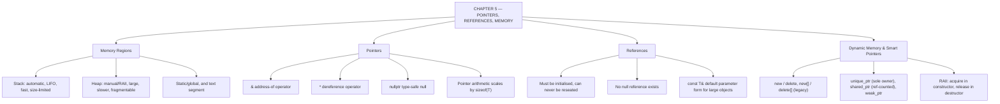

# C++ - CHAPTER 5
## Pointers, References, and Memory Management

> “A pointer does not hold your data. It holds the address where your data has agreed to live.” — A First Lesson in Indirection

### Learning Objectives
By the end of this chapter, you will be able to:
* Understand the physical difference between Stack memory and Heap memory.
* Master the address-of (`&`) and dereference (`*`) operators.
* Clearly differentiate between Pointers and References.
* Allocate and deallocate manual memory using `new` and `delete`.
* Modernize your code using C++ Smart Pointers (`std::unique_ptr`) to prevent memory leaks.

---

### Introduction
Everything you have done so far has happened automatically. When you created a variable, C++ found memory for it. When a function finished, C++ deleted its variables. Now, the training wheels come off. C++ is one of the few languages in the world that allows you to look directly at the physical hardware (RAM) and manipulate the exact addresses where data lives. This is the realm of pointers and dynamic memory. It is what makes C++ the language of choice for operating systems, game engines, and high-frequency trading.

### Why This Topic Matters
If you do not understand pointers and memory, you do not understand C++. Mishandling manual memory leads to the two most infamous bugs in computer science: **Memory Leaks** (your program slowly consumes all the computer's RAM until it crashes) and **Segmentation Faults** (your program tries to access memory it doesn't own, and the Operating System instantly kills it). Mastering this chapter elevates you from a script-writer to a software engineer.

---

### Chapter Roadmap
* Concept 1: The Anatomy of Memory (Stack vs. Heap)
* Concept 2: Memory Addresses and Pointers
* Concept 3: Pointers vs. References
* Concept 4: Dynamic Memory and Smart Pointers
* Learning Support Elements
* Debugging and Problem Solving
* Practical Application & Mini Project
* Practice and Evaluation
* Chapter Conclusion

---

> [!NOTE]
> **Real-Life Analogy: The Hotel and the Room Key**
> A hotel room is memory. The room number is the address. The guest inside is the value. A pointer is a slip of paper with a room number written on it — you can copy that slip, hand it to a colleague, or lose it, and none of that touches the guest. Dereferencing with `*` is walking to that room and opening the door.
> 
> A reference is different: it is an alias printed on the door itself. Once the door says 'Suite A', it says that permanently, it can never point at another room, and there is no such thing as a door with no room behind it. That is why a reference must be initialised at declaration and can never be reseated.
> 
> The stack is the hotel's day-use lounge: seats are assigned and released automatically as guests arrive and leave, in strict order, and nobody has to remember to tidy up. The heap is the long-stay wing: you request a room explicitly with `new`, and it stays yours until someone explicitly checks out with `delete`. Forget to check out and the room is billed forever with nobody in it — that is a memory leak. Check out and then walk back in with your old key — that is a dangling pointer, and the room may now belong to someone else entirely.
> 
> Smart pointers are the automated concierge. `std::unique_ptr` is a key that cannot be duplicated: exactly one holder, and checkout happens automatically the moment that holder leaves. `std::shared_ptr` keeps a tally at the front desk of how many keys are out, and checks the room out only when the count reaches zero. `std::weak_ptr` is a key that can look at the room but is not counted in the tally, which is how you break the deadlock of two rooms each holding a key to the other forever.

---

### Real-World Applications

| Domain | How this chapter's ideas appear in practice |
| :--- | :--- |
| **Operating Systems** | Page tables, process control blocks and device buffers are all reached through pointers; the kernel has no garbage collector to fall back on. |
| **Game Development** | Scene graphs use `unique_ptr` for owned children and raw or weak pointers for non-owning back-references to parents, avoiding cycles. |
| **Embedded Systems** | Memory-mapped hardware registers are accessed by casting a fixed integer address to a volatile pointer — indirection at its most literal. |
| **Databases** | Buffer pool managers hand out pointers into pinned pages; reference counting decides when a page may be evicted. |
| **Machine Learning** | Tensor libraries share large buffers between views via `shared_ptr` so that slicing a tensor costs no copy. |
| **Cyber Security** | Use-after-free and double-free are among the most exploited bug classes in the world, and RAII plus smart pointers exist specifically to eliminate them. |

---

### Core Learning Sections

#### CONCEPT 1: The Anatomy of Memory (Stack vs. Heap)
*Sub-topics Covered: 5.1 The Stack, 5.2 The Heap*

**Intuitive Explanation:** Imagine your computer's RAM as a massive warehouse. The **Stack** is a small, hyper-organized filing cabinet right next to your desk. It is incredibly fast, but space is highly limited. If you put too many files in it, it overflows. The **Heap** is the massive warehouse floor. You have gigabytes of space, but you have to manually walk out there, find an empty spot, put your box down, and remember exactly where you left it.

##### 5.1 The Stack (Automatic Memory)
Every time you declare a standard variable (`int x = 5;`) or call a function, C++ places it on the Stack.
* **Rule:** The Stack is LIFO (Last-In, First-Out).
* **Rule:** Stack memory is completely automatic. When a function finishes, all variables created inside it are instantly and permanently destroyed (popped off the stack).
* **Limitation:** The Stack is small (usually around 1MB to 8MB). If you try to create a massive array here, your program will crash (Stack Overflow).

##### 5.2 The Heap (Dynamic Memory)
The Heap is the vast remainder of your computer's RAM. C++ does *not* manage this automatically. If you want to use the Heap, you must explicitly ask the Operating System for a block of memory.
* **Rule:** The OS will give you the memory, but it will *never* take it back automatically. You are strictly responsible for returning it when you are done.



---

#### CONCEPT 2: Memory Addresses and Pointers
*Sub-topics Covered: 5.3 Memory Addresses (&), 5.4 Declaring Pointers, 5.5 Dereferencing (*), 5.6 The Null Pointer*

**Intuitive Explanation:** A memory address is like the GPS coordinates of a house. A Pointer is just a variable that stores those GPS coordinates. It doesn't hold the house itself; it just tells you where to find it.

##### 5.3 Memory Addresses (`&`)
Every byte in your RAM has a unique hexadecimal address (e.g., `0x7ffee9b`). You can find exactly where any variable lives using the Address-Of operator (`&`).

##### 5.4 Declaring Pointers
A pointer is a variable that holds a memory address. You declare it using an asterisk (`*`) placed next to the data type.

##### Syntax
```cpp
int* ptr; // Reads as: "ptr is a pointer to an integer"
```

##### 5.5 Dereferencing (`*`)
If you have a pointer (the GPS coordinates), you use the Dereference operator (`*`) to travel to that address and access or change the actual data stored there.

> [!WARNING]
> **Watch Out: The Dual Meaning of \***
> The asterisk does two different things depending on context:
> * In a declaration (`int* p`), it means "create a pointer."
> * In an action (`*p = 10;`), it means "travel to the address and modify the data."

##### 5.6 The Null Pointer (`nullptr`)
If you create a pointer but don't have an address to give it yet, you **must** set it to `nullptr`. A pointer holding random garbage data is called a "Wild Pointer" and will crash your system.

##### Code Example: Pointer Basics
```cpp
#include <iostream>

int main() {
    int score = 100;
    // 5.3 & 5.4: Declare a pointer and assign it the exact address of 'score'
    int* score_ptr = &score;

    std::cout << "Value of score:   " << score << "\n";
    std::cout << "Address of score: " << score_ptr << "\n"; // Prints hexadecimal

    // 5.5: Dereference the pointer to change the original variable
    *score_ptr = 500;
    std::cout << "New value of score: " << score << "\n";

    // 5.6: Safety reset
    score_ptr = nullptr;
    return 0;
}
```

##### Expected Output:
```text
Value of score:   100
Address of score: 0x16b6772fc (Note: exact hex will vary on your machine)
New value of score: 500
```

---

#### CONCEPT 3: Pointers vs. References
*Sub-topics Covered: 5.7 The Reference Operator, 5.8 Core Differences*

**Intuitive Explanation:** A pointer is a separate sticky note with an address written on it. You can erase the sticky note and write a new address on it. A reference (`&`) is just an unbreakable alias (a nickname) for an existing variable.

##### 5.7 The Reference Operator
A reference must be assigned to an existing variable immediately upon creation.

##### 5.8 Core Differences (The Strict Rules)
* **Reassignment:** Pointers can be reassigned to point to different variables later. References are permanently locked to their original variable; they can never be changed.
* **Nullability:** Pointers can be `nullptr` (point to nothing). References **must** point to a valid object. A null reference is illegal in C++.
* **Syntax:** Pointers require the `*` operator to read/write data. References look and act exactly like normal variables (no `*` required).

---

#### CONCEPT 4: Dynamic Memory and Smart Pointers
*Sub-topics Covered: 5.9 new and delete (Legacy), 5.10 Memory Leaks, 5.11 Smart Pointers (<memory>), 5.12 std::unique_ptr*

##### 5.9 `new` and `delete` (Legacy C++)
In older C++, you used the `new` keyword to ask the OS for memory on the Heap. It returned a pointer. When finished, you strictly had to use `delete` to give the memory back.

##### 5.10 Memory Leaks
If you use `new` but forget to write `delete` (or if a function crashes before it reaches `delete`), that memory is locked forever. Your program will eat RAM until the computer freezes. This is a **Memory Leak**.

##### 5.11 Smart Pointers (`<memory>`) & 5.12 `std::unique_ptr`
Modern C++ (C++11 and beyond) introduces Smart Pointers to eliminate memory leaks. A Smart Pointer is a wrapper around a raw pointer. It automatically calls `delete` for you the exact moment the pointer goes out of scope.

> [!WARNING]
> **Watch Out: Never use raw new and delete**
> In modern professional C++ (as advised by Bjarne Stroustrup), you should almost never write `new` or `delete` manually. Always use Smart Pointers (`std::make_unique`).

##### Code Example: Dynamic Arrays using Smart Pointers
```cpp
#include <iostream>
#include <memory> // Required for smart pointers

int main() {
    int class_size = 3;
    
    // 5.12: Allocate an array on the Heap dynamically based on size.
    // We use unique_ptr so we NEVER have to worry about memory leaks!
    std::unique_ptr<int[]> grades = std::make_unique<int[]>(class_size);

    // Populate the dynamic array
    for (int i = 0; i < class_size; ++i) {
        grades[i] = 100 - i; // Dummy data (100, 99, 98...)
    }

    std::cout << "Student 2's Grade: " << grades[1] << "\n";
    // NO 'delete' keyword needed! 
    // When main() ends, 'grades' automatically cleans up the Heap memory.
    return 0;
}
```

##### Expected Output:
```text
Student 2's Grade: 99
```



---

### Learning Support Elements

> [!TIP]
> **Tips: Reading Pointer Declarations**
> Always read C++ pointer declarations strictly from right to left:
> * `const int* ptr` -> `ptr` is a pointer to an `int` that is `const` (you can change where the pointer points, but not the data).
> * `int* const ptr` -> `ptr` is a `const` pointer to an `int` (you can change the data, but not where it points).

> [!NOTE]
> **Important Notes: The Stack is Fast**
> Because the Stack is physically ordered and managed entirely by the CPU's internal pointers, allocating memory on the Stack takes virtually zero time. Allocating memory on the Heap requires a slow call to the OS. *Rule of Thumb:* Always prefer the Stack unless data is massive or size is unknown until runtime.

> [!WARNING]
> **Warnings: Dangling Pointers**
> If you manually `delete` a raw pointer, the memory goes back to the OS. However, your pointer variable still holds the old address. If you try to dereference it again, you will crash the program. Always set raw pointers to `nullptr` after deleting them.

---

### Debugging and Problem Solving

#### Compiler Errors vs. Runtime Errors
* **Compiler Error (Const Violation):** `error: assignment of read-only reference` — Cause: You tried to modify a `const std::string&` parameter inside a function.
* **Runtime Error (Segmentation Fault):** Cause: Dereferencing a `nullptr` or accessing memory your program doesn't own. The OS instantly terminates your process.
* **Runtime Error (Memory Leak):** Cause: Used `new`, forgot `delete`. Fix: Replace all raw `new`/`delete` pairs with `std::unique_ptr`.

---

### Practical Application & Mini Project

#### Mini Project: Sensor Data Buffer Manager
In embedded systems, you often read streams of data (like temperature sensors). You don't know how much data you'll get, so you must allocate it dynamically using smart pointers alongside basic pointer arithmetic.

```cpp
#include <iostream>
#include <memory>
#include <format>

void AnalyzeData(int* data_ptr, int size) {
    std::cout << "--- Analyzing Buffer ---\n";
    for (int i = 0; i < size; ++i) {
        // Pointer arithmetic: *(data_ptr + i) is exactly the same as data_ptr[i]
        int current_val = *(data_ptr + i);
        if (current_val > 80) {
            std::cout << std::format("Warning: High temp detected at index {}: {}C\n", i, current_val);
        }
    }
}

int main() {
    int buffer_size = 4;
    std::cout << "Sensor readings count: " << buffer_size << "\n";

    // Allocate Heap memory safely
    auto sensor_buffer = std::make_unique<int[]>(buffer_size);

    // Simulate reading data from a sensor
    for (int i = 0; i < buffer_size; ++i) {
        sensor_buffer[i] = 75 + (i * 3); // Values: 75, 78, 81, 84...
    }

    // Extract the raw pointer from the smart pointer safely using .get()
    AnalyzeData(sensor_buffer.get(), buffer_size);
    std::cout << "Program finished safely. Heap memory auto-released.\n";
    return 0;
}
```

##### Expected Output:
```text
Sensor readings count: 4
--- Analyzing Buffer ---
Warning: High temp detected at index 2: 81C
Warning: High temp detected at index 3: 84C
Program finished safely. Heap memory auto-released.
```

---

### Practice and Evaluation

#### Quick Check Questions
* Does the Stack or the Heap require you to manually manage memory?
* What does the `&` operator do when placed in front of a standard variable?
* What is the fundamental difference between a Pointer and a Reference regarding nullability?
* Why is `std::unique_ptr` superior to legacy `new` and `delete`?

#### Coding Exercises
* Create a normal `double` variable. Create a pointer to that variable. Use the dereference operator on the pointer to multiply the original variable by `2.0`.
* Write a program that dynamically allocates an array using `std::make_unique`, fills it with numbers, and prints them.

#### Interview Questions & Answers

1. **(Junior) What is the difference between the Stack and the Heap?**
   * **Answer:** The Stack is automatic, fast, and limited memory managed by the CPU for local variables. The Heap is vast, manual dynamic memory managed by the OS. Variables on the Stack are destroyed automatically when scope ends, while Heap memory must be freed.

2. **(Junior) What does the dereference operator (`*`) do?**
   * **Answer:** When applied to a pointer variable (e.g., `*ptr`), the dereference operator accesses the physical memory address stored inside the pointer, allowing you to read or overwrite the actual data residing at that location.

3. **(Junior) What is a Segmentation Fault?**
   * **Answer:** A Segmentation Fault occurs when a program attempts to access a memory location it is not allowed to access, such as dereferencing a `nullptr` or attempting to write to read-only memory.

4. **(Mid-Level) Explain the exact differences between a Pointer and a Reference.**
   * **Answer:** A pointer is a distinct variable that holds a memory address; it can be reassigned to point to different variables and can be set to `nullptr`. A reference is an immutable alias to an existing variable; it must be initialized immediately, can never be reassigned, and cannot be null.

5. **(Mid-Level) What is a Memory Leak in C++?**
   * **Answer:** A memory leak occurs when a program allocates dynamic memory on the Heap (using `new`) but loses the pointer to that memory before calling `delete`. Because the address is lost, the memory cannot be freed and remains permanently locked.

6. **(Mid-Level) How does `std::unique_ptr` prevent memory leaks?**
   * **Answer:** `std::unique_ptr` relies on RAII (Resource Acquisition Is Initialization). It acts as a wrapper around a raw pointer. When the `unique_ptr` object goes out of scope, its destructor automatically calls `delete` on the underlying raw pointer.

7. **(Mid-Level) What is a Dangling Pointer?**
   * **Answer:** A dangling pointer is a pointer that holds the memory address of an object that has already been deleted or deallocated. Attempting to dereference a dangling pointer results in Undefined Behavior.

8. **(Senior) Why does C++ array syntax `arr[i]` work the exact same way as pointer arithmetic `*(arr + i)`?**
   * **Answer:** Because raw arrays decay into pointers. When you write `arr[i]`, the compiler internally translates it to `*(arr + i)`. It takes the base memory address of the first element, mathematically adds an offset equal to $i \times \text{sizeof(type)}$, and dereferences that location.

9. **(Senior) When would you pass a raw pointer to a function instead of a reference?**
   * **Answer:** You pass a raw pointer when the parameter is strictly optional. Because references cannot be null, a reference parameter mandates that an object must exist. A pointer parameter allows the caller to pass `nullptr`.

10. **(Senior) Explain the concept of RAII (Resource Acquisition Is Initialization).**
    * **Answer:** RAII dictates that resource management (memory, file handles, locks) should be tied to the lifespan of objects on the Stack. A resource is acquired in an object's constructor and released in its destructor automatically when scope exits.

---

### Chapter Conclusion
Memory in C++ is divided into the fast, automatic Stack and the vast, manual Heap. Pointers are variables that store the literal RAM addresses of data, allowing you to manipulate memory directly. While raw pointers and `new`/`delete` keywords provide immense power, modern C++ solves memory risks by wrapping management in Smart Pointers (`std::unique_ptr`).

#### Key Takeaways
* **References over Pointers:** Always prefer passing variables by reference (`&`). Only use pointers when you specifically require `nullptr`.
* **Never Use raw `new`:** Avoid manual `new` and `delete` in modern codebases.
* **Smart Pointers:** Always use `std::make_unique` to allocate dynamic memory safely.
* **Pointer Arithmetic:** Stepping through an array is physically stepping through continuous blocks of bytes in RAM.

#### What to Learn Next
Now that you can manage data types, control flow, and physical memory, it is time to build your own complex architectures in **Chapter 6: Object-Oriented Programming (OOP)**.

---

### Progressive Code Examples: Four Tiers

#### TIER 1 · BEGINNER
##### Address, Pointer, Value
**Goal:** See the three things that are constantly confused, printed side by side.

```cpp
#include <iostream>

int main() {
    int score = 95;
    int* ptr = &score; // & : take the address of score

    std::cout << "value of score   : " << score << '\n';
    std::cout << "address of score : " << &score << '\n';
    std::cout << "value of ptr     : " << ptr << '\n';
    std::cout << "value at *ptr    : " << *ptr << '\n';

    *ptr = 100; // * : go to that address and write
    std::cout << "score is now     : " << score << '\n';
    return 0;
}
```

##### Expected Output
```text
value of score   : 95
address of score : 0x7ffd4c2a1b3c
value of ptr     : 0x7ffd4c2a1b3c
value at *ptr    : 95
score is now     : 100
```

> **What this tier adds:** Baseline. The key observation is that ptr and &score print the same thing: the pointer holds the address, nothing more.

---

#### TIER 2 · INTERMEDIATE
##### Swap, Three Ways
**Goal:** Prove the difference between by-value, by-pointer and by-reference parameters.

```cpp
#include <iostream>

void swapByValue(int a, int b) { // operates on COPIES
    int t = a; a = b; b = t;    // caller sees nothing
}

void swapByPointer(int* a, int* b) { // explicit indirection
    if (!a || !b) return;            // pointers can be null
    int t = *a; *a = *b; *b = t;
}

void swapByReference(int& a, int& b) { // aliases, cannot be null
    int t = a; a = b; b = t;
}

int main() {
    int x = 1, y = 2;

    swapByValue(x, y);
    std::cout << "after value     : " << x << ' ' << y << '\n';

    swapByPointer(&x, &y);
    std::cout << "after pointer   : " << x << ' ' << y << '\n';

    swapByReference(x, y);
    std::cout << "after reference : " << x << ' ' << y << '\n';
    return 0;
}
```

##### Expected Output
```text
after value     : 1 2
after pointer   : 2 1
after reference : 1 2
```

> **What this tier adds:** The by-value version silently does nothing, which is the entire lesson. Pointer and reference both work; the reference version needs no null check and no & at the call site.

---

#### TIER 3 · ADVANCED
##### The Leak, and Why RAII Fixes It
**Goal:** Watch manual memory management fail under an exception, then repair it.

```cpp
#include <iostream>
#include <stdexcept>
#include <memory>

struct Resource {
    int id;
    explicit Resource(int i) : id{i} {
        std::cout << "  acquired #" << id << '\n';
    }
    ~Resource() {
        std::cout << "  released #" << id << '\n';
    }
};

void leaky() {
    Resource* r = new Resource(1);
    throw std::runtime_error("failure after allocation");
    delete r; // NEVER REACHED — the memory leaks
}

void safe() {
    auto r = std::make_unique<Resource>(2);
    throw std::runtime_error("failure after allocation");
    // no delete needed: ~unique_ptr runs during stack unwinding
}

int main() {
    std::cout << "leaky():\n";
    try { leaky(); } catch (const std::exception& e) {
        std::cout << "  caught: " << e.what() << '\n';
    }

    std::cout << "safe():\n";
    try { safe(); } catch (const std::exception& e) {
        std::cout << "  caught: " << e.what() << '\n';
    }
    return 0;
}
```

##### Expected Output
```text
leaky():
  acquired #1
  caught: failure after allocation
safe():
  acquired #2
  released #2
  caught: failure after allocation
```

> **What this tier adds:** This output is the proof, not the argument. Stack unwinding runs destructors, and a raw pointer has none — which is why the leak is structural rather than a matter of remembering to type delete.

---

#### TIER 4 · PROFESSIONAL
##### Ownership Modelled Correctly
**Goal:** Express sole ownership, shared ownership and non-owning observation in one program.

```cpp
#include <iostream>
#include <memory>
#include <string>
#include <vector>

struct Node {
    std::string name;
    std::vector<std::shared_ptr<Node>> children; // parent OWNS children
    std::weak_ptr<Node> parent;                 // child OBSERVES parent

    explicit Node(std::string n) : name{std::move(n)} {}
    ~Node() { std::cout << "  destroying " << name << '\n'; }
};

void attach(const std::shared_ptr<Node>& parent,
            const std::shared_ptr<Node>& child) {
    child->parent = parent; // weak: does NOT bump the count
    parent->children.push_back(child);
}

int main() {
    {
        auto root  = std::make_shared<Node>("root");
        auto leafA = std::make_shared<Node>("leafA");
        attach(root, leafA);

        std::cout << "root use_count : " << root.use_count() << '\n';

        if (auto p = leafA->parent.lock()) { // safe upgrade
            std::cout << "leafA's parent : " << p->name << '\n';
        }
    } // scope ends -> everything is released, in order

    std::cout << "scope exited cleanly\n";
    return 0;
}
```

##### Expected Output
```text
root use_count : 1
leafA's parent : root
  destroying root
  destroying leafA
scope exited cleanly
```

> **What this tier adds:** Encodes the ownership graph in the type system: shared_ptr downward, weak_ptr upward. lock() is the only safe way to use a weak_ptr, because the target may already be gone.

---

### Common Mistakes and How to Fix Them

| The mistake | Why it happens | What you see (class) | The fix |
| :--- | :--- | :--- | :--- |
| **Using a pointer after `delete`** | The variable still holds a plausible-looking address | Random corruption or a crash *(UNDEFINED)* | Use `unique_ptr` so the pointer and the lifetime cannot drift apart |
| **Mismatching `new[]` with `delete`** | One allocation, so one deallocation feels right | Heap corruption *(UNDEFINED)* | Use `std::vector`; if you must, match `new[]` with `delete[]` |
| **Leaking when an exception is thrown between `new` and `delete`** | The `delete` is clearly written in the code | Steadily growing memory usage *(RUNTIME)* | RAII: `make_unique`, so the release cannot be skipped |
| **Two `shared_ptr`s pointing at each other** | Shared ownership seems symmetric and harmless | Destructors never run *(LOGIC)* | Make one direction `weak_ptr` — usually the child-to-parent link |
| **Dereferencing a null or uninitialised pointer** | The declaration looked complete | Segmentation fault *(RUNTIME)* | Initialise to `nullptr` and check, or use a reference where null is impossible |
| **Returning `shared_ptr` for something with one owner** | `shared_ptr` feels safer than `unique_ptr` | Hidden lifetime extension, unclear ownership *(LOGIC)* | Default to `unique_ptr`; upgrade to `shared_ptr` only when sharing is real |

---

### Chapter Mind Map



---

> [!TIP]
> **Prepare for your Chapter Exam!**
> You have completed reading Chapter 5. Head to the **Take Chapter Quiz** assessment below to test your knowledge and unlock Chapter 6!
