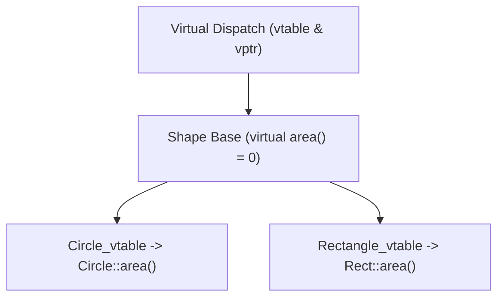

# C++ - CHAPTER 6
## Object-Oriented Programming

> “A class is not a way to group data. It is a way to make illegal states impossible to write down.” — A First Lesson in Encapsulation

### Learning Objectives
By the end of this chapter, you will be able to:
* Understand the difference between a `struct` and a `class`.
* Master the creation of Objects and the use of Access Specifiers (`public`, `private`, `protected`).
* Initialize data safely using Constructors and Member Initializer Lists.
* Secure data using Encapsulation, Getters, Setters, and `const` methods.
* Implement foundational Inheritance and Polymorphism using `virtual` functions and `override`.

---

### Introduction
Up until this point, you have been writing Procedural code. You create isolated variables to hold data, and you write isolated functions to modify that data. But as programs grow to tens of thousands of lines, keeping track of which function is allowed to modify which variable becomes a chaotic nightmare. Object-Oriented Programming (OOP) solves this by fundamentally shifting how you think about code. Instead of separating data and actions, OOP bundles them together into self-contained entities called **Objects**.

### Why This Topic Matters
OOP is the dominant programming paradigm in the software industry. Game engines treat "Players" and "Enemies" as objects. Operating systems treat "Windows" and "Files" as objects. Mastering OOP allows you to model real-world concepts in code, securely hide sensitive data from unauthorized modification (Encapsulation), and reuse massive amounts of code effortlessly (Inheritance).

---

### Chapter Roadmap
* Concept 1: Classes, Objects, and Access Specifiers
* Concept 2: Constructors and Object Initialization
* Concept 3: Encapsulation and Methods
* Concept 4: Inheritance and Polymorphism
* Learning Support Elements
* Debugging and Problem Solving
* Practical Application & Mini Project
* Practice and Evaluation
* Chapter Conclusion

---

> [!NOTE]
> **Real-Life Analogy: The Architect's Blueprint**
> A blueprint is not a house. It is a specification from which any number of houses can be built, each with its own address, its own furniture, its own occupants. The blueprint is the class; each built house is an object. Changing the blueprint changes every house built from it afterwards, but the houses already standing keep their own independent state.
> 
> Access specifiers are the building's zoning. The public section is the front door and the doorbell — anything on the street may use them. The private section is the wiring inside the walls: essential, but no visitor is permitted to reach in and rewire it, because they would have no way of knowing which changes are safe. `protected` is the service corridor: closed to the public, but open to any extension wing built onto this house.
> 
> A constructor is the handover on completion day, when the builder guarantees the house is habitable — water connected, power on, no room left half-finished. A destructor is the demolition crew that shuts off the utilities in the correct order. Inheritance is designing a bungalow blueprint by starting from the general house blueprint and specialising it. Polymorphism is the postal service: it puts a letter through the door of any building on the street without needing to know whether it is a bungalow, a duplex or a tower, because every one of them honours the same 'letterbox' interface.

---

### Real-World Applications

| Domain | How this chapter's ideas appear in practice |
| :--- | :--- |
| **Game Development** | Entity hierarchies expose a `virtual update()` so the engine loop can drive thousands of dissimilar objects through one uniform call. |
| **Operating Systems** | Device drivers implement a fixed `virtual` interface, which is exactly how one kernel can talk to hardware it has never seen. |
| **Databases** | Storage engines are pluggable behind an abstract interface — the query layer is written once against the base class. |
| **Robotics** | Sensor abstraction lets a navigation stack accept LiDAR, sonar or camera input through a single polymorphic Sensor type. |
| **Finance** | Instrument hierarchies (Bond, Option, Future) share a `price()` interface so a portfolio can be valued without a type switch. |
| **Browsers** | The DOM is a deep class hierarchy; rendering walks it polymorphically without knowing every element type in advance. |

---

### Core Learning Sections

#### CONCEPT 1: Classes, Objects, and Access Specifiers
*Sub-topics Covered: 6.1 What is a Class?, 6.2 Instantiating Objects, 6.3 Access Specifiers (public, private)*

**Intuitive Explanation:** A Class is a blueprint. An Object is the actual house built from that blueprint. The blueprint defines how many doors and windows the house will have, but the blueprint itself is not a physical house. You can use one single blueprint (Class) to build hundreds of unique houses (Objects).

##### 6.1 What is a Class?
A class is a custom data type created by the programmer. It allows you to group variables (called Member Variables or Attributes) and functions (called Member Functions or Methods) into a single package.

> [!WARNING]
> **Watch Out: The Semicolon Trap**
> Unlike a function, the closing brace `}` of a class definition **must** be followed by a semicolon `;`. Forgetting this is the #1 cause of massive, confusing compiler errors for beginners (`class MyClass { ... };`).

##### 6.2 Instantiating Objects
Once a class is defined, you create an instance of it in memory. This is called an Object. You access the data and functions inside the object using the dot operator (`.`).

##### 6.3 Access Specifiers (`public`, `private`)
By default, everything inside a class is locked down and hidden (`private`).
* `private`: Variables and functions under this label can **only** be accessed or modified by the class's own internal functions.
* `public`: Variables and functions under this label can be freely accessed by anyone using the object.

##### Code Example: The Blueprint and the Object
```cpp
#include <iostream>
#include <string>

// 6.1: Defining the Blueprint
class Student {
// 6.3: Access Specifiers
private: 
    // Hidden data
    int secret_id{101}; 
public: 
    // Visible data and functions
    std::string name;
    void Study() {
        std::cout << name << " is studying hard.\n";
    }
}; // <-- MUST have a semicolon here!

int main() {
    // 6.2: Instantiating Objects
    Student student_one;
    student_one.name = "Alice";
    Student student_two;
    student_two.name = "Bob";

    // Accessing a public method using the dot operator
    student_one.Study();
    student_two.Study();

    // student_one.secret_id = 1234; // COMPILER ERROR! Cannot access private data.
    return 0;
}
```

##### Expected Output:
```text
Alice is studying hard.
Bob is studying hard.
```

---

#### CONCEPT 2: Constructors and Object Initialization
*Sub-topics Covered: 6.4 The Default Constructor, 6.5 Parameterized Constructors, 6.6 Member Initializer Lists*

**Intuitive Explanation:** When a house is built, a construction crew has to do the initial setup (pouring concrete, setting up plumbing). In C++, a **Constructor** is the construction crew. It is a special function that runs *automatically* the exact millisecond an object is created, ensuring the object is set up safely before the program is allowed to use it.

##### 6.4 & 6.5 Default & Parameterized Constructors
A constructor has the exact same name as the class and has **no return type** (not even `void`). A default constructor takes no parameters. A parameterized constructor accepts arguments at creation time.

##### 6.6 Member Initializer Lists
Inside the constructor, Modern C++ heavily favors the Member Initializer List syntax (`: field{val}`). It initializes the variables directly at the memory level before the constructor's code block even runs. It is significantly faster and strictly required for `const` member variables.

##### Code Example: Safe Initialization
```cpp
#include <iostream>
#include <string>

class Rectangle {
private:
    double width;
    double height;
public:
    // 6.4: Default Constructor
    Rectangle() : width{1.0}, height{1.0} {
        std::cout << "Default Rectangle created.\n";
    }
    // 6.5 & 6.6: Parameterized Constructor using an Initializer List (The colon syntax)
    Rectangle(double w, double h) : width{w}, height{h} {
        std::cout << "Custom Rectangle created.\n";
    }
    double GetArea() const {
        return width * height;
    }
};

int main() {
    // Triggers the Default Constructor
    Rectangle base_rect; 
    // Triggers the Parameterized Constructor
    Rectangle custom_rect(5.0, 4.0); 

    std::cout << "Base Area:   " << base_rect.GetArea() << "\n";
    std::cout << "Custom Area: " << custom_rect.GetArea() << "\n";
    return 0;
}
```

##### Expected Output:
```text
Default Rectangle created.
Custom Rectangle created.
Base Area:   1
Custom Area: 20
```

---

#### CONCEPT 3: Encapsulation and Methods
*Sub-topics Covered: 6.7 Encapsulation, 6.8 Getters and Setters, 6.9 const Member Functions*

**Intuitive Explanation:** Encapsulation is the concept of a bank vault. You don't let customers walk into the vault and grab cash themselves (`public` variables). Instead, you lock the cash away (`private` variables) and force the customer to talk to a Bank Teller (`public` methods). The Teller verifies the request before handing over the money.

##### 6.7 Encapsulation & 6.8 Getters/Setters
Never make member variables public. Always make them private. To interact with private data, provide public functions: A **Getter** reads the data; a **Setter** modifies the data with validation logic.

##### 6.9 `const` Member Functions
If a method only reads data (like a Getter) and does not modify the object, label the function as `const` at the end of the signature (`double GetBalance() const`). This proves to the compiler that the function is read-only safe.

##### Code Example: The Bank Teller Concept
```cpp
#include <iostream>

class BankAccount {
private:
    // 6.7: Encapsulated data. Only the class can touch this.
    double balance; 
public:
    BankAccount(double initial_deposit) : balance{initial_deposit} {}

    // 6.8: Getter (Accessor)
    // 6.9: const keyword guarantees this function won't alter the balance
    double GetBalance() const {
        return balance;
    }

    // 6.8: Setter (Mutator) with validation logic
    void Deposit(double amount) {
        if (amount > 0) {
            balance += amount;
            std::cout << "Deposited: $" << amount << "\n";
        } else {
            std::cerr << "Error: Deposit must be positive.\n";
        }
    }
};

int main() {
    BankAccount my_account(100.0);
    // my_account.balance = 50000; // ERROR! Protected by encapsulation.
    my_account.Deposit(50.0);
    my_account.Deposit(-20.0); // Will be rejected by the Setter
    std::cout << "Final Balance: $" << my_account.GetBalance() << "\n";
    return 0;
}
```

##### Expected Output:
```text
Deposited: $50
Error: Deposit must be positive.
Final Balance: $150
```

---

#### CONCEPT 4: Inheritance and Polymorphism
*Sub-topics Covered: 6.10 Base and Derived Classes, 6.11 virtual Functions, 6.12 The override Keyword*

**Intuitive Explanation:** Inheritance is the "Is-A" relationship. A Car "Is-A" Vehicle. Polymorphism (many forms) means a program can issue a generic command like "Drive," and the Car will execute its specific driving style, while a Motorcycle executes a different style.

##### 6.10 Base and Derived Classes
The Base Class (Parent) holds shared data. The Derived Class (Child) uses a colon `:` to inherit (`class Car : public Vehicle`).

##### 6.11 `virtual` Functions & 6.12 `override` Keyword
Label a Base Class function as `virtual` to instruct the compiler to use **Dynamic Dispatch** via a `vtable` at runtime. Place the `override` keyword at the end of derived class function signatures to enforce compile-time verification that you are correctly overriding a parent method.

##### Code Example: Academic Roles
```cpp
#include <iostream>
#include <string>

// 6.10: Base Class
class Person {
protected: // Like private, but allows Derived classes to access it
    std::string name;
public:
    Person(std::string n) : name{n} {}
    // 6.11: Virtual function allows children to overwrite this behavior
    virtual void Introduce() const {
        std::cout << "I am a generic person named " << name << ".\n";
    }
};

// 6.10: Derived Class inheriting publicly from Person
class Professor : public Person {
private:
    std::string department;
public:
    // Call the Base Class constructor in the initializer list
    Professor(std::string n, std::string dept) : Person(n), department{dept} {}

    // 6.12: Overriding the base behavior
    void Introduce() const override {
        std::cout << "I am Prof. " << name << ", head of " << department << ".\n";
    }
};

int main() {
    Person generic("John");
    Professor teacher("Smith", "Physics");
    generic.Introduce();
    teacher.Introduce();
    return 0;
}
```

##### Expected Output:
```text
I am a generic person named John.
I am Prof. Smith, head of Physics.
```



---

### Learning Support Elements

> [!TIP]
> **Tips: Class vs. Struct in C++**
> In C++, `class` and `struct` are nearly identical. The only difference: `class` members are `private` by default; `struct` members are `public` by default. *Best Practice:* Use `struct` for plain data containers (like 3D coordinates: X, Y, Z); use `class` for complex objects requiring encapsulation and logic.

> [!NOTE]
> **Important Notes: Rule of Three (Preview)**
> In advanced C++, if your class allocates manual Heap memory in its constructor, you must explicitly write a custom Destructor to clean it up, as well as handle copy construction and copy assignment.

> [!WARNING]
> **Warnings: Passing Objects to Functions**
> Because Objects contain multiple variables, they can be massive in memory. **Never** pass an object to a function by value (`void Print(Student s)`). This forces the CPU to copy the entire object. Always pass objects by `const` reference: `void Print(const Student& s)`.

---

### Debugging and Problem Solving

#### Compiler Errors vs. Runtime Errors
* **Compiler Error (Private Context Violation):** `error: 'double BankAccount::balance' is private within this context` — Cause: Attempted to directly access a private member outside the class. Fix: Use public Getters/Setters.
* **Compiler Error (No Default Constructor):** Cause: Created a parameterized constructor without writing a default constructor. Fix: Explicitly define `MyClass() = default;`.

---

### Practical Application & Mini Project

#### Mini Project: Student Registration System
This project brings together classes, encapsulation, Member Initializer Lists, `const` methods, and object instantiation.

```cpp
#include <iostream>
#include <string>
#include <format>

class StudentRecord {
private:
    int student_id;
    std::string name;
    double gpa;
public:
    // Parameterized Constructor with Initializer List
    StudentRecord(int id, std::string n, double initial_gpa) 
        : student_id{id}, name{n}, gpa{initial_gpa} {}

    // Getter for the Name
    std::string GetName() const { return name; }
    double GetGPA() const { return gpa; }

    // Setter for GPA with Encapsulated Validation Logic
    void UpdateGPA(double new_gpa) {
        if (new_gpa >= 0.0 && new_gpa <= 4.0) {
            gpa = new_gpa;
            std::cout << "GPA for " << name << " updated successfully.\n";
        } else {
            std::cerr << "SECURITY ALERT: Invalid GPA submission rejected.\n";
        }
    }

    void PrintTranscript() const {
        std::cout << std::format("ID: {} | Name: {:<10} | GPA: {:.1f}\n", student_id, name, gpa);
    }
};

int main() {
    std::cout << "--- University Database ---\n";
    StudentRecord student1(1001, "Alice M.", 3.8);
    StudentRecord student2(1002, "Bob T.", 2.5);

    student1.PrintTranscript();
    student2.PrintTranscript();

    std::cout << "\n--- Processing End of Semester ---\n";
    student2.UpdateGPA(2.9); // Valid update
    student1.UpdateGPA(4.5); // Invalid update (blocked by encapsulation)

    std::cout << "\n--- Final Records ---\n";
    student1.PrintTranscript();
    student2.PrintTranscript();
    return 0;
}
```

##### Expected Output:
```text
--- University Database ---
ID: 1001 | Name: Alice M.   | GPA: 3.8
ID: 1002 | Name: Bob T.     | GPA: 2.5

--- Processing End of Semester ---
GPA for Bob T. updated successfully.
SECURITY ALERT: Invalid GPA submission rejected.

--- Final Records ---
ID: 1001 | Name: Alice M.   | GPA: 3.8
ID: 1002 | Name: Bob T.     | GPA: 2.9
```

---

### Practice and Evaluation

#### Quick Check Questions
* Why must a class definition end with a semicolon?
* If you do not write `public:` or `private:` in a class, what is the default access level?
* What is the purpose of a Getter and Setter?
* Why is the Member Initializer List preferred over assigning variables inside the constructor's body?

#### Coding Exercises
* Create a class called `Circle` with a private `double radius`. Write a constructor to initialize the radius and a `const` method `GetArea()`.
* Modify `Circle` by adding `SetRadius(double r)` with input validation rejecting negative numbers.

#### Interview Questions & Answers

1. **(Junior) What are the four main pillars of Object-Oriented Programming?**
   * **Answer:** Encapsulation (hiding data), Abstraction (hiding complex implementations), Inheritance (sharing traits from parent classes), and Polymorphism (allowing one interface to represent multiple form implementations).

2. **(Junior) What is the fundamental difference between a `struct` and a `class` in C++?**
   * **Answer:** Members of a `class` are `private` by default, whereas members of a `struct` are `public` by default.

3. **(Junior) What is a Constructor, and when is it executed?**
   * **Answer:** A constructor is a special member function with the exact same name as the class and no return type. It is executed automatically the exact moment an object is instantiated.

4. **(Mid-Level) Why should member functions that do not modify member variables be labeled as `const`?**
   * **Answer:** Labeling a method as `const` guarantees to the compiler that the function will not alter object state, permitting invocation on `const` references.

5. **(Mid-Level) Explain the purpose of a Member Initializer List.**
   * **Answer:** The member initializer list initializes variables at the time of creation in memory before the constructor body executes, preventing default-construction overhead.

6. **(Mid-Level) What does the `virtual` keyword do?**
   * **Answer:** It enables dynamic polymorphism via a `vtable`, ensuring the program executes the derived class's overridden version of a function at runtime.

7. **(Mid-Level) Why is the `override` keyword important when implementing polymorphism?**
   * **Answer:** `override` forces the compiler to verify that a derived method signature exactly matches a base class `virtual` method.

8. **(Senior) Why is it dangerous to make data members public, even if you don't care about security?**
   * **Answer:** It breaks Encapsulation and class invariants, exposing internal data state to corruption from external code.

9. **(Senior) What happens if you explicitly write a parameterized constructor, but do not write a default constructor?**
   * **Answer:** The compiler suppresses implicit generation of the default constructor. Instantiating without arguments will cause a compiler error.

10. **(Senior) What is object slicing?**
    * **Answer:** Object slicing occurs when a derived class object is assigned to a base class object *by value*, stripping away derived variables and virtual behavior.

---

### Chapter Conclusion
Object-Oriented Programming fundamentally shifts code design from isolated actions to interacting entities. By using Classes, Encapsulation, Constructors, and Inheritance, you build maintainable, enterprise-grade C++ systems.

#### Key Takeaways
* **Encapsulate Everything:** Never leave member variables public.
* **Initialize Early:** Always use the Member Initializer List in your constructors.
* **Const Correctness:** Put `const` at the end of any method that only reads data.
* **Semicolon Check:** Remember the `;` at the end of class definitions.

#### What to Learn Next
In **Chapter 7: Modern Data Structures (Vectors and Iterators)**, you will learn how to store thousands of custom objects in dynamically growing STL containers.

---

### Progressive Code Examples: Four Tiers

#### TIER 1 · BEGINNER
##### A Class With a Constructor
**Goal:** Bundle data with the function that guarantees it starts out valid.

```cpp
#include <iostream>
#include <string>

class Student {
public:
    Student(std::string name, int roll)
        : name_{std::move(name)}, roll_{roll} {} // member init list

    void print() const { // const: cannot mutate
        std::cout << roll_ << " " << name_ << '\n';
    }
private:
    std::string name_;
    int roll_;
};

int main() {
    Student a{"Ananya", 101};
    Student b{"Bhaskar", 102};
    a.print();
    b.print();
    return 0;
}
```

##### Expected Output
```text
101 Ananya
102 Bhaskar
```

> **What this tier adds:** Baseline. Two objects, one blueprint, independent state. The member initialiser list constructs the members directly instead of default-constructing then assigning.

---

#### TIER 2 · INTERMEDIATE
##### An Invariant the Class Enforces
**Goal:** Make an illegal state impossible to reach from outside.

```cpp
#include <iostream>
#include <stdexcept>

class BankAccount {
public:
    explicit BankAccount(double opening) {
        if (opening < 0) throw std::invalid_argument("negative opening balance");
        balance_ = opening;
    }
    void deposit(double amount) {
        if (amount <= 0) throw std::invalid_argument("deposit must be positive");
        balance_ += amount;
    }
    void withdraw(double amount) {
        if (amount <= 0) throw std::invalid_argument("withdrawal must be positive");
        if (amount > balance_) throw std::runtime_error("insufficient funds");
        balance_ -= amount;
    }
    double balance() const { return balance_; } // read-only accessor
private:
    double balance_{0.0}; // THE INVARIANT: balance_ is never negative
};

int main() {
    BankAccount acc{1000.0};
    acc.deposit(500.0);
    try { acc.withdraw(5000.0); }
    catch (const std::exception& e) { std::cout << "rejected: " << e.what() << '\n'; }
    std::cout << "balance: " << acc.balance() << '\n';
    return 0;
}
```

##### Expected Output
```text
rejected: insufficient funds
balance: 1500
```

> **What this tier adds:** There is no setter for balance_, so the invariant is enforced in exactly one place. A public data member would have scattered that responsibility across every caller.

---

#### TIER 3 · ADVANCED
##### Inheritance and Virtual Dispatch
**Goal:** Drive dissimilar objects through one interface, and see why the destructor must be virtual.

```cpp
#include <iostream>
#include <memory>
#include <vector>
#include <string>

class Shape {
public:
    virtual ~Shape() = default; // ESSENTIAL for base classes
    virtual double area() const = 0; // pure virtual -> abstract
    virtual std::string name() const = 0;
    void describe() const { // non-virtual, calls virtuals
        std::cout << name() << " area = " << area() << '\n';
    }
};

class Circle : public Shape {
public:
    explicit Circle(double r) : r_{r} {}
    double area() const override { return 3.14159265 * r_ * r_; }
    std::string name() const override { return "Circle"; }
private:
    double r_;
};

class Rectangle : public Shape {
public:
    Rectangle(double w, double h) : w_{w}, h_{h} {}
    double area() const override { return w_ * h_; }
    std::string name() const override { return "Rectangle"; }
private:
    double w_, h_;
};

int main() {
    std::vector<std::unique_ptr<Shape>> shapes;
    shapes.push_back(std::make_unique<Circle>(2.0));
    shapes.push_back(std::make_unique<Rectangle>(3.0, 4.0));

    double total = 0.0;
    for (const auto& s : shapes) { s->describe(); total += s->area(); }
    std::cout << "total = " << total << '\n';
    return 0;
}
```

##### Expected Output
```text
Circle area = 12.5664
Rectangle area = 12
total = 24.5664
```

> **What this tier adds:** main() never names a concrete type after construction. Remove `virtual` from ~Shape and the derived parts are never destroyed — undefined behaviour that sanitizers will report immediately.

---

#### TIER 4 · PROFESSIONAL
##### Interface, Implementation, and Substitutability
**Goal:** Separate policy from mechanism so behaviour can be replaced without touching the caller.

```cpp
#include <iostream>
#include <memory>
#include <string>
#include <vector>

// ---- the abstraction the business logic depends on ----
class INotifier {
public:
    virtual ~INotifier() = default;
    virtual void send(const std::string& to, const std::string& body) = 0;
};

// ---- two interchangeable implementations ----
class EmailNotifier final : public INotifier {
public:
    void send(const std::string& to, const std::string& body) override {
        std::cout << "[email] " << to << ": " << body << '\n';
    }
};

class TestNotifier final : public INotifier {
public:
    void send(const std::string& to, const std::string& body) override {
        sent.push_back(to + "|" + body); // records instead of sending
    }
    std::vector<std::string> sent;
};

// ---- business logic: knows the interface, not the implementation ----
class OrderService {
public:
    explicit OrderService(INotifier& notifier) : notifier_{notifier} {}
    void placeOrder(const std::string& customer, int itemId) {
        notifier_.send(customer, "Order for item " + std::to_string(itemId) + " confirmed");
    }
private:
    INotifier& notifier_;
};

int main() {
    EmailNotifier email;
    OrderService production{email};
    production.placeOrder("ananya@example.com", 42);

    TestNotifier fake; // same code, no side effects
    OrderService underTest{fake};
    underTest.placeOrder("test@example.com", 7);
    std::cout << "captured: " << fake.sent.front() << '\n';
    return 0;
}
```

##### Expected Output
```text
[email] ananya@example.com: Order for item 42 confirmed
captured: test@example.com|Order for item 7 confirmed
```

> **What this tier adds:** OrderService is now testable without a mail server. This single restructuring is Dependency Inversion, met properly in Chapter 15 — introduced here because it is the real payoff of polymorphism.

---

### Common Mistakes and How to Fix Them

| The mistake | Why it happens | What you see (class) | The fix |
| :--- | :--- | :--- | :--- |
| **A base class without a `virtual` destructor** | The destructor is empty, so it seems irrelevant | Derived members never destroyed *(UNDEFINED)* | `virtual ~Base() = default;` on every polymorphic base |
| **Expecting a non-`virtual` function to dispatch dynamically** | Overriding it in the derived class looks sufficient | The base version runs *(LOGIC)* | Mark it `virtual` in the base and `override` in the derived class |
| **Storing derived objects in a `vector<Base>`** | It compiles cleanly | Object slicing — derived data is discarded *(LOGIC)* | Store `vector<std::unique_ptr<Base>>` instead |
| **Making data members public for convenience** | Getters and setters look like ceremony | The invariant can be broken from anywhere *(LOGIC)* | Keep data private; expose behaviour rather than fields |
| **Assigning in the constructor body instead of the initialiser list** | Both end up with the right value | Members are default-constructed then overwritten *(PERFORMANCE)* | Use the member initialiser list; `const` and reference members require it |
| **Using inheritance for code reuse alone** | It saves retyping shared functions | A hierarchy that cannot be substituted *(DESIGN)* | Prefer composition unless the relationship is genuinely 'is-a' |

---

### Chapter Mind Map

```mermaid
graph TD
    Root["CHAPTER 6 — OBJECT-ORIENTED PROGRAMMING"] --> Classes["Classes & Objects"]
    Root --> Access["Access Specifiers"]
    Root --> Ctors["Constructors & Destructors"]
    Root --> Encap["Encapsulation"]
    Root --> Polymorph["Inheritance & Polymorphism"]

    Classes --> Blueprint["class = blueprint, object = instance"]
    Classes --> StructVsClass["struct vs class: default access only"]

    Access --> Public["public: the interface"]
    Access --> Private["private: the implementation"]
    Access --> Protected["protected: visible to derived classes"]

    Ctors --> InitList["Member initialiser list : x{a}, y{b}"]
    Ctors --> Dtor["Destructor ~T() releases resources"]

    Encap --> Invariants["Invariants enforced in one place via Getters/Setters"]
    Encap --> ConstMethod["const member functions promise not to mutate"]

    Polymorph --> VirtualKw["virtual functions + override"]
    Polymorph --> AbstractBase["Abstract base class: = 0 pure virtual"]
    Polymorph --> VTable["vtable / vptr dispatch at run time"]
```



---

> [!TIP]
> **Prepare for your Chapter Exam!**
> You have completed reading Chapter 6. Head to the **Take Chapter Quiz** assessment below to test your knowledge and unlock Chapter 7!
