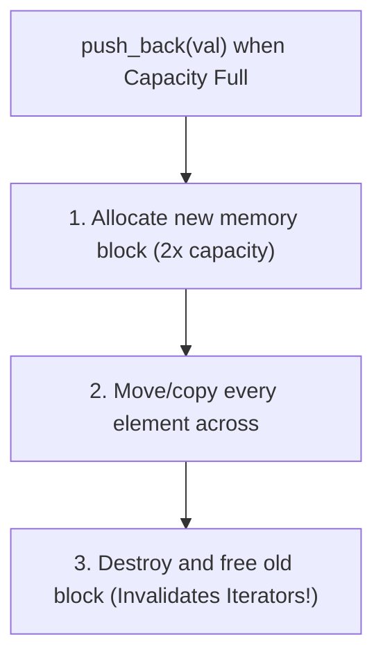
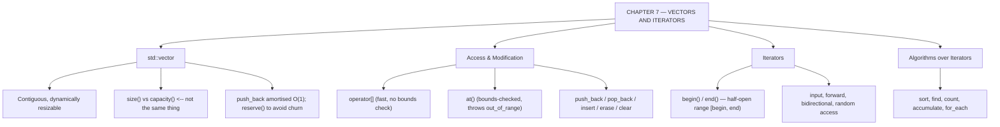

# C++ - CHAPTER 7
## Modern Data Structures: Vectors and Iterators

> “A vector is an array that has learned to grow, and paid for the lesson with one pointer indirection.” — A First Lesson in Dynamic Containers

### Learning Objectives
By the end of this chapter, you will be able to:
* Master dynamic resizing using `std::vector`.
* Differentiate between a vector's size and its capacity.
* Safely manipulate vector elements using `push_back`, `pop_back`, `.at()`, and `.insert()`.
* Navigate collections using Iterators and standard STL algorithms (`std::sort`, `std::find`).
* Optimize performance using memory pre-allocation (`reserve`).

---

### Introduction
In Chapter 4, you learned about `std::array`, which is fantastic for fixed-size lists. But what happens in the real world when you don't know how many items a user will enter? A shopping cart, a high-score leaderboard, or a database of users must be able to grow and shrink dynamically at runtime. In older languages like C, you had to manually calculate bytes, allocate raw memory blocks, and risk catastrophic buffer overflows. Modern C++ solves this elegantly with the `std::vector`—the absolute workhorse of the Standard Template Library (STL).

### Why This Topic Matters
If you rely solely on fixed-size arrays, your software is rigid and brittle. `std::vector` provides a dynamically resizing array that manages its own Heap memory automatically. Understanding how vectors handle capacity behind the scenes separates engineers who write code that merely works from engineers who write high-performance, lag-free software.

---

### Chapter Roadmap
* Concept 1: Dynamic Arrays (`std::vector`)
* Concept 2: Modifying and Accessing Vectors
* Concept 3: Iterators and Algorithms
* Concept 4: Multidimensional Vectors and Performance
* Learning Support Elements
* Debugging and Problem Solving
* Practical Application & Mini Project
* Practice and Evaluation
* Chapter Conclusion

---

> [!NOTE]
> **Real-Life Analogy: The Expanding Bookshelf**
> A raw array is a bookshelf built into the wall: exactly twelve slots, decided when the house was built, and if you buy a thirteenth book you have a problem. A `std::vector` is a free-standing shelf with a policy: when it fills up, the shop delivers a larger shelf, the entire collection is carried across in order, and the old shelf is taken away.
> 
> That move is why `push_back` is described as amortised constant time. Most insertions are instant. Occasionally one insertion triggers the whole relocation. Because the new shelf is typically double the size, those expensive moves become exponentially rarer, and the average cost per book stays flat. `reserve()` is telephoning ahead to say 'I will need space for a thousand books' so the relocation never happens at all.
> 
> It is also why a pointer to a book's old position can become worthless: after relocation the books physically live somewhere else. That is iterator invalidation. An iterator is a bookmark that knows how to advance to the next book; `begin()` is the first slot and `end()` is the empty space just past the last one — which is exactly why comparing against `end()` means 'not found' rather than pointing at a real element.

---

### Real-World Applications

| Domain | How this chapter's ideas appear in practice |
| :--- | :--- |
| **Machine Learning** | Feature matrices are stored as contiguous vectors precisely because contiguous memory is what lets SIMD and cache prefetching do their work. |
| **Game Development** | Entity component systems store components in flat vectors so that iterating an entire system is a single linear cache-friendly sweep. |
| **Databases** | Row batches and result sets are vectors; `reserve()` is called with the estimated cardinality to avoid mid-query reallocation. |
| **Networking** | Packet buffers are vectors of bytes; capacity management directly determines allocation churn under load. |
| **Finance** | Time-series price data is held contiguously so that rolling-window algorithms stay within L1 and L2 cache. |
| **Robotics** | Point clouds from LiDAR arrive as large vectors that are transformed in place by standard algorithms. |

---

### Core Learning Sections

#### CONCEPT 1: Dynamic Arrays (`std::vector`)
*Sub-topics Covered: 7.1 What is a Vector?, 7.2 Dynamic Resizing, 7.3 Capacity vs Size, 7.4 Vector Initialization*

**Intuitive Explanation:** Think of a standard array as a fixed-size shipping container. Once it's full, you can't squeeze another item inside. A `std::vector` is a magical expanding container. If you try to put a 6th item into a vector that currently holds 5, it automatically builds a brand-new, larger container elsewhere in the warehouse, copies all your old items over, throws away the old container, and safely adds your new item.

##### 7.1 What is a Vector? & 7.2 Dynamic Resizing
`std::vector` is a sequence container that encapsulates dynamic size arrays. It is stored contiguously in memory, meaning its elements sit right next to each other in RAM, making index lookups blazing fast ($O(1)$ time complexity).

##### 7.3 Capacity vs. Size
* **Size:** The exact number of elements currently stored in the vector.
* **Capacity:** The total amount of memory the vector has currently reserved on the Heap before it needs to ask for more. Capacity is always greater than or equal to Size.

##### 7.4 Vector Initialization
```cpp
#include <vector>
std::vector<int> v1;                 // Empty vector
std::vector<int> v2 = {1, 2, 3, 4}; // Initialized vector
std::vector<int> v3(5, 100);        // 5 elements, all initialized to 100
```



---

#### CONCEPT 2: Modifying and Accessing Vectors
*Sub-topics Covered: 7.5 Element Access ([] vs .at()), 7.6 Adding and Removing Elements, 7.7 Range-Based Loops with Vectors*

##### 7.5 Element Access (`[]` vs `.at()`)
You can access elements using standard brackets `vec[i]` or the bounds-safe method `vec.at(i)`. Always prefer `.at()` when safety matters, as it throws an exception if you go out of bounds instead of corrupting memory.

##### 7.6 Adding and Removing Elements
* `push_back(val)`: Adds an item to the very end of the vector ($O(1)$ amortized).
* `pop_back()`: Removes the final item from the vector.
* `insert(pos, val)` & `erase(pos)`: Inserts/removes elements at a specific position ($O(N)$ due to element shifting).

##### 7.7 Range-Based Loops with Vectors
```cpp
for (const auto& element : vector_name) {
    // processes every element sequentially
}
```

##### Code Example: Dynamic Scoreboard
```cpp
#include <iostream>
#include <vector>

int main() {
    // 7.4: Initializing a dynamic vector
    std::vector<int> scores = {85, 90, 78};

    // 7.6: Adding elements dynamically
    scores.push_back(95); // Adds to the end
    scores.push_back(88);

    std::cout << "Initial Vector Size:     " << scores.size() << "\n";
    std::cout << "Initial Vector Capacity: " << scores.capacity() << "\n";

    // 7.5: Safe element access
    std::cout << "First score: " << scores.at(0) << "\n";
    std::cout << "Last score:  " << scores.at(scores.size() - 1) << "\n";

    // 7.7: Range-based for loop traversal
    std::cout << "All Scores:  ";
    for (const auto& score : scores) {
        std::cout << score << " ";
    }
    std::cout << "\n";

    // 7.6: Removing the last element
    scores.pop_back();
    std::cout << "Size after pop_back: " << scores.size() << "\n";
    return 0;
}
```

##### Expected Output:
```text
Initial Vector Size:     5
Initial Vector Capacity: 6 (Note: capacity can vary depending on compiler implementation)
First score: 85
Last score:  88
All Scores:  85 90 78 95 88 
Size after pop_back: 4
```

---

#### CONCEPT 3: Iterators and Algorithms
*Sub-topics Covered: 7.8 What is an Iterator?, 7.9 begin() and end(), 7.10 Basic STL Algorithms (std::sort, std::find)*

**Intuitive Explanation:** An **Iterator** is a generalized pointer. While raw pointers work on standard memory, iterators are custom objects designed specifically to walk through standard library containers like vectors, maps, or lists. Think of an iterator as a bookmark that moves step-by-step through your vector.

##### 7.8 & 7.9 `begin()` and `end()`
* `vec.begin()`: Returns an iterator pointing directly to the *first* element of the vector.
* `vec.end()`: Returns an iterator pointing to the memory slot *just past the final element* (half-open range `[begin, end)`).

##### 7.10 Basic STL Algorithms
* `std::sort(vec.begin(), vec.end());`: Sorts the vector in ascending order.
* `std::find(vec.begin(), vec.end(), target);`: Searches for a specific value.

##### Code Example: Sorting and Searching
```cpp
#include <iostream>
#include <vector>
#include <algorithm> // Required for std::sort and std::find

int main() {
    std::vector<int> numbers = {42, 10, 55, 3, 19};

    // 7.10: Sorting the vector using iterators
    std::sort(numbers.begin(), numbers.end());

    std::cout << "Sorted Numbers: ";
    for (int n : numbers) {
        std::cout << n << " ";
    }
    std::cout << "\n";

    // 7.10: Finding an element
    int target = 55;
    auto it = std::find(numbers.begin(), numbers.end(), target);
    if (it != numbers.end()) {
        std::cout << "Found " << target << " in the vector!\n";
    } else {
        std::cout << target << " not found.\n";
    }

    return 0;
}
```

##### Expected Output:
```text
Sorted Numbers: 3 10 19 42 55 
Found 55 in the vector!
```

---

#### CONCEPT 4: Multidimensional Vectors and Performance
*Sub-topics Covered: 7.11 2D Vectors, 7.12 Memory Reallocation (reserve)*

##### 7.11 2D Vectors
```cpp
std::vector<std::vector<int>> grid(rows, std::vector<int>(cols, 0));
```

##### 7.12 Memory Reallocation (`reserve`)
If you know you are going to add 1,000 items, calling `vec.reserve(1000);` upfront forces the vector to allocate all that memory once, completely bypassing expensive mid-operation reallocations.

---

### Learning Support Elements

> [!TIP]
> **Tips: Pre-allocating with `reserve()`**
> If you know approximately how many elements your vector will hold, call `vec.reserve(expected_size)` immediately after creation to avoid sequential memory reallocation penalties.

> [!NOTE]
> **Important Notes: Contiguous Memory Storage**
> A `std::vector` guarantees that its elements are stored contiguously in physical RAM (back-to-back), making vectors fully compatible with legacy C-style functions using `vec.data()`.

> [!WARNING]
> **Warnings: Iterator Invalidation**
> Modifying a vector's structure (by calling `push_back`, `insert`, or `erase`) can trigger a memory reallocation or shift elements. When this happens, any existing iterators, pointers, or references pointing to elements in that vector become immediately invalid.

#### Common Misconceptions
* **Misconception:** "Calling `vec.clear()` frees the vector's memory back to the Operating System."
* **Reality:** `clear()` sets the vector's size to 0, but its capacity remains unchanged. To truly free memory, use `shrink_to_fit()`.

#### Best Practices
* **Pass Vectors by Reference:** Never pass a `std::vector` to a function by value. Always pass by reference (`std::vector<int>& vec`) or const reference (`const std::vector<int>& vec`).
* **Use `.at()` for Safety:** Prefer `.at()` over `[]` when working with untrusted indices.

---

### Debugging and Problem Solving

#### Runtime Error: Iterator Invalidation
* **Cause:** You are looping through a vector using an iterator or reference, and inside the loop, you call `vec.push_back()`. If that insertion triggers a capacity reallocation, the vector moves to a new location on the Heap, rendering your iterator dangling.
* **Fix:** Never modify a vector's structure while actively iterating through it unless using iterator values returned by functions like `erase()`.

---

### Practical Application & Mini Project

#### Mini Project: Student Grade Management System
This project integrates `std::vector`, dynamic resizing, `push_back`, iterators, and `.at()` safety checks into an academic tracking system.

```cpp
#include <iostream>
#include <vector>
#include <algorithm>
#include <numeric>
#include <format>

class Gradebook {
private:
    std::vector<double> grades;
public:
    void AddGrade(double grade) {
        if (grade >= 0.0 && grade <= 100.0) {
            grades.push_back(grade);
            std::cout << std::format("Added grade: {:.1f}\n", grade);
        } else {
            std::cerr << "Invalid grade ignored.\n";
        }
    }

    void DisplayStats() const {
        if (grades.empty()) {
            std::cout << "No grades recorded yet.\n";
            return;
        }
        double sum = std::accumulate(grades.begin(), grades.end(), 0.0);
        double average = sum / grades.size();
        auto [min_it, max_it] = std::minmax_element(grades.begin(), grades.end());

        std::cout << "\n--- Gradebook Statistics ---\n";
        std::cout << std::format("Total Students: {}\n", grades.size());
        std::cout << std::format("Class Average:  {:.2f}\n", average);
        std::cout << std::format("Lowest Grade:   {:.1f}\n", *min_it);
        std::cout << std::format("Highest Grade:  {:.1f}\n", *max_it);
    }
};

int main() {
    Gradebook my_class;
    my_class.AddGrade(88.5);
    my_class.AddGrade(92.0);
    my_class.AddGrade(79.5);
    my_class.AddGrade(95.0);
    my_class.AddGrade(64.0);
    my_class.DisplayStats();
    return 0;
}
```

##### Expected Output:
```text
Added grade: 88.5
Added grade: 92.0
Added grade: 79.5
Added grade: 95.0
Added grade: 64.0

--- Gradebook Statistics ---
Total Students: 5
Class Average:  83.80
Lowest Grade:   64.0
Highest Grade:  95.0
```

---

### Practice and Evaluation

#### Quick Check Questions
* What is the difference between a vector's size and its capacity?
* Why is calling `push_back()` generally fast, while inserting an element at index 0 is slow?
* What does `vec.begin()` return?
* Why should you call `reserve()` if you know the final size of a vector beforehand?

#### Coding Exercises
* Write a program that asks the user to enter 5 integers, stores them in a `std::vector`, sorts them using `std::sort`, and prints the sorted list.
* Create a vector of strings representing grocery items. Use a range-based `for` loop to print them, then use `.at()` to access the second item safely.

#### Interview Questions & Answers

1. **(Junior) What is the difference between `std::vector` and a built-in C-style array?**
   * **Answer:** C-style arrays are fixed in size, decay into raw pointers, and provide no bounds checking. `std::vector` is a dynamic container that manages its own Heap memory, automatically resizes, and provides safe element access via `.at()`.

2. **(Junior) What happens to a vector's capacity when you call `clear()`?**
   * **Answer:** `clear()` sets the vector's size to 0 and destroys all elements, but it does not alter the capacity.

3. **(Mid-Level) How does `std::vector` manage its memory behind the scenes when it runs out of capacity?**
   * **Answer:** When a vector's size meets its capacity and a new element is added, it allocates a new contiguous block of memory on the Heap (typically double its previous capacity), moves existing elements, and frees the old block.

4. **(Mid-Level) Explain the time complexity of `push_back()` on a `std::vector`.**
   * **Answer:** The amortized time complexity of `push_back()` is $O(1)$ (constant time) because capacity grows geometrically.

5. **(Mid-Level) What is iterator invalidation, and what causes it?**
   * **Answer:** Iterator invalidation occurs when an operation modifies the structure or memory location of a container, causing existing iterators to point to freed or incorrect memory locations.

6. **(Senior) When should you use `std::vector` versus other STL containers like `std::list` or `std::deque`?**
   * **Answer:** `std::vector` should be the default container because its contiguous memory layout maximizes CPU cache locality.

7. **(Senior) What is the difference between `vector::capacity()` and `vector::shrink_to_fit()`?**
   * **Answer:** `capacity()` returns allocated storage space. `shrink_to_fit()` requests reducing capacity to match current size.

8. **(Senior) Why does `std::vector<bool>` behave differently than other vectors?**
   * **Answer:** `std::vector<bool>` is a space-optimized specialization where each boolean is packed into a single bit rather than an entire byte.

9. **(Senior) How do you safely remove an element from a vector while iterating through it?**
   * **Answer:** Use the iterator returned by the `erase()` method: `it = vec.erase(it);`.

10. **(Senior) Explain how move semantics (introduced in C++11) revolutionized how `std::vector` handles reallocation.**
    * **Answer:** Move semantics allow vectors to steal internal resources of temporary objects during reallocation instead of performing expensive deep copies.

---

### Chapter Conclusion
`std::vector` is the cornerstone of modern C++ data handling. It bridges the gap between the speed of contiguous memory arrays and the flexibility of dynamic sizing.

#### Key Takeaways
* **Default Container:** Always reach for `std::vector` first when designing data collections.
* **Pre-allocate:** Use `reserve()` when dealing with large datasets to eliminate costly reallocations.
* **Safety First:** Use `.at()` instead of `[]` when bounds checking is required.
* **Iterators:** Use standard iterators and algorithms (`std::sort`, `std::find`) to write expressive, high-performance code.

#### What to Learn Next
In **Chapter 8**, we will explore **Advanced Templates and the Standard Template Library (STL)**, where you will learn how to write your own generic functions and classes.

---

### Progressive Code Examples: Four Tiers

#### TIER 1 · BEGINNER
##### A Container That Grows
**Goal:** Store an unknown number of values without deciding the size in advance.

```cpp
#include <iostream>
#include <vector>

int main() {
    std::vector<int> marks;
    marks.push_back(78);
    marks.push_back(91);
    marks.push_back(65);

    std::cout << "count : " << marks.size() << '\n';
    for (int m : marks) std::cout << m << ' ';
    std::cout << "\nfirst : " << marks.front()
              << "\nlast  : " << marks.back() << '\n';
    return 0;
}
```

##### Expected Output
```text
count : 3
78 91 65 
first : 78
last  : 65
```

> **What this tier adds:** Baseline. No size was declared anywhere, and no memory was managed by hand.

---

#### TIER 2 · INTERMEDIATE
##### Watching Reallocation Happen
**Goal:** Make capacity growth visible, then eliminate it with reserve.

```cpp
#include <iostream>
#include <vector>

void grow(bool useReserve) {
    std::vector<int> v;
    if (useReserve) v.reserve(16);

    std::size_t lastCap = v.capacity();
    int reallocations = 0;

    for (int i = 0; i < 16; ++i) {
        v.push_back(i);
        if (v.capacity() != lastCap) {
            std::cout << "  size " << v.size()
                      << " -> capacity " << v.capacity() << '\n';
            lastCap = v.capacity();
            ++reallocations;
        }
    }
    std::cout << "  reallocations: " << reallocations << "\n\n";
}

int main() {
    std::cout << "without reserve:\n"; grow(false);
    std::cout << "with reserve(16):\n"; grow(true);
    return 0;
}
```

##### Expected Output
```text
without reserve:
  size 1 -> capacity 1
  size 2 -> capacity 2
  size 3 -> capacity 4
  size 5 -> capacity 8
  size 9 -> capacity 16
  reallocations: 5

with reserve(16):
  reallocations: 0
```

> **What this tier adds:** Separates size from capacity concretely, and shows that reserve turns five reallocations plus five element migrations into zero.

---

#### TIER 3 · ADVANCED
##### Iterators, Algorithms, and the Erase-Remove Idiom
**Goal:** Stop writing loops that the library already wrote correctly.

```cpp
#include <iostream>
#include <vector>
#include <algorithm>
#include <numeric>

int main() {
    std::vector<int> v{45, 12, 78, 12, 90, 33, 12, 67};

    std::sort(v.begin(), v.end());
    std::cout << "sorted   : "; for (int x : v) std::cout << x << ' ';

    const auto it = std::find(v.begin(), v.end(), 90);
    std::cout << "\nfound90  : " << (it != v.end() ? "yes" : "no");
    std::cout << "\nat index : " << std::distance(v.begin(), it);

    const int sum = std::accumulate(v.begin(), v.end(), 0);
    const auto above50 = std::count_if(v.begin(), v.end(),
                                       [](int x) { return x > 50; });
    std::cout << "\nsum      : " << sum << "\ncount>50 : " << above50;

    // erase-remove: remove() only shuffles; erase() actually shrinks
    v.erase(std::remove(v.begin(), v.end(), 12), v.end());
    std::cout << "\nno 12s   : "; for (int x : v) std::cout << x << ' ';
    std::cout << "\nsize     : " << v.size() << '\n';
    return 0;
}
```

##### Expected Output
```text
sorted   : 12 12 12 33 45 67 78 90 
found90  : yes
at index : 7
sum      : 349
count>50 : 3
no 12s   : 33 45 67 78 90 
size     : 5
```

> **What this tier adds:** Introduces the half-open range convention, comparison against end() for 'not found', and the erase-remove idiom — remove alone changes nothing about size, which surprises almost everyone once.

---

#### TIER 4 · PROFESSIONAL
##### A Cache-Friendly Matrix
**Goal:** Store two-dimensional data as one contiguous block instead of a vector of vectors.

```cpp
#include <iostream>
#include <vector>
#include <stdexcept>

class Matrix {
public:
    Matrix(std::size_t rows, std::size_t cols)
        : rows_{rows}, cols_{cols}, data_(rows * cols, 0.0) {}

    double& operator()(std::size_t r, std::size_t c) {
        return data_[index(r, c)];
    }
    double operator()(std::size_t r, std::size_t c) const {
        return data_[index(r, c)];
    }

    std::size_t rows() const { return rows_; }
    std::size_t cols() const { return cols_; }
private:
    std::size_t index(std::size_t r, std::size_t c) const {
        if (r >= rows_ || c >= cols_) throw std::out_of_range("Matrix index");
        return r * cols_ + c; // ROW-MAJOR: rows are contiguous
    }
    std::size_t rows_, cols_;
    std::vector<double> data_; // ONE allocation, not rows_ of them
};

int main() {
    Matrix m{3, 4};
    for (std::size_t r = 0; r < m.rows(); ++r)
        for (std::size_t c = 0; c < m.cols(); ++c)
            m(r, c) = static_cast<double>(r * 10 + c);

    for (std::size_t r = 0; r < m.rows(); ++r) {
        for (std::size_t c = 0; c < m.cols(); ++c) std::cout << m(r, c) << '\t';
        std::cout << '\n';
    }
    return 0;
}
```

##### Expected Output
```text
0	1	2	3	
10	11	12	13	
20	21	22	23	
```

> **What this tier adds:** One allocation instead of four, guaranteed contiguity, bounds checking in one place, and a natural (r, c) syntax via operator(). Iterating rows in order now walks memory in order, which is what the prefetcher is built for.

---

### Common Mistakes and How to Fix Them

| The mistake | Why it happens | What you see (class) | The fix |
| :--- | :--- | :--- | :--- |
| **Holding an iterator across a `push_back`** | The container is the same object, so it feels stable | Crash or corrupt data after reallocation *(UNDEFINED)* | Re-acquire iterators after any insertion, or `reserve()` in advance |
| **Using `operator[]` on an index that may not exist** | `at()` feels slower and more verbose | Silent out-of-bounds read *(UNDEFINED)* | Use `at()` wherever the index is not provably valid |
| **Assuming `remove()` shrinks the container** | The name says remove | `size()` is unchanged *(LOGIC)* | The erase-remove idiom: `v.erase(std::remove(...), v.end())` |
| **Confusing `size()` with `capacity()`** | Both report a count | `reserve()` appears to do nothing *(LOGIC)* | `size` is elements present; `capacity` is space available before reallocation |
| **Erasing inside a range-based `for` loop** | It reads naturally | Undefined behaviour mid-iteration *(UNDEFINED)* | Use the erase-remove idiom, or an explicit iterator loop with the returned iterator |
| **Using `vector<vector<T>>` for a numeric matrix** | It maps directly onto the mathematical notation | Poor cache behaviour on large data *(PERFORMANCE)* | One flat vector with `r * cols + c` index arithmetic |

---

### Chapter Mind Map



---

> [!TIP]
> **Prepare for your Chapter Exam!**
> You have completed reading Chapter 7. Head to the **Take Chapter Quiz** assessment below to test your knowledge and unlock Chapter 8!
