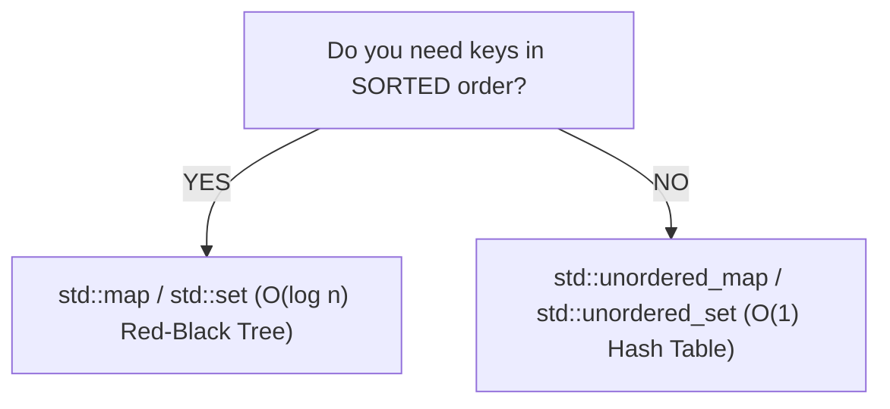
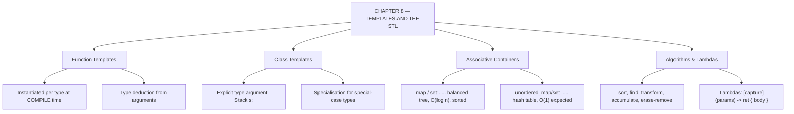

# C++ - CHAPTER 8
## Advanced Templates and the Standard Template Library

> “Write the algorithm once. Let the compiler write the fifty versions you would otherwise have typed by hand.” — A First Lesson in Generic Programming

### Learning Objectives
By the end of this chapter, you will be able to:
* Write and instantiate Function Templates and Class Templates.
* Understand template type deduction and non-type template parameters.
* Navigate advanced STL associative containers (`std::map`, `std::unordered_map`, `std::set`).
* Utilize Lambda expressions and modern STL algorithms (`std::for_each`, `std::transform`).

---

### Introduction
Imagine writing a function to find the maximum of two integers. Then, you need another function for floats, another for doubles, and another for custom student objects. Writing identical logic four times is tedious and a maintenance nightmare. C++ solves this through **Templates**—the foundation of generic programming. Templates allow you to write code blueprints that adapt to any data type automatically. Combined with the Standard Template Library (STL), templates give you access to hyper-optimized containers and algorithms that form the backbone of modern systems engineering.

### Why This Topic Matters
Templates are how `std::vector` can hold integers, strings, or custom classes without rewriting code. Mastering templates and advanced STL components like `std::map` and Lambda expressions enables you to write highly reusable, type-safe, and expressive code.

---

### Chapter Roadmap
* Concept 1: Function Templates
* Concept 2: Class Templates
* Concept 3: STL Associative Containers
* Concept 4: Algorithms and Lambda Expressions
* Learning Support Elements
* Debugging and Problem Solving
* Practical Application & Mini Project
* Practice and Evaluation
* Chapter Conclusion

---

> [!NOTE]
> **Real-Life Analogy: The Cookie Cutter and the Dough**
> A template is not code. It is a cookie cutter — a shape from which real cookies are stamped. The cutter itself is never eaten. When you write `max<int>(a, b)`, the compiler presses the cutter into int-shaped dough and produces a genuine, fully typed function that is compiled and optimised exactly as if you had written it by hand. That is template instantiation, and it is why generic C++ carries no runtime dispatch cost.
> 
> It also explains why template error messages are so long: the compiler is not complaining about your cutter, it is complaining about the specific cookie it just tried to stamp, and it shows you the entire chain of stamping that led there.
> 
> The STL containers are the pantry. A vector is a numbered shelf. A map is a filing cabinet with alphabetically sorted labelled folders — finding a folder takes a few decisive steps rather than a scan of everything. An `unordered_map` is a cloakroom with numbered hooks and a hashing rule that computes your hook number directly, so retrieval is a single step on average. A set is a guest list that silently refuses duplicates. Algorithms such as sort and find are the kitchen staff: trained to work with any pantry that exposes the standard iterator handles.

---

### Real-World Applications

| Domain | How this chapter's ideas appear in practice |
| :--- | :--- |
| **Machine Learning** | Tensor libraries are template-heavy so the same operator code compiles for float, double and half precision with no runtime branching. |
| **Finance** | Order books use `std::map` keyed by price for automatically sorted price levels, and `unordered_map` keyed by order ID for $O(1)$ lookup. |
| **Browsers** | Style rule matching relies on hash containers to resolve selectors in constant expected time during layout. |
| **Databases** | Index structures and query operators are written generically over comparison and hashing traits. |
| **Game Development** | Resource caches are `unordered_map` from asset ID to loaded asset; the hash lookup happens once per frame per asset. |
| **Cyber Security** | Deduplicating observed hashes or IPs is a natural `std::unordered_set`, chosen for expected constant-time membership tests. |

---

### Core Learning Sections

#### CONCEPT 1: Function Templates
*Sub-topics Covered: 8.1 What are Templates?, 8.2 Writing Function Templates, 8.3 Template Argument Deduction*

**Intuitive Explanation:** Templates are a mechanism where the compiler generates code dynamically based on the data types you pass. It is "compile-time polymorphism"—the compiler writes the overloaded functions for you behind the scenes.

##### 8.1 & 8.2 Writing Function Templates
You prefix a function definition with `template <typename T>` (or `template <class T>`), where `T` acts as a placeholder for any data type.

##### Syntax
```cpp
template <typename T>
T Max(T a, T b) {
    return (a > b) ? a : b;
}
```

##### 8.3 Template Argument Deduction
When you call a function template like `Max(10, 20);`, the compiler looks at the arguments and automatically deduces that `T` is an `int`. You do not need to specify `Max<int>(10, 20)` manually unless type ambiguity occurs.

---

#### CONCEPT 2: Class Templates
*Sub-topics Covered: 8.4 Writing Class Templates, 8.5 Non-type Template Parameters, 8.6 Template Specialization*

##### 8.4 Writing Class Templates
Just like functions, entire classes can be parameterized (`std::vector<T>` is a class template).

##### Syntax
```cpp
template <typename T>
class Box {
private:
    T item;
public:
    void SetItem(T val) { item = val; }
    T GetItem() const { return item; }
};
```

##### 8.5 Non-type Template Parameters
Templates can accept literal values (like integers) in addition to types (`template <typename T, int Size>`), which is how `std::array<int, 5>` fixes its size at compile time.

##### 8.6 Template Specialization
You can write custom behavior for a specific data type when generic template logic is inadequate.

---

#### CONCEPT 3: STL Associative Containers
*Sub-topics Covered: 8.7 STL Architecture Overview, 8.8 std::map, 8.9 std::unordered_map, 8.10 std::set*

##### 8.7 STL Architecture Overview
The STL consists of three core components: **Containers** (data structures), **Iterators** (bridges), and **Algorithms** (operations).

##### 8.8 `std::map`
An associative container that stores key-value pairs sorted automatically by key using a balanced binary search tree ($O(\log N)$ lookup).

##### 8.9 `std::unordered_map`
A hash table-based key-value store offering average $O(1)$ constant-time lookups (unsorted order).

##### 8.10 `std::set`
A collection of unique, automatically sorted elements.



---

#### CONCEPT 4: Algorithms and Lambda Expressions
*Sub-topics Covered: 8.11 Standard Algorithms, 8.12 Lambda Expressions, 8.13 Lambda Captures*

##### 8.11 Standard Algorithms & 8.12 Lambda Expressions
Functions like `std::for_each` or `std::transform` apply operations across container ranges cleanly. A Lambda is an inline anonymous function object (`[capture](parameters) { body }`).

##### 8.13 Lambda Captures
* `[=]`: Captures local variables by value.
* `[&]`: Captures local variables by reference.

##### Code Example: Templates and Maps
```cpp
#include <iostream>
#include <map>
#include <string>

// 8.2: Function Template
template <typename T>
T FindMax(T a, T b) {
    return (a > b) ? a : b;
}

int main() {
    // Testing template with integers and doubles
    std::cout << "Max int:    " << FindMax(10, 20) << "\n";
    std::cout << "Max double: " << FindMax(5.5, 3.2) << "\n";

    // 8.8: std::map usage (Key-Value lookup)
    std::map<std::string, int> inventory;
    inventory["Swords"] = 5;
    inventory["Shields"] = 2;

    // Traversing a map using C++17 structured bindings
    for (const auto& [item, count] : inventory) {
        std::cout << item << ": " << count << "\n";
    }
    return 0;
}
```

##### Expected Output:
```text
Max int:    20
Max double: 5.5
Shields: 2
Swords: 5
```

---

### Learning Support Elements

> [!TIP]
> **Tips: Header Inclusion for Templates**
> Template definitions must be fully visible to the compiler at the point of instantiation. Therefore, template implementations must be written entirely inside header files.

> [!NOTE]
> **Important Notes: Compilation Overhead**
> Templates expand your binary code size (code bloat). If you instantiate `FindMax` for `int`, `double`, and `float`, the compiler generates three distinct machine-code functions behind the scenes.

> [!WARNING]
> **Warnings: Unordered Map Collision Risks**
> `std::unordered_map` relies on hashing functions. In security-sensitive environments, malicious inputs can trigger worst-case hash collisions ($O(N)$). Use `std::map` when predictable worst-case performance is required.

#### Common Misconceptions
* **Misconception:** "Templates are compiled once into a generic format, like generics in Java or C#."
* **Reality:** C++ templates are *not* compiled until they are actually instantiated with concrete types.

---

### Debugging and Problem Solving

#### Compiler Error: Massive Template Diagnostic Trace
* **Message:** `error: no matching function for call to...` followed by 50 lines of complex template expansion traces.
* **Cause:** You passed a type into a template function or class that does not support internal operations required by the template.
* **Fix:** Read the *very first line* of the error message to find the call site, then verify that your custom data type overloads necessary operators.

---

### Practical Application & Mini Project

#### Mini Project: Generic Cache System using Templates and Maps
This project builds a type-safe generic cache using class templates and `std::unordered_map`.

```cpp
#include <iostream>
#include <unordered_map>
#include <string>
#include <format>

template <typename K, typename V>
class SimpleCache {
private:
    std::unordered_map<K, V> cache_store;
public:
    void Insert(const K& key, const V& value) {
        cache_store[key] = value;
    }

    bool Get(const K& key, V& out_value) const {
        auto it = cache_store.find(key);
        if (it != cache_store.end()) {
            out_value = it->second;
            return true;
        }
        return false;
    }
};

int main() {
    SimpleCache<std::string, int> score_cache;
    score_cache.Insert("Alice", 95);
    score_cache.Insert("Bob", 82);

    int score = 0;
    if (score_cache.Get("Alice", score)) {
        std::cout << std::format("Cached score for Alice: {}\n", score);
    } else {
        std::cout << "Key not found in cache.\n";
    }
    return 0;
}
```

##### Expected Output:
```text
Cached score for Alice: 95
```

---

### Practice and Evaluation

#### Quick Check Questions
* What keyword is used to declare a function template?
* What is the time complexity of a key lookup in a `std::map` versus a `std::unordered_map`?
* Why must template definitions be placed in header files?
* What is a lambda expression?

#### Coding Exercises
* Write a function template named `PrintArray` that takes a pointer to an array and its size, and prints all elements.
* Create a `std::map<int, std::string>` representing error codes and descriptions. Insert 3 items and write a lookup loop.

#### Interview Questions & Answers

1. **(Junior) What is a template in C++?**
   * **Answer:** A template is a blueprint for writing generic functions and classes, allowing code to operate with different data types without being rewritten for each type.

2. **(Junior) What is the difference between `std::map` and `std::unordered_map`?**
   * **Answer:** `std::map` is implemented as a balanced binary search tree ($O(\log N)$ lookups). `std::unordered_map` is implemented as a hash table (average $O(1)$ constant-time lookups).

3. **(Mid-Level) How does template instantiation work at compile time?**
   * **Answer:** When the compiler encounters a template call with concrete types, it performs "template instantiation," generating a specific, concrete copy of the function or class for those exact types.

4. **(Mid-Level) What is a Lambda capture clause, and what is the difference between capturing by value `[=]` and by reference `[&]`?**
   * **Answer:** The capture clause allows a lambda expression to access variables from its surrounding scope. Capturing by value `[=]` copies the variables, while capturing by reference `[&]` grants direct access.

5. **(Mid-Level) Explain Template Specialization.**
   * **Answer:** Template specialization allows you to provide a custom implementation for a template when instantiated with a specific data type.

6. **(Senior) What are non-type template parameters?**
   * **Answer:** Parameters in a template declaration that accept constant values (such as integers) known at compile time, rather than data types.

7. **(Senior) What is SFINAE (Substitution Failure Is Not An Error)?**
   * **Answer:** A core C++ template rule stating that if an invalid type substitution occurs during template overload resolution, the compiler discards that overload from the candidate set instead of throwing a hard error.

8. **(Senior) Why can code bloat occur with heavy template usage?**
   * **Answer:** Because the compiler generates a separate physical copy of a template's machine code for every distinct data type it is instantiated with.

9. **(Senior) How do container allocators work in the STL?**
   * **Answer:** STL containers use allocator objects (like `std::allocator`) to abstract memory allocation and deallocation strategies.

10. **(Senior) What is a dependent name in templates?**
    * **Answer:** A dependent name is a symbol inside a template whose meaning depends on a template parameter, requiring the `typename` keyword to inform the parser that it is a type.

---

### Chapter Conclusion
Templates and the STL represent the pinnacle of C++'s generic programming capabilities. By mastering function and class templates, associative containers, and lambdas, you write expressive, high-performance software.

#### Key Takeaways
* **Generic Blueprint:** Use templates to avoid repetitive type-specific code duplication.
* **Container Choice:** Choose `std::unordered_map` for speed, or `std::map` when sorted keys are required.
* **Lambdas:** Leverage lambda expressions to write concise, inline operations for STL algorithms.

#### What to Learn Next
In **Chapter 9**, we will explore **Exception Handling and Robust Error Management**.

---

### Progressive Code Examples: Four Tiers

#### TIER 1 · BEGINNER
##### One Function, Every Type
**Goal:** Write the algorithm once instead of once per type.

```cpp
#include <iostream>
#include <string>

template <typename T>
T largest(T a, T b) {
    return (a > b) ? a : b;
}

int main() {
    std::cout << largest(3, 9) << '\n';                // T = int
    std::cout << largest(2.5, 1.75) << '\n';           // T = double
    std::cout << largest<std::string>("apple", "pear") << '\n';
    return 0;
}
```

##### Expected Output
```text
9
2.5
pear
```

> **What this tier adds:** Baseline. The compiler stamps out three separate real functions; none of them costs anything extra at run time.

---

#### TIER 2 · INTERMEDIATE
##### A Class Template
**Goal:** Make a whole data structure generic, not just a function.

```cpp
#include <iostream>
#include <vector>
#include <stdexcept>
#include <string>

template <typename T>
class Stack {
public:
    void push(T value) { items_.push_back(std::move(value)); }
    T pop() {
        if (items_.empty()) throw std::out_of_range("pop from empty stack");
        T top = std::move(items_.back());
        items_.pop_back();
        return top;
    }
    const T& top() const {
        if (items_.empty()) throw std::out_of_range("top of empty stack");
        return items_.back();
    }
    bool empty() const { return items_.empty(); }
    std::size_t size() const { return items_.size(); }
private:
    std::vector<T> items_;
};

int main() {
    Stack<int> numbers;
    numbers.push(10); numbers.push(20); numbers.push(30);
    std::cout << "popped: " << numbers.pop() << " left: " << numbers.size() << '\n';

    Stack<std::string> words;
    words.push("beta"); words.push("gamma");
    std::cout << "top   : " << words.top() << '\n';
    return 0;
}
```

##### Expected Output
```text
popped: 30 left: 2
top   : gamma
```

> **What this tier adds:** Class templates require the type argument explicitly. Note pop() moves rather than copies the returned element — the technique of Chapter 12, used here in advance.

---

#### TIER 3 · ADVANCED
##### Ordered Versus Hashed
**Goal:** Count words with both associative container families and observe the difference.

```cpp
#include <iostream>
#include <map>
#include <unordered_map>
#include <sstream>
#include <string>

int main() {
    const std::string text = "the quick brown fox jumps over the lazy dog the fox";
    std::map<std::string, int> ordered;
    std::unordered_map<std::string, int> hashed;

    std::istringstream in{text};
    for (std::string w; in >> w; ) { ++ordered[w]; ++hashed[w]; }

    std::cout << "std::map (sorted by key, O(log n) lookup)\n";
    for (const auto& [word, count] : ordered)
        std::cout << "  " << word << " : " << count << '\n';

    std::cout << "\nunordered_map lookup of \"fox\": "
              << hashed.at("fox") << " (O(1) expected)\n";
    std::cout << "buckets: " << hashed.bucket_count() << '\n';
    return 0;
}
```

##### Expected Output
```text
std::map (sorted by key, O(log n) lookup)
  brown : 1
  dog : 1
  fox : 2
  jumps : 1
  lazy : 1
  over : 1
  quick : 1
  the : 3

unordered_map lookup of "fox": 2 (O(1) expected)
buckets: 13
```

> **What this tier adds:** Introduces structured bindings, the default-construct behaviour of operator[] on maps, and the concrete reason to choose one container family over the other.

---

#### TIER 4 · PROFESSIONAL
##### A Constrained Generic Algorithm
**Goal:** Make the template state its own requirements so misuse fails early and readably.

```cpp
#include <iostream>
#include <vector>
#include <string>
#include <concepts>
#include <ranges>

template <typename T>
concept Summable = requires(T a, T b) {
    { a + b } -> std::convertible_to<T>;
};

template <std::ranges::input_range R>
    requires Summable<std::ranges::range_value_t<R>>
auto total(const R& range) {
    std::ranges::range_value_t<R> acc{};
    for (const auto& x : range) acc = acc + x;
    return acc;
}

int main() {
    std::vector<int> nums{1, 2, 3, 4, 5};
    std::vector<std::string> parts{"Mod", "ern", " C++"};

    std::cout << total(nums)  << '\n';
    std::cout << total(parts) << '\n';
    return 0;
}
```

##### Expected Output
```text
15
Modern C++
```

> **What this tier adds:** C++20 concepts replace a hundred lines of instantiation-chain errors with a single sentence naming the unsatisfied requirement. This is what makes generic C++ maintainable at team scale.

---

### Common Mistakes and How to Fix Them

| The mistake | Why it happens | What you see (class) | The fix |
| :--- | :--- | :--- | :--- |
| **Putting a template definition in a `.cpp` file** | It is what you do for ordinary functions | `undefined reference at instantiation` *(LINKER)* | Define templates in the header; there is nothing to compile until instantiated |
| **Reading only the first line of a template error** | The message is enormous | Time lost on the wrong line *(WORKFLOW)* | Read the last line first; it names the actual unsatisfied requirement |
| **Using `operator[]` on a map to check for a key** | It reads like a lookup | The key is silently inserted with a default value *(LOGIC)* | Use `.find()`, `.contains()` or `.at()` for read-only access |
| **Choosing `unordered_map` when ordered output is needed** | It is described as faster | Iteration order is unspecified and varies *(LOGIC)* | Use `std::map` when you need sorted iteration |
| **Assuming `unordered_map` is always $O(1)$** | That is the headline complexity | Pathological slowdowns with a poor hash *(PERFORMANCE)* | It is $O(1)$ expected, $O(N)$ worst case; verify the hash quality for your keys |
| **Writing a raw loop where an algorithm exists** | Loops feel more explicit | Off-by-one and boundary bugs *(LOGIC)* | Prefer `std::find`, `std::count_if`, `std::transform`, `std::accumulate` |

---

### Chapter Mind Map



---

> [!TIP]
> **Prepare for your Chapter Exam!**
> You have completed reading Chapter 8. Head to the **Take Chapter Quiz** assessment below to test your knowledge and unlock Chapter 9!
