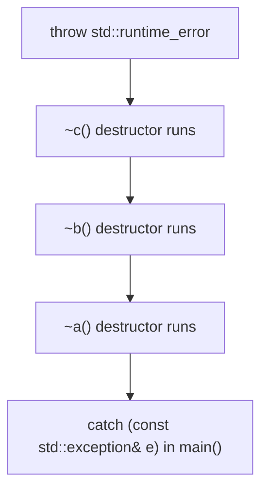
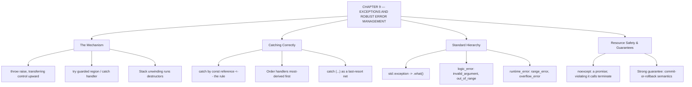

# C++ - CHAPTER 9
## Exception Handling and Robust Error Management

> “Error handling is not the code you write after the program works. It is what decides whether it ever really did.” — A First Lesson in Robustness

### Learning Objectives
By the end of this chapter, you will be able to:
* Master the mechanics of throwing and catching exceptions using `try`, `catch`, and `throw`.
* Understand stack unwinding and how it interacts with resource management (RAII).
* Navigate the standard C++ exception hierarchy (`std::exception`, `std::runtime_error`, `std::out_of_range`).
* Implement exception safety guarantees and use the `noexcept` specifier to optimize performance.

---

### Introduction
Even the most carefully written code encounters unexpected conditions: a file fails to open, a network connection drops mid-transfer, or a user inputs negative numbers where only positive values are allowed. In older paradigms like C, errors were signaled using fragile status return codes (like returning -1 or `nullptr`). These codes are easily ignored by developers, leading to silent failures and catastrophic system crashes. Modern C++ provides a structured, fail-safe mechanism to handle unexpected runtime anomalies: **Exceptions**.

### Why This Topic Matters
Writing software that works under ideal conditions is easy; writing software that survives hostile environments is what separates amateurs from professionals. Exception handling allows you to cleanly separate your core business logic from your error-recovery logic. It guarantees that when a critical fault occurs, execution pauses, resources are cleaned up safely, and the error is routed to a handler capable of resolving it.

---

### Chapter Roadmap
* Concept 1: Basic Exception Handling (`try`, `catch`, `throw`)
* Concept 2: Catching Exceptions by Reference and Polymorphism
* Concept 3: Standard Exception Hierarchy
* Concept 4: Resource Safety and Exceptions (RAII & `noexcept`)
* Learning Support Elements
* Debugging and Problem Solving
* Practical Application & Mini Project
* Practice and Evaluation
* Chapter Conclusion

---

> [!NOTE]
> **Real-Life Analogy: The Building's Fire Alarm**
> Imagine a fault detected on the fourteenth floor. The technician there cannot decide whether to evacuate the whole building — that is not their authority. So they pull the alarm: a signal that travels upward until it reaches someone whose job it is to respond. That is `throw`, and the search up the call stack for a matching handler.
> 
> Crucially, as the alarm propagates, every floor it passes performs its own orderly shutdown: machines stop, gas valves close, doors seal. In C++ this is stack unwinding, and the destructor of every local object between the `throw` and the `catch` is guaranteed to run. That guarantee is precisely why RAII and exceptions are two halves of one idea — the alarm cleans up after itself only because each floor knew how to shut itself down.
> 
> Catching by value is photocopying the alarm report and reading the copy — you lose everything specific to the original, which is exactly the slicing problem. Catching by `const` reference reads the original report, which is why it is the rule rather than a preference. And a destructor that throws during an evacuation is a second fire started by the fire brigade: the standard's answer is that the program terminates.

---

### Real-World Applications

| Domain | How this chapter's ideas appear in practice |
| :--- | :--- |
| **Databases** | A failed transaction must roll back completely; RAII guard objects perform the rollback automatically when an exception unwinds past them. |
| **Finance** | A partially applied trade is worse than a rejected one, so strong exception guarantees are a written requirement in trading systems. |
| **Cloud Computing** | Service handlers translate exceptions into HTTP status codes at exactly one boundary rather than checking return codes at every layer. |
| **Operating Systems** | Kernel and hard-real-time code frequently disables exceptions entirely, which is why `noexcept` and error codes still matter. |
| **Game Development** | Engines often disable exceptions in the hot rendering path but use them freely in asset loading and tooling. |
| **Networking** | Connection failures are exceptional, not expected, and are naturally expressed by throwing rather than by threading error codes through ten call levels. |

---

### Core Learning Sections

#### CONCEPT 1: Basic Exception Handling (`try`, `catch`, `throw`)
*Sub-topics Covered: 9.1 Error Handling Paradigms, 9.2 The throw Keyword, 9.3 try and catch Blocks*

**Intuitive Explanation:** Think of exception handling like a safety net in a circus. The `try` block is the tightrope walker performing normal operations. If something goes wrong, the performer throws a signal (`throw`). The execution immediately abandons its normal path and drops down into the safety net (`catch`), where workers catch the issue and handle it before anyone gets hurt.

##### 9.1 Error Handling Paradigms
Traditional error codes require manual checking after every single function call, cluttering code. Exceptions invert this: code runs normally until an error occurs, at which point an exception object is thrown, bypassing all intermediate code until a matching catch handler is found.

##### 9.2 The `throw` Keyword
When a function detects an unrecoverable state, it uses `throw` to transmit an error object.

##### Syntax
```cpp
throw std::runtime_error("Critical failure detected!");
```

##### 9.3 `try` and `catch` Blocks
```cpp
try {
    // Code that might fail
} catch (const std::runtime_error& e) {
    // Recovery logic
}
```



---

#### CONCEPT 2: Catching Exceptions by Reference and Polymorphism
*Sub-topics Covered: 9.4 Catching by Reference, 9.5 Catching Base and Derived Exceptions, 9.6 Catch-All Handlers (...)*

##### 9.4 Catching by Reference
Always catch exceptions by `const` reference (e.g., `catch (const std::exception& e)`). Catching by value causes "object slicing," where derived exception details are stripped away, losing valuable diagnostic information.

##### 9.5 Catching Base and Derived Exceptions
Because standard exceptions follow an object-oriented hierarchy, a base class catch block can intercept any derived exception. Therefore, you must always order your catch blocks from **most specific to most generic** (derived classes first, base classes last).

##### 9.6 Catch-All Handlers (`...`)
```cpp
catch (...) { /* Handle unknown exceptions */ }
```

---

#### CONCEPT 3: Standard Exception Hierarchy
*Sub-topics Covered: 9.7 The <stdexcept> Library, 9.8 std::exception, 9.9 Common Standard Exceptions*

##### 9.8 `std::exception`
The base class for all standard library runtime exceptions. It features a `virtual` method called `what()` which returns a descriptive C-style error message string.

##### 9.9 Common Standard Exceptions
* `std::out_of_range`: Thrown by container `.at()` methods when an index is invalid.
* `std::invalid_argument`: Thrown when an invalid argument is passed to a function.
* `std::bad_alloc`: Thrown when the Heap runs out of memory during a `new` allocation.

---

#### CONCEPT 4: Resource Safety and Exceptions (RAII & `noexcept`)
*Sub-topics Covered: 9.10 Stack Unwinding, 9.11 The noexcept Specifier, 9.12 Exception Safety Guarantees*

##### 9.10 Stack Unwinding
When an exception is thrown, C++ begins walking backward up the Call Stack, destroying all local stack variables in active functions until it finds a matching catch block.

##### 9.11 The `noexcept` Specifier
If you know a function will never throw an exception, mark it `noexcept`. This tells the compiler to optimize machine code generation by omitting costly exception-tracking tables.

##### 9.12 Exception Safety Guarantees
* **Basic Guarantee:** No resource leaks, valid state preserved.
* **Strong Guarantee:** Commit-or-rollback semantics (operation succeeds or leaves state unchanged).
* **No-throw Guarantee:** Guaranteed never to throw (`noexcept`).

##### Code Example: Safe Division and Exception Propagation
```cpp
#include <iostream>
#include <stdexcept>

double Divide(double numerator, double denominator) {
    if (denominator == 0.0) {
        throw std::invalid_argument("Error: Division by zero is undefined.");
    }
    return numerator / denominator;
}

int main() {
    double num = 10.0;
    double denom = 0.0;

    try {
        std::cout << "Attempting division...\n";
        double result = Divide(num, denom);
        std::cout << "Result: " << result << "\n"; // Skipped if exception occurs
    } 
    catch (const std::invalid_argument& e) {
        // Specific catch handler
        std::cerr << "Caught Invalid Argument: " << e.what() << "\n";
    } 
    catch (const std::exception& e) {
        // General fallback for other standard exceptions
        std::cerr << "Caught Standard Exception: " << e.what() << "\n";
    }

    std::cout << "Program continued normally after error recovery.\n";
    return 0;
}
```

##### Expected Output:
```text
Attempting division...
Caught Invalid Argument: Error: Division by zero is undefined.
Program continued normally after error recovery.
```

---

### Learning Support Elements

> [!TIP]
> **Tips: Catch by Reference Always**
> Always catch standard exceptions by const reference (`const std::exception&`). Catching by value discards polymorphism and prevents derived error messages from displaying correctly via `what()`.

> [!NOTE]
> **Important Notes: Constructors and Exceptions**
> Constructors do not have return values, making exceptions the *only* proper way for a constructor to signal a failure during object instantiation. If a constructor throws an exception, the object's memory is safely cleaned up, and no destructor is called.

> [!WARNING]
> **Warnings: Exceptions in Destructors**
> Never allow an exception to escape a destructor during stack unwinding. If an exception is thrown while another exception is already being handled, C++ invokes `std::terminate()`, instantly crashing your application. Destructors should always be marked `noexcept`.

#### Common Misconceptions
* **Misconception:** "Exception handling is free until an error actually occurs."
* **Reality:** While the happy path has minimal overhead in modern compilers, maintaining stack unwinding tables and exception propagation logic increases binary executable size.

#### Best Practices
* **Use RAII for Resource Management:** Always use smart pointers (`std::unique_ptr`) and STL containers so that stack unwinding automatically cleans up Heap memory when exceptions occur.
* **Order Catch Blocks Correctly:** Place specialized derived exception handlers *above* generalized base exception handlers.

---

### Debugging and Problem Solving

#### Runtime Error: Uncaught Exception Termination
* **Message:** `terminate called after throwing an instance of 'std::out_of_range'`
* **Cause:** An exception was thrown inside your code, but no matching catch block existed higher up the Call Stack to handle it.
* **Fix:** Wrap risky code calls in a `try`/`catch` block, or add a global catch-all handler (`catch (...)`) at the top of `main()`.

---

### Practical Application & Mini Project

#### Mini Project: Robust Configuration File Parser
This project integrates standard exceptions, input validation, custom error messages, and safe recovery workflows.

```cpp
#include <iostream>
#include <string>
#include <stdexcept>
#include <format>

class ConfigParser {
public:
    static int ParsePort(const std::string& config_line) {
        size_t delimiter_pos = config_line.find('=');
        if (delimiter_pos == std::string::npos) {
            throw std::invalid_argument(std::format("Malformed config line (Missing '='): '{}'", config_line));
        }
        std::string key = config_line.substr(0, delimiter_pos);
        std::string val_str = config_line.substr(delimiter_pos + 1);

        if (key != "PORT") {
            throw std::runtime_error(std::format("Unknown configuration key encountered: '{}'", key));
        }

        try {
            int port = std::stoi(val_str);
            if (port < 1024 || port > 65535) {
                throw std::out_of_range("Port number must be between 1024 and 65535.");
            }
            return port;
        } catch (const std::invalid_argument&) {
            throw std::invalid_argument(std::format("Failed to convert port value to integer: '{}'", val_str));
        }
    }
};

int main() {
    std::cout << "=== CONFIGURATION PARSER SYSTEM ===\n\n";
    std::string test_configs[] = {
        "TIMEOUT=30",         // Will trigger unknown key error
        "PORT=invalid_port",  // Will trigger conversion error
        "PORT=90000",         // Will trigger out-of-range error
        "PORT=8080"           // Valid configuration
    };

    for (const auto& line : test_configs) {
        std::cout << std::format("Processing: '{}'\n", line);
        try {
            int active_port = ConfigParser::ParsePort(line);
            std::cout << std::format(" -> SUCCESS: Active Port set to {}\n\n", active_port);
        } catch (const std::out_of_range& e) {
            std::cerr << std::format(" -> RANGE ERROR: {}\n\n", e.what());
        } catch (const std::invalid_argument& e) {
            std::cerr << std::format(" -> FORMAT ERROR: {}\n\n", e.what());
        } catch (const std::exception& e) {
            std::cerr << std::format(" -> GENERAL ERROR: {}\n\n", e.what());
        }
    }

    std::cout << "Parser system shut down gracefully.\n";
    return 0;
}
```

##### Expected Output:
```text
=== CONFIGURATION PARSER SYSTEM ===

Processing: 'TIMEOUT=30'
 -> GENERAL ERROR: Unknown configuration key encountered: 'TIMEOUT'

Processing: 'PORT=invalid_port'
 -> FORMAT ERROR: Failed to convert port value to integer: 'invalid_port'

Processing: 'PORT=90000'
 -> RANGE ERROR: Port number must be between 1024 and 65535.

Processing: 'PORT=8080'
 -> SUCCESS: Active Port set to 8080

Parser system shut down gracefully.
```

---

### Practice and Evaluation

#### Quick Check Questions
* What three keywords form the core syntax of C++ exception handling?
* Why must exceptions always be caught by reference rather than by value?
* What happens if an exception is thrown inside a destructor during stack unwinding?
* What is the purpose of the `noexcept` specifier?

#### Coding Exercises
* Write a function that accepts an age as an integer. If the age is less than 0 or greater than 120, throw a `std::out_of_range` exception. Call this function inside a `try`/`catch` block in `main`.
* Create a dynamic vector allocation wrapped in a `try` block that intentionally attempts to access an out-of-bounds index via `.at()`, and catch the resulting exception.

#### Interview Questions & Answers

1. **(Junior) What is an exception in C++, and how does it differ from a return error code?**
   * **Answer:** An exception is a runtime error signal that interrupts normal program flow, forcing execution to jump upward through the call stack until a matching catch handler is found. Unlike return status codes, exceptions cannot be silently bypassed.

2. **(Junior) Why should you catch exceptions by `const` reference?**
   * **Answer:** Catching by reference prevents object slicing, preserving polymorphism so derived exception details and virtual method calls (like `what()`) remain intact.

3. **(Junior) What is Stack Unwinding?**
   * **Answer:** Stack unwinding is the process where C++ automatically cleans up local stack frames when an exception is thrown, invoking destructors of all fully constructed local objects in reverse order.

4. **(Mid-Level) Explain the order in which catch blocks must be written when handling multiple exception types.**
   * **Answer:** Catch blocks must be ordered strictly from most specific (derived) to most general (base).

5. **(Mid-Level) What is the purpose of the `noexcept` specifier?**
   * **Answer:** `noexcept` is a contractual guarantee stating that a function will never throw an exception, enabling compiler machine code optimization.

6. **(Mid-Level) What is a catch-all handler, and when should it be used?**
   * **Answer:** A catch-all handler uses an ellipsis (`catch (...)`) to intercept any thrown exception regardless of type, typically used at top system boundaries to log unexpected failures.

7. **(Senior) What are the three exception safety guarantees defined in C++?**
   * **Answer:** Basic Guarantee (no leaks, valid state), Strong Guarantee (commit-or-rollback), and No-Throw Guarantee (`noexcept`).

8. **(Senior) Why is throwing an exception inside a destructor considered dangerous?**
   * **Answer:** If an exception is thrown while stack unwinding is already in progress due to a previous exception, C++ cannot handle two simultaneous active exceptions and instantly calls `std::terminate()`.

9. **(Senior) How does RAII (Resource Acquisition Is Initialization) interact with exception handling?**
   * **Answer:** RAII binds resources to object lifespans on the Stack. During stack unwinding, destructors run automatically, guaranteeing resources are released cleanly without memory leaks.

10. **(Senior) What is the performance overhead of using exceptions versus return codes?**
    * **Answer:** On the happy path, modern compilers optimize exceptions with zero or near-zero performance overhead. However, when an exception is thrown, stack unwinding is computationally expensive.

---

### Chapter Conclusion
Exception handling provides a robust, fail-safe architecture for managing runtime errors in modern C++. By separating error detection from recovery logic using `try`, `catch`, and `throw`, your code remains clean and maintainable.

#### Key Takeaways
* **Fail Safely:** Use exceptions for exceptional, unrecoverable runtime anomalies.
* **Reference Catching:** Always catch standard exceptions by `const` reference.
* **RAII Integration:** Rely on smart pointers and standard containers to ensure leak-free stack unwinding during exceptions.
* **Specificity First:** Order multiple catch blocks from most specific derived types to most general base types.

#### What to Learn Next
In **Chapter 10**, we will explore **File I/O and Streams**, learning how to read and write persistent data to disk safely.

---

### Progressive Code Examples: Four Tiers

#### TIER 1 · BEGINNER
##### Catching a Failure
**Goal:** Report an impossible request instead of producing nonsense.

```cpp
#include <iostream>
#include <stdexcept>

double divide(double a, double b) {
    if (b == 0.0) throw std::invalid_argument("division by zero");
    return a / b;
}

int main() {
    try {
        std::cout << divide(10, 2) << '\n';
        std::cout << divide(10, 0) << '\n'; // never printed
        std::cout << "unreachable\n";
    }
    catch (const std::invalid_argument& e) {
        std::cout << "error: " << e.what() << '\n';
    }
    std::cout << "program continues\n";
    return 0;
}
```

##### Expected Output
```text
5
error: division by zero
program continues
```

> **What this tier adds:** Baseline. Control jumped from inside divide() straight to the handler, skipping the rest of the try block entirely.

---

#### TIER 2 · INTERMEDIATE
##### Your Own Exception Type
**Goal:** Carry structured information, not just a message string.

```cpp
#include <iostream>
#include <stdexcept>
#include <string>

class ValidationError : public std::runtime_error {
public:
    ValidationError(std::string field, std::string reason)
        : std::runtime_error("validation failed: " + field + " (" + reason + ")"),
          field_{std::move(field)}, reason_{std::move(reason)} {}

    const std::string& field()  const noexcept { return field_; }
    const std::string& reason() const noexcept { return reason_; }
private:
    std::string field_, reason_;
};

void registerUser(const std::string& email, int age) {
    if (email.find('@') == std::string::npos)
        throw ValidationError("email", "missing @");
    if (age < 13)
        throw ValidationError("age", "below minimum");
}

int main() {
    try { registerUser("ananya.example.com", 25); }
    catch (const ValidationError& e) {
        std::cout << e.what() << '\n';
        std::cout << "  highlight field: " << e.field() << '\n';
    }
    catch (const std::exception& e) { // broader net, listed AFTER
        std::cout << "unexpected: " << e.what() << '\n';
    }
    return 0;
}
```

##### Expected Output
```text
validation failed: email (missing @)
  highlight field: email
```

> **What this tier adds:** Deriving from std::runtime_error means existing catch(const std::exception&) handlers still work. Note the handler ordering: most derived first, or the general one would swallow it.

---

#### TIER 3 · ADVANCED
##### Exception Safety Under Unwinding
**Goal:** Prove that only objects with destructors survive an exception intact.

```cpp
#include <iostream>
#include <mutex>
#include <memory>
#include <stdexcept>

std::mutex gMutex;

void safeVersion() {
    std::lock_guard<std::mutex> guard(gMutex);
    std::cout << "  safe: lock acquired\n";
    throw std::runtime_error("boom");
    // ~lock_guard runs during unwinding -> the mutex is released
}

int main() {
    try { safeVersion(); }
    catch (const std::exception& e) { std::cout << "  caught: " << e.what() << '\n'; }

    // Proof: if the mutex had leaked, this would deadlock instead of printing.
    if (gMutex.try_lock()) {
        std::cout << "mutex was correctly released\n";
        gMutex.unlock();
    } else {
        std::cout << "mutex LEAKED — a later lock would deadlock\n";
    }
    return 0;
}
```

##### Expected Output
```text
  safe: lock acquired
  caught: boom
mutex was correctly released
```

> **What this tier adds:** Generalises the leak lesson beyond memory: mutexes, file handles, sockets and transactions all leak the same way. RAII is the single mechanism that covers all of them.

---

#### TIER 4 · PROFESSIONAL
##### The Strong Exception Guarantee
**Goal:** Make an operation either fully succeed or leave the object exactly as it was.

```cpp
#include <iostream>
#include <vector>
#include <string>
#include <stdexcept>

class Inventory {
public:
    // STRONG guarantee: validate and build aside, then commit with a no-throw swap.
    void addAllStrong(const std::vector<std::string>& items) {
        std::vector<std::string> candidate = items_; // work on a copy
        candidate.reserve(items_.size() + items.size());
        for (const auto& i : items) {
            if (i.empty()) throw std::invalid_argument("empty item name");
            candidate.push_back(i);
        }
        items_.swap(candidate); // swap on vector is noexcept: the commit point
    }

    std::size_t size() const noexcept { return items_.size(); }
private:
    std::vector<std::string> items_;
};

int main() {
    const std::vector<std::string> batch{"bolt", "nut", "", "washer"};
    Inventory strong;

    try { strong.addAllStrong(batch); } catch (...) {}
    std::cout << "strong size after failure: " << strong.size() << '\n';
    return 0;
}
```

##### Expected Output
```text
strong size after failure: 0
```

> **What this tier adds:** Demonstrates the copy-and-swap discipline: do everything that can throw before touching the real state, then commit with an operation that cannot throw.

---

### Common Mistakes and How to Fix Them

| The mistake | Why it happens | What you see (class) | The fix |
| :--- | :--- | :--- | :--- |
| **Catching by value** | It matches how parameters are usually written | Object slicing loses the derived type *(LOGIC)* | Always catch `(const std::exception& e)` |
| **Ordering catch blocks base-first** | The general case feels like a sensible default | The derived handler is unreachable *(COMPILER / LOGIC)* | Order handlers most derived first |
| **Letting an exception escape a destructor** | The cleanup code itself can fail | `std::terminate` during unwinding *(RUNTIME)* | Catch and log inside the destructor; never let it propagate |
| **Using exceptions for ordinary control flow** | They are a convenient non-local jump | Slow, and hides real failures *(PERFORMANCE)* | Reserve exceptions for exceptional conditions; return a value otherwise |
| **Marking a function `noexcept` without checking** | It looks like a helpful optimisation hint | Immediate termination if it throws *(RUNTIME)* | Only promise `noexcept` when nothing it calls can throw |
| **Swallowing exceptions with an empty `catch(...)`** | It makes the crash stop | Silent data loss, undiagnosable bugs *(LOGIC)* | Log and rethrow, or handle meaningfully — never discard silently |

---

### Chapter Mind Map



---

> [!TIP]
> **Prepare for your Chapter Exam!**
> You have completed reading Chapter 9. Head to the **Take Chapter Quiz** assessment below to test your knowledge and unlock Chapter 10!
