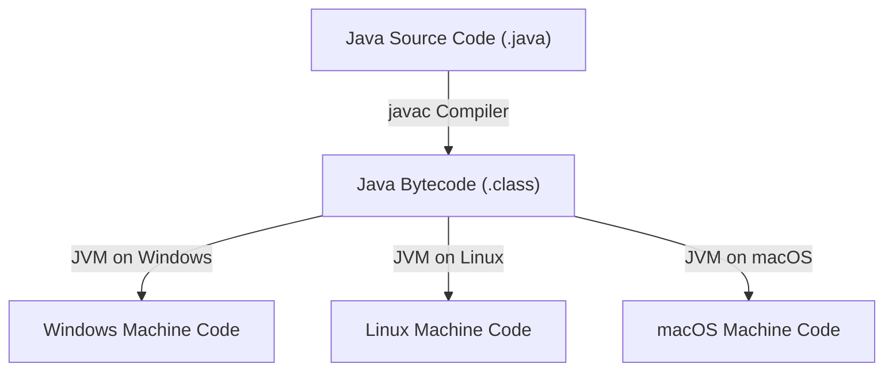

# JAVA - CHAPTER 1
## Introduction to Java

> "Write Once, Run Anywhere." — The Core Philosophy of Java

### By the End of This Chapter, You Will Be Able To:
* Explain what Java is and articulate its core "Write Once, Run Anywhere" (WORA) philosophy.
* Identify the major application domains where Java is heavily utilized in modern enterprise software.
* Differentiate Java's primary architectural features including platform independence, robustness, security, and multi-threading.
* Understand the role of Garbage Collection and Automatic Memory Management in Java.
* Compare Java with other programming languages across key capabilities.

---

### 1. What is Java?

Java is a high-level, class-based, object-oriented programming language designed to have as few implementation dependencies as possible. Developed by Sun Microsystems under the leadership of James Gosling and released in 1995, Java has evolved into one of the most widely used enterprise programming languages worldwide (now maintained by Oracle Corporation).



#### The WORA Philosophy
The defining architectural breakthrough of Java was **Write Once, Run Anywhere (WORA)**. Unlike traditional languages such as C or C++ that compile directly into platform-specific machine binaries (e.g., `.exe` for Windows or ELF binaries for Linux), Java code compiles into an intermediate representation called **Bytecode** (`.class` files). Bytecode is machine-independent instructions executed by the **Java Virtual Machine (JVM)**.

> [!NOTE]
> **Key Insight — Platform Independence**
> The Java Compiler (`javac`) produces platform-independent bytecode. The JVM translates bytecode into host machine instructions at runtime. Thus, Java code is platform-independent, while the JVM implementation itself is platform-dependent.

---

### 2. Major Application Areas

Java's reliability, scalability, and security make it a dominant technology stack across diverse software sectors:

1. **Enterprise Applications (J2EE / Jakarta EE)**: Core banking systems, insurance platforms, ERP systems (SAP, Oracle Applications), and high-frequency trading platforms.
2. **Web Applications**: Scalable back-end microservices built using Spring Boot, Jakarta EE, Quarkus, and Micronaut.
3. **Android Mobile Development**: Android applications and APIs traditionally rely on Java runtime interfaces and modern Kotlin-Java interoperability.
4. **Big Data & Analytics**: Industry-standard data frameworks such as Apache Hadoop, Apache Spark, Apache Flink, and Apache Kafka are natively built in Java or Scala (JVM).
5. **Embedded Systems & IoT**: Smart cards, set-top boxes, industrial sensors, and robotics runtime environments.
6. **Scientific & High-Performance Computing**: Simulation tools, matrix algebra libraries, and bioinformatics applications.

---

### 3. Deep Dive into Primary Features

Java is often characterized by its 12 primary architectural characteristics:

| Feature | Description |
| :--- | :--- |
| **1. Simple** | Syntax is clean, modeled after C++, but removes prone-to-error constructs like explicit pointers and operator overloading. |
| **2. Object-Oriented** | Everything in Java revolves around Classes and Objects. Supports Abstraction, Encapsulation, Inheritance, and Polymorphism. |
| **3. Platform-Independent** | Source compiles to Bytecode which runs on any system equipped with a compatible JVM. |
| **4. Secured** | Runs inside a secure JVM sandbox environment with explicit Memory Access Controls and Type Safety checks. |
| **5. Robust** | Strongly typed language with strict compile-time checking, automatic memory management (Garbage Collection), and Exception Handling. |
| **6. Architecture-Neutral** | Fixed primitive data sizes across all platforms (e.g., `int` is always 32 bits, whether on 32-bit or 64-bit architecture). |
| **7. Portable** | Java bytecode can be transferred easily across network connections and executed without modification. |
| **8. High-Performance** | Uses Just-In-Time (JIT) compilers inside the JVM to compile hot bytecode fragments into native CPU instructions on the fly. |
| **9. Distributed** | Built-in capabilities for network programming, RMI (Remote Method Invocation), and distributed HTTP/gRPC services. |
| **10. Multi-threaded** | Native support for executing concurrent threads of execution, optimizing multi-core hardware processor utilization. |
| **11. Dynamic** | Supports dynamic loading of classes at runtime (`Class.forName()`) and runtime inspection via Reflection API. |
| **12. Interpreted & Compiled** | Combines static compilation (to Bytecode) with dynamic JIT interpretation/execution. |

> [!TIP]
> **Performance Optimization in Modern JVMs**
> While early versions of Java were labeled slow due to pure interpretation, modern JVMs utilize adaptive JIT compilation (C1 and C2 compilers, GraalVM) to achieve near-native execution performance.

---

### 4. Code Demonstration — First Look at Java

```java
public class FeatureDemo {
    public static void main(String[] args) {
        System.out.println("Welcome to KnowledgeStream AI Java Track!");
        
        // Demonstrating dynamic runtime inspection
        Runtime runtime = Runtime.getRuntime();
        long freeMemory = runtime.freeMemory() / (1024 * 1024);
        long totalMemory = runtime.totalMemory() / (1024 * 1024);
        int availableProcessors = runtime.availableProcessors();

        System.out.println("JVM Free Memory: " + freeMemory + " MB");
        System.out.println("JVM Total Memory: " + totalMemory + " MB");
        System.out.println("Available CPU Cores: " + availableProcessors);
    }
}
```

Output:
```text
Welcome to KnowledgeStream AI Java Track!
JVM Free Memory: 245 MB
JVM Total Memory: 512 MB
Available CPU Cores: 8
```

---

### 5. Visual Comparison — Java vs C++ vs Python

| Feature | Java | C++ | Python |
| :--- | :--- | :--- | :--- |
| **Execution Model** | Compiled to Bytecode + JIT | Compiled to Native Machine Code | Interpreted (CPython bytecode) |
| **Memory Management** | Automatic (Garbage Collector) | Manual (`new` / `delete`) | Automatic (Reference Counting + GC) |
| **Pointers** | Encapsulated (No direct pointer arithmetic) | Explicit Pointers supported | No explicit pointers |
| **Platform Dependency** | Platform-Independent (Requires JVM) | Platform-Dependent | Platform-Independent (Requires Interpreter) |
| **Type System** | Static & Strongly Typed | Static & Strongly Typed | Dynamic & Strongly Typed |

---

### ✏ Try It Yourself
1. Install JDK 17 or 21 (LTS version) on your machine.
2. Verify your installation by opening a terminal and running:
   ```bash
   java -version
   javac -version
   ```
3. What is the difference between source code (`.java`) and bytecode (`.class`)? Write down a 2-sentence explanation.

---

### Chapter Summary

#### Key Takeaways
* **Java** is a compiled, interpreted, object-oriented language engineered for security and portability.
* **Bytecode** allows Java applications to execute seamlessly on any system that has a compatible JVM.
* **Garbage Collection** eliminates manual pointer management, making Java applications highly robust against memory leaks and buffer overflows.
* **Java's Ecosystem** spans enterprise microservices, cloud software, big data systems, and mobile applications.

---

> [!TIP]
> **Prepare for your Chapter Exam!**
> You have completed reading Chapter 1. Head to the **Take Chapter Quiz** assessment below to test your knowledge and unlock Chapter 2!

