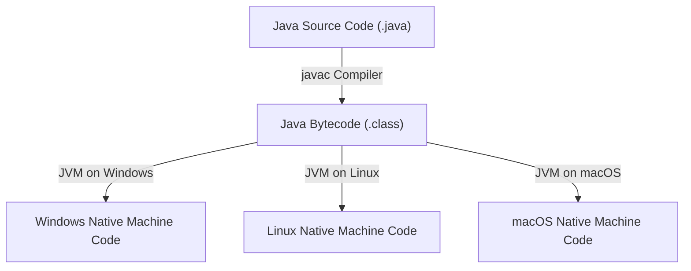
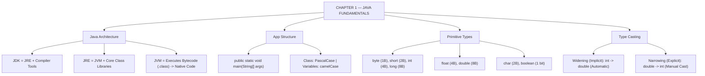

# JAVA - CHAPTER 1
## Introduction to Java and Fundamentals

> “Write Once, Run Anywhere.” — The Core Philosophy of Java

### Learning Objectives
By the end of this chapter, you will be able to:
* Understand the Java architecture (JDK, JRE, and JVM) and the compilation process.
* Write, compile, and execute a standard Java application with proper entry points.
* Master the 8 primitive data types and their strict memory footprints.
* Perform implicit (widening) and explicit (narrowing) type casting safely.
* Adopt industry-standard naming conventions and recognize reserved keywords.

---

### Introduction
Welcome to Java. For over two decades, Java has powered everything from enterprise banking backends and Android applications to Mars rovers and big data processing engines. Unlike languages that execute directly on hardware (like C++), Java introduces a revolutionary middleman: the **Java Virtual Machine (JVM)**. This allows you to write your code once on a Windows machine and run it flawlessly on a Linux server or a Mac without changing a single line. By learning Java, you are mastering the backbone of global enterprise software.

### Why This Topic Matters
Before writing complex algorithms or building web APIs, you must understand how Java actually runs. Grasping the difference between the JDK, JRE, and JVM prevents severe deployment headaches. Furthermore, understanding Java's strictly typed primitive variables and naming conventions ensures you write code that is safe, readable, and perfectly aligned with industry standards.

---

### Chapter Roadmap
* Concept 1: The Java Architecture (JDK, JRE, JVM)
* Concept 2: Application Structure and Syntax
* Concept 3: Primitive Data Types
* Concept 4: Type Casting
* Learning Support Elements
* Debugging and Problem Solving
* Practical Application & Mini Project
* Practice and Evaluation
* Chapter Conclusion

---

> [!NOTE]
> **Real-Life Analogy: The Translation Pair of Glasses**
> Imagine writing a book in English, but your readers only speak French, Spanish, and German. Instead of rewriting the book three times (the C++ compiled approach), you translate it once into a universal symbol language (**Bytecode**). You then give each reader a special translation pair of glasses (the **JVM**) that instantly turns those symbols into their native operating system language. 
> 
> The **JDK** is your writer's desk containing all the pen and paper tools to write the book. The **JRE** is the library building where readers can sit and read. The **JVM** is the translator inside the glasses doing the actual real-time translation.

---

### Real-World Applications

| Domain | How this chapter's ideas appear in practice |
| :--- | :--- |
| **Enterprise Backends** | Banking platforms use strict primitive types (`long` for monetary micro-units) to prevent rounding errors across microservices. |
| **Android Development** | Android apps compile Java source code into bytecode before executing on Dalvik/ART virtual machine runtimes. |
| **Cloud Systems** | Microservices packaged in Docker containers leverage Java's "Write Once, Run Anywhere" philosophy for seamless cloud deployments. |
| **Big Data (Hadoop/Spark)** | Large-scale data pipelines optimize RAM usage by understanding the exact memory footprint of raw primitives versus wrapped objects. |
| **Financial Trading** | High-frequency trading systems rely on explicit type casting and memory alignment to process market tick signals. |
| **Embedded Systems** | IoT sensors utilize lightweight JVMs to execute standardized control logic across diverse hardware chipsets. |

---

### Core Learning Sections

#### CONCEPT 1: The Java Architecture (JDK, JRE, JVM)
*Sub-topics Covered: 1.1 History and Philosophy, 1.2 The JDK, JRE, and JVM*

##### 1.1 History and Philosophy
Created by James Gosling in 1995 at Sun Microsystems, Java's guiding philosophy is **"Write Once, Run Anywhere" (WORA)**. It was designed to be robust, secure, and purely object-oriented, intentionally removing complex C++ features like manual memory pointers to prevent memory corruption and segmentation crashes.

##### 1.2 The JDK, JRE, and JVM
* **JVM (Java Virtual Machine)**: The engine that executes bytecode. It translates platform-independent Bytecode (`.class` files) into native machine instructions for your specific operating system.
* **JRE (Java Runtime Environment)**: The environment required to run Java applications. It contains the JVM and core class libraries (`JRE = JVM + Libraries`).
* **JDK (Java Development Kit)**: The complete toolkit required to write and build Java applications. It contains the JRE plus development tools like the compiler `javac` (`JDK = JRE + Tools`).



---

#### CONCEPT 2: Application Structure and Syntax
*Sub-topics Covered: 1.3 The main Method, 1.4 Naming Conventions*

##### 1.3 The `main` Method
Every standalone Java application must have a `public static void main(String[] args)` method. This is the exact entry point where the JVM begins executing code.
* `public`: Accessible by the JVM from outside the class scope.
* `static`: Can be invoked directly without instantiating an object of the class first.
* `void`: Indicates the method does not return any value to the caller.
* `String[] args`: Accepts command-line argument strings passed during launch.

##### 1.4 Naming Conventions
* **Classes**: PascalCase (e.g., `EmployeeDetails`, `SensorAnalyzer`).
* **Methods & Variables**: camelCase (e.g., `calculateSalary`, `accountBalance`).
* **Constants**: UPPER_SNAKE_CASE (e.g., `MAX_SPEED`, `DEFAULT_TIMEOUT`).

---

#### CONCEPT 3: Primitive Data Types
*Sub-topics Covered: 1.5 The 8 Primitive Types*

##### 1.5 The 8 Primitive Types
Java is strictly typed. You must declare the type and memory size of data before using it:

1. `byte`: 1 byte (8 bits, range: $-128$ to $127$)
2. `short`: 2 bytes (16 bits, range: $-32,768$ to $32,767$)
3. `int`: 4 bytes (32 bits, default choice for whole numbers)
4. `long`: 8 bytes (64 bits, requires `'L'` suffix, e.g., `100L`)
5. `float`: 4 bytes (32 bits, single-precision decimal, requires `'f'` suffix, e.g., `3.14f`)
6. `double`: 8 bytes (64 bits, double-precision decimal, default choice for floating-point)
7. `char`: 2 bytes (16-bit Unicode character, e.g., `'A'`)
8. `boolean`: 1 bit (`true` or `false`)

---

#### CONCEPT 4: Type Casting
*Sub-topics Covered: 1.6 Widening (Implicit), 1.7 Narrowing (Explicit)*

##### 1.6 Widening Casting (Implicit)
Converting a smaller data type to a larger data type. Java performs widening automatically because there is zero risk of data loss:
```java
int myInt = 9;
double myDouble = myInt; // Widening: int -> double (9.0)
```

##### 1.7 Narrowing Casting (Explicit)
Converting a larger data type to a smaller data type. Because this can truncate data (such as dropping decimal values), Java forces you to perform explicit narrowing using cast operators:
```java
double myDouble = 9.78;
int myInt = (int) myDouble; // Narrowing: double -> int (9)
```

##### Code Example: Fundamentals in Action
```java
public class Fundamentals {
    public static void main(String[] args) {
        // Concept 3: Primitive Types
        int userAge = 25;
        double accountBalance = 1500.75;
        boolean isActive = true;
        char grade = 'A';

        // Concept 4: Widening Casting (int to double)
        double ageAsDouble = userAge;

        // Concept 4: Narrowing Casting (double to int)
        int truncatedBalance = (int) accountBalance;

        // Output Formatting
        System.out.println("--- Java Fundamentals ---");
        System.out.println("Active Status: " + isActive);
        System.out.println("Grade: " + grade);
        System.out.println("Age as Double: " + ageAsDouble);
        System.out.println("Original Balance: $" + accountBalance);
        System.out.println("Truncated Balance: $" + truncatedBalance);
    }
}
```

##### Expected Output:
```text
--- Java Fundamentals ---
Active Status: true
Grade: A
Age as Double: 25.0
Original Balance: $1500.75
Truncated Balance: $1500
```

##### Line-by-Line Explanation:
* `public class Fundamentals`: Declares the public class. The source file must be named `Fundamentals.java`.
* `int userAge = 25;`: Allocates 4 bytes of memory to store a 32-bit integer.
* `double ageAsDouble = userAge;`: Automatically widens the 4-byte `int` into an 8-byte `double`, appending `.0`.
* `int truncatedBalance = (int) accountBalance;`: Explicitly casts the 8-byte `double` down to a 4-byte `int`, permanently truncating the `.75` fractional component.
* `System.out.println(...)`: Prints text and concatenated variables to the standard output console.

---

### Learning Support Elements

> [!TIP]
> **Tips: The Class/Filename Rule**
> In Java, if a class is marked `public`, the source file name **must** exactly match the class name including exact casing, followed by `.java`. For example, `public class InvoiceGenerator` must be saved in a file named `InvoiceGenerator.java`.

> [!NOTE]
> **Important Notes: Suffixes for `float` and `long`**
> By default, Java treats all decimal literals as `double` and all integer literals as `int`. If you want to explicitly define a `float` or a `long`, you must append an `f` or `L` suffix (e.g., `float pi = 3.14f;` and `long distance = 9876543210L;`).

> [!WARNING]
> **Warnings: Integer Division Truncation**
> If you divide two integers in Java (e.g., `5 / 2`), the result is truncated to an integer (`2`). To preserve decimal values (`2.5`), at least one operand must be a floating-point type (e.g., `5.0 / 2`).

#### Common Misconceptions
* **Misconception:** "Java and JavaScript are essentially the same language."
* **Reality:** They are completely unrelated. Java is a compiled, strictly typed, object-oriented systems language. JavaScript is an interpreted, dynamically typed scripting language designed originally for web browsers.

#### Best Practices
* **Use `double` Over `float`:** Unless you are working in extreme memory-constrained environments (like embedded sensors), always prefer `double` for decimal calculations to minimize precision loss.
* **Strict camelCase:** Always begin variable and method names with a lowercase letter to easily distinguish them from Class names.

---

### Debugging and Problem Solving

#### Compiler Error: `class [Name] is public, should be declared in a file named [Name].java`
* **Cause:** The public class name in your code does not match the `.java` filename.
* **Fix:** Rename the file to match the public class name exactly (case-sensitive).

#### Compiler Error: `incompatible types: possible loss of precision`
* **Cause:** Attempted to assign a larger/higher-precision type (e.g., `double`) to a smaller variable (e.g., `int`) without explicit casting.
* **Fix:** Apply explicit narrowing casting: `int x = (int) 5.99;`.

---

### Practical Application & Mini Project

#### Mini Project: Sensor Data Analyzer
This project simulates reading raw hardware sensor data, applying type casting transformations, and printing formatted diagnostic reports.

```java
public class SensorAnalyzer {
    public static void main(String[] args) {
        System.out.println("=== IOT SENSOR DIAGNOSTICS ===");

        // Simulating raw data from hardware sensors
        byte sensorId = 12;
        short uptimeMinutes = 3450;
        int packetCount = 890456;
        float preciseTemperature = 42.87f;
        double preciseVoltage = 112.456789;
        boolean isOnline = true;

        // Data transformations (Casting)
        // Widening: byte to int
        int idAsInt = sensorId;

        // Narrowing: double to int (losing decimal precision for UI)
        int displayVoltage = (int) preciseVoltage;

        // Narrowing: float to byte (truncates decimals and fits byte range)
        byte tempAsByte = (byte) preciseTemperature;

        System.out.println("\n--- Raw Sensor Data ---");
        System.out.println("Sensor ID: " + sensorId);
        System.out.println("Online Status: " + isOnline);
        System.out.println("Uptime (mins): " + uptimeMinutes);
        System.out.println("Packets Sent: " + packetCount);

        System.out.println("\n--- Transformed Data (Casting) ---");
        System.out.println("ID (Widened): " + idAsInt);
        System.out.println("Voltage (Truncated): " + displayVoltage + "V");
        System.out.println("Temp (Byte Cast): " + tempAsByte + "C");

        System.out.println("\nDiagnostics completed successfully.");
    }
}
```

##### Expected Output:
```text
=== IOT SENSOR DIAGNOSTICS ===

--- Raw Sensor Data ---
Sensor ID: 12
Online Status: true
Uptime (mins): 3450
Packets Sent: 890456

--- Transformed Data (Casting) ---
ID (Widened): 12
Voltage (Truncated): 112V
Temp (Byte Cast): 42C

Diagnostics completed successfully.
```

---

### Practice and Evaluation

#### Coding Exercises
* Write a program containing a `public class ProfilePrinter`. Declare variables for your name (`String`), age (`int`), and height in meters (`double`). Print them neatly formatted to the console.
* Write a Java program that declares a `double` variable with value `99.99`. Cast this value explicitly to a `byte`, an `int`, and a `long`, and print all three transformed values.

#### Interview Questions & Answers

1. **(Junior) Why is Java called platform-independent?**
   * **Answer:** Java code compiles into intermediate Bytecode (`.class` files) rather than OS-specific machine instructions. This bytecode runs on any system equipped with a compatible Java Virtual Machine (JVM).

2. **(Junior) What is the purpose of the `public static void main(String[] args)` method?**
   * **Answer:** It is the mandatory entry point of a standalone Java application. The JVM searches for this exact method signature to begin program execution.

3. **(Junior) What is the difference between Widening and Narrowing casting?**
   * **Answer:** Widening (implicit) casts a smaller type into a larger type (e.g., `int` to `double`) without data loss. Narrowing (explicit) casts a larger type into a smaller type (e.g., `double` to `int`), requiring explicit `(type)` syntax due to potential data truncation.

4. **(Mid-Level) Explain the internal architecture of the JVM.**
   * **Answer:** The JVM consists of three main subsystems: the **Class Loader** (loads, links, and initializes bytecode), **Runtime Data Areas** (allocates memory for Heap, Stack, Method Area, PC Registers), and the **Execution Engine** (interprets bytecode and uses the JIT Compiler for high-frequency hotspot optimization).

5. **(Mid-Level) Why doesn't Java support explicit memory pointers like C++?**
   * **Answer:** Java was designed for security and safety. Eliminating direct memory pointers prevents programmers from accessing unauthorized memory addresses, eliminating memory corruption, buffer overflows, and segmentation faults.

6. **(Mid-Level) What happens if your file is named `Test.java` but contains `public class App`?**
   * **Answer:** The Java compiler throws a fatal compilation error because Java strictly mandates that a `public` class must reside in a `.java` file with the exact matching name.

7. **(Senior) What is the Just-In-Time (JIT) compiler?**
   * **Answer:** The JIT compiler is part of the JVM Execution Engine. Instead of interpreting bytecode line-by-line, it monitors execution at runtime, identifies frequently executed "hotspot" methods, and compiles them directly into native CPU machine instructions for maximum speed.

8. **(Senior) How do `boolean` memory size requirements work under the hood in the JVM?**
   * **Answer:** While a `boolean` conceptually represents 1 bit, the JVM specification does not dictate an exact size. In standard JVMs (like HotSpot), an isolated `boolean` variable occupies 1 byte (8 bits) for memory alignment, while `boolean[]` arrays pack elements efficiently as 1 byte per element.

9. **(Senior) What are default values of primitive fields if declared as instance variables without initialization?**
   * **Answer:** Numeric primitives (`byte`, `short`, `int`, `long`, `float`, `double`) default to `0` or `0.0`. `char` defaults to `\u0000` (null character), and `boolean` defaults to `false`. Local variables inside methods receive no defaults and must be initialized before use.

10. **(Senior) What is the "Constant Pool" in Java memory architecture?**
    * **Answer:** The Constant Pool is a specialized memory region inside the Method Area (or Metaspace in Java 8+). It stores string literals and numeric constants, allowing the JVM to save RAM by sharing identical literal instances across the application.

---

### Chapter Conclusion
Chapter 1 has established the foundational bedrock of Java development. You now understand the layered architecture of the JDK, JRE, and JVM enabling the "Write Once, Run Anywhere" paradigm.

#### Key Takeaways
* **JVM Translation:** The JVM translates intermediate Bytecode into native machine instructions.
* **Strict File Naming:** A `public class Name` must always reside in `Name.java`.
* **Type Safety:** Java enforces explicit casting when narrowing data types to prevent accidental data loss.
* **Entry Signature:** `public static void main(String[] args)` is non-negotiable for standalone program execution.

#### What to Learn Next
Now that you can store primitive data safely in memory, you need to manipulate it. In **Chapter 2: Operators and Control Flow**, you will learn how to perform arithmetic operations, branch logic using `if-else` and `switch` statements, and automate tasks using loops.

---

### Progressive Code Examples: Four Tiers

#### TIER 1 · BEGINNER
##### Hello World and Basic Output
**Goal:** Create your first Java source file and verify compilation and execution.

```java
public class HelloWorld {
    public static void main(String[] args) {
        System.out.println("Hello, World!");
        System.out.println("Java version: " + System.getProperty("java.version"));
    }
}
```

##### Expected Output
```text
Hello, World!
Java version: 21.0.1
```

> **What this tier adds:** Baseline. Teaches file structure, public class naming, main entry point, and system property queries.

---

#### TIER 2 · INTERMEDIATE
##### Variable Declaration and Type Casting
**Goal:** Explore primitive types, memory boundaries, and safe type conversion.

```java
public class TypeConversion {
    public static void main(String[] args) {
        int originalInt = 42;
        double implicitDouble = originalInt; // Widening

        double piDouble = 3.14159;
        int explicitInt = (int) piDouble; // Narrowing (truncates decimals)

        long bigNumber = 10000000000L; // Requires L suffix
        float price = 19.99f; // Requires f suffix

        System.out.println("Implicit Double: " + implicitDouble);
        System.out.println("Explicit Int: " + explicitInt);
        System.out.println("Big Number: " + bigNumber);
        System.out.println("Price: " + price);
    }
}
```

##### Expected Output
```text
Implicit Double: 42.0
Explicit Int: 3
Big Number: 10000000000
Price: 19.99
```

> **What this tier adds:** Demonstrates widening vs narrowing, floating point suffixes (`f`, `L`), and fractional truncation.

---

#### TIER 3 · ADVANCED
##### Environment Inspection and Primitive Boundaries
**Goal:** Programmatically inspect primitive min/max boundaries and JVM runtime memory.

```java
public class EnvironmentInspector {
    public static void main(String[] args) {
        System.out.println("=== PRIMITIVE MEMORY BOUNDARIES ===");
        System.out.println("Byte Range: " + Byte.MIN_VALUE + " to " + Byte.MAX_VALUE);
        System.out.println("Int Range:  " + Integer.MIN_VALUE + " to " + Integer.MAX_VALUE);
        System.out.println("Long Range: " + Long.MIN_VALUE + " to " + Long.MAX_VALUE);

        System.out.println("\n=== JVM RUNTIME MEMORY ===");
        Runtime rt = Runtime.getRuntime();
        long maxMemoryMB = rt.maxMemory() / (1024 * 1024);
        long totalMemoryMB = rt.totalMemory() / (1024 * 1024);
        System.out.println("Max Allocated Heap: " + maxMemoryMB + " MB");
        System.out.println("Total Active Heap:  " + totalMemoryMB + " MB");
    }
}
```

##### Expected Output
```text
=== PRIMITIVE MEMORY BOUNDARIES ===
Byte Range: -128 to 127
Int Range:  -2147483648 to 2147483647
Long Range: -9223372036854775808 to 9223372036854775807

=== JVM RUNTIME MEMORY ===
Max Allocated Heap: 4096 MB
Total Active Heap:  256 MB
```

> **What this tier adds:** Wrapper classes (`Byte`, `Integer`, `Long`) for primitive limits and interacting with `Runtime.getRuntime()`.

---

#### TIER 4 · PROFESSIONAL
##### Command Line Argument Processor and Input Validation
**Goal:** Process command-line parameters, perform safe numeric parsing, and implement robust error feedback.

```java
public class ArgumentProcessor {
    public static void main(String[] args) {
        if (args.length < 2) {
            System.err.println("Error: Insufficient arguments provided.");
            System.out.println("Usage: java ArgumentProcessor <name> <age>");
            return;
        }

        String username = args[0];
        try {
            int age = Integer.parseInt(args[1]);
            boolean isAdult = age >= 18;

            System.out.println("=== USER VERIFICATION REPORT ===");
            System.out.println("Username: " + username);
            System.out.println("Age: " + age);
            System.out.println("Adult Status: " + isAdult);
        } catch (NumberFormatException e) {
            System.err.println("Error: Age parameter '" + args[1] + "' must be a valid integer.");
        }
    }
}
```

##### Expected Output
```text
=== USER VERIFICATION REPORT ===
Username: Alice
Age: 25
Adult Status: true
```

> **What this tier adds:** Command line `args[]` evaluation, defensive parameter checking, and handling `NumberFormatException` during string-to-primitive conversion.

---

### Common Mistakes and How to Fix Them

| The mistake | Why it happens | What you see (class) | The fix |
| :--- | :--- | :--- | :--- |
| **Filename case mismatch** | Filename doesn't match public class name | `class [X] is public, should be declared in file [X].java` *(COMPILER)* | Match filename to class name exactly including capitalization |
| **Missing `f` on float literal** | Decimals default to `double` | `incompatible types: possible loss of precision from double to float` *(COMPILER)* | Append `f` suffix: `float x = 3.14f;` |
| **Missing `L` on large long literal** | Whole numbers default to `int` | `integer number too large` *(COMPILER)* | Append `L` suffix: `long x = 9000000000L;` |
| **Integer division precision loss** | `int / int` truncates fractional component | `5 / 2` evaluates to `2` instead of `2.5` *(LOGIC)* | Cast at least one operand to double: `(double) 5 / 2` |
| **Reassigning local variable before init** | Local variables receive no default values | `variable x might not have been initialized` *(COMPILER)* | Initialize local variables prior to reading them |
| **Attempting `float` to `int` without cast** | Narrowing loses fractional precision | `incompatible types: possible loss of precision` *(COMPILER)* | Perform explicit cast: `int x = (int) floatVal;` |

---

### Chapter Mind Map



---

> [!TIP]
> **Prepare for your Chapter Exam!**
> You have completed reading Chapter 1. Head to the **Take Chapter Quiz** assessment below to test your knowledge and unlock Chapter 2!
