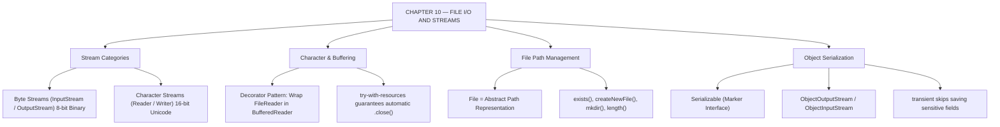

# JAVA - CHAPTER 10
## File I/O and Streams

> “RAM is volatile memory; File I/O gives software a memory of the past.” — A First Lesson in Persistence

### Learning Objectives
By the end of this chapter, you will be able to:
* Understand the Java Stream architecture (Input vs. Output, Byte vs. Character).
* Read and write raw binary data using `FileInputStream` and `FileOutputStream`.
* Read and write human-readable text efficiently using `BufferedReader` and `BufferedWriter`.
* Navigate the file system and manage directories using the `File` class.
* Save entire Java objects to the hard drive using Object Serialization and the `transient` keyword.

---

### Introduction
So far, all the data you have worked with—whether stored in a primitive variable, an array, or an `ArrayList`—has lived in the computer's Random Access Memory (RAM). RAM is volatile. The exact millisecond your Java program finishes executing or your computer loses power, every piece of data is permanently erased. To build software that matters, your data must persist. You need to save user settings, write error logs, and export reports. Java handles this through the **I/O (Input/Output) Streams API**, allowing your programs to reach outside the JVM and interact with the physical hard drive.

### Why This Topic Matters
Without File I/O, software has no memory of the past. Understanding how to read from and write to the file system is foundational for everything from building desktop applications to managing server log files. Furthermore, mishandling file streams is one of the most common causes of resource leaks, which can lock files and eventually crash operating systems. Mastering modern `try-with-resources` file handling ensures your code is safe and robust.

---

### Chapter Roadmap
* Concept 1: Introduction to I/O Streams
* Concept 2: Byte Streams vs. Character Streams
* Concept 3: The `File` Class and Directory Management
* Concept 4: Object Serialization
* Learning Support Elements
* Debugging and Problem Solving
* Practical Application & Mini Project
* Practice and Evaluation
* Chapter Conclusion

---

> [!NOTE]
> **Real-Life Analogy: Water Pipes and Freeze-Drying Objects**
> A stream in Java is like a physical water pipe:
> * To pull data **into** your program from a file, attach an **Input Stream** pipe.
> * To push data **out** of your program to a file, attach an **Output Stream** pipe.
> 
> **Object Serialization** is like freeze-drying an object. You take a complex `Player` object with health, inventory, and levels, freeze it into a stream of bytes, and save it directly to a file. **Deserialization** thaws those bytes back into a live object in memory.

---

### Real-World Applications

| Domain | How this chapter's ideas appear in practice |
| :--- | :--- |
| **Server Administration** | Server loggers append operational timestamps and exceptions to persistent `.log` files on disk. |
| **Game Development** | Game save-states freeze player profile objects to binary save files via Object Serialization. |
| **Configuration Managers** | Applications read `.properties` or `.json` files on launch to set environment database URLs. |
| **Media Processing** | `FileInputStream` reads raw 8-bit binary data for image files (`.png`, `.jpeg`) and audio buffers. |
| **Data Export Tools** | `BufferedWriter` streams transaction reports line-by-line into downloadable `.csv` spreadsheets. |
| **Enterprise Security** | `transient` fields prevent sensitive passwords or private keys from being written to physical disk storage. |

---

### Core Learning Sections

#### CONCEPT 1: Introduction to I/O Streams
*Sub-topics Covered: 10.1 What is a Stream?, Directionality, Type of Data*

##### 10.1 Stream Classifications
Streams are categorized by the data flowing through the pipe:
1. **Byte Streams**: Transmit raw 8-bit binary data (`0`s and `1`s). Inherit from `InputStream` and `OutputStream`. Used for images, audio files, and compiled bytecode.
2. **Character Streams**: Transmit 16-bit Unicode characters. Inherit from `Reader` and `Writer`. Used for human-readable text files (`.txt`, `.csv`, `.json`).

---

#### CONCEPT 2: Byte Streams vs. Character Streams
*Sub-topics Covered: 10.2 FileInputStream / FileOutputStream, 10.3 FileReader / BufferedReader*

##### 10.2 Byte Streams (`FileInputStream` / `FileOutputStream`)
Fundamental binary streams reading/writing raw data one byte at a time. Ideal for copying non-text files like `.png` or `.pdf`.

##### 10.3 Character Streams and Buffering
* `FileReader` / `FileWriter`: Read/write text character-by-character. Disk I/O per character is painfully slow.
* `BufferedReader` / `BufferedWriter`: **Wrapper streams** (using the Decorator Design Pattern) that add an in-memory buffer array. They gather large text chunks in RAM and write to disk in bulk operations. **Always use buffered streams for text.**

---

#### CONCEPT 3: The File Class and Directory Management
*Sub-topics Covered: 10.4 The java.io.File Class*

##### 10.4 The `File` Class
The `File` class does not contain file contents; it represents an abstract pathname pointing to a file or directory on disk.
* `file.exists()`: Checks if the path physically exists on disk.
* `file.createNewFile()`: Creates a blank new file.
* `file.mkdir()`: Creates a new directory (folder).
* `file.length()`: Returns file size in bytes.

---

#### CONCEPT 4: Object Serialization
*Sub-topics Covered: 10.5 Serialization, Deserialization, the transient keyword*

##### 10.5 Implementing Serialization
* **`Serializable` Interface**: Classes MUST implement `java.io.Serializable`. It is a **marker interface** (no methods) signaling to the JVM that the class can be safely serialized.
* **`ObjectOutputStream` / `ObjectInputStream`**: Specialized streams that freeze objects into byte arrays and reconstruct them back into memory.
* **`transient` Keyword**: Prevents sensitive fields (like `password`) from being saved to disk. Transient variables initialize to default (`null`/`0`) upon deserialization.
* **`serialVersionUID`**: Unique version ID verifying saved object structures match current class definitions during deserialization.

```mermaid
graph TD
    Object["Java Live Object in RAM"] -->|ObjectOutputStream (Serialize)| Bytes["Byte Stream / Save File (.dat)"]
    Bytes -->|ObjectInputStream (Deserialize)| Reconstructed["Reconstructed Object in RAM"]
    Transient["transient Fields (Password)"] -.->|Skipped During Serialization| Bytes
```

##### Code Example: Buffered Text I/O
```java
import java.io.BufferedReader;
import java.io.BufferedWriter;
import java.io.File;
import java.io.FileReader;
import java.io.FileWriter;
import java.io.IOException;

public class FileIODemo {
    public static void main(String[] args) {
        String fileName = "system_log.txt";
        File logFile = new File(fileName);

        System.out.println("--- 1. WRITING TO FILE ---");
        // try-with-resources guarantees the writer is closed automatically!
        // The 'true' flag in FileWriter enables "append" mode, preserving existing text.
        try (BufferedWriter writer = new BufferedWriter(new FileWriter(logFile, true))) {
            writer.write("LOG ENTRY: Application started successfully.");
            writer.newLine(); // Safely adds a line break for any OS (Windows/Linux/Mac)
            writer.write("LOG ENTRY: Database connected.");
            writer.newLine();
            System.out.println("Successfully wrote to " + logFile.getAbsolutePath());
        } catch (IOException e) {
            System.err.println("Error writing to file: " + e.getMessage());
        }

        System.out.println("\n--- 2. READING FROM FILE ---");
        if (logFile.exists()) {
            try (BufferedReader reader = new BufferedReader(new FileReader(logFile))) {
                String currentLine;
                // Read line-by-line until end of file (null)
                while ((currentLine = reader.readLine()) != null) {
                    System.out.println(currentLine);
                }
            } catch (IOException e) {
                System.err.println("Error reading file: " + e.getMessage());
            }
        } else {
            System.out.println("File does not exist!");
        }
    }
}
```

##### Expected Output:
```text
--- 1. WRITING TO FILE ---
Successfully wrote to C:\path\to\your\project\system_log.txt

--- 2. READING FROM FILE ---
LOG ENTRY: Application started successfully.
LOG ENTRY: Database connected.
```

---

### Learning Support Elements

> [!TIP]
> **Tips: New I/O (NIO.2)**
> Java 7 introduced the modern `java.nio.file` package (NIO.2). Classes like `Files` and `Paths` provide faster, concise methods for file operations (e.g., `Files.readAllLines(Paths.get("file.txt"))`). Explore NIO.2 for modern enterprise applications.

> [!NOTE]
> **Important Notes: The Decorator Pattern**
> Java's I/O streams use the Decorator Design Pattern. You start with a basic stream (`FileReader`) and "wrap" it with a buffering stream (`BufferedReader`):
> `new BufferedReader(new FileReader("file.txt"))`.

> [!WARNING]
> **Warnings: File Locks and Memory Leaks**
> If you open a file stream and forget to call `.close()`, the operating system will lock the file, denying access to other programs. Always use `try-with-resources` so Java closes files automatically even when exceptions occur.

#### Common Misconceptions
* **Misconception:** "`new File("data.txt")` creates a new text file on the hard drive."
* **Reality:** It creates an in-memory Java `File` object pointing to that path. To physically create the file on disk, call `file.createNewFile()`.

#### Best Practices
* **Always Buffer:** Never read or write character-by-character directly to disk. Disk access is expensive. Always wrap streams in `BufferedReader` or `BufferedWriter`.

---

### Debugging and Problem Solving

#### Runtime Error: `java.io.FileNotFoundException`
* **Cause:** Attempted to open a `FileReader` or `FileInputStream` for a path that does not exist on disk.
* **Fix:** Use `file.exists()` to verify path existence before reading, and double-check relative vs. absolute file paths.

#### Runtime Error: `java.io.NotSerializableException`
* **Cause:** Attempted to serialize an object whose class does not implement `java.io.Serializable`.
* **Fix:** Add `implements Serializable` to the class declaration and ensure all nested object fields also implement `Serializable`.

---

### Practical Application & Mini Project

#### Mini Project: Game Save-State Manager (Serialization)
This project demonstrates how to freeze a complex Java object (`PlayerProfile`), save it to a binary file, and reload it later while ignoring sensitive fields via `transient`.

```java
import java.io.*;

// 1. Class must implement Serializable
class PlayerProfile implements Serializable {
    private static final long serialVersionUID = 1L;

    public String username;
    public int level;

    // 2. transient prevents password from being saved to disk!
    public transient String password;

    public PlayerProfile(String username, int level, String password) {
        this.username = username;
        this.level = level;
        this.password = password;
    }

    public void displayProfile() {
        System.out.println("Username: " + username);
        System.out.println("Level: " + level);
        System.out.println("Password: " + (password == null ? "[HIDDEN/NOT SAVED]" : password));
    }
}

public class GameSaveManager {
    public static void main(String[] args) {
        String saveFileName = "savegame.dat";
        PlayerProfile player1 = new PlayerProfile("DragonSlayer99", 42, "superSecret123!");

        System.out.println("=== 1. ORIGINAL PLAYER PROFILE ===");
        player1.displayProfile();

        // --- SERIALIZATION (Saving to disk) ---
        try (ObjectOutputStream out = new ObjectOutputStream(new FileOutputStream(saveFileName))) {
            out.writeObject(player1);
            System.out.println("\nGame saved successfully to " + saveFileName);
        } catch (IOException e) {
            System.err.println("Failed to save game: " + e.getMessage());
        }

        // --- DESERIALIZATION (Loading from disk) ---
        System.out.println("\n=== 2. LOADED PLAYER PROFILE ===");
        try (ObjectInputStream in = new ObjectInputStream(new FileInputStream(saveFileName))) {
            // Read object and cast back to PlayerProfile
            PlayerProfile loadedPlayer = (PlayerProfile) in.readObject();
            loadedPlayer.displayProfile();
        } catch (IOException | ClassNotFoundException e) {
            System.err.println("Failed to load game: " + e.getMessage());
        }
    }
}
```

##### Expected Output:
```text
=== 1. ORIGINAL PLAYER PROFILE ===
Username: DragonSlayer99
Level: 42
Password: superSecret123!

Game saved successfully to savegame.dat

=== 2. LOADED PLAYER PROFILE ===
Username: DragonSlayer99
Level: 42
Password: [HIDDEN/NOT SAVED]
```

---

### Practice and Evaluation

#### Coding Exercises
* Write a program that opens a text file named `notes.txt`, counts the total number of lines using `BufferedReader`, and prints the line count to the console.
* Create a class `UserPreferences` implementing `Serializable` with fields `themeColor` and `transient sessionToken`. Write code to serialize and deserialize an instance to `prefs.dat`.

#### Interview Questions & Answers

1. **(Junior) What are the two main categories of streams in `java.io`?**
   * **Answer:** Byte Streams (`InputStream`/`OutputStream`) for raw 8-bit binary data (images, bytecode), and Character Streams (`Reader`/`Writer`) for 16-bit Unicode text (`.txt`, `.json`).

2. **(Junior) What is the purpose of the `BufferedReader` class?**
   * **Answer:** `BufferedReader` wraps a `Reader` (`FileReader`) to buffer input in memory. Instead of disk reads per character, it reads chunks into RAM, improving performance.

3. **(Junior) What happens if you try to read an object from a file whose `.class` file is missing?**
   * **Answer:** `ObjectInputStream.readObject()` throws a `ClassNotFoundException`.

4. **(Mid-Level) Explain the `transient` keyword.**
   * **Answer:** `transient` instructs the JVM to skip a variable during object serialization. Upon deserialization, transient fields initialize to default values (`null` or `0`).

5. **(Mid-Level) What is `serialVersionUID` and why is it important?**
   * **Answer:** It is a unique version identifier for a `Serializable` class. During deserialization, the JVM compares the file ID with the class ID. If fields changed and IDs mismatch, `InvalidClassException` is thrown.

6. **(Mid-Level) How does `try-with-resources` work under the hood?**
   * **Answer:** Introduced in Java 7, `try-with-resources` closes resources declared in `try(...)` automatically. The resource class must implement `AutoCloseable` or `Closeable`.

7. **(Senior) What are the limitations of standard Java Serialization, and what are modern alternatives?**
   * **Answer:** Java serialization is slow, space-inefficient, language-dependent (Java-only), and vulnerable to deserialization security exploits. Modern enterprise apps use JSON (Jackson/Gson) or Protocol Buffers.

8. **(Senior) Compare traditional `java.io` (OIO) with `java.nio` (NIO.2).**
   * **Answer:** Traditional `java.io` is stream-oriented and blocking. `java.nio` is buffer-and-channel-oriented supporting non-blocking I/O via Selectors, making it vastly superior for high-concurrency network servers.

9. **(Senior) If a parent class does not implement `Serializable` but a child does, what happens during serialization?**
   * **Answer:** The child's fields serialize normally. The parent's fields are skipped; during deserialization, the parent's no-arg constructor runs to initialize parent fields. If the parent lacks a no-arg constructor, a runtime exception is thrown.

10. **(Senior) How would you read an extremely large file (50 GB) in Java without causing `OutOfMemoryError`?**
    * **Answer:** Process the file sequentially line-by-line using `BufferedReader` inside a loop or Java 8's `Files.lines()`, which returns a lazily evaluated `Stream<String>` with minimal RAM usage.

---

### Chapter Conclusion
In Chapter 10, you learned to make data outlive your program's execution. By understanding Byte vs. Character streams, buffered I/O, Object Serialization, and `try-with-resources`, you possess the skills to build persistent, leak-free applications.

#### Key Takeaways
* **Use Buffers:** Always wrap `FileReader`/`FileWriter` in `BufferedReader`/`BufferedWriter`.
* **Prevent Leaks:** Use `try-with-resources` exclusively to close file streams automatically.
* **Serialization:** Implement `Serializable` to save objects to disk, using `transient` for sensitive fields.
* **Paths vs. Files:** A `File` object is an in-memory path representation, not the physical disk file.

#### What to Learn Next
Now that you can handle persistence, we dive into **Chapter 11: Modern Java Features (Java 8 and Beyond)**, exploring `Optional` for null-safety, modern date/time APIs (`java.time`), and Java Records.

---

### Progressive Code Examples: Four Tiers

#### TIER 1 · BEGINNER
##### Checking File Existence and Creating Files
**Goal:** Use the `File` class to check path existence and create a physical text file.

```java
import java.io.File;
import java.io.IOException;

public class FileBasicsDemo {
    public static void main(String[] args) {
        File file = new File("test.txt");

        try {
            if (file.createNewFile()) {
                System.out.println("File created: " + file.getName());
            } else {
                System.out.println("File already exists at: " + file.getAbsolutePath());
            }
        } catch (IOException e) {
            System.err.println("An error occurred: " + e.getMessage());
        }
    }
}
```

##### Expected Output
```text
File created: test.txt
```

> **What this tier adds:** Baseline. `File` path creation, `.createNewFile()`, `.getAbsolutePath()`, and `IOException` handling.

---

#### TIER 2 · INTERMEDIATE
##### Appending Text to Existing Files
**Goal:** Append text records without overwriting existing file data using `FileWriter(file, true)`.

```java
import java.io.BufferedWriter;
import java.io.FileWriter;
import java.io.IOException;

public class AppendTextDemo {
    public static void main(String[] args) {
        // 'true' parameter enables append mode
        try (BufferedWriter writer = new BufferedWriter(new FileWriter("log.txt", true))) {
            writer.write("NEW LOG ENTRY: System check completed.");
            writer.newLine();
            System.out.println("Successfully appended entry to log.txt");
        } catch (IOException e) {
            System.err.println("Append error: " + e.getMessage());
        }
    }
}
```

##### Expected Output
```text
Successfully appended entry to log.txt
```

> **What this tier adds:** `FileWriter` append mode boolean flag, `BufferedWriter`, and `newLine()` line formatting.

---

#### TIER 3 · ADVANCED
##### Reading Files Line-by-Line with BufferedReader
**Goal:** Efficiently ingest text file contents line-by-line using buffered streams.

```java
import java.io.BufferedReader;
import java.io.FileReader;
import java.io.IOException;

public class LineReaderDemo {
    public static void main(String[] args) {
        try (BufferedReader reader = new BufferedReader(new FileReader("log.txt"))) {
            String line;
            int lineNumber = 1;
            while ((line = reader.readLine()) != null) {
                System.out.println("Line " + lineNumber++ + ": " + line);
            }
        } catch (IOException e) {
            System.err.println("Read error: " + e.getMessage());
        }
    }
}
```

##### Expected Output
```text
Line 1: NEW LOG ENTRY: System check completed.
```

> **What this tier adds:** `BufferedReader`, `readLine()` loop reading, and checking for `null` end-of-stream markers.

---

#### TIER 4 · PROFESSIONAL
##### NIO.2 Path Management and Direct File Operations
**Goal:** Modernize file reading using Java 7 `java.nio.file.Files` and `Paths`.

```java
import java.io.IOException;
import java.nio.file.Files;
import java.nio.file.Path;
import java.nio.file.Paths;
import java.util.List;

public class ModernNIODemo {
    public static void main(String[] args) {
        Path path = Paths.get("log.txt");

        try {
            if (Files.exists(path)) {
                List<String> allLines = Files.readAllLines(path);
                System.out.println("=== READ VIA NIO.2 ===");
                System.out.println("Total Lines Read: " + allLines.size());
                allLines.forEach(l -> System.out.println(" -> " + l));
            }
        } catch (IOException e) {
            System.err.println("NIO Error: " + e.getMessage());
        }
    }
}
```

##### Expected Output
```text
=== READ VIA NIO.2 ===
Total Lines Read: 1
 -> NEW LOG ENTRY: System check completed.
```

> **What this tier adds:** Modern NIO.2 `Path`, `Paths.get()`, `Files.exists()`, and `Files.readAllLines()`.

---

### Common Mistakes and How to Fix Them

| The mistake | Why it happens | What you see (class) | The fix |
| :--- | :--- | :--- | :--- |
| **Overwriting file instead of appending** | Omitted `true` flag in `FileWriter` | File contents overwritten on every run *(DATA LOSS)* | Use `new FileWriter("file.txt", true)` |
| **Forgetting `transient` on secret fields** | Passwords saved to disk | Plaintext passwords written to binary files *(SECURITY)* | Mark sensitive fields `transient` |
| **Reading un-buffered character streams** | Direct `FileReader` calls | Extremely slow disk access performance *(PERFORMANCE)* | Wrap streams in `BufferedReader` |
| **Forgetting to close file streams** | Omitted `close()` | Locked files & resource leak crashes *(RUNTIME)* | Wrap streams in `try-with-resources` |
| **Assuming `new File()` creates a file** | Mistaking path object for file | `FileNotFoundException` when reading *(RUNTIME)* | Call `file.createNewFile()` to physically create file |
| **Missing `serialVersionUID` in custom class** | Omitted version identifier | `InvalidClassException` after minor class edits *(RUNTIME)* | Declare `private static final long serialVersionUID = 1L;` |

---

### Chapter Mind Map



---

> [!TIP]
> **Prepare for your Chapter Exam!**
> You have completed reading Chapter 10. Head to the **Take Chapter Quiz** assessment below to test your knowledge and unlock Chapter 11!
