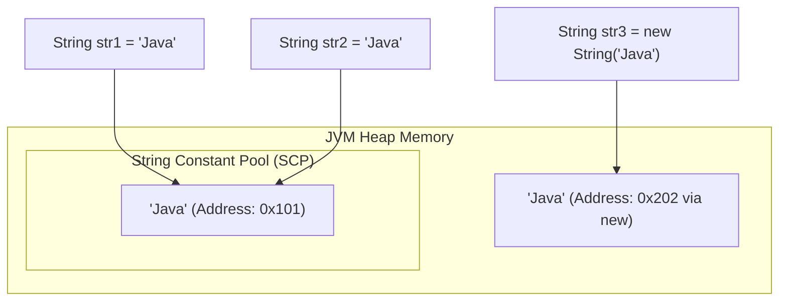
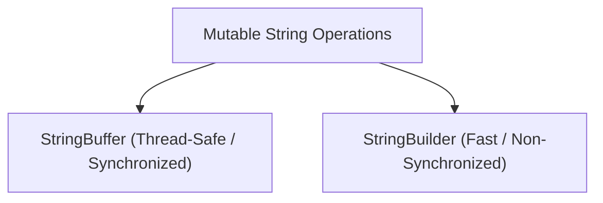

# JAVA - CHAPTER 10
## String Handling

> "Strings are immutable foundations of Java memory management; mastering String Constant Pools and mutable builders optimizes throughput and heap efficiency."

### By the End of This Chapter, You Will Be Able To:
* Explain String Immutability and the mechanics of the JVM String Constant Pool (SCP).
* Compare `String`, `StringBuffer`, and `StringBuilder` based on mutability, thread safety, and performance.
* Override `toString()` to deliver meaningful object representations.
* Tokenize text data using `StringTokenizer` and regex `split()`.
* Avoid memory leaks associated with string concatenation loops.

---

### 1. String Immutability & The String Constant Pool (SCP)

In Java, `String` objects are **immutable** — once created, their values cannot be changed inside heap memory. Any modification generates a brand-new `String` object.



#### Why are Strings Immutable in Java?
1. **String Constant Pool (SCP)**: Saves memory by reusing identical string literals across the application.
2. **Security**: Strings carry sensitive parameters like DB URLs, usernames, passwords, and network sockets. Immutability prevents malicious tampering.
3. **Thread Safety**: Immutable objects are inherently thread-safe without requiring `synchronized` locking locks.
4. **HashCode Caching**: String hash codes are calculated once and cached (`hash`), speeding up `HashMap` key lookups.

> [!NOTE]
> **Literal vs `new String()`**
> - `String s1 = "Hello";` creates 1 object in the String Constant Pool (if not already present).
> - `String s2 = new String("Hello");` creates 2 objects: 1 in SCP and 1 in general Heap memory.

---

### 2. `String` vs. `StringBuffer` vs. `StringBuilder`

Because `String` is immutable, appending strings inside loops using `+` creates thousands of short-lived temporary objects, causing garbage collection spikes. Java provides **mutable** alternatives:



#### Comparison Matrix

| Property | `String` | `StringBuffer` | `StringBuilder` |
| :--- | :--- | :--- | :--- |
| **Mutability** | **Immutable** | **Mutable** | **Mutable** |
| **Thread Safety** | Thread-Safe (Immutable) | **Thread-Safe** (Methods `synchronized`) | **Not Thread-Safe** (No sync overhead) |
| **Performance** | Slow for frequent modifications | Moderate (Locking overhead) | **Fastest** (Ideal for single-thread ops) |
| **Storage Memory** | Heap + SCP | Heap | Heap |
| **Introduced In** | JDK 1.0 | JDK 1.0 | JDK 1.5 |

#### Program 10.1 — Performance Benchmark

```java
public class StringPerformanceTest {
    public static void main(String[] args) {
        int iterations = 100_000;

        // 1. StringBuilder Performance
        long startTime = System.currentTimeMillis();
        StringBuilder sb = new StringBuilder();
        for (int i = 0; i < iterations; i++) {
            sb.append("A");
        }
        long endTime = System.currentTimeMillis();
        System.out.println("StringBuilder Time: " + (endTime - startTime) + " ms");

        // 2. StringBuffer Performance
        startTime = System.currentTimeMillis();
        StringBuffer sbf = new StringBuffer();
        for (int i = 0; i < iterations; i++) {
            sbf.append("A");
        }
        endTime = System.currentTimeMillis();
        System.out.println("StringBuffer Time: " + (endTime - startTime) + " ms");
    }
}
```

---

### 3. The `toString()` Method

The `toString()` method in `Object` returns a text representation of an object. By default, it returns `ClassName@HexHashCode`. Overriding `toString()` provides readable debugging insights:

```java
public class Book {
    private String title;
    private String author;
    private double price;

    public Book(String title, String author, double price) {
        this.title = title;
        this.author = author;
        this.price = price;
    }

    @Override
    public String toString() {
        return "Book[Title='" + title + "', Author='" + author + "', Price=$" + price + "]";
    }

    public static void main(String[] args) {
        Book b = new Book("Effective Java", "Joshua Bloch", 45.00);
        System.out.println(b); // Automatically invokes b.toString()
    }
}
```

---

### 4. Text Tokenization

Tokenization breaks a delimited text sequence into individual substrings ("tokens").

#### Option A: `java.util.StringTokenizer`
A legacy utility class for simple character delimiter splitting:

```java
import java.util.StringTokenizer;

public class TokenizerDemo {
    public static void main(String[] args) {
        String data = "Java,Python,C++,JavaScript,Rust";
        StringTokenizer tokenizer = new StringTokenizer(data, ",");

        while (tokenizer.hasMoreTokens()) {
            System.out.println("Token: " + tokenizer.nextToken());
        }
    }
}
```

#### Option B: Modern Regex `String.split()`
Flexible regex-based tokenization:

```java
public class RegexSplitDemo {
    public static void main(String[] args) {
        String logLine = "2026-07-31 | ERROR | SystemOut | Database connection timeout";
        String[] parts = logLine.split("\\s*\\|\\s*"); // Delimit by pipe with surrounding spaces

        for (String part : parts) {
            System.out.println("Part: " + part);
        }
    }
}
```

---

### ✏ Try It Yourself
1. Test whether `"Java" == new String("Java")` evaluates to `true` or `false`, and explain why. Then test `equals()`.
2. Write a function `boolean isPalindrome(String input)` using `StringBuilder.reverse()`.
3. Given a CSV string of numbers `"10,20,30,40,50"`, tokenize the string, parse numbers into integers, and calculate the total sum.

---

### Chapter Summary

#### Key Takeaways
* **Strings are immutable** in Java to support SCP memory caching, security, and thread-safety.
* Use **`StringBuilder`** for fast single-threaded string manipulations; use **`StringBuffer`** when thread safety is required across concurrent worker threads.
* Always override **`toString()`** in data models to simplify logging and inspection.
* String literal equality (`==`) checks memory reference address; `equals()` checks character value equality.

---

### Chapter Quiz & Exercises

#### Multiple Choice Questions
1. Where are string literals stored in JVM memory when declared like `String s = "Hello";`?
   - A) Stack Frame
   - B) String Constant Pool (SCP)
   - C) Native Method Stack
   - D) Code Segment
   *Correct Answer: B*

2. Which class should be preferred for concatenating strings inside a single-threaded loop?
   - A) `java.lang.String`
   - B) `java.lang.StringBuffer`
   - C) `java.lang.StringBuilder`
   - D) `java.util.StringTokenizer`
   *Correct Answer: C*

#### Practice Exercise
Create a utility `LogSanitizer.java` that receives raw user comments, uses `StringBuilder` to strip out HTML tags (`<script>`, `<div>`), replaces profane words with `***`, and formats clean output.
