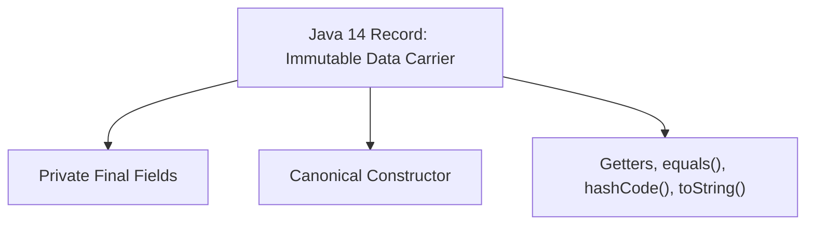
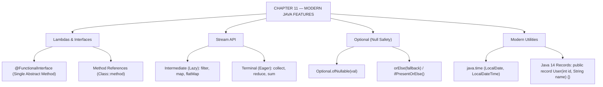

# JAVA - CHAPTER 11
## Modern Java Features (Java 8 and Beyond)

> “Modern Java replaces verbose boilerplate with expressive, declarative code while retaining enterprise-grade type safety.” — A First Lesson in Language Evolution

### Learning Objectives
By the end of this chapter, you will be able to:
* Write inline functions using Lambda Expressions and understand Functional Interfaces.
* Process data collections declaratively using the Stream API (`filter`, `map`, `reduce`).
* Eliminate `NullPointerException` risks using the `Optional` class.
* Manage dates and times safely using the immutable `java.time` API.
* Eliminate boilerplate data-carrier classes using Java 14 `record` types.

---

### Introduction
For its first 20 years, Java was a strictly, sometimes stubbornly, Object-Oriented language. To perform a simple action, you had to write a Class, instantiate an Object, and call a Method. This verbosity made Java robust but incredibly wordy. In 2014, Java 8 changed the landscape of the language forever by introducing **Functional Programming** capabilities. Suddenly, Java developers could write concise, expressive code that reads like natural language. Subsequent releases (Java 11, 14, 17, and 21) continued this modernization, trimming boilerplate code and making Java feel as agile as Python or JavaScript, while retaining enterprise-grade type safety.

### Why This Topic Matters
If you write Java today using only pre-Java 8 paradigms, your code is considered legacy. Modern codebases rely heavily on Lambdas and the Stream API to process massive collections of data efficiently. The `Optional` class is now the industry standard for preventing the dreaded `NullPointerException` (often called the "Billion Dollar Mistake"). Mastering these features is not optional for a modern Java developer; it is the absolute baseline expected in technical interviews and professional environments.

---

### Chapter Roadmap
* Concept 1: Lambda Expressions and Functional Interfaces
* Concept 2: The Stream API
* Concept 3: The Optional Class (Null Safety)
* Concept 4: Modern Utilities: Date/Time and Records
* Learning Support Elements
* Debugging and Problem Solving
* Practical Application & Mini Project
* Practice and Evaluation
* Chapter Conclusion

---

> [!NOTE]
> **Real-Life Analogy: The Container Box and the Sealed Data Carrier**
> `Optional<T>` is a transparent box. Instead of passing `null` directly (which risks crashing your app when opened), you pass a transparent box. The caller looks inside: if empty, they handle the fallback safely; if full, they safely unwrap the item.
> A **Java Record** is a pre-fabricated, immutable shipping container. You define what goes inside (`int id, String name`), and Java automatically manufactures the container with private final fields, constructors, getters, `equals()`, `hashCode()`, and `toString()` built-in.

---

### Real-World Applications

| Domain | How this chapter's ideas appear in practice |
| :--- | :--- |
| **REST APIs (Spring Boot)** | Java 14 Records act as immutable Data Transfer Objects (DTOs) for JSON request payloads. |
| **Database Repositories** | `Optional<User>` forces callers to handle missing database records gracefully without throwing NPEs. |
| **Financial Systems** | `java.time.LocalDate` and `LocalDateTime` manage immutable transaction timestamps free of time-zone bugs. |
| **Microservice Pipelines** | Stream pipelines filter and transform user analytics events in real time across server networks. |
| **Cloud Event Services** | Lambdas provide clean, inline callbacks for reactive event-driven cloud architectures. |
| **Data Serialization** | Records automatically generate compact `equals()` and `hashCode()` methods required for cache keys. |

---

### Core Learning Sections

#### CONCEPT 1: Lambda Expressions and Functional Interfaces
*Sub-topics Covered: 11.1 Lambdas and Functional Interfaces, 11.4 Method References*

##### 11.1 Functional Interfaces and Lambdas
* **Functional Interface**: An interface containing **exactly one abstract method**. Acts as the target type for a lambda expression. (Annotated with `@FunctionalInterface`).
* **Lambda Syntax**: `(parameters) -> { body }`
  * Example: `(int a, int b) -> { return a + b; }`
  * Shorthand: `(a, b) -> a + b;`

##### 11.4 Method References (`::`)
Shorthand syntax when a lambda merely calls an existing method:
* Lambda: `name -> System.out.println(name)`
* Method Reference: `System.out::println`

---

#### CONCEPT 2: The Stream API
*Sub-topics Covered: 11.2 Filter, Map, Reduce, Collect*

##### 11.2 The Stream Pipeline
A data stream is an assembly line processing collections without mutating original sources:
* **Source**: Create stream via `list.stream()`.
* **Intermediate Operations (Lazy)**:
  * `filter(Predicate)`: Retains elements matching boolean conditions.
  * `map(Function)`: Transforms objects (e.g., mapping `Employee` $\rightarrow$ `String name`).
* **Terminal Operations (Eager)**:
  * `collect(Collectors.toList())`: Packages items into a new List.
  * `reduce()`: Combines elements into an aggregated value (e.g., summing numbers).

---

#### CONCEPT 3: The Optional Class (Null Safety)
*Sub-topics Covered: 11.3 Handling Nulls, orElse, ifPresent*

##### 11.3 The `Optional` Class
Historically, missing values returned `null`, causing `NullPointerException` (NPE) crashes if callers forgot null checks. `Optional<T>` is a container expressing presence or absence of a value:
* `Optional.ofNullable(value)`: Wraps a value that might be null.
* `opt.isPresent()`: Returns `true` if a value exists.
* `opt.orElse(defaultValue)`: Safely unwraps the value, or provides a backup fallback if empty.

---

#### CONCEPT 4: Modern Utilities: Date/Time and Records
*Sub-topics Covered: 11.5 java.time API, 11.6 Records*

##### 11.5 New Date and Time API (`java.time`)
Replaces legacy mutable `java.util.Date` with a thread-safe, immutable API based on Joda-Time:
* `LocalDate.now()`: Date only (`2026-08-05`).
* `LocalTime.now()`: Time only (`14:30:00`).
* `LocalDateTime.now()`: Combined date and time.

##### 11.6 Records (Java 14+)
Eliminates boilerplate for data-carrier classes. A `record` generates private final fields, constructor, getters, `equals()`, `hashCode()`, and `toString()` in **one line**:
`public record User(int id, String name) {}`



##### Code Example: Modern Java in Action
```java
import java.time.LocalDate;
import java.util.List;
import java.util.Optional;
import java.util.stream.Collectors;

// 11.6: Java 14 Record (Replaces 40 lines of boilerplate code!)
record Employee(String name, String department, double salary, LocalDate hireDate) {}

public class ModernJavaDemo {
    public static void main(String[] args) {

        List<Employee> staff = List.of(
            new Employee("Alice", "Engineering", 85000, LocalDate.of(2020, 5, 10)),
            new Employee("Bob", "Sales", 60000, LocalDate.of(2019, 3, 15)),
            new Employee("Charlie", "Engineering", 95000, LocalDate.of(2021, 8, 22))
        );

        System.out.println("--- 1. THE STREAM API & LAMBDAS ---");
        // Filter Engineering staff earning > $80k and extract names
        List<String> topEngineers = staff.stream() // Source
            .filter(emp -> emp.department().equals("Engineering")) // Lambda Filter
            .filter(emp -> emp.salary() > 80000)
            .map(Employee::name) // 11.4: Method Reference
            .collect(Collectors.toList()); // Terminal operation

        System.out.println("Top Engineers: " + topEngineers);

        System.out.println("\n--- 2. OPTIONAL (NULL SAFETY) ---");
        // Safely search for an employee that doesn't exist
        Optional<Employee> foundEmp = staff.stream()
            .filter(emp -> emp.name().equals("David"))
            .findFirst();

        // 11.3: Safe unwrapping using Optional
        String message = foundEmp
            .map(emp -> "Found: " + emp.name())
            .orElse("Employee not found in the database.");

        System.out.println(message);
    }
}
```

##### Expected Output:
```text
--- 1. THE STREAM API & LAMBDAS ---
Top Engineers: [Alice, Charlie]

--- 2. OPTIONAL (NULL SAFETY) ---
Employee not found in the database.
```

---

### Learning Support Elements

> [!TIP]
> **Tips: Reading Stream Pipelines**
> Always read Stream pipelines vertically, not horizontally. Place the dot `.` at the beginning of each new line for `filter`, `map`, and `collect`. This aligns the assembly line visually for instant readability.

> [!NOTE]
> **Important Notes: Streams are Single-Use**
> Once you call a terminal operation (`collect()`, `findFirst()`) on a Stream, the stream is consumed. Attempting to call another operation on the exact same stream variable throws an `IllegalStateException`.

> [!WARNING]
> **Warnings: Don't Abuse Optional**
> `Optional` was designed specifically as a **return type** for methods that might not return a value. Do **not** use `Optional` for class fields (instance variables) or method parameters, as it creates unnecessary object wrapping overhead.

#### Common Misconceptions
* **Misconception:** "Streams actually modify the original source `List`."
* **Reality:** Streams never mutate their source. `list.stream().map(...)` generates a brand-new stream of transformed data, leaving the original `List` untouched.

#### Best Practices
* **Immutable Dates:** Always use `java.time.LocalDate` or `LocalDateTime` in modern codebases. Never use legacy `java.util.Date` or `java.util.Calendar` unless required by legacy APIs.

---

### Debugging and Problem Solving

#### Runtime Error: `java.lang.IllegalStateException: stream has already been operated upon or closed`
* **Cause:** Stored a stream in a variable (`Stream<String> s = list.stream();`), called a terminal operation, and tried to reuse `s`.
* **Fix:** Chain operations directly from the collection source (`list.stream().filter(...).count()`).

#### Runtime Error: `java.util.NoSuchElementException: No value present`
* **Cause:** Called `.get()` directly on an empty `Optional` object (wrapping a `null`).
* **Fix:** Use `.orElse(fallbackValue)`, `.orElseThrow()`, or check `.isPresent()` first.

---

### Practical Application & Mini Project

#### Mini Project: E-Commerce Order Analytics
This project uses Java 14 Records to model data and the Stream API (`flatMap`, `mapToDouble`, `sum`, `max`) to perform financial analytics in just a few lines of code.

```java
import java.util.List;
import java.util.Optional;

// Using Java 14 Records for concise data carriers
record Product(String id, String category, double price) {}
record Order(String orderId, List<Product> products, boolean isDelivered) {}

public class StreamAnalytics {
    public static void main(String[] args) {

        // Mock Database of Orders
        List<Order> database = List.of(
            new Order("ORD-01", List.of(new Product("P1", "Electronics", 1200.0)), true),
            new Order("ORD-02", List.of(new Product("P2", "Books", 45.0), new Product("P3", "Books", 15.0)), true),
            new Order("ORD-03", List.of(new Product("P4", "Electronics", 800.0)), false) // Not delivered
        );

        System.out.println("=== E-COMMERCE ANALYTICS ===");

        // 1. Calculate Total Revenue of all DELIVERED orders
        double totalRevenue = database.stream()
            .filter(Order::isDelivered) // Keep delivered orders only
            .flatMap(order -> order.products().stream()) // Flatten product lists into one stream
            .mapToDouble(Product::price) // Extract prices
            .sum(); // Terminal operation: calculate sum

        System.out.println("Total Revenue (Delivered): $" + totalRevenue);

        // 2. Find most expensive product across all orders safely using Optional
        Optional<Product> mostExpensive = database.stream()
            .flatMap(order -> order.products().stream())
            .max((p1, p2) -> Double.compare(p1.price(), p2.price())); // Lambda comparison

        // Print safely
        mostExpensive.ifPresentOrElse(
            product -> System.out.println("Most Expensive Item Sold: " + product.category() + " for $" + product.price()),
            () -> System.out.println("No products found in the database.")
        );
    }
}
```

##### Expected Output:
```text
=== E-COMMERCE ANALYTICS ===
Total Revenue (Delivered): $1260.0
Most Expensive Item Sold: Electronics for $1200.0
```

---

### Practice and Evaluation

#### Coding Exercises
* Create a record `BookRecord(String title, double price)`. Create a list of 3 books, use Streams to filter books costing over `$30.0`, and collect their titles into a `List<String>`.
* Write a method `Optional<String> findUser(String id)` that returns `Optional.empty()` if `id` is null or unknown. Test handling it with `.orElse("Default User")`.

#### Interview Questions & Answers

1. **(Junior) What defines a Functional Interface in Java?**
   * **Answer:** An interface containing **exactly one abstract method** (Single Abstract Method rule). Annotated with `@FunctionalInterface`.

2. **(Junior) Which syntax defines a Lambda Expression in Java?**
   * **Answer:** `(parameters) -> { body }` or `(a, b) -> a + b;`.

3. **(Junior) What is the fundamental difference between Intermediate and Terminal operations in Streams?**
   * **Answer:** Intermediate operations configure the stream lazily and return a new `Stream`. Terminal operations trigger actual data processing, producing a non-Stream result (or `void`) and closing the stream.

4. **(Mid-Level) Which Stream operation transforms elements from one type to another?**
   * **Answer:** The `.map(Function)` intermediate operation transforms elements ($1$-to-$1$ mapping).

5. **(Mid-Level) What happens to the original List when processed via a Stream?**
   * **Answer:** The original List remains completely unchanged. Streams do not mutate source data; they generate a brand-new result.

6. **(Mid-Level) What exception is thrown if you reuse a Stream variable after calling a terminal operation?**
   * **Answer:** `java.lang.IllegalStateException: stream has already been operated upon or closed`.

7. **(Senior) What is the primary purpose of `Optional<T>` introduced in Java 8?**
   * **Answer:** To provide a type-safe container expressing the presence or absence of a non-null value, forcing callers to explicitly handle empty cases and eliminating `NullPointerException` risks.

8. **(Senior) What is the safest way to extract a value from `Optional<String> opt` with a fallback?**
   * **Answer:** `opt.orElse("Fallback Value")`.

9. **(Senior) Why is calling `.get()` directly on an `Optional` without `.isPresent()` considered a dangerous anti-pattern?**
   * **Answer:** If the `Optional` is empty, calling `.get()` throws a `NoSuchElementException`, completely defeating the safety purpose of using `Optional`.

10. **(Senior) What boilerplate code does a Java 14 record automatically generate?**
    * **Answer:** A canonical constructor, private final fields, getters matching field names, `equals()`, `hashCode()`, and `toString()`.

---

### Chapter Conclusion
In Chapter 11, you bridged the gap between legacy Java and modern software engineering. By adopting Lambdas, Streams, `Optional`, `java.time`, and Java Records, you write concise, declarative, and memory-safe code.

#### Key Takeaways
* **Declarative > Imperative:** Streams describe *what* to do with data, rather than micromanaging *how* to loop.
* **Null is the Enemy:** Return `Optional<T>` from methods when a value might be missing.
* **Immutability is Safe:** Use `LocalDate` and Java Records for data carriers that cannot be accidentally mutated.
* **Streams are Lazy:** Nothing in a stream pipeline actually runs until a terminal operation is invoked.

#### What to Learn Next
With modern syntax mastered, we proceed to **Chapter 12: Advanced Topics: Generics, Annotations, and JDBC**, exploring generic classes, metadata annotations, JVM Garbage Collection mechanics, and database connectivity.

---

### Progressive Code Examples: Four Tiers

#### TIER 1 · BEGINNER
##### Defining and Instantiating Java 14 Records
**Goal:** Create a zero-boilerplate data carrier using Java Records.

```java
record UserDto(int id, String username) {}

public class RecordBasicsDemo {
    public static void main(String[] args) {
        UserDto user = new UserDto(101, "Alice");

        System.out.println("Username: " + user.username()); // Auto-generated getter
        System.out.println("ToString: " + user); // Auto-generated toString()
    }
}
```

##### Expected Output
```text
Username: Alice
ToString: UserDto[id=101, username=Alice]
```

> **What this tier adds:** Baseline. Java 14 `record` syntax, field accessors, and `toString()` representation.

---

#### TIER 2 · INTERMEDIATE
##### Safe Null Handling with Optional
**Goal:** Wrap potentially null references inside `Optional` and unwrap with fallbacks.

```java
import java.util.Optional;

public class OptionalUnwrapDemo {
    public static Optional<String> findEmail(boolean exists) {
        return exists ? Optional.of("user@example.com") : Optional.empty();
    }

    public static void main(String[] args) {
        String email1 = findEmail(true).orElse("no-reply@domain.com");
        String email2 = findEmail(false).orElse("no-reply@domain.com");

        System.out.println("Email 1: " + email1);
        System.out.println("Email 2 (Fallback): " + email2);
    }
}
```

##### Expected Output
```text
Email 1: user@example.com
Email 2 (Fallback): no-reply@domain.com
```

> **What this tier adds:** `Optional.of()`, `Optional.empty()`, and `.orElse()` safe unwrapping.

---

#### TIER 3 · ADVANCED
##### Immutable Date/Time Computations with `java.time`
**Goal:** Perform modern date arithmetic using `LocalDate` and `Period`.

```java
import java.time.LocalDate;
import java.time.Period;

public class ModernDateTimeDemo {
    public static void main(String[] args) {
        LocalDate today = LocalDate.now();
        LocalDate projectDeadline = today.plusDays(30);

        Period remaining = Period.between(today, projectDeadline);

        System.out.println("Today: " + today);
        System.out.println("Deadline: " + projectDeadline);
        System.out.println("Days Remaining: " + remaining.getDays());
    }
}
```

##### Expected Output
```text
Today: 2026-08-05
Deadline: 2026-09-04
Days Remaining: 30
```

> **What this tier adds:** `java.time.LocalDate`, `.plusDays()`, and `Period.between()` immutable arithmetic.

---

#### TIER 4 · PROFESSIONAL
##### Enterprise Stream Pipeline with Records and Optional
**Goal:** Ingest Record DTOs, execute stream filtering, and safely unwraps top results with `Optional`.

```java
import java.util.List;
import java.util.Optional;
import java.util.Comparator;

record CustomerOrder(String id, double totalAmount, boolean isVIP) {}

public class EnterpriseStreamPipelineDemo {
    public static void main(String[] args) {
        List<CustomerOrder> orders = List.of(
            new CustomerOrder("O-101", 250.0, false),
            new CustomerOrder("O-102", 1250.0, true),
            new CustomerOrder("O-103", 890.0, true)
        );

        Optional<CustomerOrder> topVIPOrder = orders.stream()
            .filter(CustomerOrder::isVIP)
            .max(Comparator.comparingDouble(CustomerOrder::totalAmount));

        topVIPOrder.ifPresentOrElse(
            o -> System.out.println("Top VIP Order ID: " + o.id() + " | Amount: $" + o.totalAmount()),
            () -> System.out.println("No VIP orders processed.")
        );
    }
}
```

##### Expected Output
```text
Top VIP Order ID: O-102 | Amount: $1250.0
```

> **What this tier adds:** Integrating Java Records, method references (`CustomerOrder::isVIP`), Stream `.max()`, and `.ifPresentOrElse()`.

---

### Common Mistakes and How to Fix Them

| The mistake | Why it happens | What you see (class) | The fix |
| :--- | :--- | :--- | :--- |
| **Direct `.get()` on empty Optional** | Calling `.get()` without checking | `java.util.NoSuchElementException: No value present` *(RUNTIME)* | Use `.orElse("fallback")` or `.ifPresent(...)` |
| **Using `Optional` as class field** | Treating `Optional` as general data type | Unnecessary object wrapping overhead & serialization issues *(STYLE)* | Use `Optional` strictly as method return types |
| **Mutating Java Record fields** | Calling setter methods | `cannot find symbol: method setField(...)` *(COMPILER)* | Records are deeply immutable; create a new Record instance |
| **Reusing consumed Stream** | Called terminal op twice on same stream | `IllegalStateException: stream has already been operated upon` *(RUNTIME)* | Create a fresh stream from the collection source |
| **Using legacy `java.util.Date`** | Legacy habits | Thread safety bugs & mutable date issues *(STYLE)* | Upgrade to `java.time.LocalDate` / `LocalDateTime` |
| **Writing multi-line lambdas** | Putting heavy logic inside `->` | Decreased code readability & testability *(STYLE)* | Extract logic into private helper method and use `Class::method` |

---

### Chapter Mind Map



---

> [!TIP]
> **Prepare for your Chapter Exam!**
> You have completed reading Chapter 11. Head to the **Take Chapter Quiz** assessment below to test your knowledge and unlock Chapter 12!
