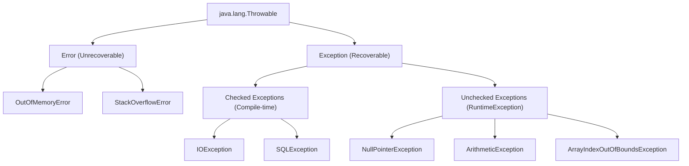
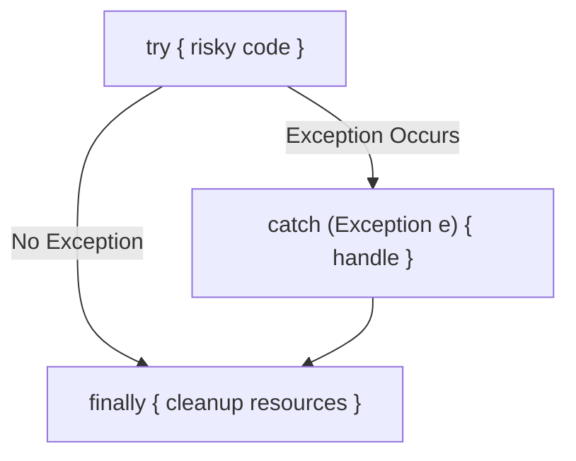

# JAVA - CHAPTER 11
## Exception Handling

> "Exception handling provides robust runtime recovery paths, preventing abnormal program termination and preserving application integrity."

### By the End of This Chapter, You Will Be Able To:
* Master the Java Exception Hierarchy (`Throwable`, `Error`, `Exception`).
* Differentiate between Checked (compile-time) and Unchecked (runtime) Exceptions.
* Apply Exception Control keywords: `try`, `catch`, `finally`, `throw`, and `throws`.
* Utilize modern Try-With-Resources for automatic resource management (`AutoCloseable`).
* Compare the keywords `final`, `finally`, and `finalize()`.
* Create Custom Application Exceptions with descriptive error messages.

---

### 1. The Java Exception Hierarchy

An **Exception** is an unwanted event that disrupts the normal execution flow of a program at runtime.



#### Categories of Throwable Objects

1. **`Error`**: Irrecoverable system-level failures caused by environment conditions (e.g., `OutOfMemoryError`, `StackOverflowError`). Applications should NOT attempt to catch `Error`.
2. **Checked Exception**: Exceptions checked by the compiler at compile-time. The program MUST handle them using `try-catch` or declare them via `throws`.
3. **Unchecked Exception (`RuntimeException`)**: Exceptions resulting from logical errors (e.g., dividing by zero, null pointer access). Not checked at compile-time.

---

### 2. Exception Control Keywords

Java provides 5 keywords to manage exceptions:

- **`try`**: Encloses code blocks that might throw an exception.
- **`catch`**: Encloses code blocks executed when a specific exception is caught.
- **`finally`**: Encloses code blocks executed **guaranteed** regardless of whether an exception occurs.
- **`throw`**: Explicitly triggers/throws an exception instance (`throw new IllegalArgumentException()`).
- **`throws`**: Declares exceptions a method might propagate caller-upwards.



#### Program 11.1 — Try-Catch-Finally & Multi-Catch

```java
public class ExceptionHandlingDemo {
    public static void main(String[] args) {
        try {
            int[] numbers = {10, 20, 30};
            int result = numbers[1] / 0; // ArithmeticException!
            System.out.println("Result: " + result);
        } catch (ArithmeticException | ArrayIndexOutOfBoundsException e) {
            System.err.println("[LOG]: Mathematical or array index error caught: " + e.getMessage());
        } catch (Exception e) {
            System.err.println("[LOG]: Generic fallback error handler: " + e.getMessage());
        } finally {
            System.out.println("[FINALLY]: Execution finished. Cleaning up operations.");
        }
    }
}
```

---

### 3. Try-With-Resources (AutoCloseable)

Introduced in Java 7, **Try-With-Resources** automatically closes resources (files, database connections, sockets) implementing `java.lang.AutoCloseable` upon block exit, rendering manual `finally { resource.close(); }` obsolete.

```java
import java.io.BufferedReader;
import java.io.FileReader;
import java.io.IOException;

public class TryWithResourcesDemo {
    public static void readFirstLine(String filePath) {
        // BufferedReader automatically closed at block termination
        try (BufferedReader br = new BufferedReader(new FileReader(filePath))) {
            String line = br.readLine();
            System.out.println("First Line: " + line);
        } catch (IOException e) {
            System.err.println("File read failed: " + e.getMessage());
        }
    }
}
```

---

### 4. Comparison: `final` vs `finally` vs `finalize()`

| Keyword / Concept | Type | Primary Purpose |
| :--- | :--- | :--- |
| **`final`** | Access Modifier Keyword | Restricts mutability of variables, method overriding, or class inheritance. |
| **`finally`** | Block Keyword | Code block attached to `try-catch` that ALWAYS executes for resource cleanup. |
| **`finalize()`** | Method in `Object` Class | Legacy method invoked by Garbage Collector prior to object destruction (Deprecated in Java 9+). |

---

### 5. Custom Exceptions

Custom exceptions allow applications to communicate domain-specific error conditions:

```java
// Custom Checked Exception (Extends Exception)
class InsufficientBalanceException extends Exception {
    private double currentBalance;
    private double requestedAmount;

    public InsufficientBalanceException(double currentBalance, double requestedAmount) {
        super("Withdrawal failed! Requested $" + requestedAmount + " but balance is $" + currentBalance);
        this.currentBalance = currentBalance;
        this.requestedAmount = requestedAmount;
    }
}

public class BankAccount {
    private double balance = 500.00;

    public void withdraw(double amount) throws InsufficientBalanceException {
        if (amount > balance) {
            throw new InsufficientBalanceException(balance, amount);
        }
        balance -= amount;
        System.out.println("Withdrawal successful! Remaining balance: $" + balance);
    }

    public static void main(String[] args) {
        BankAccount account = new BankAccount();
        try {
            account.withdraw(750.00);
        } catch (InsufficientBalanceException e) {
            System.err.println("Transaction Error: " + e.getMessage());
        }
    }
}
```

---

### ✏ Try It Yourself
1. Create a custom unchecked exception `InvalidAgeException` extending `RuntimeException`.
2. Write a method `validateVoterAge(int age)` that throws `InvalidAgeException` if age is under 18.
3. Test your method inside a `try-catch` block and print the stack trace using `e.printStackTrace()`.

---

### Chapter Summary

#### Key Takeaways
* **`Throwable`** is the parent of both `Error` (irrecoverable system failures) and `Exception` (recoverable application issues).
* **Checked Exceptions** are validated at compile-time; **Unchecked Exceptions** (`RuntimeException`) occur at runtime.
* **`finally`** blocks always execute regardless of whether exceptions were thrown or caught.
* Use **Try-With-Resources** (`try (Resource r = ...)` ) to guarantee automatic resource cleanup.
* **`final`** is a modifier, **`finally`** is a code block, and **`finalize()`** is a deprecated cleanup method in `Object`.

---

### Chapter Quiz & Exercises

#### Multiple Choice Questions
1. Which exception type is unchecked by the Java compiler?
   - A) `java.io.IOException`
   - B) `java.sql.SQLException`
   - C) `java.lang.NullPointerException`
   - D) `java.lang.ClassNotFoundException`
   *Correct Answer: C*

2. What occurs if an exception is thrown inside a `try` block and caught by a matching `catch` block?
   - A) The program terminates instantly.
   - B) The `catch` block executes, followed by the `finally` block, and the program continues.
   - C) The JVM restarts the main method.
   - D) The `finally` block is skipped.
   *Correct Answer: B*

#### Practice Exercise
Write a file parser program `CSVDataParser.java` that reads numerical records from a file using Try-With-Resources, catches `FileNotFoundException`, `IOException`, and `NumberFormatException`, logs individual line errors, and computes the sum of valid records.
