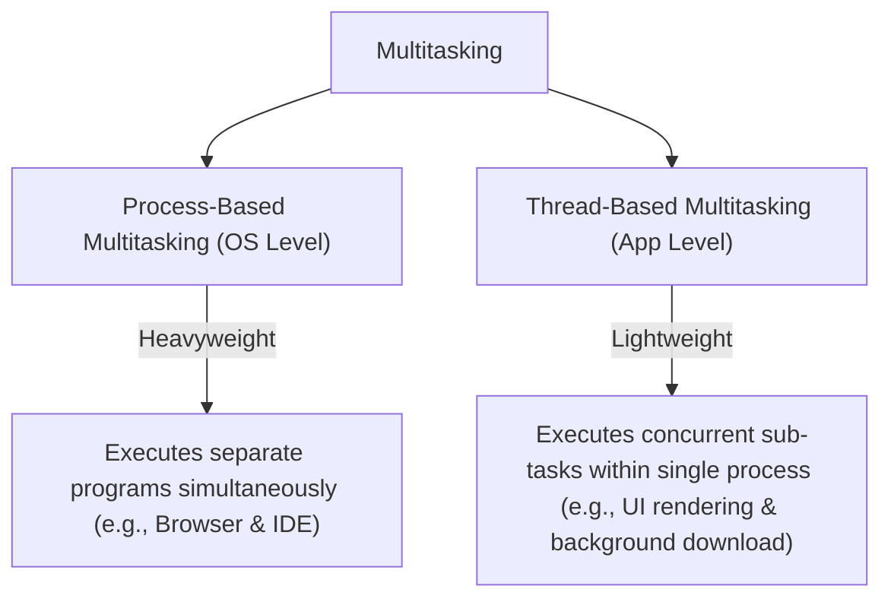
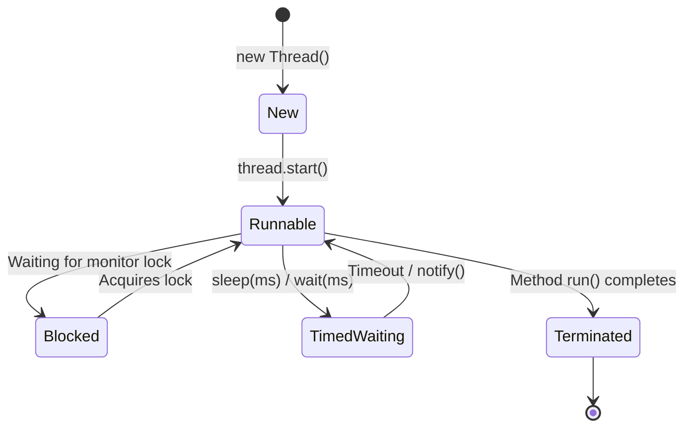

# JAVA - CHAPTER 12
## Multithreading

> "Multithreading unlocks hardware parallelism, enabling concurrent execution paths that maximize CPU core utilization."

### By the End of This Chapter, You Will Be Able To:
* Distinguish Process-based Multitasking from Thread-based Multitasking.
* Trace the 5 Thread Lifecycle States (New, Runnable, Blocked, Timed Waiting, Terminated).
* Create and launch threads by extending `Thread` and implementing `Runnable`.
* Explain Thread Scheduler mechanics (FCFS, Time-Slicing, Preemptive Priority).
* Configure Daemon Threads, Thread Pools (`ExecutorService`), and JVM Shutdown Hooks.

---

### 1. Process vs. Thread Multitasking

**Multitasking** allows CPUs to execute multiple tasks concurrently.



#### Comparison Matrix

| Property | Process | Thread |
| :--- | :--- | :--- |
| **Definition** | An operating system level executing program instance. | A lightweight sub-path of execution inside a process. |
| **Memory Access** | Isolated memory space per process. | Shares process Heap memory and static memory. |
| **Creation Cost** | High creation and context-switching overhead. | Low creation and fast context-switching overhead. |
| **Inter-communication** | Requires IPC (Inter-Process Communication, Sockets, Pipes). | Shares heap memory directly (Fast, but requires synchronization). |

---

### 2. The 5 Thread Lifecycle States



1. **New**: Thread instance created using `new`, but `start()` has not been invoked.
2. **Runnable**: Thread is ready for execution and waiting for CPU allocation from the Thread Scheduler.
3. **Blocked / Waiting**: Thread is paused waiting for a monitor lock or notify signal.
4. **Timed Waiting**: Thread is sleeping or waiting for a specified time interval (`Thread.sleep(1000)`).
5. **Terminated (Dead)**: Thread's `run()` method has completed execution.

---

### 3. Thread Creation: `Thread` Class vs. `Runnable` Interface

#### Approach A: Extending `Thread` Class
```java
class WorkerTask extends Thread {
    @Override
    public void run() {
        System.out.println("Thread extending Thread class running: " + Thread.currentThread().getName());
    }
}
```

#### Approach B: Implementing `Runnable` Interface (Preferred Best Practice)
Implementing `Runnable` is preferred because Java does not support multiple class inheritance; extending `Thread` prevents extending any other parent class.

```java
public class ThreadCreationDemo {
    public static void main(String[] args) {
        // Approach A execution
        WorkerTask t1 = new WorkerTask();
        t1.start(); // Spawns new native thread and invokes run()

        // Approach B execution (Runnable with Lambda expression)
        Runnable task = () -> {
            for (int i = 1; i <= 3; i++) {
                System.out.println(Thread.currentThread().getName() + " processing step " + i);
                try {
                    Thread.sleep(500); // Timed Waiting state
                } catch (InterruptedException e) {
                    Thread.currentThread().interrupt();
                }
            }
        };

        Thread t2 = new Thread(task, "Worker-Thread-2");
        t2.start();
    }
}
```

> [!WARNING]
> **`start()` vs `run()`**
> Always invoke `t.start()`. Calling `t.run()` directly does NOT launch a new thread; it simply executes `run()` synchronously on the current main thread!

---

### 4. Thread Scheduler & Priority Scheduling

The JVM **Thread Scheduler** determines which `Runnable` thread gets CPU execution slices.

#### Scheduling Algorithms
1. **Preemptive Priority Scheduling**: Higher priority threads ($1$ to $10$, default $5$) preempt lower priority threads.
2. **Time-Slicing (Round Robin)**: Equal priority threads share CPU time slices sequentially.
3. **First-Come, First-Served (FCFS)**: Threads are picked in order of readiness.

---

### 5. Thread Pools, Daemon Threads, & Shutdown Hooks

#### A. Thread Pools (`ExecutorService`)
Creating raw `new Thread()` instances for thousands of short-lived tasks degrades performance. **Thread Pools** reuse a fixed set of worker threads:

```java
import java.util.concurrent.ExecutorService;
import java.util.concurrent.Executors;

public class ThreadPoolDemo {
    public static void main(String[] args) {
        // Create pool with 3 reusable worker threads
        ExecutorService pool = Executors.newFixedThreadPool(3);

        for (int i = 1; i <= 5; i++) {
            final int taskId = i;
            pool.execute(() -> {
                System.out.println("Executing Task " + taskId + " via " + Thread.currentThread().getName());
            });
        }

        pool.shutdown(); // Gracefully shutdown pool after tasks complete
    }
}
```

#### B. Daemon Threads & JVM Shutdown Hooks
- **Daemon Thread**: Background service threads (e.g., Garbage Collector). The JVM exits automatically when only daemon threads remain running (`thread.setDaemon(true)`).
- **Shutdown Hook**: A cleanup thread registered with `Runtime.getRuntime().addShutdownHook()` executed automatically when the JVM shuts down.

```java
public class ShutdownHookDemo {
    public static void main(String[] args) {
        Runtime.getRuntime().addShutdownHook(new Thread(() -> {
            System.out.println("[SHUTDOWN HOOK]: JVM Exiting! Flushing logs and closing connection pools...");
        }));

        System.out.println("Main application running...");
    }
}
```

---

### ✏ Try It Yourself
1. Create two threads: `OddPrinter` and `EvenPrinter`. Use `Thread.sleep()` to make them print numbers 1 through 10 in staggered sequence.
2. Create an `ExecutorService` with a fixed pool of 4 threads and submit 10 tasks calculating factorials.

---

### Chapter Summary

#### Key Takeaways
* **Threads** are lightweight sub-paths of execution sharing process heap memory.
* The 5 Thread Lifecycle states are **New, Runnable, Blocked, Timed Waiting, and Terminated**.
* Prefer implementing **`Runnable`** or using **`ExecutorService`** thread pools over extending `Thread`.
* Calling **`start()`** allocates a new native OS thread; calling `run()` executes synchronously on the current thread.
* **Daemon Threads** execute background tasks and do not prevent the JVM from exiting.

---

> [!TIP]
> **Prepare for your Chapter Exam!**
> You have completed reading Chapter 12. Head to the **Take Chapter Quiz** assessment below to test your knowledge and unlock Chapter 13!

