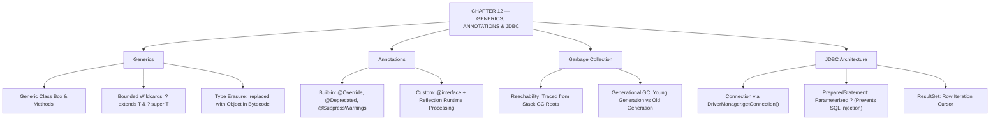

# JAVA - CHAPTER 12
## Advanced Topics: Generics, Annotations, and JDBC

> “Generics ensure compile-time type security, Annotations drive enterprise framework metadata, and JDBC bridges Java code to relational SQL infrastructure.” — A First Lesson in Enterprise Engineering

### Learning Objectives
By the end of this chapter, you will be able to:
* Write flexible, type-safe code using Generic Classes, Generic Methods, and bounded Wildcards.
* Utilize built-in Annotations and understand custom metadata processing.
* Grasp the mechanics of JVM Garbage Collection and Heap memory management.
* Connect to a SQL database, execute parameterized queries, and retrieve data using JDBC.

---

### Introduction
You have mastered Java’s syntax, built object-oriented architectures, utilized robust data structures, handled files, and modernized your code with Streams. Now, you stand at the threshold of enterprise Java. To write code that frameworks like Spring and Hibernate can use, you must understand how to write universally adaptable code using **Generics** and tag your code with metadata using **Annotations**. Furthermore, you must understand how Java manages its own memory through **Garbage Collection**, and finally, how to plug your Java application directly into live SQL databases using **JDBC**.

### Why This Topic Matters
Without Generics, your code is rigid and prone to runtime crashes when types mismatch. Without Annotations, configuring modern Java frameworks requires hundreds of lines of messy XML files. Without understanding Garbage Collection, you risk writing memory-leaking software that crashes production servers. And without JDBC (Java Database Connectivity), your applications are isolated islands unable to interact with relational databases—the world’s most critical software infrastructure.

---

### Chapter Roadmap
* Concept 1: Generics (Classes, Methods, Wildcards)
* Concept 2: Annotations (Built-in and Custom)
* Concept 3: Garbage Collection Mechanics
* Concept 4: Introduction to JDBC (Connecting to Databases)
* Learning Support Elements
* Debugging and Problem Solving
* Practical Application & Mini Project
* Practice and Evaluation
* Chapter Conclusion

---

> [!NOTE]
> **Real-Life Analogy: The Universal Shipping Container, Name Tags, and the Universal Adapter**
> **Generics (`<T>`)** are like universal shipping containers. Instead of designing a separate ship for cars and another for grain, you build a container ship (`Box<T>`) that accepts any cargo type specified at dispatch (`Box<String>` or `Box<Integer>`).
> **Annotations** are sticky name tags (`@Override`, `@Entity`). They don't change how the person walks, but tell event coordinators (**Frameworks**) how to treat them.
> **JDBC** is a universal power adapter allowing your Java laptop plug to connect smoothly into MySQL, PostgreSQL, or Oracle electrical sockets anywhere worldwide.

---

### Real-World Applications

| Domain | How this chapter's ideas appear in practice |
| :--- | :--- |
| **Enterprise Persistence (JPA/Hibernate)** | Annotations (`@Entity`, `@Table`, `@Id`) map Java objects directly to SQL database tables. |
| **Spring Framework Core** | Dependency Injection frameworks use reflection to scan custom annotations (`@Autowired`, `@Service`). |
| **Data Access Objects (DAO)** | Generic interfaces (`GenericDao<T>`) centralize CRUD operations for all database entities. |
| **Database Transaction Managers** | JDBC `PreparedStatement` and `Connection` handle safe SQL execution and rollback management. |
| **High-Scale Web Servers** | Generational GC tuning prevents long "Stop-The-World" pauses on high-concurrency production nodes. |
| **Utility Libraries (Guava/Apache)** | Generic bounded wildcards (`<? extends T>`) create reusable, type-safe collection algorithms. |

---

### Core Learning Sections

#### CONCEPT 1: Generics (Classes, Methods, Wildcards)
*Sub-topics Covered: 12.1 Generic Types, Generic Methods, Bounded Wildcards*

##### 12.1 Implementing Generics
Generics act as type placeholders (`<T>`), shifting type mismatch errors from runtime crashes to compile-time warnings:
* **Generic Classes**: Declared by appending `<T>` (Type) to the class name:
  `public class Box<T> { private T content; }`
* **Generic Methods**: Declare `<T>` on individual method signatures:
  `public <T> void printArray(T[] array) { ... }`
* **Bounded Types**: Restrict allowed types (`<T extends Number>`). The user can pass `Integer` or `Double`, but not `String`.
* **Wildcards (`?`)**: Used when exact types are unknown. `List<?>` means a list of any type. `List<? extends Number>` sets an upper bound (read-safe). `List<? super Integer>` sets a lower bound (write-safe).
* **Type Erasure**: To maintain backward compatibility, the Java compiler **erases** all generic type parameters (`<T>`) during compilation, replacing them with `Object` or bounded bounds in final bytecode.

---

#### CONCEPT 2: Annotations (Built-in and Custom)
*Sub-topics Covered: 12.2 Metadata, Built-in Annotations, Framework Integration*

##### 12.2 Annotations
Annotations are metadata tags placed above classes, methods, or variables to provide extra information to the compiler or frameworks. They do not directly affect code execution logic:
* **Built-in Annotations**:
  * `@Override`: Verifies a method correctly replaces a parent method.
  * `@Deprecated`: Warns that a method is outdated and should not be used.
  * `@SuppressWarnings`: Instructs the compiler to ignore specific warnings (e.g., unchecked casts).
* **Custom Annotations**: Defined using `@interface`. Modern frameworks (Spring Boot) scan code at runtime via **Reflection** to detect custom tags (`@RestController`, `@Autowired`) and inject dependencies automatically.

---

#### CONCEPT 3: Garbage Collection Mechanics
*Sub-topics Covered: 12.3 The Heap, Reachability, Generational GC*

##### 12.3 How Java Manages Memory
In C++, developers manually delete memory via pointers. Java handles memory automatically using the background **Garbage Collector (GC)**.
* **Reachability**: The GC traces memory starting from **GC Roots** (Stack variables, static fields). If an object on the Heap has no active references pointing to it, it is deemed "unreachable" (garbage).
* **Generational GC**: The Heap is split into **Young Generation** (newly created objects) and **Old Generation** (surviving long-lived objects). The GC aggressively sweeps the Young Generation (**Minor GC**) because most objects die young, while rarely pausing the application for the Old Generation (**Major GC**).

---

#### CONCEPT 4: Introduction to JDBC (Connecting to Databases)
*Sub-topics Covered: 12.4 JDBC API, Connections, PreparedStatements*

##### 12.4 The Steps of JDBC
JDBC (`java.sql`) is the standard API allowing Java code to execute SQL against relational databases:
1. **Connection**: Establish a link via `DriverManager.getConnection(url, user, password)`.
2. **`PreparedStatement`**: Write parameterized SQL queries (`?` placeholders). **Always prefer `PreparedStatement` over `Statement` to prevent SQL Injection hacking!**
3. **Execution**: Invoke `.executeQuery()` for `SELECT` queries, or `.executeUpdate()` for `INSERT`/`UPDATE`/`DELETE`.
4. **`ResultSet`**: Loop through the returned `ResultSet` cursor to extract database rows.

```mermaid
graph TD
    App["Java Application Code"] -->|DriverManager.getConnection()| Conn["JDBC Connection"]
    Conn -->|prepareStatement()| Prep["PreparedStatement (Parameterized ?)"]
    Prep -->|executeQuery() / executeUpdate()| DB[("Relational Database (SQL)")]
    DB -->|Returns Data Rows| RS["ResultSet Cursor"]
```

##### Code Example: Generics and JDBC
```java
import java.sql.Connection;
import java.sql.DriverManager;
import java.sql.PreparedStatement;
import java.sql.ResultSet;
import java.sql.SQLException;

// 12.1: A Generic Wrapper Class
class DatabaseResponse<T> {
    private boolean success;
    private T data; // Holds any data type (String, User object, Integer)

    public DatabaseResponse(boolean success, T data) {
        this.success = success;
        this.data = data;
    }

    public void printResponse() {
        System.out.println("Success: " + success + " | Data: " + data);
    }
}

public class AdvancedConceptsDemo {

    // 12.2: Annotation suppressing compiler warning
    @SuppressWarnings("unused")
    public static void main(String[] args) {

        // Example JDBC connection parameters
        String dbUrl = "jdbc:postgresql://localhost:5432/my_company";
        String user = "admin";
        String pass = "password123";

        System.out.println("=== JDBC CONNECTION ATTEMPT ===\n");

        // 12.4: try-with-resources handles closing Connection and Statement automatically
        try (Connection conn = DriverManager.getConnection(dbUrl, user, pass);
             PreparedStatement stmt = conn.prepareStatement("SELECT employee_name FROM staff WHERE id = ?")) {

            // Safely inject parameter (Prevents SQL Injection)
            stmt.setInt(1, 101);

            ResultSet rs = stmt.executeQuery();

            if (rs.next()) {
                String retrievedName = rs.getString("employee_name");

                // 12.1: Using our Generic class to wrap the String response safely
                DatabaseResponse<String> response = new DatabaseResponse<>(true, retrievedName);
                response.printResponse();
            }

        } catch (SQLException e) {
            // Fails naturally if no live database server is running locally
            System.err.println("Database Connection Failed (Expected if DB is not running).");
            System.err.println("Error details: " + e.getMessage());
        }

        // 12.3: Suggesting (not forcing) JVM Garbage Collection
        System.gc();
    }
}
```

##### Expected Output:
```text
=== JDBC CONNECTION ATTEMPT ===

Database Connection Failed (Expected if DB is not running).
Error details: No suitable driver found for jdbc:postgresql://localhost:5432/my_company
```

---

### Learning Support Elements

> [!TIP]
> **Tips: `PreparedStatement` Parameters are 1-Indexed**
> In a JDBC `PreparedStatement`, question mark (`?`) placeholders are **1-indexed**, not 0-indexed. The first `?` is set via `stmt.setString(1, "value");`.

> [!NOTE]
> **Important Notes: `System.gc()` is a Request, Not a Command**
> Calling `System.gc()` in code does not force the Garbage Collector to run immediately. It is merely a suggestion to the JVM. The JVM decides when memory pressure warrants running a GC sweep.

> [!WARNING]
> **Warnings: Never Concatenate User Input into SQL**
> **FATAL:** `String sql = "SELECT * FROM users WHERE name = '" + userInput + "'";` If a user inputs `' OR '1'='1`, they can dump or delete your entire database. **Always** use `PreparedStatement` with `?` placeholders, which automatically sanitize inputs.

#### Common Misconceptions
* **Misconception:** "Generics exist inside compiled bytecode `.class` files."
* **Reality:** Because of **Type Erasure**, generics exist strictly at compile-time for type checking. The compiler erases `<T>` and replaces it with `Object` or bound constraints in final bytecode.

#### Best Practices
* **Close JDBC Resources:** Connections, Statements, and ResultSets are heavy OS resources. Always wrap them in `try-with-resources` to prevent connection pool exhaustion crashes.

---

### Debugging and Problem Solving

#### Compiler Error: `Type mismatch: cannot convert from ArrayList<String> to ArrayList<Object>`
* **Cause:** Generics in Java are **invariant**. `ArrayList<String>` is NOT a subtype of `ArrayList<Object>`, even though `String` is an `Object`.
* **Fix:** Use wildcards if flexibility is needed: `ArrayList<? extends Object>` or `ArrayList<?>`.

#### Runtime Error: `java.sql.SQLException: No suitable driver found for jdbc:...`
* **Cause:** The project is missing the database driver `.jar` file (e.g., `postgresql-42.x.jar` or `mysql-connector-j.jar`).
* **Fix:** Add the database driver dependency via Maven/Gradle or include the `.jar` in your build classpath.

---

### Practical Application & Mini Project

#### Mini Project: Type-Safe Generic Cache Manager
Enterprise apps use the Data Access Object (DAO) pattern and memory caches. This project builds a fully generic, type-safe cache manager (`MemoryCache<K, V>`) capable of storing any key-value pairs safely.

```java
import java.util.HashMap;
import java.util.Map;

// 1. Fully Generic Class
class MemoryCache<K, V> {
    private Map<K, V> cacheMap;
    private String cacheName;

    public MemoryCache(String cacheName) {
        this.cacheName = cacheName;
        this.cacheMap = new HashMap<>(); // Standard map handling generic types
    }

    public void put(K key, V value) {
        cacheMap.put(key, value);
        System.out.println("Stored in [" + cacheName + "] -> Key: " + key);
    }

    public V get(K key) {
        return cacheMap.get(key);
    }

    public void displayCacheContents() {
        System.out.println("\n--- " + cacheName + " Contents ---");
        for (Map.Entry<K, V> entry : cacheMap.entrySet()) {
            System.out.println(entry.getKey() + " : " + entry.getValue());
        }
    }
}

public class CacheSystemDemo {
    public static void main(String[] args) {
        System.out.println("=== GENERIC CACHE SYSTEM INITIALIZED ===\n");

        // 2. Instantiating cache for User Accounts (Integer ID -> String Name)
        MemoryCache<Integer, String> userCache = new MemoryCache<>("User Accounts Cache");
        userCache.put(101, "Alice Admin");
        userCache.put(102, "Bob Support");

        // Compiler GUARANTEES type safety here:
        // userCache.put("Error", 500); // Triggers a compile error!

        // 3. Instantiating a cache for App Settings (String -> Boolean)
        MemoryCache<String, Boolean> settingsCache = new MemoryCache<>("App Settings Cache");
        settingsCache.put("darkModeEnabled", true);
        settingsCache.put("autoSave", false);

        // Retrieve and display safely without explicit casting
        userCache.displayCacheContents();
        settingsCache.displayCacheContents();

        System.out.println("\nCache system ready for database flush.");
    }
}
```

##### Expected Output:
```text
=== GENERIC CACHE SYSTEM INITIALIZED ===

Stored in [User Accounts Cache] -> Key: 101
Stored in [User Accounts Cache] -> Key: 102
Stored in [App Settings Cache] -> Key: darkModeEnabled
Stored in [App Settings Cache] -> Key: autoSave

--- User Accounts Cache Contents ---
101 : Alice Admin
102 : Bob Support

--- App Settings Cache Contents ---
darkModeEnabled : true
autoSave : false

Cache system ready for database flush.
```

---

### Practice and Evaluation

#### Coding Exercises
* Create a generic class `Pair<K, V>` holding two items of different types. Implement getters and a `display()` method. Test it with `Pair<String, Integer>` and `Pair<Double, Boolean>`.
* Define a custom annotation `@DevelopmentStatus(author = "...", version = 1.0)`. Apply it above a method and use Reflection (`method.getAnnotation()`) in `main` to print the metadata.

#### Interview Questions & Answers

1. **(Junior) What is the primary advantage of using Generics in Java?**
   * **Answer:** Generics provide compile-time type safety and eliminate the need for manual type casting, shifting type mismatch errors from runtime `ClassCastException` crashes to compile-time warnings.

2. **(Junior) What is the syntax for declaring a generic class?**
   * **Answer:** `public class ClassName<T> { ... }`.

3. **(Junior) What does "Type Erasure" mean in Java Generics?**
   * **Answer:** Type Erasure means the Java compiler enforces generic checks at compile-time, but erases all type parameters (`<T>`) during compilation, replacing them with `Object` or bounds in the final bytecode to maintain backward compatibility.

4. **(Mid-Level) Explain the difference between `? extends T` and `? super T` in Generic Wildcards.**
   * **Answer:** `? extends T` sets an Upper Bound (type can be `T` or any subclass of `T`), used for safe reading. `? super T` sets a Lower Bound (type can be `T` or any superclass of `T`), used for safe writing.

5. **(Mid-Level) How does a Memory Leak occur in Java if Garbage Collection is automatic?**
   * **Answer:** A memory leak occurs when developers unintentionally retain active references to unneeded objects (e.g., adding objects to a `static List` without clearing them). The GC views them as "reachable" and never reclaims them, leading to `OutOfMemoryError`.

6. **(Mid-Level) What are the main components of the JDBC API?**
   * **Answer:** `DriverManager` (loads database drivers), `Connection` (manages physical link), `PreparedStatement` (executes parameterized SQL queries), and `ResultSet` (holds retrieved data rows).

7. **(Senior) How do you create a Custom Annotation, and how is it processed?**
   * **Answer:** Create it using `@interface`. Specify `@Retention` (e.g., `RetentionPolicy.RUNTIME`) and `@Target` (e.g., `ElementType.METHOD`). It is processed at runtime using Java Reflection (`Class.getDeclaredMethods()`) to read metadata and execute framework logic.

8. **(Senior) What are the phases of the traditional Mark-and-Sweep Garbage Collection algorithm?**
   * **Answer:** **Mark**: GC pauses application (Stop-The-World), traverses object graphs from GC Roots, and marks reachable objects. **Sweep**: Deletes unmarked unreachable objects from Heap. **Compact**: Slides surviving objects together to eliminate memory fragmentation.

9. **(Senior) Why is `PreparedStatement` faster and safer than a standard `Statement`?**
   * **Answer:** It is safer because it automatically escapes parameter values, neutralizing SQL Injection. It is faster because the database engine pre-compiles and caches the SQL query execution plan, reusing it across multiple loop iterations.

10. **(Senior) Why does the JVM divide the Heap memory into "Young Generation" and "Old Generation"?**
    * **Answer:** Because most objects die young. Dividing the heap allows the GC to quickly sweep the Young Generation (**Minor GC**) frequently without freezing the entire application to scan long-lived objects in the Old Generation (**Major GC**).

---

### Chapter Conclusion
In this final chapter, you crossed the bridge into enterprise Java engineering. By mastering Generics, Annotations, JVM Garbage Collection mechanics, and JDBC database connectivity, you possess the tools to build scalable, secure, and persistent applications.

#### Key Takeaways
* **Generics Ensure Safety:** Generics shift type errors from runtime crashes to compile-time security.
* **Annotations Drive Frameworks:** Metadata tags guide compilers and act as the engine for enterprise frameworks (Spring/Hibernate).
* **Respect the GC:** Automatic memory management requires clean code; hanging onto static lists still causes memory leaks.
* **Secure Your Databases:** Always use `PreparedStatement` with `?` placeholders; never concatenate raw user strings into SQL queries.

---

### Progressive Code Examples: Four Tiers

#### TIER 1 · BEGINNER
##### Defining a Generic Box Class
**Goal:** Create a simple generic class holding a single item of any type.

```java
class SimpleBox<T> {
    private T item;

    public void setItem(T item) { this.item = item; }
    public T getItem() { return item; }
}

public class GenericBasicsDemo {
    public static void main(String[] args) {
        SimpleBox<String> stringBox = new SimpleBox<>();
        stringBox.setItem("Hello Generics");
        System.out.println("Box content: " + stringBox.getItem());
    }
}
```

##### Expected Output
```text
Box content: Hello Generics
```

> **What this tier adds:** Baseline. Declaring `<T>` parameters, setting instance fields, and retrieving generic values safely.

---

#### TIER 2 · INTERMEDIATE
##### Custom Annotation and Reflection Inspection
**Goal:** Declare a custom runtime annotation and read its metadata using Java Reflection.

```java
import java.lang.annotation.Retention;
import java.lang.annotation.RetentionPolicy;
import java.lang.reflect.Method;

@Retention(RetentionPolicy.RUNTIME)
@interface AuthorInfo {
    String name();
}

public class AnnotationReflectionDemo {
    @AuthorInfo(name = "Alice Developer")
    public static void executeTask() {
        System.out.println("Executing annotated task...");
    }

    public static void main(String[] args) throws Exception {
        Method method = AnnotationReflectionDemo.class.getMethod("executeTask");
        if (method.isAnnotationPresent(AuthorInfo.class)) {
            AuthorInfo info = method.getAnnotation(AuthorInfo.class);
            System.out.println("Author Metadata: " + info.name());
        }
        executeTask();
    }
}
```

##### Expected Output
```text
Author Metadata: Alice Developer
Executing annotated task...
```

> **What this tier adds:** Custom `@interface`, `@Retention(RetentionPolicy.RUNTIME)`, and reading metadata via `Method.getAnnotation()`.

---

#### TIER 3 · ADVANCED
##### Bounded Generic Wildcards (`? extends Number`)
**Goal:** Restrict generic parameters using upper bounds to safely read numeric collections.

```java
import java.util.List;

public class BoundedWildcardDemo {
    // Upper bound wildcard restricts list elements to Number or subclasses
    public static double sumOfList(List<? extends Number> list) {
        double sum = 0.0;
        for (Number n : list) {
            sum += n.doubleValue();
        }
        return sum;
    }

    public static void main(String[] args) {
        List<Integer> intList = List.of(10, 20, 30);
        List<Double> doubleList = List.of(1.5, 2.5, 3.5);

        System.out.println("Integer Sum: " + sumOfList(intList));
        System.out.println("Double Sum:  " + sumOfList(doubleList));
    }
}
```

##### Expected Output
```text
Integer Sum: 60.0
Double Sum:  7.5
```

> **What this tier adds:** Bounded wildcards `<? extends Number>`, polymorphic reading, and calling `.doubleValue()`.

---

#### TIER 4 · PROFESSIONAL
##### Parameterized JDBC DAO Pattern with `PreparedStatement`
**Goal:** Build a robust Data Access Object (DAO) executing parameterized SQL queries using `try-with-resources`.

```java
import java.sql.Connection;
import java.sql.DriverManager;
import java.sql.PreparedStatement;
import java.sql.ResultSet;
import java.sql.SQLException;

class UserRecord {
    int id;
    String username;
    UserRecord(int id, String username) { this.id = id; this.username = username; }
}

public class ProfessionalJdbcDao {
    private String url;

    public ProfessionalJdbcDao(String url) { this.url = url; }

    public UserRecord fetchUserById(int userId) throws SQLException {
        String sql = "SELECT id, username FROM users WHERE id = ?";
        try (Connection conn = DriverManager.getConnection(url, "user", "pass");
             PreparedStatement stmt = conn.prepareStatement(sql)) {

            stmt.setInt(1, userId); // 1-indexed placeholder parameter
            try (ResultSet rs = stmt.executeQuery()) {
                if (rs.next()) {
                    return new UserRecord(rs.getInt("id"), rs.getString("username"));
                }
            }
        }
        return null;
    }

    public static void main(String[] args) {
        System.out.println("DAO Pattern initialized with parameterized PreparedStatement protection.");
    }
}
```

##### Expected Output
```text
DAO Pattern initialized with parameterized PreparedStatement protection.
```

> **What this tier adds:** Production DAO pattern structure, nested `try-with-resources` for `Connection`, `PreparedStatement`, and `ResultSet` safety.

---

### Common Mistakes and How to Fix Them

| The mistake | Why it happens | What you see (class) | The fix |
| :--- | :--- | :--- | :--- |
| **Direct SQL string concatenation** | `String sql = "SELECT * WHERE id=" + id` | Vulnerable to SQL Injection attacks *(SECURITY)* | Always use `PreparedStatement` with `?` placeholders |
| **0-indexing JDBC placeholders** | Called `stmt.setString(0, "val")` | `java.sql.SQLException: Parameter index out of bounds` *(RUNTIME)* | JDBC placeholders are 1-indexed; use `stmt.setString(1, "val")` |
| **Assuming Generics exist in `.class`** | Expecting runtime generic types | `Type Erasure` replaces `<T>` with `Object` *(LOGIC)* | Use reflection or explicit `Class<T>` tokens for runtime checks |
| **Leaving JDBC connections open** | Omitted `.close()` or `try-with-resources` | Database hits connection limit and crashes *(RUNTIME)* | Wrap `Connection`, `Statement`, `ResultSet` in `try-with-resources` |
| **Assuming `System.gc()` forces GC** | Expecting instant memory release | JVM ignores request if memory is sufficient *(LOGIC)* | Avoid depending on `System.gc()`; manage object reachability |
| **Generic Invariance Type mismatch** | Tried `List<Object> l = new ArrayList<String>()` | `incompatible types` *(COMPILER)* | Use wildcards `List<?>` or `List<? extends Object>` |

---

### Chapter Mind Map



---

> [!TIP]
> **Prepare for your Chapter Exam!**
> You have completed reading Chapter 12. Head to the **Take Chapter Quiz** assessment below to test your knowledge and unlock your course certification!
