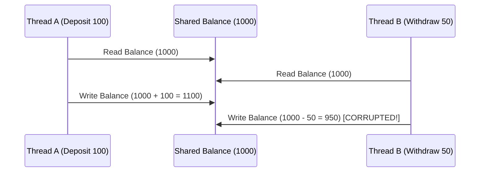
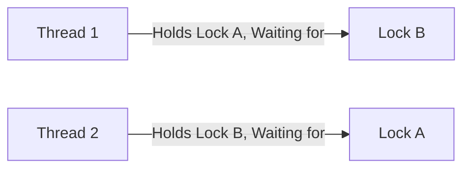

# JAVA - CHAPTER 13
## Synchronization & Concurrent Collections

> "Synchronization coordinates concurrent execution paths to eliminate race conditions while keeping thread contention to a minimum."

### By the End of This Chapter, You Will Be Able To:
* Identify and eliminate Race Conditions and Data Corruption in multithreaded code.
* Use `synchronized` methods, synchronized blocks, and object monitor locks.
* Solve classic concurrency problems like the Producer-Consumer pattern using `wait()`, `notify()`, and `notifyAll()`.
* Recognize Deadlocks, Starvation, and Livelocks, and apply deadlock prevention strategies.
* Utilize Concurrent Collections (`ConcurrentHashMap`, `CopyOnWriteArrayList`, `BlockingQueue`).

---

### 1. Race Conditions & Object Monitor Synchronization

A **Race Condition** occurs when multiple threads concurrently read and mutate shared mutable state without proper synchronization, resulting in unpredictable and corrupted values.



#### The `synchronized` Keyword
Java provides intrinsic object monitor locks via `synchronized`:

```java
public class SynchronizedBank {
    private double balance = 1000.00;
    private final Object lock = new Object(); // Explicit lock object

    // Synchronized Block (Preferred for fine-grained locking)
    public void deposit(double amount) {
        synchronized (lock) {
            double temp = balance + amount;
            balance = temp;
            System.out.println(Thread.currentThread().getName() + " deposited $" + amount + " | Balance: $" + balance);
        }
    }

    // Synchronized Method
    public synchronized void withdraw(double amount) {
        if (balance >= amount) {
            balance -= amount;
            System.out.println(Thread.currentThread().getName() + " withdrew $" + amount + " | Balance: $" + balance);
        }
    }
}
```

---

### 2. Inter-Thread Communication (`wait`, `notify`, `notifyAll`)

Inter-thread communication allows threads to coordinate state changes without polling.

- **`wait()`**: Causes the current thread to release the monitor lock and wait until notified.
- **`notify()`**: Wakes up a single waiting thread on the monitor lock.
- **`notifyAll()`**: Wakes up all waiting threads on the monitor lock.

> [!IMPORTANT]
> **Must Hold Monitor Lock**
> Calling `wait()`, `notify()`, or `notifyAll()` outside a `synchronized` context throws `IllegalMonitorStateException`.

#### Program 13.1 — Producer-Consumer Pattern

```java
import java.util.LinkedList;
import java.util.Queue;

public class ProducerConsumerBuffer {
    private final Queue<Integer> buffer = new LinkedList<>();
    private final int CAPACITY = 5;

    public void produce(int item) throws InterruptedException {
        synchronized (this) {
            while (buffer.size() == CAPACITY) {
                System.out.println("Buffer FULL. Producer waiting...");
                wait(); // Release lock and wait for consumer to drain
            }
            buffer.add(item);
            System.out.println("Produced: " + item);
            notifyAll(); // Notify consumer threads
        }
    }

    public int consume() throws InterruptedException {
        synchronized (this) {
            while (buffer.isEmpty()) {
                System.out.println("Buffer EMPTY. Consumer waiting...");
                wait(); // Release lock and wait for producer to add
            }
            int val = buffer.remove();
            System.out.println("Consumed: " + val);
            notifyAll(); // Notify producer threads
            return val;
        }
    }
}
```

---

### 3. Deadlock Analysis & Prevention

A **Deadlock** occurs when two or more threads are blocked forever, each waiting for a monitor lock held by the other.



#### Deadlock Avoidance Strategy
Always acquire multiple locks in a **consistent global ordering** across all threads:

```java
// Safe Lock Acquisition Order
public void transferMoney(Account acc1, Account acc2, double amount) {
    Account firstLock = acc1.getId() < acc2.getId() ? acc1 : acc2;
    Account secondLock = acc1.getId() < acc2.getId() ? acc2 : acc1;

    synchronized (firstLock) {
        synchronized (secondLock) {
            acc1.withdraw(amount);
            acc2.deposit(amount);
        }
    }
}
```

---

### 4. Concurrent Collections

Legacy synchronized collections (`Vector`, `Hashtable`, `Collections.synchronizedList`) lock the entire data structure for every operation. Java 5 introduced lock-free and segment-locked **Concurrent Collections** in `java.util.concurrent`:

| Collection | Thread-Safety Mechanism | Best Use Case |
| :--- | :--- | :--- |
| **`ConcurrentHashMap`** | Lock striping / CAS (Compare-And-Swap) operations | High-throughput concurrent read/write map operations |
| **`CopyOnWriteArrayList`** | Creates duplicate array copy on every write | Concurrent reads with rare write updates |
| **`ArrayBlockingQueue`** | Thread-safe bounded queue with built-in `put()` and `take()` blocking | Producer-Consumer message queues |

```java
import java.util.concurrent.ConcurrentHashMap;

public class ConcurrentMapDemo {
    public static void main(String[] args) {
        ConcurrentHashMap<String, Integer> pageViews = new ConcurrentHashMap<>();

        // Atomic update using compute()
        pageViews.compute("/home", (key, val) -> (val == null) ? 1 : val + 1);
        System.out.println("Page Views: " + pageViews);
    }
}
```

---

### ✏ Try It Yourself
1. Implement a thread-safe cache using `ConcurrentHashMap`.
2. Write a program with 2 threads sharing an `ArrayBlockingQueue` where Thread 1 produces numbers and Thread 2 consumes them.

---

### Chapter Summary

#### Key Takeaways
* **Race Conditions** occur when non-atomic concurrent access corrupts shared mutable state.
* Use **`synchronized`** methods or blocks to enforce mutual exclusion via JVM monitor locks.
* **`wait()`** and **`notify()`** enable thread coordination inside synchronized contexts.
* Prevent **Deadlocks** by enforcing strict, uniform lock ordering across all thread paths.
* Prefer **Concurrent Collections** (`ConcurrentHashMap`, `BlockingQueue`) over legacy `Hashtable` or `Vector`.

---

> [!TIP]
> **Prepare for your Chapter Exam!**
> You have completed reading Chapter 13. Head to the **Take Chapter Quiz** assessment below to test your knowledge and unlock Chapter 14!

