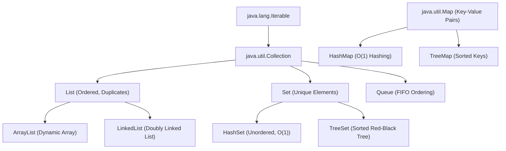

# JAVA - CHAPTER 14
## Collections Framework & Generics

> "The Java Collections Framework standardizes data structure implementations, while Generics enforce type safety at compile time."

### By the End of This Chapter, You Will Be Able To:
* Navigate the Java Collections Hierarchy (`Collection`, `List`, `Set`, `Queue`, `Map`).
* Compare core data structures (`ArrayList` vs `LinkedList`, `HashSet` vs `TreeSet`, `HashMap` vs `TreeMap`).
* Enforce compile-time type safety using Java Generics (`<T>`, `List<T>`).
* Use Generics Wildcards (`?`, `? extends T`, `? super T`) according to the PECS principle.
* Sort collections using `Comparable` and `Comparator`.

---

### 1. The Java Collections Hierarchy



#### Primary Collection Capabilities

| Collection | Ordering | Allows Duplicates? | Internal Data Structure | Complexity |
| :--- | :--- | :--- | :--- | :--- |
| **`ArrayList`** | Insertion Order | Yes | Dynamic Resizable Array | Random Access: $O(1)$, Insert/Delete: $O(n)$ |
| **`LinkedList`** | Insertion Order | Yes | Doubly Linked List | Random Access: $O(n)$, Insert/Delete: $O(1)$ |
| **`HashSet`** | Unordered | **No** | Hash Table | Search/Insert: $O(1)$ average |
| **`TreeSet`** | Sorted Order | **No** | Red-Black Self-Balancing Tree | Search/Insert: $O(\log n)$ |
| **`HashMap`** | Unordered | Keys: **No**, Values: Yes | Hash Table with Buckets | Key Lookup: $O(1)$ average |
| **`TreeMap`** | Sorted Keys | Keys: **No**, Values: Yes | Red-Black Tree | Key Lookup: $O(\log n)$ |

---

### 2. Java Generics & The PECS Principle

**Generics** allow types (classes and methods) to operate on objects of specified types while providing compile-time type safety and eliminating explicit type casts.

#### Generic Classes & Methods

```java
// Generic Class
public class GenericBox<T> {
    private T item;

    public void setItem(T item) { this.item = item; }
    public T getItem() { return item; }

    public static void main(String[] args) {
        GenericBox<String> stringBox = new GenericBox<>();
        stringBox.setItem("Generics in Java");
        String value = stringBox.getItem(); // No explicit (String) cast needed!
    }
}
```

#### Wildcards & PECS Principle
- **PECS**: **P**roducer **E**xtends, **C**onsumer **S**uper.
  - Use `? extends T` when reading items from a collection (**Producer**).
  - Use `? super T` when writing items into a collection (**Consumer**).

```java
import java.util.List;

public class WildcardDemo {
    // Upper Bounded Wildcard (Producer Extends): Read-only number processing
    public static double sumOfList(List<? extends Number> list) {
        double sum = 0.0;
        for (Number num : list) {
            sum += num.doubleValue();
        }
        return sum;
    }

    // Lower Bounded Wildcard (Consumer Super): Writing numbers into list
    public static void addIntegers(List<? super Integer> list) {
        list.add(10);
        list.add(20);
    }
}
```

---

### 3. Sorting Collections: `Comparable` vs `Comparator`

| Aspect | `Comparable<T>` | `Comparator<T>` |
| :--- | :--- | :--- |
| **Package** | `java.lang` | `java.util` |
| **Method** | `int compareTo(T o)` | `int compare(T o1, T o2)` |
| **Sorting Logic** | Defines **Natural Ordering** inside domain class. | Defines **Custom / Multiple Orderings** in external classes or Lambdas. |

```java
import java.util.*;

class Student implements Comparable<Student> {
    int id;
    String name;
    double gpa;

    public Student(int id, String name, double gpa) {
        this.id = id;
        this.name = name;
        this.gpa = gpa;
    }

    // Natural Ordering by ID
    @Override
    public int compareTo(Student other) {
        return Integer.compare(this.id, other.id);
    }
}

public class SortingDemo {
    public static void main(String[] args) {
        List<Student> students = new ArrayList<>();
        students.add(new Student(103, "Chandu", 3.9));
        students.add(new Student(101, "Alice", 3.7));
        students.add(new Student(102, "Bob", 4.0));

        // 1. Sort using Natural Ordering (Comparable)
        Collections.sort(students);

        // 2. Custom Sort by GPA descending using Lambda Comparator
        students.sort((s1, s2) -> Double.compare(s2.gpa, s1.gpa));
    }
}
```

---

### ✏ Try It Yourself
1. Create a `Map<String, Integer>` representing inventory counts for products. Perform add, update, remove, and key iteration operations.
2. Sort a list of `Product` objects by price ascending, and secondary sort by name alphabetically using `Comparator.comparing()`.

---

### Chapter Summary

#### Key Takeaways
* Use **`ArrayList`** for frequent lookups; use **`LinkedList`** for frequent insertions/deletions.
* **`HashSet`** provides $O(1)$ fast uniqueness filtering; **`TreeSet`** maintains sorted elements.
* **Generics** eliminate runtime `ClassCastException` by validating types at compile-time.
* Follow the **PECS rule**: `? extends T` to read (Produce); `? super T` to write (Consume).
* **`Comparable`** sets natural class ordering; **`Comparator`** provides flexible custom sorting routines.

---

### Chapter Quiz & Exercises

#### Multiple Choice Questions
1. Which Collection implementation maintains elements in sorted order with $O(\log n)$ operations?
   - A) `ArrayList`
   - B) `HashSet`
   - C) `TreeSet`
   - D) `LinkedList`
   *Correct Answer: C*

2. According to the PECS principle, which wildcard signature should be used for a method that writes integer data into a collection parameter?
   - A) `List<Integer>`
   - B) `List<? extends Integer>`
   - C) `List<? super Integer>`
   - D) `List<?>`
   *Correct Answer: C*

#### Practice Exercise
Write a program `WordFrequencyCounter.java` that reads a string paragraph, normalizes punctuation, tokenizes words, stores word frequencies in a `HashMap`, and prints top words sorted by frequency using `TreeMap` or `Stream`.
