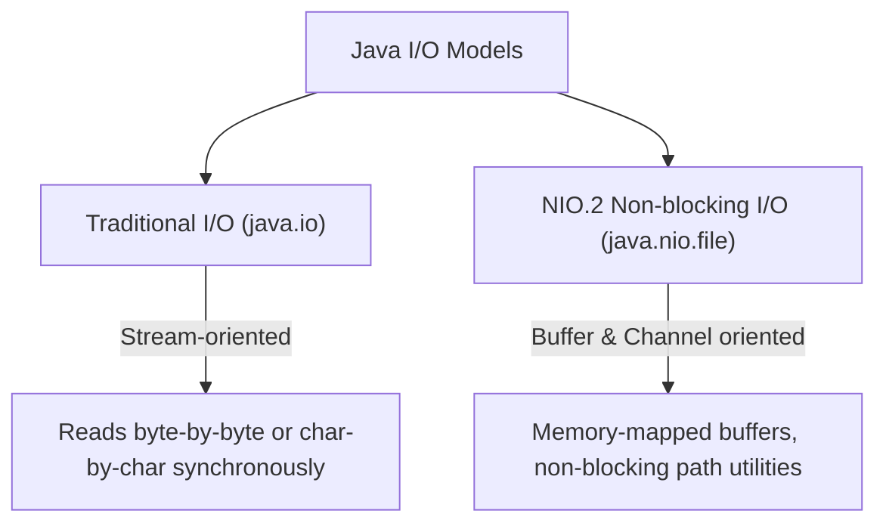
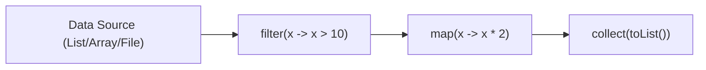

# JAVA - CHAPTER 15
## File I/O, NIO & Streams API

> "Modern Java combines declarative Stream pipelines with high-throughput NIO.2 file channels to process enterprise data at scale."

### By the End of This Chapter, You Will Be Able To:
* Perform Byte Stream (`FileInputStream`/`FileOutputStream`) and Character Stream (`FileReader`/`FileWriter`) operations.
* Utilize Java NIO.2 (`java.nio.file.Path`, `java.nio.file.Files`) for fast file system access.
* Master the Java 8 Streams API (`filter`, `map`, `reduce`, `collect`).
* Distinguish Intermediate Stream operations (lazy evaluation) from Terminal operations.
* Parallelize data processing using Parallel Streams (`parallelStream()`).

---

### 1. Traditional File I/O vs. Java NIO.2

Java provides two primary I/O models:



#### A. Traditional Character Streams with `BufferedReader` / `BufferedWriter`

```java
import java.io.*;

public class ClassicIODemo {
    public static void main(String[] args) {
        File file = new File("output.txt");

        // Writing text
        try (BufferedWriter writer = new BufferedWriter(new FileWriter(file))) {
            writer.write("KnowledgeStream AI Java Track - Chapter 15\n");
            writer.write("Enterprise File I/O Operations\n");
        } catch (IOException e) {
            e.printStackTrace();
        }

        // Reading text
        try (BufferedReader reader = new BufferedReader(new FileReader(file))) {
            String line;
            while ((line = reader.readLine()) != null) {
                System.out.println("Read: " + line);
            }
        } catch (IOException e) {
            e.printStackTrace();
        }
    }
}
```

#### B. Modern Java NIO.2 (`java.nio.file`)

Java 7 NIO.2 simplifies file operations to single-line method calls:

```java
import java.nio.file.*;
import java.io.IOException;
import java.util.List;

public class NIODemo {
    public static void main(String[] args) throws IOException {
        Path path = Paths.get("data.txt");

        // Write lines directly
        Files.write(path, List.of("Line 1: High-Performance NIO.2", "Line 2: Stream Channels"));

        // Read all lines directly
        List<String> lines = Files.readAllLines(path);
        lines.forEach(System.out::println);
    }
}
```

---

### 2. The Java 8 Streams API

A **Stream** is a sequence of elements supporting functional-style pipeline operations (filter, transform, aggregate). Streams do NOT store elements; they compute values on demand.



#### Intermediate vs. Terminal Operations

| Category | Operations | Behavior |
| :--- | :--- | :--- |
| **Intermediate** | `filter()`, `map()`, `sorted()`, `distinct()`, `limit()` | **Lazy Evaluation**: Returned stream pipeline is built but not executed until terminal call. |
| **Terminal** | `collect()`, `forEach()`, `reduce()`, `count()`, `findFirst()` | **Executes Pipeline**: Consumes stream, produces final result or side-effect. |

#### Program 15.1 — Complete Streams Pipeline

```java
import java.util.*;
import java.util.stream.Collectors;

class Transaction {
    private String id;
    private String type; // "CREDIT" or "DEBIT"
    private double amount;

    public Transaction(String id, String type, double amount) {
        this.id = id;
        this.type = type;
        this.amount = amount;
    }

    public String getType() { return type; }
    public double getAmount() { return amount; }
}

public class StreamPipelineDemo {
    public static void main(String[] args) {
        List<Transaction> transactions = List.of(
            new Transaction("T1", "CREDIT", 250.00),
            new Transaction("T2", "DEBIT", 80.00),
            new Transaction("T3", "CREDIT", 1200.00),
            new Transaction("T4", "CREDIT", 450.00),
            new Transaction("T5", "DEBIT", 300.00)
        );

        // Filter CREDIT transactions > $300, sort descending, extract amounts
        List<Double> highCreditAmounts = transactions.stream()
            .filter(t -> t.getType().equals("CREDIT"))
            .filter(t -> t.getAmount() > 300.00)
            .map(Transaction::getAmount)
            .sorted(Comparator.reverseOrder())
            .collect(Collectors.toList());

        System.out.println("High Credit Amounts: " + highCreditAmounts);

        // Reduce to calculate total credit sum
        double totalCredit = transactions.stream()
            .filter(t -> t.getType().equals("CREDIT"))
            .mapToDouble(Transaction::getAmount)
            .sum();

        System.out.println("Total Credit Sum: $" + totalCredit);
    }
}
```

---

### 3. Parallel Streams

Parallel Streams (`parallelStream()`) automatically partition data processing tasks across multiple CPU cores using the JVM **ForkJoinPool**.

```java
import java.util.stream.LongStream;

public class ParallelStreamDemo {
    public static void main(String[] args) {
        long N = 10_000_000L;

        // Sequential Stream Sum
        long start = System.currentTimeMillis();
        long sumSeq = LongStream.rangeClosed(1, N).sum();
        long end = System.currentTimeMillis();
        System.out.println("Sequential Time: " + (end - start) + " ms");

        // Parallel Stream Sum across multi-core CPUs
        start = System.currentTimeMillis();
        long sumPar = LongStream.rangeClosed(1, N).parallel().sum();
        end = System.currentTimeMillis();
        System.out.println("Parallel Time: " + (end - start) + " ms");
    }
}
```

> [!WARNING]
> **Parallel Stream Overhead**
> Parallel streams incur thread partitioning and merging overhead. Use parallel streams primarily for CPU-bound computations with large datasets ($N > 10,000$) and stateless non-interfering functions.

---

### ✏ Try It Yourself
1. Use `Files.lines(Path)` to stream a text log file, filter lines containing `"ERROR"`, map them to uppercase, and write results to `error_log.txt`.
2. Given a list of integers, use Streams to find the average of all even numbers squared.

---

### Chapter Summary

#### Key Takeaways
* **Java NIO.2** (`java.nio.file.Files`, `Path`) provides high-performance, non-blocking file utilities.
* **Streams API** provides declarative functional pipelines (`filter`, `map`, `reduce`).
* **Intermediate Operations** are lazily evaluated; **Terminal Operations** trigger execution.
* **`parallelStream()`** leverages multi-core CPUs via ForkJoinPool for large CPU-intensive workloads.

---

> [!TIP]
> **Congratulations! You have reached the end of the Java Masterclass!**
> Take the final Chapter 15 Quiz Exam below to complete your course certification!

