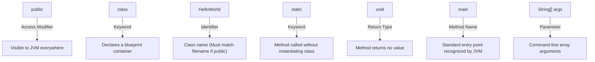
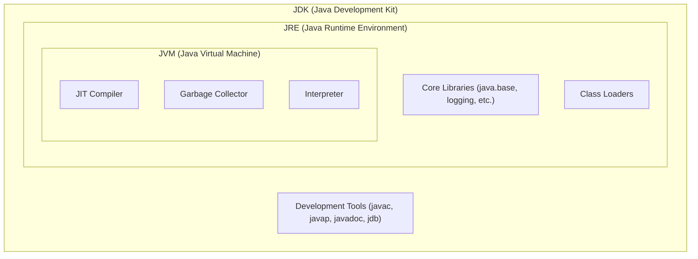
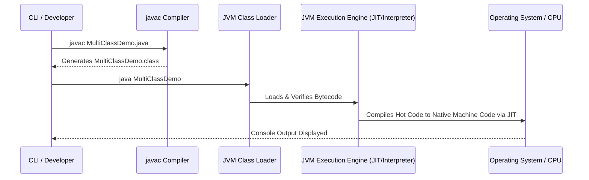

# JAVA - CHAPTER 2
## First Java Program & Architecture

> "Understanding the architecture of the execution engine transforms a developer from a coder into a system architect."

### By the End of This Chapter, You Will Be Able To:
* Deconstruct and explain every keyword in `public static void main(String[] args)`.
* Trace the complete lifecycle of a Java program from source code to JVM execution.
* Distinguish between the roles, contents, and boundaries of JDK, JRE, and JVM.
* Apply Java source file naming rules, public class constraints, and multi-class declarations.
* Use `javac` and `java` commands from the CLI to compile and run multi-class files.

---

### 1. Anatomy of a Basic Java Program

Let's examine a canonical Java program line by line:

```java
public class HelloWorld {
    public static void main(String[] args) {
        System.out.println("Hello, KnowledgeStream AI!");
    }
}
```



#### Detailed Breakdown of Keywords

1. **`public`**: An access modifier. Marking `class HelloWorld` as `public` makes it accessible to any other package or the JVM runtime.
2. **`class`**: Used to declare a new class definition in Java.
3. **`HelloWorld`**: The name of the class. By convention, Java class names use **PascalCase**.
4. **`static`**: Indicates that the `main` method belongs to the class itself rather than an instance of the class. This allows the JVM to invoke `main()` without allocating memory for an object using `new HelloWorld()`.
5. **`void`**: The return type of the method, indicating that `main` does not return any value to the caller.
6. **`main`**: The mandatory entry-point method signature searched for by the JVM when launching a console application.
7. **`String[] args`**: An array of `String` objects representing command-line arguments passed to the application during launch.
8. **`System.out.println()`**: `System` is a final class in `java.lang`, `out` is a static `PrintStream` field inside `System`, and `println()` is a method that prints text to standard output followed by a line break.

> [!WARNING]
> **Case Sensitivity Requirement**
> Java is strictly case-sensitive. `Main` is different from `main`, `System` is different from `system`, and `String` is different from `string`. Mismatched casing causes compilation or runtime linkage errors.

---

### 2. JDK vs. JRE vs. JVM Architecture

To write and run Java applications, you must understand the relationship between the Java Development Kit (JDK), Java Runtime Environment (JRE), and Java Virtual Machine (JVM).



#### Core Architectural Component Matrix

| Component | Full Name | Responsibilities | Target Audience |
| :--- | :--- | :--- | :--- |
| **JVM** | Java Virtual Machine | Abstract computing machine that executes Java Bytecode. Handles Class Loading, JIT compilation, Garbage Collection, and Thread Management. | Execution Engine |
| **JRE** | Java Runtime Environment | Contains JVM + standard runtime class libraries (`java.base`, etc.). Provides everything necessary to execute compiled Java programs. | End Users / Deployments |
| **JDK** | Java Development Kit | Contains JRE + Software Development Tools (`javac`, `javap`, `javadoc`, `jar`, `jdb`). Necessary for creating Java code. | Software Developers |

> [!NOTE]
> **Modern JDK Note (Java 11+)**
> Starting from Java 11, standalone JRE downloads were discontinued by Oracle. The JDK is now distributed as a single unified package containing runtime and development binaries.

---

### 3. Source File Constraints & Multi-Class Rules

Java enforces strict rules regarding how classes are declared within `.java` files:

1. **One Public Class Rule**: A `.java` source file can contain at most **one** `public` top-level class.
2. **File Name Matching**: If a file contains a `public` class, the file name **MUST** exactly match the name of that public class (including casing) with a `.java` extension.
   - Example: `public class BankAccount` must be saved in `BankAccount.java`.
3. **Multiple Non-Public Classes**: A single `.java` file can contain multiple package-private (non-public) classes.
4. **Compilation Output**: Compiling a single `.java` file with $N$ classes generates $N$ separate `.class` files.

#### Program 2.1 — Multi-Class Single File Demonstration

```java
// Saved inside file: MultiClassDemo.java

class Helper {
    static void printMessage() {
        System.out.println("Helper class utility executing...");
    }
}

class Processor {
    void processData() {
        System.out.println("Processing enterprise records...");
    }
}

public class MultiClassDemo {
    public static void main(String[] args) {
        System.out.println("Main method started.");
        Helper.printMessage();
        
        Processor proc = new Processor();
        proc.processData();
    }
}
```

Compiling `MultiClassDemo.java` produces three distinct bytecode artifacts:
- `Helper.class`
- `Processor.class`
- `MultiClassDemo.class`

---

### 4. What Happens at Runtime?



1. **Compilation Phase (`javac`)**: Converts human-readable Java code into bytecode instructions, performing syntax analysis, type checking, and symbol resolution.
2. **Class Loading**: The JVM `ClassLoader` subsystem loads `.class` files into the JVM Memory structure (Method Area / Metaspace).
3. **Bytecode Verification**: Ensures bytecode complies with JVM safety guidelines and does not violate memory access rules.
4. **Execution**: The Execution Engine uses an interpreter for fast initial startup, while the JIT Compiler transforms frequently executed code blocks ("hot spots") into native machine code.

---

### ✏ Try It Yourself
1. Create a file named `Greeting.java` with a main method that prints your name and favorite programming topic.
2. Compile it using:
   ```bash
   javac Greeting.java
   ```
3. Execute the bytecode using:
   ```bash
   java Greeting
   ```
4. Try renaming the file to `greeting.java` while keeping `public class Greeting` and recompile. What error does `javac` produce?

---

### Chapter Summary

#### Key Takeaways
* `public static void main(String[] args)` is the mandatory entry point for standalone Java applications.
* **JDK** contains tools to compile code; **JRE** provides libraries to run code; **JVM** executes the bytecode.
* A Java source file can have only **one public class**, and the file name must match that public class name.
* `javac` translates `.java` files into `.class` bytecode files, which the `java` runtime engine loads and executes.

---

> [!TIP]
> **Prepare for your Chapter Exam!**
> You have completed reading Chapter 2. Head to the **Take Chapter Quiz** assessment below to test your knowledge and unlock Chapter 3!

