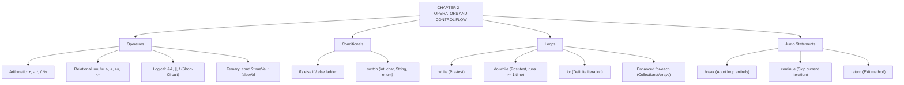

# JAVA - CHAPTER 2
## Operators and Control Flow

> “Control flow and operators are the steering wheel and engine of your Java application.” — A First Lesson in Algorithmic Logic

### Learning Objectives
By the end of this chapter, you will be able to:
* Master Java's operators: Arithmetic, Relational, Logical, and the Ternary operator (`? :`).
* Branch program execution using `if`, `else if`, `else`, and `switch` statements.
* Automate repetitive tasks using `while`, `do-while`, and `for` loops.
* Control loop execution precisely using jump statements like `break` and `continue`.

---

### Introduction
A program that executes line-by-line from top to bottom is predictable, but it isn't very smart. Real-world applications need to make decisions, perform calculations, and repeat tasks. Imagine a video game that cannot loop its frame updates, or a banking app that cannot check if your balance is high enough before transferring funds. Control flow and operators transform static scripts into dynamic, intelligent software capable of reacting to user input and changing conditions.

### Why This Topic Matters
Mastering operators ensures your mathematical and logical computations are perfectly accurate. Understanding control flow—specifically how to branch logic with `if`/`switch` and repeat logic with `for`/`while` loops—is the absolute foundation of algorithmic problem-solving. Furthermore, avoiding classic beginner traps like infinite loops or switch fallthroughs will save you countless hours of debugging.

---

### Chapter Roadmap
* Concept 1: Operators (The Math and Logic Engines)
* Concept 2: Conditional Statements (Decision Making)
* Concept 3: Looping Constructs (Iteration)
* Concept 4: Jump Statements (Loop Control)
* Learning Support Elements
* Debugging and Problem Solving
* Practical Application & Mini Project
* Practice and Evaluation
* Chapter Conclusion

---

> [!NOTE]
> **Real-Life Analogy: Navigating a Highway Junction**
> Think of operators as the steering wheel and accelerator pedal that control your car's trajectory and speed. Conditional statements (`if`/`switch`) are highway exits and forks in the road — depending on whether your fuel gauge reads full or empty (`true` or `false`), you take different paths. Loops (`while`/`for`) are traffic roundabouts: you remain in the loop executing turns repeatedly until your specific exit condition is satisfied.

---

### Real-World Applications

| Domain | How this chapter's ideas appear in practice |
| :--- | :--- |
| **Banking Systems** | `if-else` branching verifies sufficient account balance before executing wire transactions. |
| **E-Commerce Apps** | `do-while` event loops keep interactive CLI terminals or web socket listeners active to process user requests. |
| **Game Engines** | `for` loops iterate through rendering queues and updates position vectors 60 times per second. |
| **Authentication Engines** | Short-circuit logical operators (`&&`, `||`) validate non-null user tokens before checking access rights. |
| **Command Processing** | `switch` statements route incoming HTTP request routes or user menu selections efficiently. |
| **Data Analytics** | `continue` jump statements skip malformed or corrupted data records during dataset batch imports. |

---

### Core Learning Sections

#### CONCEPT 1: Operators (The Math and Logic Engines)
*Sub-topics Covered: 2.1 Arithmetic, Relational, Logical, Assignment, and Ternary Operators*

**Intuitive Explanation:** Operators are symbols that tell the JVM to perform specific mathematical or logical manipulations. They are the verbs of the Java language.

* **Arithmetic Operators**: Perform standard math (`+`, `-`, `*`, `/`, `%`). The modulo operator (`%`) returns the remainder of integer division (e.g., `10 % 3` is `1`).
* **Relational Operators**: Compare two values and always return a `boolean` (`true` or `false`). Includes `==` (equal to), `!=` (not equal to), `>`, `<`, `>=`, `<=`.
* **Logical Operators**: Combine multiple boolean expressions:
  * `&&` (Logical AND): `true` only if *both* sides are true.
  * `||` (Logical OR): `true` if *at least one* side is true.
  * `!` (Logical NOT): Reverses the boolean value.
* **Short-Circuit Evaluation**: Java evaluates logically from left to right. In `A && B`, if `A` is `false`, Java completely skips checking `B` because the overall result cannot possibly be true.
* **The Ternary Operator (`? :`)**: A concise shorthand for a simple `if-else` statement:
  `condition ? value_if_true : value_if_false;`

---

#### CONCEPT 2: Conditional Statements (Decision Making)
*Sub-topics Covered: 2.2 if, else-if, else, and switch*

##### The `if-else` Ladder
Evaluates conditions sequentially from top to bottom. As soon as one condition evaluates to `true`, its block executes, and the rest of the ladder is skipped.

##### The `switch` Statement
When comparing a single variable against many possible exact matches (like checking a menu option from 1 to 5), `switch` is cleaner and faster than a massive `else-if` ladder.
* **Rule 1**: Works with `int`, `char`, `String`, and `enum` types.
* **Rule 2**: You must explicitly include the `break;` keyword at the end of each case. Without it, execution "falls through" and runs the code in subsequent cases unintentionally.

---

#### CONCEPT 3: Looping Constructs (Iteration)
*Sub-topics Covered: 2.3 while, do-while, for, and the Enhanced for-each Loop*

* **`while` Loop (Pre-test)**: Checks the condition *before* running. If the condition is false initially, the loop runs zero times. Used when the iteration count is unknown upfront.
* **`do-while` Loop (Post-test)**: Runs the code block first, then checks the condition at the bottom. This guarantees the loop will execute **at least once**, making it ideal for user input menus.
* **`for` Loop (Definite Iteration)**: Packs initialization, condition, and incrementing into a single line. Used when you know the exact iteration count. Syntax: `for (int i = 0; i < 10; i++) { ... }`
* **Enhanced `for-each` Loop**: Introduced in Java 5, it is the safest way to iterate through arrays or Collections without risking out-of-bounds index errors.

---

#### CONCEPT 4: Jump Statements (Loop Control)
*Sub-topics Covered: 2.4 break, continue, and return*

* **`break`**: Instantly terminates/aborts the loop. The JVM escapes the loop entirely and moves to the line immediately following it.
* **`continue`**: Aborts only the current iteration. It skips the rest of the code block and jumps back to the top of the loop to evaluate the condition for the next round.
* **`return`**: Instantly exits the entire method and hands control (and optionally a return value) back to the caller.

##### Code Example: Logic and Loops
```java
public class ControlFlowDemo {
    public static void main(String[] args) {
        int targetNumber = 7;

        System.out.println("--- FOR LOOP & CONTINUE ---");
        for (int i = 1; i <= 10; i++) {
            // Skip even numbers using the modulo operator and continue
            if (i % 2 == 0) {
                continue;
            }
            System.out.println("Odd number: " + i);

            // Break the loop early if we hit our target
            if (i == targetNumber) {
                System.out.println("Target hit! Aborting loop.");
                break;
            }
        }

        System.out.println("\n--- TERNARY OPERATOR ---");
        int score = 85;
        // Ternary operator replaces a 5-line if-else block
        String result = (score >= 50) ? "Pass" : "Fail";
        System.out.println("Exam Result: " + result);
    }
}
```

##### Expected Output:
```text
--- FOR LOOP & CONTINUE ---
Odd number: 1
Odd number: 3
Odd number: 5
Odd number: 7
Target hit! Aborting loop.

--- TERNARY OPERATOR ---
Exam Result: Pass
```

---

### Learning Support Elements

> [!TIP]
> **Tips: The Ternary Shortcut**
> Whenever you have an `if-else` statement that strictly assigns a single value to a variable based on a condition, use the Ternary Operator (`? :`). It compresses five lines of code into a single, elegant line.

> [!NOTE]
> **Important Notes: Comparing Strings (The Ultimate Trap)**
> In Java, **never** use the `==` operator to compare the actual text of two `String` objects. The `==` operator checks if two variables point to the exact same memory address. To compare the actual characters inside a String, you must use the `.equals()` method:
> * **Wrong:** `if (name == "Alice")`
> * **Correct:** `if (name.equals("Alice"))`

> [!WARNING]
> **Warnings: The Switch Fallthrough**
> If you forget the `break;` statement at the end of a case in a `switch` block, Java will execute that case and then blindly execute all code in subsequent cases below it until it hits a break or the end of the switch block.

#### Common Misconceptions
* **Misconception:** `=` and `==` are interchangeable.
* **Reality:** `=` is the assignment operator (assigns a value to a variable). `==` is the relational operator (checks if two values are equal). Writing `if (x = 5)` instead of `if (x == 5)` will cause a compilation error in Java.

#### Best Practices
* **Always Use Curly Braces:** Even if an `if` statement only contains one line of code, always wrap it in curly braces `{ }`. Omitting them leads to logic errors when a second line is added later.

---

### Debugging and Problem Solving

#### Compiler Error: `unreachable statement`
* **Cause:** Code was placed directly below a `break`, `continue`, or `return` statement inside the same block. The code can never execute.
* **Fix:** Remove or relocate the unreachable code to a valid execution path.

#### Runtime Bug: The Infinite Loop
* **Cause:** A `while` loop condition variable was never updated inside the loop body (e.g., omitting `i++`). The condition remains `true` forever.
* **Fix:** Ensure every loop has a clear mechanism to eventually evaluate its exit condition to `false`.

---

### Practical Application & Mini Project

#### Mini Project: Interactive ATM Menu Simulator
This project brings together the `Scanner` class for console input, a `do-while` loop to keep the interactive session active, and a `switch` statement for command routing.

```java
import java.util.Scanner;

public class ATMSimulator {
    public static void main(String[] args) {
        Scanner scanner = new Scanner(System.in);
        double balance = 1000.00;
        int choice;

        System.out.println("=== WELCOME TO JAVA BANK ===");

        // do-while guarantees the menu shows at least once
        do {
            System.out.println("\n1. Check Balance");
            System.out.println("2. Deposit Money");
            System.out.println("3. Withdraw Money");
            System.out.println("4. Exit");
            System.out.print("Enter your choice: ");

            choice = scanner.nextInt();

            // switch statement to handle the menu selection
            switch (choice) {
                case 1:
                    System.out.println("Current Balance: $" + balance);
                    break; // Prevents fallthrough

                case 2:
                    System.out.print("Enter deposit amount: $");
                    double deposit = scanner.nextDouble();
                    if (deposit > 0) {
                        balance += deposit;
                        System.out.println("Successfully deposited. New balance: $" + balance);
                    } else {
                        System.out.println("Invalid deposit amount.");
                    }
                    break;

                case 3:
                    System.out.print("Enter withdrawal amount: $");
                    double withdrawal = scanner.nextDouble();
                    // Using operators to validate the transaction
                    if (withdrawal > 0 && withdrawal <= balance) {
                        balance -= withdrawal;
                        System.out.println("Please take your cash. New balance: $" + balance);
                    } else {
                        System.out.println("Insufficient funds or invalid amount.");
                    }
                    break;

                case 4:
                    System.out.println("Thank you for banking with us. Goodbye!");
                    break;

                default:
                    System.out.println("Invalid choice. Please select 1-4.");
                    break;
            }
        } while (choice != 4); // Loop continues until user selects 4

        scanner.close();
    }
}
```

##### Expected Output:
```text
=== WELCOME TO JAVA BANK ===

1. Check Balance
2. Deposit Money
3. Withdraw Money
4. Exit
Enter your choice: 1
Current Balance: $1000.0

1. Check Balance
2. Deposit Money
3. Withdraw Money
4. Exit
Enter your choice: 3
Enter withdrawal amount: $500
Please take your cash. New balance: $500.0

1. Check Balance
2. Deposit Money
3. Withdraw Money
4. Exit
Enter your choice: 4
Thank you for banking with us. Goodbye!
```

---

### Practice and Evaluation

#### Coding Exercises
* Write a program using a `for` loop that iterates from 1 to 50. Use the modulo operator (`%`) and an `if-else` block to print `"Fizz"` for multiples of 3, `"Buzz"` for multiples of 5, and the number itself for all other cases.
* Write a `while` loop that continuously halves a starting integer of 100 and prints the result, stopping only when the number is less than 1.

#### Interview Questions & Answers

1. **(Junior) Explain the difference between `break` and `continue`.**
   * **Answer:** `break` immediately terminates the entire loop and transfers execution to the line following the loop block. `continue` terminates only the current iteration, skipping the rest of the block and jumping back to evaluate the loop condition for the next round.

2. **(Junior) Why should you use `.equals()` instead of `==` to compare Strings?**
   * **Answer:** The `==` operator checks for reference equality (whether two variables point to the exact same memory address). The `.equals()` method checks for value equality (whether the character sequence is identical).

3. **(Junior) What is the ternary operator and what is its syntax?**
   * **Answer:** The ternary operator is a concise one-line shorthand for a simple `if-else` statement that returns a value. Its syntax is `condition ? valueIfTrue : valueIfFalse;`.

4. **(Mid-Level) Explain Short-Circuit Evaluation in Java.**
   * **Answer:** Short-circuit evaluation occurs with `&&` and `||`. In `A && B`, if `A` is `false`, the JVM skips evaluating `B` because the overall result is guaranteed to be `false`. In `A || B`, if `A` is `true`, `B` is skipped.

5. **(Mid-Level) What data types are permissible inside a switch statement in Java?**
   * **Answer:** Historically, `switch` accepted `byte`, `short`, `char`, and `int`. Java 5 added support for `enum` types and primitive wrapper classes. Java 7 introduced support for `String`. (`long`, `float`, and `double` are not allowed).

6. **(Mid-Level) What is an infinite loop, and how does it typically occur?**
   * **Answer:** An infinite loop is a loop whose exit condition never evaluates to `false`, causing execution to run endlessly until killed. It usually occurs when a developer forgets to update the loop control variable inside a `while` loop.

7. **(Senior) What is a labeled break statement, and when would you use it?**
   * **Answer:** A standard `break` terminates only the innermost loop. A labeled break (e.g., `break outerLoop;`) allows terminating an outer loop from deep within nested loops, useful in multi-dimensional searches.

8. **(Senior) How did Java 14 modify the switch statement (Switch Expressions)?**
   * **Answer:** Java 14 introduced Switch Expressions, allowing `switch` to return values directly (using `yield` or arrow syntax `case X ->`), which eliminates fallthrough behavior and removes manual `break` statements.

9. **(Senior) Why does `System.out.println(10 + 20 + "Java")` produce different output than `System.out.println("Java" + 10 + 20)`?**
   * **Answer:** Java evaluates expressions left-to-right. `10 + 20 + "Java"` performs integer addition (`30`) then string concatenation (`"30Java"`). `"Java" + 10 + 20` performs string concatenation across all terms (`"Java1020"`).

10. **(Senior) Can you execute a `for` loop without an initialization, condition, or increment block?**
    * **Answer:** Yes. `for (;;)` is valid Java syntax. Omitting all three components defaults the condition to `true`, creating an infinite loop equivalent to `while(true)`.

---

### Chapter Conclusion
Control flow and operators transform your code from a static list of commands into dynamic, decision-making software. By utilizing relational and logical operators, you can evaluate complex truths. With `if` and `switch` statements, your code can navigate different logical pathways. Finally, mastering `for`, `while`, and `do-while` loops allows you to automate repetitive tasks efficiently.

#### Key Takeaways
* **Relational Logic:** Understand short-circuit evaluation (`&&`, `||`) to write safe, optimized conditions.
* **String Comparison:** Use `.equals()` for string contents, never `==`.
* **Loop Selection:** Use `for` for known iteration counts, `while` for unknown counts, and `do-while` when code must execute at least once.
* **Switch Safety:** Include `break` in traditional `switch` statements to prevent unintended fallthrough.

#### What to Learn Next
Now that you can write complex logic and loops, we will move into **Chapter 3: Object-Oriented Programming (OOP) – Part 1**, where you will learn how to design custom Classes, instantiate Objects, and write Methods.

---

### Progressive Code Examples: Four Tiers

#### TIER 1 · BEGINNER
##### Basic Arithmetic and Relational Checking
**Goal:** Perform basic mathematical operations and evaluate boolean conditions.

```java
public class BasicOperators {
    public static void main(String[] args) {
        int a = 15;
        int b = 4;

        int sum = a + b;
        int remainder = a % b;
        boolean isGreater = a > b;

        System.out.println("Sum: " + sum);
        System.out.println("Remainder (15 % 4): " + remainder);
        System.out.println("Is 15 > 4? " + isGreater);
    }
}
```

##### Expected Output
```text
Sum: 19
Remainder (15 % 4): 3
Is 15 > 4? true
```

> **What this tier adds:** Baseline. Shows standard arithmetic, modulo operator `%`, and relational comparison output.

---

#### TIER 2 · INTERMEDIATE
##### Conditional Branching with Switch Expressions
**Goal:** Use modern Java switch expressions for concise value mapping.

```java
public class DayPlanner {
    public static void main(String[] args) {
        String day = "WEDNESDAY";

        String activity = switch (day) {
            case "MONDAY", "FRIDAY" -> "Gym Workout";
            case "TUESDAY", "THURSDAY" -> "Code Review";
            case "WEDNESDAY" -> "Team Sync";
            case "SATURDAY", "SUNDAY" -> "Rest Day";
            default -> "Invalid Day";
        };

        System.out.println("Schedule for " + day + ": " + activity);
    }
}
```

##### Expected Output
```text
Schedule for WEDNESDAY: Team Sync
```

> **What this tier adds:** Modern Java arrow `switch` expressions that return values directly without fallthrough risk.

---

#### TIER 3 · ADVANCED
##### Nested Loops and Labeled Break
**Goal:** Search a 2D grid matrix and break out of nested loop structures immediately upon finding a match.

```java
public class MatrixSearch {
    public static void main(String[] args) {
        int[][] grid = {
            { 1, 3, 5 },
            { 7, 9, 11 },
            { 13, 15, 17 }
        };
        int target = 9;
        boolean found = false;

        searchLoop:
        for (int row = 0; row < grid.length; row++) {
            for (int col = 0; col < grid[row].length; col++) {
                if (grid[row][col] == target) {
                    System.out.println("Found target " + target + " at (" + row + ", " + col + ")");
                    found = true;
                    break searchLoop; // Escapes BOTH loops
                }
            }
        }

        if (!found) System.out.println("Target not found.");
    }
}
```

##### Expected Output
```text
Found target 9 at (1, 1)
```

> **What this tier adds:** 2D array traversal, labeled `break searchLoop` statement for multi-level loop termination.

---

#### TIER 4 · PROFESSIONAL
##### Short-Circuit Guarded Validation Pipeline
**Goal:** Combine short-circuit logical operators to safely evaluate object state without NullPointerExceptions.

```java
public class UserValidator {
    public static boolean isValidUser(String username, String email) {
        // Short-circuiting protects against null reference dereferencing
        return username != null && !username.isBlank() && username.length() >= 3 &&
               email != null && email.contains("@") && email.endsWith(".com");
    }

    public static void main(String[] args) {
        System.out.println("Test 1 (Valid): " + isValidUser("Alice", "alice@example.com"));
        System.out.println("Test 2 (Null Username): " + isValidUser(null, "alice@example.com"));
        System.out.println("Test 3 (Short Username): " + isValidUser("Al", "alice@example.com"));
        System.out.println("Test 4 (Invalid Email): " + isValidUser("Bob", "bob@example"));
    }
}
```

##### Expected Output
```text
Test 1 (Valid): true
Test 2 (Null Username): false
Test 3 (Short Username): false
Test 4 (Invalid Email): false
```

> **What this tier adds:** Defensive programming utilizing `&&` short-circuiting to prevent `NullPointerException` during multi-condition validation pipelines.

---

### Common Mistakes and How to Fix Them

| The mistake | Why it happens | What you see (class) | The fix |
| :--- | :--- | :--- | :--- |
| **Using `==` to compare Strings** | `==` works for primitive values | Unexpected `false` when text is identical *(LOGIC)* | Always use `str1.equals(str2)` for string comparison |
| **Missing `break` in traditional switch** | Switch fallthrough design | Code in subsequent cases executes unexpectedly *(LOGIC)* | Add `break;` at the end of each case or use arrow syntax `->` |
| **Writing `if (x = 5)` instead of `==`** | Confusing assignment with equality | `incompatible types: int cannot be converted to boolean` *(COMPILER)* | Use `==` for comparison: `if (x == 5)` |
| **Omitting loop variable update** | Forgot `i++` inside `while` loop | Program freezes in an infinite loop *(RUNTIME)* | Ensure loop control variable increments/decrements toward exit |
| **Placing code after `break` or `return`** | Unreachable execution path | `unreachable statement` *(COMPILER)* | Remove or move code above the exit statement |
| **Comparing floating-point with `==`** | Precision rounding imprecision | `0.1 + 0.2 == 0.3` evaluates to `false` *(LOGIC)* | Compare absolute difference: `Math.abs(a - b) < 1e-9` |

---

### Chapter Mind Map



---

> [!TIP]
> **Prepare for your Chapter Exam!**
> You have completed reading Chapter 2. Head to the **Take Chapter Quiz** assessment below to test your knowledge and unlock Chapter 3!
