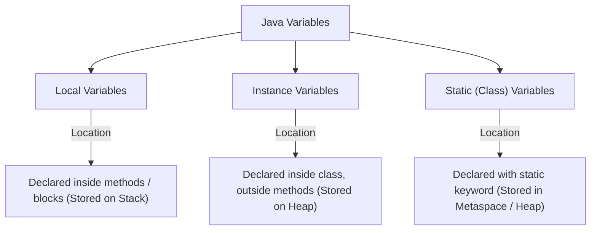
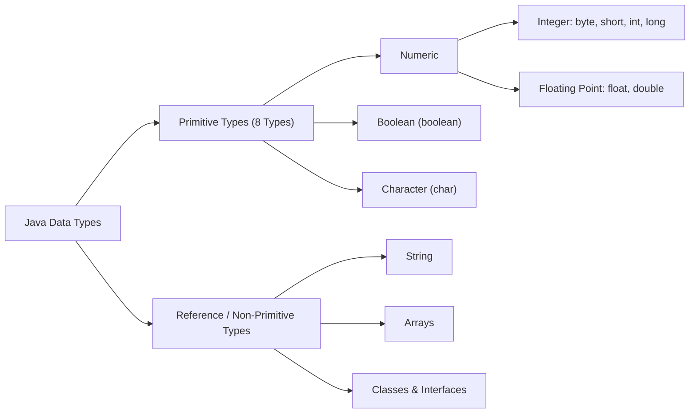

# JAVA - CHAPTER 3
## Variables, Data Types & Control Flow

> "Control flow structures give software its decision-making intelligence, transforming raw data calculations into adaptive logic."

### By the End of This Chapter, You Will Be Able To:
* Distinguish between Local, Instance, and Static variables along with their memory locations and lifecycles.
* List all 8 Java Primitive Data Types with their exact bit sizes, ranges, and default values.
* Explain Java's Unicode system (`char` size and encoding mechanism).
* Master control flow constructs: Decision Statements (`if-else`, `switch`), Loops (`for`, `while`, `do-while`, enhanced `for`), and Jump Statements (`break`, `continue`).
* Implement type casting (implicit widening vs. explicit narrowing).

---

### 1. Variables and Variable Scopes in Java

In Java, a variable is a named memory location that stores values during program execution. Variables are classified into three types based on scope and lifecycle:



| Scope Type | Declared Location | Memory Storage | Lifecycle | Default Value |
| :--- | :--- | :--- | :--- | :--- |
| **Local Variable** | Inside method body or block | Stack | Created on method entry, destroyed on exit | **No default value** (Must be initialized before use) |
| **Instance Variable** | Inside class, outside methods | Heap (inside Object) | Created when object is instantiated with `new` | Default assigned (`0`, `false`, `null`) |
| **Static Variable** | Inside class with `static` keyword | Class Area / Metaspace | Created when class is loaded into JVM | Default assigned (`0`, `false`, `null`) |

#### Program 3.1 — Demonstrating Variable Scopes

```java
public class VariableScopes {
    // Static Variable (Shared across all instances)
    static int companyId = 9901;

    // Instance Variable (Unique per object instance)
    String employeeName = "Chandu";

    public void calculateSalary() {
        // Local Variable (Scoped strictly to calculateSalary method)
        double hourlyRate = 45.50;
        int hoursWorked = 160;
        double totalSalary = hourlyRate * hoursWorked;

        System.out.println("Employee: " + employeeName);
        System.out.println("Company ID: " + companyId);
        System.out.println("Total Monthly Salary: $" + totalSalary);
    }

    public static void main(String[] args) {
        VariableScopes emp1 = new VariableScopes();
        emp1.calculateSalary();
    }
}
```

> [!WARNING]
> **Local Variable Initialization Requirement**
> Compiler error occurs if you attempt to read an uninitialized local variable. Instance and static variables are automatically assigned default zero-equivalent values.

---

### 2. Primitive vs. Non-Primitive Data Types

Java is a strongly typed language. Data types are partitioned into **Primitives** and **Non-Primitives (Reference types)**.



#### The 8 Primitive Data Types

| Type | Bit Size | Memory | Range / Values | Default Value | Example |
| :--- | :--- | :--- | :--- | :--- | :--- |
| **`byte`** | 8 bits | 1 byte | $-128$ to $127$ | `0` | `byte b = 100;` |
| **`short`** | 16 bits | 2 bytes | $-32,768$ to $32,767$ | `0` | `short s = 5000;` |
| **`int`** | 32 bits | 4 bytes | $-2^{31}$ to $2^{31}-1$ | `0` | `int i = 150000;` |
| **`long`** | 64 bits | 8 bytes | $-2^{63}$ to $2^{63}-1$ | `0L` | `long l = 10000000000L;` |
| **`float`** | 32 bits | 4 bytes | Single-precision floating point | `0.0f` | `float f = 3.14f;` |
| **`double`** | 64 bits | 8 bytes | Double-precision floating point | `0.0d` | `double d = 99.999;` |
| **`char`** | 16 bits | 2 bytes | `\u0000` ($0$) to `\uffff` ($65,535$) | `\u0000` | `char c = 'A';` |
| **`boolean`** | ~1 bit | VM specific | `true` or `false` | `false` | `boolean active = true;` |

---

### 3. The Java Unicode System

Unlike C/C++ which historically used 8-bit ASCII characters (`char` size 1 byte), Java uses the **Unicode System** for character representation.

- **Size**: 2 bytes (16 bits) per character.
- **Why Unicode?**: ASCII only supports standard English letters (0 to 127). Unicode supports international alphabets including Latin, Greek, Arabic, Cyrillic, Devanagari, Hanzi, and Emoji symbols.

```java
public class UnicodeDemo {
    public static void main(String[] args) {
        char englishChar = 'A';
        char devanagariChar = '\u0905'; // Hindi letter 'अ'
        char symbolChar = '\u2615';     // Coffee symbol '☕'

        System.out.println("English: " + englishChar);
        System.out.println("Devanagari: " + devanagariChar);
        System.out.println("Symbol: " + symbolChar);
    }
}
```

---

### 4. Control Flow Statements

Control flow statements dictate the order in which statements are evaluated and executed.

#### A. Decision Making Statements (`if-else`, `switch`)

##### Enhanced `switch` Expression (Java 14+)
Modern Java supports arrow syntax and value yielding inside `switch` expressions:

```java
public class SwitchDemo {
    public static void main(String[] args) {
        String day = "MONDAY";
        
        String typeOfDay = switch (day) {
            case "MONDAY", "TUESDAY", "WEDNESDAY", "THURSDAY", "FRIDAY" -> "Weekday";
            case "SATURDAY", "SUNDAY" -> "Weekend";
            default -> throw new IllegalArgumentException("Invalid day: " + day);
        };

        System.out.println(day + " is a " + typeOfDay);
    }
}
```

#### B. Looping Statements (`for`, `while`, `do-while`, Enhanced `for`)

```java
public class LoopDemonstration {
    public static void main(String[] args) {
        // Standard For Loop
        System.out.print("Standard For: ");
        for (int i = 1; i <= 5; i++) {
            System.out.print(i + " ");
        }

        // Enhanced For Loop (For-Each)
        System.out.print("\nEnhanced For: ");
        int[] numbers = {10, 20, 30, 40, 50};
        for (int num : numbers) {
            System.out.print(num + " ");
        }

        // Do-While Loop (Guarantees at least 1 execution)
        System.out.print("\nDo-While: ");
        int count = 0;
        do {
            System.out.print(count + " ");
            count++;
        } while (count < 3);
    }
}
```

#### C. Jump Statements (`break`, `continue`, Labeled Loops)

```java
public class JumpDemo {
    public static void main(String[] args) {
        // Labeled Break Example
        outerLoop:
        for (int i = 1; i <= 3; i++) {
            for (int j = 1; j <= 3; j++) {
                if (i == 2 && j == 2) {
                    System.out.println("\nBreaking outer loop at i=" + i + ", j=" + j);
                    break outerLoop; // Exits outer loop directly
                }
                System.out.print("[" + i + "," + j + "] ");
            }
        }
    }
}
```

---

### ✏ Try It Yourself
1. Declare variables for an e-commerce item: `itemId` (long), `price` (double), `inStock` (boolean), `rating` (float), and `categoryCode` (char).
2. Assign values and print all details in a single formatted block.
3. Write a program using a `for` loop to print prime numbers between 1 and 50 using `break` / `continue` jump logic.

---

### Chapter Summary

#### Key Takeaways
* Java provides **3 variable scopes**: Local (Stack), Instance (Heap), and Static (Metaspace/Class Area).
* There are **8 primitive data types**: `byte`, `short`, `int`, `long`, `float`, `double`, `char`, and `boolean`.
* Java's `char` type is 2 bytes (16 bits) to natively support international character sets using **Unicode**.
* Java 14+ introduces simplified, expression-based `switch` structures with arrow `->` syntax.

---

> [!TIP]
> **Prepare for your Chapter Exam!**
> You have completed reading Chapter 3. Head to the **Take Chapter Quiz** assessment below to test your knowledge and unlock Chapter 4!

