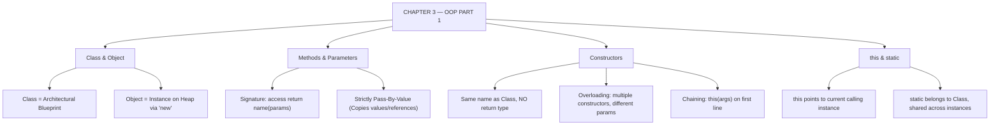

# JAVA - CHAPTER 3
## Object-Oriented Programming (OOP) – Part 1

> “A Class is a blueprint; an Object is the physical house built from that blueprint.” — A First Lesson in Object Design

### Learning Objectives
By the end of this chapter, you will be able to:
* Understand the relationship between a Class (the blueprint) and an Object (the physical instance).
* Declare and instantiate objects using the `new` keyword and understand Heap memory allocation.
* Define methods, manage return types, and understand Java's strict "Pass-by-Value" mechanism.
* Initialize objects securely using default, parameterized, and overloaded Constructors.
* Master the `this` keyword to resolve variable shadowing.
* Differentiate between instance members and static class-level members.

---

### Introduction
So far, you have been writing procedural code—lists of instructions executing from top to bottom. But the real world isn't a list of instructions; it is made of interacting objects. A bank is an object that holds account objects, which in turn belong to customer objects. **Object-Oriented Programming (OOP)** is a paradigm that allows you to model your software exactly like the real world. By bundling data (state) and the functions that operate on that data (behavior) into single entities called **Classes**, you can build massive, modular, and easily maintainable software systems.

### Why This Topic Matters
Java is fundamentally an Object-Oriented language. You cannot write a Java program without interacting with classes and objects. Understanding how memory is allocated when you use the `new` keyword, how constructors initialize state, and the crucial difference between instance variables and static variables is what transitions you from writing simple scripts to engineering professional Java applications.

---

### Chapter Roadmap
* Concept 1: OOP Basics, Classes, and Objects
* Concept 2: Methods and Pass-by-Value
* Concept 3: Constructors and Object Initialization
* Concept 4: The `this` and `static` Keywords
* Learning Support Elements
* Debugging and Problem Solving
* Practical Application & Mini Project
* Practice and Evaluation
* Chapter Conclusion

---

> [!NOTE]
> **Real-Life Analogy: Architectural Blueprint vs. Physical House**
> A **Class** is an architectural blueprint for a house. You cannot live inside a blueprint. An **Object** is the actual physical house built using that blueprint. You can build 100 identical houses (Objects) from a single blueprint (Class), but each house will have its own distinct street address and its own specific families living inside.

---

### Real-World Applications

| Domain | How this chapter's ideas appear in practice |
| :--- | :--- |
| **Banking Applications** | `BankAccount` classes bundle private balance state with validated `deposit()` and `withdraw()` behavior methods. |
| **E-Commerce Platforms** | `User` and `Cart` objects are instantiated dynamically per web session to manage individual shopping state. |
| **GUI Frameworks** | UI buttons and input fields are instantiated objects (`JButton`, `JTextField`) responding to event callbacks. |
| **Database ORMs** | Object-Relational Mapping (Hibernate/JPA) maps database rows directly into Java class instances. |
| **Enterprise Metrics** | `static` counter variables track global connection pool statistics across thousands of concurrent client requests. |
| **API Web Services** | Parameterized constructors ensure DTOs (Data Transfer Objects) are created in a valid, immutable state. |

---

### Core Learning Sections

#### CONCEPT 1: OOP Basics, Classes, and Objects
*Sub-topics Covered: 3.1 Introduction to OOP Concepts, 3.2 Classes and Objects*

##### 3.1 Introduction to OOP Concepts
OOP revolves around four main pillars (which we will cover across Chapters 3 and 4): **Encapsulation**, **Inheritance**, **Polymorphism**, and **Abstraction**. In this chapter, we focus on **Encapsulation**—bundling data and methods together.

##### 3.2 Classes and Objects
* **State (Fields/Variables)**: What the object *knows* (e.g., color, price, name).
* **Behavior (Methods)**: What the object *does* (e.g., drive, calculate, print).
* **Instantiation**: To create a physical object from a Class blueprint, use the `new` keyword. The `new` keyword asks the JVM to allocate fresh memory on the **Heap** for the object and returns its memory address reference:
  `Car myCar = new Car();`

---

#### CONCEPT 2: Methods and Pass-by-Value
*Sub-topics Covered: 3.3 Methods (Declaration, Invocation, Pass-by-Value)*

##### 3.3 Methods
A method is a block of code designed to perform a specific task, located inside a class.
* **Signature**: Includes access modifier, return type, method name, and parameter list (e.g., `public int addNumbers(int a, int b)`).
* **Pass-by-Value (Crucial Concept)**: **Java is strictly pass-by-value.** When you pass a primitive variable into a method, Java creates an isolated *copy* of that value. Modifying the copy inside the method does *not* change the original variable. (Note: When passing objects, Java passes a copy of the *reference* to the memory address).

---

#### CONCEPT 3: Constructors and Object Initialization
*Sub-topics Covered: 3.4 Constructors (Default, Parameterized, Overloading)*

##### 3.4 Constructors
A constructor is a specialized method invoked automatically the exact moment an object is created via the `new` keyword.
* **Rules**: Must have the *exact same name* as the Class, and has **no return type** (not even `void`).
* **Default Constructor**: If you do not explicitly write any constructor, Java silently provides an empty no-arg constructor that sets fields to default values (`0`, `null`, `false`).
* **Parameterized Constructor**: Allows passing specific data to initialize the object at creation time.
* **Constructor Overloading**: Having multiple constructors in the same class with different parameter lists (different types or counts of arguments).

---

#### CONCEPT 4: The `this` and `static` Keywords
*Sub-topics Covered: 3.5 The this Keyword, 3.6 The static Keyword*

##### 3.5 The `this` Keyword
`this` is a reference variable pointing to the current object instance calling the method or constructor. It is primarily used to resolve **variable shadowing**—when a method parameter shares the exact same name as an instance field:
`this.name = name;`

##### 3.6 The `static` Keyword
* **Instance Variables**: Belong to specific object instances. 3 `Employee` objects have 3 separate salary variables.
* **Static Variables**: Belong to the Class itself. There is only **one copy** shared across all instances in memory, loaded when the Class is first loaded.
* **Static Methods**: Can be invoked without creating an object instance (e.g., `Math.max()`). Static methods cannot access `this` or non-static instance variables directly.

##### Code Example: Anatomy of a Class
```java
// The Class (Blueprint)
class Employee {
    // 3.6: Static variable (Shared by all employees)
    public static String companyName = "TechCorp Inc.";

    // 3.2: Instance variables (State unique to each object)
    public String employeeName;
    public int employeeId;

    // 3.4: Default Constructor
    public Employee() {
        this.employeeName = "Unknown";
        this.employeeId = 0;
    }

    // 3.4: Parameterized Constructor (Overloaded)
    public Employee(String employeeName, int employeeId) {
        // 3.5: 'this' keyword resolves shadowing
        this.employeeName = employeeName;
        this.employeeId = employeeId;
    }

    // 3.3: Instance Method (Behavior)
    public void displayDetails() {
        System.out.println("ID: " + this.employeeId +
                           " | Name: " + this.employeeName +
                           " | Company: " + companyName);
    }
}

// The Execution Entry Point
public class OOPDemo {
    public static void main(String[] args) {
        System.out.println("=== EMPLOYEE DATABASE ===\n");

        // 3.2: Instantiating objects using 'new'
        Employee emp1 = new Employee("Alice Smith", 101);
        Employee emp2 = new Employee("Bob Jones", 102);

        // Using default constructor
        Employee emp3 = new Employee();

        // Invoking instance methods
        emp1.displayDetails();
        emp2.displayDetails();
        emp3.displayDetails();

        // Demonstrating static behavior
        System.out.println("\n--- Company Acquisition ---");
        Employee.companyName = "GlobalTech LLC"; // Changed via Class name

        // The change reflects across ALL objects because the variable is static
        emp1.displayDetails();
        emp2.displayDetails();
    }
}
```

##### Expected Output:
```text
=== EMPLOYEE DATABASE ===

ID: 101 | Name: Alice Smith | Company: TechCorp Inc.
ID: 102 | Name: Bob Jones | Company: TechCorp Inc.
ID: 0 | Name: Unknown | Company: TechCorp Inc.

--- Company Acquisition ---
ID: 101 | Name: Alice Smith | Company: GlobalTech LLC
ID: 102 | Name: Bob Jones | Company: GlobalTech LLC
```

---

### Learning Support Elements

> [!TIP]
> **Tips: Accessing Static Members**
> When accessing a static variable or method, always call it using the **Class name** (e.g., `Employee.companyName`) rather than an object reference (e.g., `emp1.companyName`). While Java permits the latter, it is bad practice because it misleads developers into assuming the variable is unique to that instance.

> [!NOTE]
> **Important Notes: Constructors vs. Methods**
> A common beginner mistake is accidentally adding a return type to a constructor (e.g., `public void Employee() { ... }`). The moment you add `void`, Java stops treating it as a constructor and turns it into a standard method, breaking object initialization.

> [!WARNING]
> **Warnings: Passing Object References**
> While Java passes everything by value, when you pass an object into a method, you pass a copy of the *memory address reference*. If you modify the object's fields inside the method (e.g., `car.setPrice(100)`), the original object is permanently altered because both references point to the same object on the Heap.

#### Common Misconceptions
* **Misconception:** "Java uses pass-by-reference for objects."
* **Reality:** Java is strictly pass-by-value. It passes the *value of the reference*. Reassigning the entire object variable inside a method (e.g., `myCar = new Car();`) does not affect the caller's original variable.

#### Best Practices
* **Constructor Chaining:** Avoid duplicating initialization code across multiple constructors. Use `this(param1, param2);` on the very first line of a constructor to invoke another overloaded constructor in the same class.

---

### Debugging and Problem Solving

#### Runtime Error: `NullPointerException` (NPE)
* **Cause:** You declared an object variable but forgot to instantiate it with `new` before calling its methods (e.g., `Employee emp; emp.displayDetails();`).
* **Fix:** Ensure the object is instantiated: `Employee emp = new Employee();`.

#### Compiler Error: `non-static variable cannot be referenced from a static context`
* **Cause:** Attempted to access an instance variable directly from inside a static method (like `main`). A static method has no `this` context.
* **Fix:** Make the variable `static`, or instantiate an object inside `main` and access the field through that instance (`emp1.name`).

---

### Practical Application & Mini Project

#### Mini Project: Banking Account System
This project simulates a bank account system, utilizing overloaded constructors, instance variables for secure balances, and static variables to track total bank assets across all accounts.

```java
class BankAccount {
    // Static variable to track total money across all accounts in the bank
    private static double totalBankFunds = 0;

    // Instance variables specific to the individual account
    private String accountHolder;
    private double balance;

    // Parameterized Constructor
    public BankAccount(String accountHolder, double initialDeposit) {
        this.accountHolder = accountHolder;
        if (initialDeposit > 0) {
            this.balance = initialDeposit;
            totalBankFunds += initialDeposit; // Add to global bank funds
        } else {
            this.balance = 0;
        }
        System.out.println("Account created for " + this.accountHolder);
    }

    // Instance Method: Deposit
    public void deposit(double amount) {
        if (amount > 0) {
            this.balance += amount;
            totalBankFunds += amount;
            System.out.println("Deposited $" + amount + " to " + this.accountHolder + "'s account.");
        }
    }

    // Instance Method: Withdraw
    public void withdraw(double amount) {
        if (amount > 0 && amount <= this.balance) {
            this.balance -= amount;
            totalBankFunds -= amount;
            System.out.println("Withdrew $" + amount + " from " + this.accountHolder + "'s account.");
        } else {
            System.out.println("Transaction failed for " + this.accountHolder + ": Insufficient funds.");
        }
    }

    // Instance Method: Check Balance
    public void displayBalance() {
        System.out.println(this.accountHolder + "'s Balance: $" + this.balance);
    }

    // Static Method: View Total Bank Assets
    public static void displayTotalBankFunds() {
        System.out.println("TOTAL BANK ASSETS: $" + totalBankFunds);
    }
}

public class BankSystem {
    public static void main(String[] args) {
        System.out.println("=== JAVA NATIONAL BANK ===\n");

        BankAccount acc1 = new BankAccount("Alice", 500.0);
        BankAccount acc2 = new BankAccount("Bob", 1500.0);

        System.out.println("\n--- Processing Transactions ---");
        acc1.deposit(200.0);
        acc2.withdraw(300.0);
        acc1.withdraw(1000.0); // Should fail (insufficient funds)

        System.out.println("\n--- Final Reports ---");
        acc1.displayBalance();
        acc2.displayBalance();

        // Calling the static method via the Class name
        BankAccount.displayTotalBankFunds();
    }
}
```

##### Expected Output:
```text
=== JAVA NATIONAL BANK ===

Account created for Alice
Account created for Bob

--- Processing Transactions ---
Deposited $200.0 to Alice's account.
Withdrew $300.0 from Bob's account.
Transaction failed for Alice: Insufficient funds.

--- Final Reports ---
Alice's Balance: $700.0
Bob's Balance: $1200.0
TOTAL BANK ASSETS: $1900.0
```

---

### Practice and Evaluation

#### Coding Exercises
* Create a `Book` class with instance variables `title`, `author`, and `pageCount`. Create an overloaded constructor allowing creation with just `title` and `author` (`pageCount = 0`), and another setting all three fields. Test in `main`.
* Create a `MathUtils` class containing only static methods `add(a,b)`, `subtract(a,b)`, and `multiply(a,b)`. Call these methods from `main` without creating an instance of `MathUtils`.

#### Interview Questions & Answers

1. **(Junior) What is the difference between a Class and an Object?**
   * **Answer:** A Class is a logical blueprint or template defining fields and behaviors. An Object is a physical runtime instance created from that class, occupying memory space on the Heap.

2. **(Junior) What is the `new` keyword used for?**
   * **Answer:** The `new` keyword allocates memory for a new object on the Heap at runtime, invokes the constructor, and returns a reference to that memory location.

3. **(Junior) Can a class have multiple constructors? What is this called?**
   * **Answer:** Yes, a class can define multiple constructors as long as their parameter lists differ. This is called Constructor Overloading.

4. **(Mid-Level) Explain how Java passes arguments to methods (Pass-by-Value vs. Pass-by-Reference).**
   * **Answer:** Java is strictly pass-by-value. For primitives, a copy of the value is passed. For objects, a copy of the reference (memory address) is passed. Modifying object fields affects the original object, but reassigning the reference variable inside the method does not affect the caller.

5. **(Mid-Level) What is the purpose of the `this` keyword?**
   * **Answer:** `this` refers to the current calling object instance. It resolves shadowing between instance variables and method parameters with identical names, and supports constructor chaining (`this()`).

6. **(Mid-Level) Can you call a non-static instance method from a static method directly? Why or why not?**
   * **Answer:** No. A static method belongs to the class blueprint, not an instance. Instance methods require an object instance's state to operate, which a static method does not possess.

7. **(Senior) What happens in memory when an object is created and no longer referenced?**
   * **Answer:** The object remains on the Heap. When all Stack variables pointing to it go out of scope or are set to `null`, the object becomes "unreachable". The JVM Garbage Collector eventually detects and reclaims its memory.

8. **(Senior) What is a static block and when is it executed?**
   * **Answer:** A static block (`static { ... }`) initializes static variables or executes class-level setup logic. It is executed automatically once when the JVM ClassLoader loads the class into memory.

9. **(Senior) What is constructor chaining, and how is it implemented?**
   * **Answer:** Constructor chaining is calling one constructor from another within the same class (or parent class). In the same class, it is achieved using `this(args)` on the first line of the constructor body.

10. **(Senior) Where are static variables stored in the JVM memory architecture?**
    * **Answer:** Prior to Java 8, static variables were stored in PermGen (Permanent Generation). In Java 8+, PermGen was replaced by Metaspace, and static variables were moved directly to the main Heap linked to the `java.lang.Class` object.

---

### Chapter Conclusion
In Chapter 3, you crossed the threshold into Object-Oriented design. You learned that a Class is a blueprint defining state and behavior, while an Object is a physical instance residing in Heap memory. By mastering constructors, you can safely initialize objects, and using `static` allows structuring global vs instance state.

#### Key Takeaways
* **Heap Allocation:** The `new` keyword creates physical objects in dynamic Heap memory.
* **Pass-by-Value:** Java *always* passes by value. Modifying an object's fields via a passed reference changes the original, but reassigning the reference does not.
* **Shadowing Resolution:** Use `this.variableName` when method parameters share names with instance fields.
* **Static Context:** `static` members belong to the class blueprint, shared across all instances.

#### What to Learn Next
Now that you can create standalone objects, you need to learn how objects relate to one another. In **Chapter 4: Object-Oriented Programming (OOP) – Part 2**, we will cover the remaining pillars of OOP: Inheritance, Polymorphism, and Access Modifiers for Encapsulation.

---

### Progressive Code Examples: Four Tiers

#### TIER 1 · BEGINNER
##### Defining a Class and Instantiating Objects
**Goal:** Create a simple blueprint class and instantiate objects in `main`.

```java
class Car {
    String model;
    int year;

    void displayInfo() {
        System.out.println(year + " " + model);
    }
}

public class SimpleClassDemo {
    public static void main(String[] args) {
        Car car1 = new Car();
        car1.model = "Sedan";
        car1.year = 2022;

        car1.displayInfo();
    }
}
```

##### Expected Output
```text
2022 Sedan
```

> **What this tier adds:** Baseline. Fields, instance methods, and `new` instantiation.

---

#### TIER 2 · INTERMEDIATE
##### Constructors and Constructor Overloading
**Goal:** Implement default and parameterized constructors with `this` shadowing resolution.

```java
class Laptop {
    String brand;
    int ramGB;

    // Default Constructor
    public Laptop() {
        this("Generic", 8); // Constructor Chaining
    }

    // Parameterized Constructor
    public Laptop(String brand, int ramGB) {
        this.brand = brand;
        this.ramGB = ramGB;
    }

    public void showSpecs() {
        System.out.println(brand + " Laptop with " + ramGB + "GB RAM");
    }
}

public class ConstructorDemo {
    public static void main(String[] args) {
        Laptop defaultLaptop = new Laptop();
        Laptop gamingLaptop = new Laptop("Alienware", 32);

        defaultLaptop.showSpecs();
        gamingLaptop.showSpecs();
    }
}
```

##### Expected Output
```text
Generic Laptop with 8GB RAM
Alienware Laptop with 32GB RAM
```

> **What this tier adds:** Overloaded constructors, `this` shadowing resolution, and constructor chaining via `this()`.

---

#### TIER 3 · ADVANCED
##### Static Fields vs Instance Fields
**Goal:** Track global object instance counts using static class members.

```java
class CounterObject {
    public static int globalCount = 0; // Shared across all instances
    public int instanceId; // Unique to each instance

    public CounterObject() {
        globalCount++;
        this.instanceId = globalCount;
    }

    public void printStats() {
        System.out.println("Instance ID: " + instanceId + " | Total Active: " + globalCount);
    }
}

public class StaticTrackerDemo {
    public static void main(String[] args) {
        CounterObject o1 = new CounterObject();
        CounterObject o2 = new CounterObject();
        CounterObject o3 = new CounterObject();

        o1.printStats();
        o2.printStats();
        o3.printStats();
    }
}
```

##### Expected Output
```text
Instance ID: 1 | Total Active: 3
Instance ID: 2 | Total Active: 3
Instance ID: 3 | Total Active: 3
```

> **What this tier adds:** Static member memory sharing vs instance field isolation.

---

#### TIER 4 · PROFESSIONAL
##### Pass-By-Value and Reference Mutation Verification
**Goal:** Prove Java's strict Pass-by-Value mechanism for primitive variables vs object reference copies.

```java
class AccountHolder {
    String name;
    AccountHolder(String name) { this.name = name; }
}

public class PassByValueVerifier {
    public static void modifyPrimitive(int val) {
        val = 99; // Modifies local copy
    }

    public static void modifyReferenceField(AccountHolder holder) {
        holder.name = "Modified Name"; // Mutates underlying Heap object
    }

    public static void reassignReference(AccountHolder holder) {
        holder = new AccountHolder("Reassigned Name"); // Local reference reassignment
    }

    public static void main(String[] args) {
        int number = 10;
        modifyPrimitive(number);
        System.out.println("Primitive after method: " + number);

        AccountHolder person = new AccountHolder("Original Name");
        modifyReferenceField(person);
        System.out.println("Object field after field mutation: " + person.name);

        reassignReference(person);
        System.out.println("Object field after reference reassign: " + person.name);
    }
}
```

##### Expected Output
```text
Primitive after method: 10
Object field after field mutation: Modified Name
Object field after reference reassign: Modified Name
```

> **What this tier adds:** Empirical verification of Java pass-by-value semantics for primitives, reference field mutation, and reference reassignment isolation.

---

### Common Mistakes and How to Fix Them

| The mistake | Why it happens | What you see (class) | The fix |
| :--- | :--- | :--- | :--- |
| **Adding return type to constructor** | Mistaking constructors for methods | Constructor `void MyClass()` ignored during `new` *(LOGIC)* | Remove return type (`void`) from constructor declaration |
| **Calling instance methods from `main` without object** | `main` is static | `non-static method cannot be referenced from static context` *(COMPILER)* | Instantiate an object first or make the target method static |
| **Forgetting `new` keyword during instantiation** | Variable declared but null | `NullPointerException` when invoking methods *(RUNTIME)* | Instantiate with `new`: `MyClass obj = new MyClass();` |
| **Shadowing instance fields without `this`** | Parameter name matches field name | Field remains default/null after constructor call *(LOGIC)* | Use `this.fieldName = fieldName;` to resolve shadowing |
| **Accessing static members via object instances** | Bad habit | Warning or developer confusion *(STYLE)* | Always invoke static members using the Class name: `Class.member` |
| **Assuming object reference reassignment mutates caller** | Misunderstanding pass-by-value | Calling variable remains unchanged *(LOGIC)* | Mutate object fields directly or return the newly created object |

---

### Chapter Mind Map



---

> [!TIP]
> **Prepare for your Chapter Exam!**
> You have completed reading Chapter 3. Head to the **Take Chapter Quiz** assessment below to test your knowledge and unlock Chapter 4!
