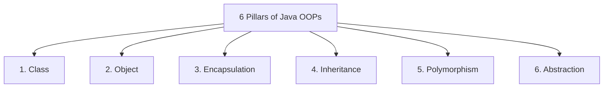
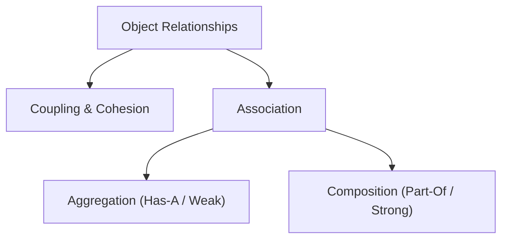
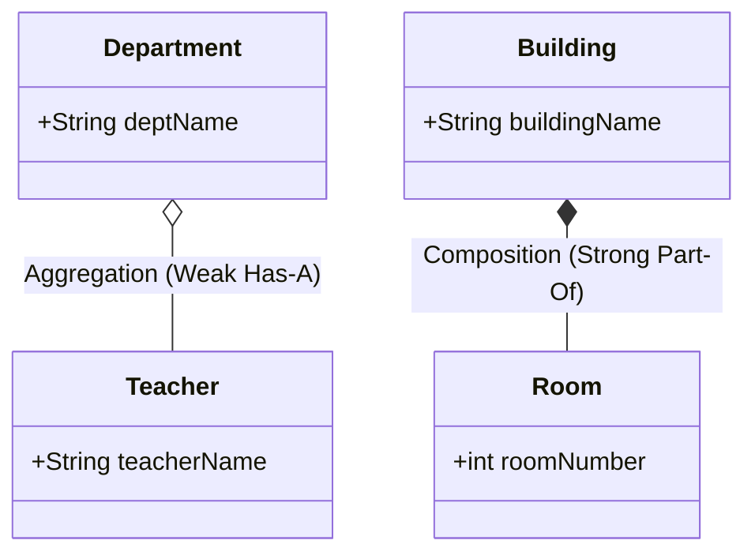

# JAVA - CHAPTER 4
## Principles of Object-Oriented Programming (OOPs)

> "Object-Oriented Programming structures soft-ware architectures to model real-world domains through modular abstractions and reusable contracts."

### By the End of This Chapter, You Will Be Able To:
* Define and implement the 6 core pillars of Object-Oriented Programming in Java.
* Distinguish between Classes (blueprints) and Objects (instantiated state).
* Implement Polymorphism (Compile-time Method Overloading vs Runtime Method Overriding).
* Apply Abstraction using Abstract Classes and Interfaces.
* Design software architecture using object relationships: Coupling, Cohesion, Association, Aggregation, and Composition.

---

### 1. The 6 Pillars of Object-Oriented Programming

Java is built from the ground up around Object-Oriented design principles. The 6 fundamental building blocks are:



#### Detailed Breakdown of Pillars

| Pillar | Definition | Real-World Analogy | Java Keyword / Mechanism |
| :--- | :--- | :--- | :--- |
| **Class** | User-defined blueprint or template containing fields and methods. | Architectural floor plan for a house. | `class` |
| **Object** | Physical instance of a class occupying heap memory. | An actual physical house constructed from the plan. | `new` operator |
| **Encapsulation** | Bundling data (variables) and code (methods) together while restricting direct access to fields. | Prescription pill capsule hiding internal ingredients. | `private` fields + `getter/setter` |
| **Inheritance** | Mechanism where one class acquires properties and behaviors of a parent class. | Child inheriting eye color from parent. | `extends` |
| **Polymorphism** | Ability of an entity or method to take on multiple forms depending on execution context. | A person acting as a teacher at school and a customer in a store. | `@Override`, Method Overloading |
| **Abstraction** | Hiding implementation complexity while exposing only essential interfaces to users. | Driving a car using steering and pedals without needing internal engine dynamics. | `abstract class`, `interface` |

---

### 2. Deep Dive: Code Implementation of OOP Pillars

#### Program 4.1 — Encapsulation & Inheritance

```java
// Encapsulation: Field data protection via private access
class BankAccount {
    private String accountNumber;
    private double balance;

    public BankAccount(String accountNumber, double initialBalance) {
        this.accountNumber = accountNumber;
        this.balance = initialBalance;
    }

    public double getBalance() {
        return balance;
    }

    public void deposit(double amount) {
        if (amount > 0) {
            balance += amount;
            System.out.println("Deposited $" + amount + ". New Balance: $" + balance);
        }
    }
}

// Inheritance: SavingsAccount extends BankAccount parent behavior
class SavingsAccount extends BankAccount {
    private double interestRate;

    public SavingsAccount(String accountNumber, double balance, double interestRate) {
        super(accountNumber, balance);
        this.interestRate = interestRate;
    }

    public void applyInterest() {
        double interest = getBalance() * (interestRate / 100);
        deposit(interest);
    }
}
```

#### Program 4.2 — Polymorphism & Abstraction

```java
// Abstraction via Interface contract
interface PaymentGateway {
    void processPayment(double amount);
}

// Class 1 Implementing PaymentGateway
class CreditCardPayment implements PaymentGateway {
    @Override
    public void processPayment(double amount) {
        System.out.println("Processing credit card payment of $" + amount);
    }
}

// Class 2 Implementing PaymentGateway
class UPIPayment implements PaymentGateway {
    @Override
    public void processPayment(double amount) {
        System.out.println("Processing Instant UPI payment of $" + amount);
    }
}

public class OOPDemo {
    public static void main(String[] args) {
        // Runtime Polymorphism: Interface reference points to different concrete implementations
        PaymentGateway payment1 = new CreditCardPayment();
        PaymentGateway payment2 = new UPIPayment();

        payment1.processPayment(150.00); // Triggers CreditCard implementation
        payment2.processPayment(75.50);  // Triggers UPI implementation
    }
}
```

---

### 3. Object Relationships & Software Architecture

Modern object-oriented architecture relies on structural relationships between objects to promote modularity, maintainability, and testability.



#### A. Coupling vs. Cohesion

- **Coupling**: The degree of direct dependency between software modules.
  - *Goal*: **Loose Coupling**. Classes should know as little about internal details of other classes as possible (achieved using Interfaces).
- **Cohesion**: The degree to which elements inside a single module belong together logically.
  - *Goal*: **High Cohesion**. Every class should focus on a single, clear responsibility (Single Responsibility Principle).

#### B. Association, Aggregation & Composition



1. **Association**: Represents a general binary relationship between two separate classes (e.g., `Student` registers for `Course`).
2. **Aggregation (Weak "Has-A")**:
   - Represents a ownership relationship where child objects can exist independently if the parent is destroyed.
   - Example: A `Department` has `Teacher`s. If the `Department` is deleted, `Teacher` objects still exist in the university database.
3. **Composition (Strong "Part-Of")**:
   - Represents a lifecycle-dependent ownership relationship where child objects **cannot** exist without the parent object.
   - Example: A `Building` has `Room`s. If the `Building` is demolished, the `Room` objects are destroyed.

#### Program 4.3 — Aggregation vs. Composition in Code

```java
import java.util.*;

// Aggregation Example: Teacher exists independently
class Teacher {
    String name;
    Teacher(String name) { this.name = name; }
}

class Department {
    String deptName;
    List<Teacher> teachers; // Department holds references to Teachers

    Department(String deptName, List<Teacher> teachers) {
        this.deptName = deptName;
        this.teachers = teachers;
    }
}

// Composition Example: Heart lifecycle bound to Human
class Heart {
    void pump() { System.out.println("Heart pumping blood..."); }
}

class Human {
    private final Heart heart; // Created directly inside Human constructor

    Human() {
        this.heart = new Heart(); // Life cycle tied to Human instance
    }

    void live() {
        heart.pump();
    }
}
```

---

### ✏ Try It Yourself
1. Create a class `Vehicle` with an abstract method `startEngine()`.
2. Create two subclasses `Car` and `ElectricScooter` extending `Vehicle`.
3. Implement polymorphism by creating a `List<Vehicle>` containing instances of both, and iterate through the list calling `startEngine()` on each.
4. Explain whether the relationship between `Car` and `Engine` is **Aggregation** or **Composition**.

---

### Chapter Summary

#### Key Takeaways
* The **6 Pillars of OOPs** are Class, Object, Encapsulation, Inheritance, Polymorphism, and Abstraction.
* **Encapsulation** protects object integrity by restricting variable access via private fields and getters/setters.
* **Polymorphism** allows treating different concrete child implementations through a common parent/interface reference.
* Design software with **Loose Coupling** (low dependencies) and **High Cohesion** (focused single responsibilities).
* **Aggregation** represents a weak "Has-A" relationship; **Composition** represents a strong lifecycle-bound "Part-Of" relationship.

---

> [!TIP]
> **Prepare for your Chapter Exam!**
> You have completed reading Chapter 4. Head to the **Take Chapter Quiz** assessment below to test your knowledge and unlock Chapter 5!
