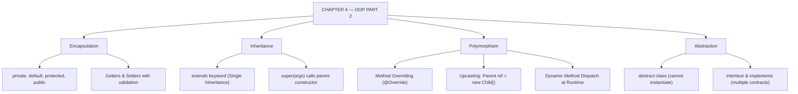

# JAVA - CHAPTER 4
## Object-Oriented Programming (OOP) – Part 2

> “Encapsulation protects data, Inheritance shares code, Polymorphism adapts behavior, and Abstraction hides complexity.” — The Four Pillars of OOP

### Learning Objectives
By the end of this chapter, you will be able to:
* Secure object data using Encapsulation and strict Access Modifiers.
* Share code and create hierarchical relationships using Inheritance (`extends`).
* Invoke parent class constructors and methods using the `super` keyword.
* Implement runtime Polymorphism via Method Overriding and Upcasting.
* Hide implementation details using Abstraction (Abstract Classes and Interfaces).

---

### Introduction
In the previous chapter, you learned how to create individual Objects from Class blueprints. But a real-world application is rarely just a collection of isolated objects. A software system is a living ecosystem where objects interact, share characteristics, and protect their internal states from outside interference. How do you design a system where a Manager and an Engineer share common Employee traits without duplicating code? How do you ensure a user cannot manually set an account balance to a negative number? The answers lie in the remaining pillars of Object-Oriented Programming (OOP).

### Why This Topic Matters
Mastering the four pillars of OOP (Encapsulation, Inheritance, Polymorphism, and Abstraction) is the dividing line between amateur coders and professional software architects. These principles allow you to build enterprise-scale applications that are secure, highly modular, and incredibly easy to update. If you don't understand how to use interfaces or dynamic method dispatch, navigating modern Java frameworks like Spring Boot or Android SDKs will be nearly impossible.

---

### Chapter Roadmap
* Concept 1: Encapsulation & Access Modifiers
* Concept 2: Inheritance and the `super` Keyword
* Concept 3: Polymorphism and Method Overriding
* Concept 4: Abstraction (Abstract Classes & Interfaces)
* Learning Support Elements
* Debugging and Problem Solving
* Practical Application & Mini Project
* Practice and Evaluation
* Chapter Conclusion

---

> [!NOTE]
> **Real-Life Analogy: The Bank Vault and Driving a Car**
> **Encapsulation** is like a bank vault. Customers cannot walk inside and grab cash directly; they must interact through a secure bank teller (**Getters/Setters**). 
> **Abstraction** is driving a car. You interact with the steering wheel and pedals (**the Interface**); you do not need to understand how the fuel injector works under the hood (**the Implementation**). 
> **Polymorphism** is pressing the "Play" button on your phone. Whether it plays a video or a song, the command is the same, but the behavior adapts to the target media object.

---

### Real-World Applications

| Domain | How this chapter's ideas appear in practice |
| :--- | :--- |
| **Spring Boot Framework** | Interfaces and Abstraction allow swapping database repositories without modifying business services. |
| **Payment Gateways** | Polymorphism processes credit card, PayPal, and UPI payments through a unified `PaymentProcessor` interface. |
| **Android Development** | Custom UI views extend standard `View` components, inheriting layout lifecycle behaviors. |
| **Enterprise Security** | Private fields with validated setters enforce strict data validation (e.g., rejecting invalid SSN numbers). |
| **Cloud SDKs** | Abstract base classes provide boilerplate connection routines while forcing concrete subclasses to supply endpoint details. |
| **Game Engines** | Dynamic method dispatch allows invoking `.update()` on an array of diverse game entities (`Enemy`, `Player`, `NPC`). |

---

### Core Learning Sections

#### CONCEPT 1: Encapsulation & Access Modifiers
*Sub-topics Covered: 4.1 Data Hiding, Getters/Setters, Access Modifiers*

##### 4.1 Data Hiding and Access Modifiers
To protect an object's internal state from corrupt external access, restrict variable visibility using **Access Modifiers**:
* `private`: Accessible *only* within the exact same class. (Standard choice for fields).
* `default` (no keyword): Accessible only within classes inside the same package.
* `protected`: Accessible within the same package, AND by child classes in different packages.
* `public`: Accessible from anywhere across the entire application.

To allow outside classes to read or safely modify private variables, provide public **Getters** and **Setters** containing validation logic (e.g., rejecting negative age values).

---

#### CONCEPT 2: Inheritance and the `super` Keyword
*Sub-topics Covered: 4.2 The extends Keyword, Single Inheritance, super*

##### 4.2 Implementing Inheritance
Inheritance allows a child class to inherit fields and methods from a parent class, eliminating redundant code.
* **The `extends` Keyword**: Establishes a parent-child (IS-A) relationship:
  `class Dog extends Animal`
* **Single Inheritance Rule**: In Java, a class can extend **only one** parent class. (Multiple class inheritance is forbidden to prevent the "Diamond Problem" of conflicting methods).
* **The `super` Keyword**: Refers to the immediate parent class. It is used to invoke the parent constructor (`super(args);`) or access parent methods (`super.makeSound();`).

---

#### CONCEPT 3: Polymorphism and Method Overriding
*Sub-topics Covered: 4.3 Method Overriding, Upcasting, Dynamic Method Dispatch*

##### 4.3 Method Overriding and Upcasting
Polymorphism means "many forms."
* **Method Overriding**: When a child class provides its own specific implementation of a method defined in its parent class. The method signature must match exactly. Use the `@Override` annotation.
* **Upcasting**: Storing a child object reference inside a parent type variable:
  `Animal myPet = new Dog();`
* **Dynamic Method Dispatch**: When calling `myPet.makeSound()`, Java checks the actual object residing in Heap memory at **runtime** (`Dog`), executing the child's overridden method rather than the parent's.

---

#### CONCEPT 4: Abstraction (Abstract Classes & Interfaces)
*Sub-topics Covered: 4.4 Abstract Classes, Interfaces, implements*

##### 4.4 Abstract Classes and Interfaces
Abstraction hides complex implementation details, exposing only essential contracts.
* **Abstract Classes**: Declared using the `abstract` keyword. Cannot be instantiated with `new`. They are half-finished blueprints containing a mix of concrete methods and abstract methods (methods without a body) that child classes *must* override.
* **Interfaces**: 100% abstract contracts (prior to Java 8 default methods). Declared using `interface`. A class adopts an interface using the `implements` keyword. A single class can implement **multiple interfaces**, bypassing the single inheritance restriction.

##### Code Example: The 4 Pillars in Action
```java
// 4.4: ABSTRACTION (Interface)
interface Payable {
    void processPayment(); // Abstract by default
}

// 4.4: ABSTRACTION (Abstract Class)
abstract class Employee implements Payable {
    // 4.1: ENCAPSULATION (Private data)
    private String name;
    private double baseSalary;

    public Employee(String name, double baseSalary) {
        this.name = name;
        this.setBaseSalary(baseSalary); // Setter with validation
    }

    // Getters and Setters
    public String getName() { return name; }
    public double getBaseSalary() { return baseSalary; }

    public void setBaseSalary(double baseSalary) {
        if (baseSalary >= 0) this.baseSalary = baseSalary;
    }

    // Abstract method: Child classes MUST provide implementation
    public abstract void displayRole();
}

// 4.2: INHERITANCE
class Developer extends Employee {
    private String programmingLanguage;

    public Developer(String name, double baseSalary, String language) {
        super(name, baseSalary); // 4.2: Calling parent constructor via 'super'
        this.programmingLanguage = language;
    }

    // 4.3: POLYMORPHISM (Method Overriding)
    @Override
    public void displayRole() {
        System.out.println(getName() + " is a Developer coding in " + programmingLanguage);
    }

    @Override
    public void processPayment() {
        System.out.println("Processing standard payroll for " + getName() + ": $" + getBaseSalary());
    }
}

public class CorporateSystem {
    public static void main(String[] args) {
        System.out.println("=== HR SYSTEM INITIALIZED ===\n");

        // 4.3: Upcasting (Storing Developer inside Employee/Payable reference)
        Employee dev = new Developer("Alice", 85000, "Java");

        dev.displayRole(); // Triggers Developer's overridden method
        dev.processPayment(); // Triggers Developer's overridden method
    }
}
```

##### Expected Output:
```text
=== HR SYSTEM INITIALIZED ===

Alice is a Developer coding in Java
Processing standard payroll for Alice: $85000.0
```

---

### Learning Support Elements

> [!TIP]
> **Tips: Always Use `@Override`**
> When overriding a parent method, always place `@Override` above it. If you accidentally misspell the method name (e.g., `makeSoundd()`), the compiler will throw an error immediately because it knows you intended to override a parent method.

> [!NOTE]
> **Important Notes: Constructors and `super()`**
> When instantiating a child class, its parent class constructor is *always* called first. If you don't write `super();` explicitly on the first line of the child constructor, Java silently inserts a call to the parent's default no-arg constructor.

> [!WARNING]
> **Warnings: Weaker Access Privileges**
> When overriding a parent method in a child class, you **cannot** assign weaker access privileges than the parent method. If a parent method is `public`, the overridden child method MUST be `public` (it cannot be `protected` or `private`).

#### Common Misconceptions
* **Misconception:** "Method Overloading and Method Overriding are the same thing."
* **Reality:** Overloading occurs in the *same class* when methods share a name but differ in parameters (compile-time). Overriding occurs between *parent and child classes* when a method replaces a parent's exact signature (runtime).

#### Best Practices
* **Program to an Interface:** Declare variable types using Interface or Abstract Class types (e.g., `List<String> list = new ArrayList<>();`). This allows swapping concrete implementations later without modifying dependent code.

---

### Debugging and Problem Solving

#### Compiler Error: `cannot inherit from final [Parent]`
* **Cause:** Attempted to extend a class marked with the `final` keyword (such as Java's built-in `String` class).
* **Fix:** Remove `final` from the parent class (if owned), or use **Composition** (embedding an instance variable) instead of Inheritance.

#### Compiler Error: `[Child] is not abstract and does not override abstract method [Method] in [Parent]`
* **Cause:** Subclassed an abstract class or implemented an interface, but omitted concrete implementations for abstract methods.
* **Fix:** Implement all missing abstract methods, or declare the child class `abstract`.

---

### Practical Application & Mini Project

#### Mini Project: Logistics Fleet Manager
This project demonstrates inheritance, encapsulation, and polymorphic arrays to calculate fleet range dynamically.

```java
// 1. Abstract Parent Class
abstract class FleetVehicle {
    private String licensePlate;
    private double baseFuelCapacity;

    public FleetVehicle(String licensePlate, double baseFuelCapacity) {
        this.licensePlate = licensePlate;
        this.baseFuelCapacity = baseFuelCapacity;
    }

    public String getLicensePlate() { return licensePlate; }
    public double getBaseFuelCapacity() { return baseFuelCapacity; }

    // Abstract method to be overridden
    public abstract void calculateRange();
}

// 2. Concrete Child Class (Delivery Truck)
class DeliveryTruck extends FleetVehicle {
    private double cargoWeightKg;

    public DeliveryTruck(String licensePlate, double fuelCapacity, double cargoWeightKg) {
        super(licensePlate, fuelCapacity);
        this.cargoWeightKg = cargoWeightKg;
    }

    @Override
    public void calculateRange() {
        // Heavy cargo reduces range
        double range = getBaseFuelCapacity() * (10.0 - (cargoWeightKg / 1000.0));
        System.out.println("Truck [" + getLicensePlate() + "] Range: " + range + " miles.");
    }
}

// 3. Concrete Child Class (Electric Scooter)
class ElectricScooter extends FleetVehicle {
    private int batteryHealthPercentage;

    public ElectricScooter(String licensePlate, double batteryCapacity, int health) {
        super(licensePlate, batteryCapacity);
        this.batteryHealthPercentage = health;
    }

    @Override
    public void calculateRange() {
        // Range depends on battery health
        double range = getBaseFuelCapacity() * 4.0 * (batteryHealthPercentage / 100.0);
        System.out.println("Scooter [" + getLicensePlate() + "] Range: " + range + " miles.");
    }
}

public class FleetManager {
    public static void main(String[] args) {
        System.out.println("=== FLEET LOGISTICS SYSTEM ===\n");

        // Polymorphic Array: Storing different child objects in a Parent array
        FleetVehicle[] activeFleet = new FleetVehicle[3];
        activeFleet[0] = new DeliveryTruck("TRK-992", 50.0, 2000.0);
        activeFleet[1] = new ElectricScooter("SCT-104", 15.0, 90);
        activeFleet[2] = new DeliveryTruck("TRK-551", 80.0, 5000.0);

        // Dynamic Method Dispatch in action
        for (FleetVehicle vehicle : activeFleet) {
            vehicle.calculateRange();
        }

        System.out.println("\nFleet range calculations complete.");
    }
}
```

##### Expected Output:
```text
=== FLEET LOGISTICS SYSTEM ===

Truck [TRK-992] Range: 400.0 miles.
Scooter [SCT-104] Range: 54.0 miles.
Truck [TRK-551] Range: 400.0 miles.

Fleet range calculations complete.
```

---

### Practice and Evaluation

#### Coding Exercises
* Create an abstract class `Shape` with a protected field `color` and abstract method `calculateArea()`. Create a `Circle` subclass extending `Shape` that takes `radius` in its constructor and overrides `calculateArea()` ($\text{Area} = \pi \times r^2$).
* Create an interface `Playable` with method `play()`. Create `Guitar` and `Piano` classes implementing `Playable`. In `main`, loop through a `Playable[]` array invoking `.play()`.

#### Interview Questions & Answers

1. **(Junior) What is Encapsulation and why is it useful?**
   * **Answer:** Encapsulation is bundling data (fields) and methods into a single class while hiding internal state using `private`. It protects data integrity by forcing access through public getters and setters.

2. **(Junior) Can a class extend multiple classes in Java?**
   * **Answer:** No. Java enforces Single Inheritance for classes to avoid ambiguity (the Diamond Problem). However, a class can implement multiple interfaces.

3. **(Junior) What is the difference between `this` and `super`?**
   * **Answer:** `this` refers to the current object instance. `super` refers to the parent class, used to call parent constructors or access overridden parent methods.

4. **(Mid-Level) Differentiate between Method Overloading and Method Overriding.**
   * **Answer:** Overloading occurs in the same class when methods share a name but differ in parameters (compile-time polymorphism). Overriding occurs between parent-child classes when a child replaces a parent's exact method signature (runtime polymorphism).

5. **(Mid-Level) Can we override `private` or `static` methods?**
   * **Answer:** No. `private` methods are hidden from child classes. `static` methods belong to the class; defining a static method with the same signature in a child hides the parent method (Method Hiding), but does not override it dynamically.

6. **(Mid-Level) Why do we use Abstract Classes instead of normal classes?**
   * **Answer:** Abstract classes provide a foundational blueprint with shared fields and concrete methods for subclasses, while preventing direct instantiation of abstract parent concepts (like `Animal`).

7. **(Senior) Explain the Access Modifier hierarchy from most restrictive to least restrictive.**
   * **Answer:** `private` (same class only) $\rightarrow$ `default` (same package) $\rightarrow$ `protected` (same package + subclasses) $\rightarrow$ `public` (accessible everywhere).

8. **(Senior) What did Java 8 introduce to Interfaces?**
   * **Answer:** Java 8 introduced `default` and `static` methods inside interfaces, allowing interfaces to provide concrete method implementations without breaking legacy implementers.

9. **(Senior) What is a "Marker Interface"?**
   * **Answer:** A marker interface contains no methods or fields (e.g., `Serializable`, `Cloneable`). It tags a class to signal special runtime handling to the JVM or frameworks.

10. **(Senior) What happens during object creation if a parent class lacks a default constructor?**
    * **Answer:** The child class constructor fails to compile because it implicitly calls `super()`. The developer must explicitly call `super(args...)` on the first line of the child constructor.

---

### Chapter Conclusion
In Chapter 4, you unlocked the true power of Object-Oriented design. You learned how to protect object integrity using Encapsulation, eliminate redundant code via Inheritance, build adaptable systems using Abstraction, and leverage Polymorphism for dynamic runtime behavior.

#### Key Takeaways
* **Protect State:** Make instance fields `private` and expose public getters/setters.
* **Code Reuse:** Use `extends` to inherit parent traits, and `super` to invoke parent constructors.
* **Dynamic Flexibility:** Polymorphism allows a parent reference variable to hold any child object, executing child `@Override` behaviors at runtime.
* **Contracts:** Use Interfaces to define *what* a class can do without dictating *how* it does it.

#### What to Learn Next
Now that you can engineer complex object ecosystems, it is time to manage groups of objects in memory. In **Chapter 5: Arrays, Strings, and the Collections Framework**, we will transition to mastering Java's core data structures.

---

### Progressive Code Examples: Four Tiers

#### TIER 1 · BEGINNER
##### Basic Encapsulation with Getters and Setters
**Goal:** Protect fields with `private` access and provide validated accessor methods.

```java
class BankUser {
    private String name;
    private int age;

    public String getName() { return name; }
    public void setName(String name) { this.name = name; }

    public int getAge() { return age; }
    public void setAge(int age) {
        if (age >= 0) this.age = age; // Validation logic
    }
}

public class EncapsulationDemo {
    public static void main(String[] args) {
        BankUser user = new BankUser();
        user.setName("Alice");
        user.setAge(25);
        user.setAge(-5); // Invalid age rejected

        System.out.println("User: " + user.getName() + " | Age: " + user.getAge());
    }
}
```

##### Expected Output
```text
User: Alice | Age: 25
```

> **What this tier adds:** Baseline. Private fields, public getters/setters, and field validation logic.

---

#### TIER 2 · INTERMEDIATE
##### Inheritance and `super` Constructor Calls
**Goal:** Create a parent-child relationship and pass initialization data upward using `super()`.

```java
class Vehicle {
    protected String brand;

    public Vehicle(String brand) {
        this.brand = brand;
    }
}

class CarVehicle extends Vehicle {
    private int doors;

    public CarVehicle(String brand, int doors) {
        super(brand); // Invokes parent constructor
        this.doors = doors;
    }

    public void display() {
        System.out.println(brand + " Car with " + doors + " doors.");
    }
}

public class InheritanceDemo {
    public static void main(String[] args) {
        CarVehicle myCar = new CarVehicle("Toyota", 4);
        myCar.display();
    }
}
```

##### Expected Output
```text
Toyota Car with 4 doors.
```

> **What this tier adds:** `extends` inheritance, `protected` access modifier, and `super(args)` constructor invocation.

---

#### TIER 3 · ADVANCED
##### Polymorphism and Dynamic Method Dispatch
**Goal:** Store diverse child instances in a parent array and trigger overridden behaviors dynamically.

```java
abstract class Animal {
    public abstract void makeSound();
}

class Dog extends Animal {
    @Override
    public void makeSound() { System.out.println("Dog barks: Woof!"); }
}

class Cat extends Animal {
    @Override
    public void makeSound() { System.out.println("Cat meows: Meow!"); }
}

public class PolymorphismDemo {
    public static void main(String[] args) {
        Animal[] pets = { new Dog(), new Cat(), new Dog() };

        for (Animal pet : pets) {
            pet.makeSound(); // Dynamic Method Dispatch
        }
    }
}
```

##### Expected Output
```text
Dog barks: Woof!
Cat meows: Meow!
Dog barks: Woof!
```

> **What this tier adds:** Abstract parent class, `@Override` annotation, upcasting in arrays, and runtime dynamic dispatch.

---

#### TIER 4 · PROFESSIONAL
##### Interface Contracts and Loose Coupling
**Goal:** Design an enterprise payment gateway using multiple interface implementations to decouple business logic.

```java
interface PaymentGateway {
    boolean process(double amount);
}

class CreditCardGateway implements PaymentGateway {
    public boolean process(double amount) {
        System.out.println("Processing $" + amount + " via Credit Card Gateway.");
        return true;
    }
}

class PayPalGateway implements PaymentGateway {
    public boolean process(double amount) {
        System.out.println("Processing $" + amount + " via PayPal Gateway.");
        return true;
    }
}

class OrderProcessor {
    private PaymentGateway gateway;

    // Depend upon Abstraction (Interface), not concrete classes
    public OrderProcessor(PaymentGateway gateway) {
        this.gateway = gateway;
    }

    public void checkout(double total) {
        if (gateway.process(total)) {
            System.out.println("Order completed successfully.");
        }
    }
}

public class InterfaceDecouplingDemo {
    public static void main(String[] args) {
        OrderProcessor cardOrder = new OrderProcessor(new CreditCardGateway());
        cardOrder.checkout(150.00);

        OrderProcessor paypalOrder = new OrderProcessor(new PayPalGateway());
        paypalOrder.checkout(299.99);
    }
}
```

##### Expected Output
```text
Processing $150.0 via Credit Card Gateway.
Order completed successfully.
Processing $299.99 via PayPal Gateway.
Order completed successfully.
```

> **What this tier adds:** Interface-driven design, dependency injection via constructors, and loose coupling adhering to SOLID architecture principles.

---

### Common Mistakes and How to Fix Them

| The mistake | Why it happens | What you see (class) | The fix |
| :--- | :--- | :--- | :--- |
| **Weakening access privileges on override** | Child method declared default/private | `cannot reduce the visibility of the inherited method` *(COMPILER)* | Ensure overridden child method has equal or broader access (e.g. `public`) |
| **Instantiating abstract class directly** | Attempted `new AbstractClass()` | `[Class] is abstract; cannot be instantiated` *(COMPILER)* | Instantiate concrete subclass extending the abstract parent |
| **Forgetting `super()` call when parent lacks no-arg ctor** | Implicit `super()` inserted by Java fails | `constructor [Parent] in class cannot be applied to given types` *(COMPILER)* | Write explicit `super(arg1, arg2)` as the first statement in child constructor |
| **Attempting multiple class inheritance** | Tried `class Child extends A, B` | `'{' expected` or syntax error *(COMPILER)* | Use single inheritance for classes and implement multiple `interfaces` |
| **Overriding `private` or `static` methods** | Expecting runtime polymorphism | Method hides parent version instead of overriding *(LOGIC)* | Override public/protected non-static instance methods |
| **Misspelling overridden method name** | Typo in child class method name | `@Override annotation not satisfied` *(COMPILER)* | Retain exact parent method signature and double-check spelling |

---

### Chapter Mind Map



---

> [!TIP]
> **Prepare for your Chapter Exam!**
> You have completed reading Chapter 4. Head to the **Take Chapter Quiz** assessment below to test your knowledge and unlock Chapter 5!
