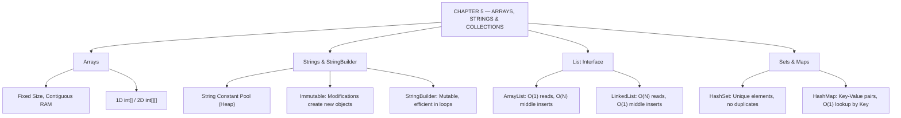

# JAVA - CHAPTER 5
## Arrays, Strings, and the Collections Framework

> “Choosing the right data structure converts a program that takes hours into one that takes milliseconds.” — A First Lesson in Data Architecture

### Learning Objectives
By the end of this chapter, you will be able to:
* Create, initialize, and traverse fixed-size 1D and 2D Arrays.
* Understand String immutability, the String Constant Pool, and `StringBuilder`.
* Utilize Java Generics (`<>`) to enforce type safety in collections.
* Master dynamic arrays using `ArrayList` and `LinkedList`.
* Store unique elements using `HashSet` and map key-value pairs using `HashMap`.

---

### Introduction
Up to this point, you have been dealing with individual variables and single objects. But what happens when you need to process the grades of 10,000 students, search through a million user accounts, or manage a dynamic shopping cart where items are constantly added and removed? You cannot declare 10,000 individual variables like `student1`, `student2`, etc. You need robust data structures. In Java, managing groups of objects is handled through Arrays, Strings (which are arrays of characters under the hood), and the powerful **Java Collections Framework**.

### Why This Topic Matters
Handling data efficiently is the core of computer science. Choosing the wrong data structure—like using a fixed-size Array when you need a dynamically resizing List, or searching a List sequentially when you should be using a high-speed Map—can turn a program that takes milliseconds to run into one that takes hours. Furthermore, understanding Java's unique handling of Strings (immutability and the String Pool) is the single most tested topic in technical interviews.

---

### Chapter Roadmap
* Concept 1: Arrays (Fixed-Size Structures)
* Concept 2: Strings and StringBuilders
* Concept 3: The Collections Framework & Lists
* Concept 4: Sets, Maps, and Generics
* Learning Support Elements
* Debugging and Problem Solving
* Practical Application & Mini Project
* Practice and Evaluation
* Chapter Conclusion

---

> [!NOTE]
> **Real-Life Analogy: The Pill Box, Stone Carving, and Stretchy Backpack**
> An **Array** is like a physical 7-day pill box. Once bought, you cannot squeeze an 8th compartment into it. You must buy a bigger box and copy everything over.
> A **String** is carved in stone. If you carve "Hello", you cannot erase the 'o' to write 'p' ("Help"). You must fetch a new stone and carve "Help" from scratch (**Immutability**).
> An **ArrayList** is a stretchy backpack. As you stuff more items into it, it automatically expands larger behind the scenes.

---

### Real-World Applications

| Domain | How this chapter's ideas appear in practice |
| :--- | :--- |
| **E-Commerce Backends** | `HashMap` provides $O(1)$ constant-time product lookups by SKU identifier. |
| **User Management** | `HashSet` enforces uniqueness when validating applied promotional discount codes. |
| **High-Volume Logging** | `StringBuilder` builds massive log entries efficiently without creating thousands of intermediate heap objects. |
| **Text Processing** | String Pool caching saves gigabytes of RAM across enterprise application servers. |
| **Financial Ledgers** | `ArrayList` maintains insertion order for transactions while allowing dynamic additions. |
| **Matrix Processing** | Multi-dimensional 2D Arrays (`int[][]`) process image pixels and game grid coordinates. |

---

### Core Learning Sections

#### CONCEPT 1: Arrays (Fixed-Size Structures)
*Sub-topics Covered: 5.1 Array Declaration, Initialization, and Multi-Dimensional Arrays*

##### 5.1 Array Declaration and Initialization
Arrays are contiguous blocks of memory holding multiple values of the same data type.
* **Creation**: Define the exact size when initializing with `new`:
  `int[] scores = new int[5];` (Creates an array of 5 integers, defaulting to `0`).
* **Literal Initialization**: Use curly braces if values are known upfront:
  `String[] days = {"Mon", "Tue", "Wed"};`
* **Zero-Indexed**: The first element is always at index `0`; the last element is at `length - 1`.
* **Multi-Dimensional Arrays**: Arrays of arrays, used for matrices or grids:
  `int[][] grid = new int[3][3];`

---

#### CONCEPT 2: Strings and StringBuilders
*Sub-topics Covered: 5.2 String Immutability, String Pool, and StringBuilder*

##### 5.2 Understanding Strings
* **The String Pool**: To save memory, Java stores string literals (e.g., `"Hello"`) in a specialized region of the Heap called the **String Constant Pool**. If two variables use the exact same literal text, Java points both variables to the exact same memory address.
* **Immutability**: Once a `String` object is created, its value cannot be changed. In `str = str + " World"`, Java does not alter the original object; it creates a brand-new `String` object on the Heap and abandons the old one.
* **StringBuilder**: A mutable class designed for string manipulation inside loops. It modifies text in-place without creating redundant intermediate objects.

---

#### CONCEPT 3: The Collections Framework & Lists
*Sub-topics Covered: 5.3 The List Interface, ArrayList, and LinkedList*

##### 5.3 Lists and Dynamic Arrays
The Collections Framework (in `java.util`) provides pre-built, dynamic data structures.
* **`ArrayList` (Most Common)**: Backed by a dynamic array under the hood. When full, it creates a larger array (1.5x size) and copies elements over. Excellent for reading data ($O(1)$ index access), but slower for inserting/deleting elements in the middle ($O(N)$).
* **`LinkedList`**: Backed by a doubly-linked list where each node points to previous and next elements. Excellent for middle insertions/deletions ($O(1)$ node updates), but slower for random index access ($O(N)$).
* **Generics (`<T>`)**: Enforces type safety so collections store only specified Object types:
  `List<String> names = new ArrayList<>();`

---

#### CONCEPT 4: Sets, Maps, and Generics
*Sub-topics Covered: 5.4 The Set Interface (HashSet), The Map Interface (HashMap)*

##### 5.4 Sets and Maps
* **`HashSet` (The Bouncer)**: A Set forbids duplicate elements. Adding a duplicate is silently ignored. It does not guarantee any specific iteration order.
* **`HashMap` (The Dictionary)**: Stores Key-Value pairs (`Map<K,V>`). A Key maps to a Value (e.g., Student ID $\rightarrow$ Student Object).
  * Keys must be strictly unique.
  * Values can contain duplicates.
  * Retrieval by key is extremely fast ($O(1)$ time complexity).

##### Code Example: Data Structures in Action
```java
import java.util.ArrayList;
import java.util.HashMap;
import java.util.HashSet;
import java.util.List;
import java.util.Map;
import java.util.Set;

public class DataStructuresDemo {
    public static void main(String[] args) {
        // 5.2: StringBuilder (Mutable String)
        StringBuilder sb = new StringBuilder("Java");
        sb.append(" Collections"); // Modifies existing object directly
        System.out.println("StringBuilder result: " + sb.toString());

        // 5.3: ArrayList (Dynamic Array)
        List<String> techStack = new ArrayList<>();
        techStack.add("Java");
        techStack.add("Spring");
        techStack.add("SQL");

        System.out.println("\n--- ArrayList Content ---");
        for (String tech : techStack) {
            System.out.println(tech);
        }

        // 5.4: HashSet (No duplicates allowed)
        Set<Integer> uniqueIds = new HashSet<>();
        uniqueIds.add(101);
        uniqueIds.add(102);
        uniqueIds.add(101); // Ignored - duplicate!

        System.out.println("\n--- HashSet Content ---");
        System.out.println("Set size (should be 2): " + uniqueIds.size());

        // 5.4: HashMap (Key-Value pairs)
        Map<String, String> userRoles = new HashMap<>();
        userRoles.put("alice99", "Admin");
        userRoles.put("bob_dev", "Developer");

        System.out.println("\n--- HashMap Content ---");
        System.out.println("Alice's Role: " + userRoles.get("alice99"));
    }
}
```

##### Expected Output:
```text
StringBuilder result: Java Collections

--- ArrayList Content ---
Java
Spring
SQL

--- HashSet Content ---
Set size (should be 2): 2

--- HashMap Content ---
Alice's Role: Admin
```

---

### Learning Support Elements

> [!TIP]
> **Tips: Primitives vs. Wrapper Classes in Collections**
> Collections (`ArrayList`, `HashMap`) can store **only Objects**, never raw primitives. You cannot write `ArrayList<int>`. Use Wrapper classes: `ArrayList<Integer>`. Java automatically converts between `int` and `Integer` via **Autoboxing** and **Unboxing**.

> [!NOTE]
> **Important Notes: Programming to an Interface**
> Always declare collections using the Interface type on the left and the concrete implementation on the right: `List<String> list = new ArrayList<>();`. This allows swapping `ArrayList` for `LinkedList` later with zero breaking changes.

> [!WARNING]
> **Warnings: String Equality**
> Never use `==` to compare String contents. Because of the String Pool, two identical string objects created dynamically might occupy different memory addresses. `str1.equals(str2)` checks whether character contents match.

#### Common Misconceptions
* **Misconception:** "`Map` is a child interface of `Collection`."
* **Reality:** `Map` is part of the Collections Framework, but `java.util.Map` stands entirely on its own. It does not inherit from `java.util.Collection` because key-value pairs behave differently than single-element collections.

#### Best Practices
* **Specify Initial Capacity:** If you know an `ArrayList` will hold 10,000 items, initialize it with capacity: `new ArrayList<>(10000);`. This prevents the JVM from constantly pausing to resize the internal array.

---

### Debugging and Problem Solving

#### Runtime Error: `ArrayIndexOutOfBoundsException`
* **Cause:** Attempted to access an index that does not exist in an array (e.g., accessing index `5` on a size-5 array).
* **Fix:** Ensure loop bounds use `< arr.length` (not `<= arr.length`).

#### Runtime Error: `ConcurrentModificationException`
* **Cause:** Attempted to call `.remove()` or `.add()` on a collection while actively iterating over it with a standard `for-each` loop.
* **Fix:** Use an `Iterator` object and call `iterator.remove()`, or use Java 8's `list.removeIf(predicate);`.

---

### Practical Application & Mini Project

#### Mini Project: Student Roster and Grade Tracker
This system combines `HashMap` (for fast ID lookups) and `ArrayList` (for dynamic grade tracking) into a memory-safe roster manager.

```java
import java.util.ArrayList;
import java.util.HashMap;
import java.util.List;
import java.util.Map;

class Student {
    private String name;
    private List<Double> grades; // Dynamic list for grades

    public Student(String name) {
        this.name = name;
        this.grades = new ArrayList<>();
    }

    public void addGrade(double grade) {
        grades.add(grade);
    }

    public double calculateAverage() {
        if (grades.isEmpty()) return 0.0;
        double sum = 0;
        for (double g : grades) {
            sum += g; // Autounboxing Double to double
        }
        return sum / grades.size();
    }

    public String getName() { return name; }
}

public class RosterSystem {
    public static void main(String[] args) {
        System.out.println("=== UNIVERSITY ROSTER SYSTEM ===\n");

        // HashMap mapping Student ID -> Student Object
        Map<String, Student> database = new HashMap<>();

        Student s1 = new Student("Alice Smith");
        Student s2 = new Student("Bob Johnson");

        database.put("ID-9921", s1);
        database.put("ID-4410", s2);

        // Adding grades dynamically
        database.get("ID-9921").addGrade(95.5);
        database.get("ID-9921").addGrade(88.0);
        database.get("ID-9921").addGrade(92.0);

        database.get("ID-4410").addGrade(75.0);
        database.get("ID-4410").addGrade(82.5);

        System.out.println("--- Grade Report ---");
        for (Map.Entry<String, Student> entry : database.entrySet()) {
            String id = entry.getKey();
            Student student = entry.getValue();

            System.out.printf("ID: %s | Name: %s | Average: %.2f\n",
                    id, student.getName(), student.calculateAverage());
        }
    }
}
```

##### Expected Output:
```text
=== UNIVERSITY ROSTER SYSTEM ===

--- Grade Report ---
ID: ID-4410 | Name: Bob Johnson | Average: 78.75
ID: ID-9921 | Name: Alice Smith | Average: 91.83
```

---

### Practice and Evaluation

#### Coding Exercises
* Write a program initializing a `String` variable with your full name. Use String methods to print length (`.length()`), uppercase representation (`.toUpperCase()`), and extract your first name (`.substring()`).
* Create a `HashMap<String, String>` dictionary with 3 words (Keys) and definitions (Values). Query user input and print the corresponding definition.

#### Interview Questions & Answers

1. **(Junior) What is the difference between `String`, `StringBuilder`, and `StringBuffer`?**
   * **Answer:** `String` is immutable. `StringBuilder` is mutable and non-thread-safe, making it fast for single-threaded text concatenation. `StringBuffer` is mutable and synchronized (thread-safe), but slower due to lock overhead.

2. **(Junior) How does an `ArrayList` handle running out of capacity?**
   * **Answer:** When an `ArrayList` hits capacity, it internally creates a new, larger array (typically 1.5x size) and copies all existing elements over before appending the new item.

3. **(Junior) What is the String Constant Pool?**
   * **Answer:** It is a dedicated memory region in the Heap. When creating a String literal (`"Hello"`), the JVM checks the pool. If `"Hello"` exists, it returns the existing reference, saving memory.

4. **(Mid-Level) Compare the performance of `ArrayList` vs. `LinkedList`.**
   * **Answer:** `ArrayList` offers $O(1)$ random access by index, but middle insertions/deletions require $O(N)$ element shifting. `LinkedList` offers $O(1)$ middle node insertions/deletions, but $O(N)$ index access due to sequential node traversal.

5. **(Mid-Level) Can you store primitive data types directly in a Java Collection?**
   * **Answer:** No. Collections store only Object references. Autoboxing automatically wraps primitives (e.g., `int` $\rightarrow$ `Integer`) when added to generic collections.

6. **(Mid-Level) What is the difference between an Iterator and a for-each loop?**
   * **Answer:** A `for-each` loop is syntactic sugar over an `Iterator`. However, to safely remove elements during iteration without throwing `ConcurrentModificationException`, you must call `iterator.remove()`.

7. **(Senior) How does a `HashMap` work internally?**
   * **Answer:** A `HashMap` uses an array of buckets. When calling `put(K, V)`, it computes `key.hashCode()` to determine the bucket index. If different keys land in the same bucket (collision), entries are stored as a LinkedList (or Red-Black tree in Java 8+ if bucket depth $> 8$).

8. **(Senior) Why must you override `hashCode()` if you override `equals()`?**
   * **Answer:** The contract specifies that if two objects are equal per `equals()`, they **must** return identical integer hash codes. Violating this breaks hash-based structures like `HashMap` and `HashSet`.

9. **(Senior) Why is a `String` considered an ideal key for `HashMap`?**
   * **Answer:** Map keys should be immutable. Strings are deeply immutable, guaranteeing their `hashCode()` remains constant after creation, preventing lost-bucket lookup failures.

10. **(Senior) Explain the time complexity of retrieving an element from a `HashMap`.**
    * **Answer:** Best case (no collisions) is $O(1)$ constant time. Worst case (massive collisions) degraded to $O(N)$ in old Java, but Java 8 improved worst case to $O(\log N)$ by converting heavily populated buckets into Red-Black Trees.

---

### Chapter Conclusion
In Chapter 5, you graduated from managing single variables to orchestrating collections of data. You learned that fixed-size Arrays provide high-speed memory blocks, `ArrayList` provides dynamic elasticity, `StringBuilder` protects memory during string manipulation, and `HashSet`/`HashMap` handle uniqueness and key-value associations.

#### Key Takeaways
* **Strings are Immutable:** Use `StringBuilder` for loop text concatenation.
* **Wrappers for Generics:** Use `<Integer>`, `<Double>` instead of primitives in Collections.
* **List vs. Set:** Use `List` when order matters and duplicates are allowed; use `Set` for guaranteed uniqueness.
* **Maps as Dictionaries:** `HashMap` provides $O(1)$ constant-time data retrieval using unique key lookups.

#### What to Learn Next
With data structures mastered, the next step is handling real-world runtime failures. In **Chapter 6: Exception Handling and File I/O**, you will learn to intercept crashes using `try-catch` blocks and read/write physical disk files.

---

### Progressive Code Examples: Four Tiers

#### TIER 1 · BEGINNER
##### Fixed-Size Array Instantiation and Traversal
**Goal:** Create a 1D array, populate values, and calculate an aggregate sum.

```java
public class ArrayBasics {
    public static void main(String[] args) {
        int[] numbers = { 10, 20, 30, 40, 50 };
        int sum = 0;

        for (int i = 0; i < numbers.length; i++) {
            sum += numbers[i];
        }

        System.out.println("Array Length: " + numbers.length);
        System.out.println("Total Sum: " + sum);
    }
}
```

##### Expected Output
```text
Array Length: 5
Total Sum: 150
```

> **What this tier adds:** Baseline. Fixed-size array declaration, literal initialization, and `.length` property iteration.

---

#### TIER 2 · INTERMEDIATE
##### StringBuilder vs String Performance in Loops
**Goal:** Observe memory efficiency using `StringBuilder` for iterative string assembly.

```java
public class StringBuilderDemo {
    public static void main(String[] args) {
        String[] words = { "Java", "Collections", "Framework", "Architecture" };
        StringBuilder builder = new StringBuilder();

        for (String word : words) {
            builder.append(word).append(" -> ");
        }

        // Remove trailing arrow
        if (builder.length() > 4) {
            builder.setLength(builder.length() - 4);
        }

        System.out.println("Formatted Chain: " + builder.toString());
    }
}
```

##### Expected Output
```text
Formatted Chain: Java -> Collections -> Framework -> Architecture
```

> **What this tier adds:** In-place `StringBuilder` mutation, `.append()` chaining, and buffer length trimming.

---

#### TIER 3 · ADVANCED
##### List and Map Operations with Generics
**Goal:** Combine `List` and `Map` collections to manage structured records.

```java
import java.util.ArrayList;
import java.util.HashMap;
import java.util.List;
import java.util.Map;

public class CollectionCombination {
    public static void main(String[] args) {
        Map<String, List<String>> departmentMap = new HashMap<>();

        List<String> engMembers = new ArrayList<>();
        engMembers.add("Alice");
        engMembers.add("Bob");

        List<String> hrMembers = new ArrayList<>();
        hrMembers.add("Charlie");

        departmentMap.put("Engineering", engMembers);
        departmentMap.put("HR", hrMembers);

        for (Map.Entry<String, List<String>> entry : departmentMap.entrySet()) {
            System.out.println("Department: " + entry.getKey() + " | Staff: " + entry.getValue());
        }
    }
}
```

##### Expected Output
```text
Department: HR | Staff: [Charlie]
Department: Engineering | Staff: [Alice, Bob]
```

> **What this tier adds:** Nested generic data structures (`Map<String, List<String>>`) and entry set iteration.

---

#### TIER 4 · PROFESSIONAL
##### Custom Object Hash Safety in HashSets
**Goal:** Implement `equals()` and `hashCode()` on a custom class to ensure correct `HashSet` deduplication.

```java
import java.util.HashSet;
import java.util.Objects;
import java.util.Set;

class ProductItem {
    private int skuId;
    private String name;

    public ProductItem(int skuId, String name) {
        this.skuId = skuId;
        this.name = name;
    }

    @Override
    public boolean equals(Object o) {
        if (this == o) return true;
        if (o == null || getClass() != o.getClass()) return false;
        ProductItem that = (ProductItem) o;
        return skuId == that.skuId;
    }

    @Override
    public int hashCode() {
        return Objects.hash(skuId);
    }

    @Override
    public String toString() {
        return "SKU-" + skuId + " (" + name + ")";
    }
}

public class HashSafetyDemo {
    public static void main(String[] args) {
        Set<ProductItem> inventory = new HashSet<>();

        ProductItem p1 = new ProductItem(5001, "Laptop");
        ProductItem p2 = new ProductItem(5002, "Monitor");
        ProductItem p3 = new ProductItem(5001, "Laptop Duplicate"); // Same SKU

        inventory.add(p1);
        inventory.add(p2);
        inventory.add(p3); // Correctly rejected by hashCode/equals contract

        System.out.println("Unique Inventory Size: " + inventory.size());
        System.out.println("Contents: " + inventory);
    }
}
```

##### Expected Output
```text
Unique Inventory Size: 2
Contents: [SKU-5001 (Laptop), SKU-5002 (Monitor)]
```

> **What this tier adds:** Overriding `equals()` and `hashCode()` to enforce logical identity deduplication in hash-based collections.

---

### Common Mistakes and How to Fix Them

| The mistake | Why it happens | What you see (class) | The fix |
| :--- | :--- | :--- | :--- |
| **Index past array bounds** | Loop index reached `arr.length` | `ArrayIndexOutOfBoundsException` *(RUNTIME)* | Use `i < arr.length` as termination condition |
| **Using primitive types in Generics** | Tried `List<int>` | `unexpected type: required reference, found int` *(COMPILER)* | Use wrapper class: `List<Integer>` |
| **Modifying collection inside for-each** | Called `list.remove()` during loop | `ConcurrentModificationException` *(RUNTIME)* | Use `Iterator.remove()` or `list.removeIf(...)` |
| **Concatenating Strings in large loop** | Re-instantiating immutable Strings | Excessive Heap memory usage & GC pauses *(PERFORMANCE)* | Use `StringBuilder` inside loops |
| **Omitting `hashCode()` with custom Map keys** | Default `Object.hashCode()` uses address | Map fails to find matching keys in buckets *(LOGIC)* | Override both `equals()` and `hashCode()` consistently |
| **Instantiating Map as concrete variable** | `HashMap map = new HashMap()` | Tight coupling to concrete class *(STYLE)* | Program to interface: `Map<K,V> map = new HashMap<>()` |

---

### Chapter Mind Map



---

> [!TIP]
> **Prepare for your Chapter Exam!**
> You have completed reading Chapter 5. Head to the **Take Chapter Quiz** assessment below to test your knowledge and unlock Chapter 6!
