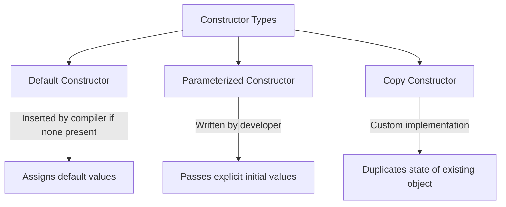
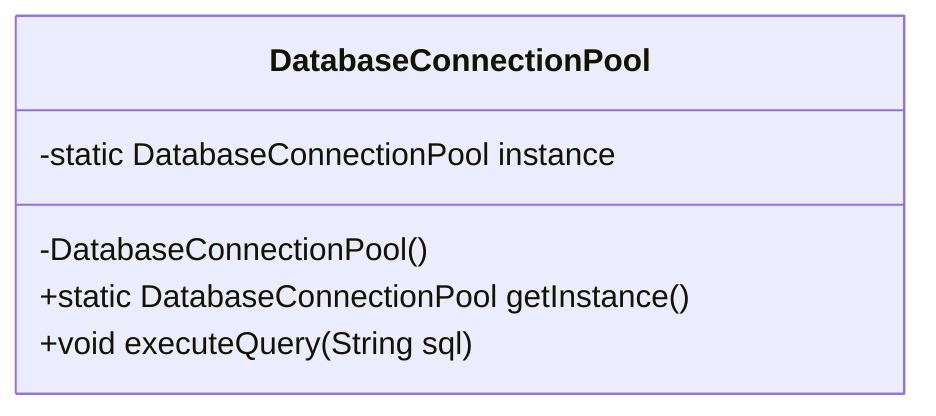

# JAVA - CHAPTER 5
## Constructors, Design Patterns & Keywords

> "Constructors establish object invariants upon birth, while keywords define the precise contracts of inheritance, mutability, and scope."

### By the End of This Chapter, You Will Be Able To:
* Master Default, Parameterized, and Copy Constructors along with Constructor Chaining (`this()` and `super()`).
* Implement the Singleton Design Pattern using Early and Lazy Instantiation with thread-safe private constructors.
* Correctly apply the core Java keywords: `static`, `final`, `this`, and `super`.
* Understand how `static` memory management optimizes JVM heap allocation.
* Utilize `final` variables, methods, and classes to build immutable objects.

---

### 1. Java Constructors & Constructor Overloading

A **Constructor** is a special block of code inside a class invoked automatically when an object is instantiated using the `new` operator. Its primary role is to initialize object fields.

#### Key Characteristics of Constructors
1. Constructor name **MUST** match the class name exactly.
2. Constructors have **NO return type** (not even `void`).
3. If no constructor is written, the Java compiler automatically inserts a **default no-arg constructor**.



#### Program 5.1 — Constructor Overloading and Chaining (`this()`)

```java
public class UserAccount {
    private String username;
    private String email;
    private String role;

    // 1. Default No-Arg Constructor
    public UserAccount() {
        this("Guest_User", "guest@ksai.com", "GUEST"); // Constructor Chaining
    }

    // 2. Parameterized Constructor (2 Arguments)
    public UserAccount(String username, String email) {
        this(username, email, "MEMBER"); // Chaining to 3-arg constructor
    }

    // 3. Master Parameterized Constructor
    public UserAccount(String username, String email, String role) {
        this.username = username;
        this.email = email;
        this.role = role;
    }

    // 4. Copy Constructor
    public UserAccount(UserAccount other) {
        this.username = other.username;
        this.email = other.email;
        this.role = other.role;
    }

    public void displayProfile() {
        System.out.println("User: " + username + " | Email: " + email + " | Role: " + role);
    }

    public static void main(String[] args) {
        UserAccount user1 = new UserAccount();
        UserAccount user2 = new UserAccount("Chandu", "chandu@ksai.com", "ADMIN");
        UserAccount user3 = new UserAccount(user2); // Copy constructor

        user1.displayProfile();
        user2.displayProfile();
        user3.displayProfile();
    }
}
```

> [!NOTE]
> **Constructor Chaining Rule (`this()`)**
> The invocation of another constructor using `this()` or `super()` **MUST** be the very first statement inside the constructor body.

---

### 2. The Singleton Design Pattern

The **Singleton Pattern** ensures that a class has only **one instance** in the entire JVM memory space and provides a global point of access to it.

#### Key Ingredients for Singleton
1. **`private` Constructor**: Prevents external classes from creating instances with `new`.
2. **`private static` Instance**: Holds the single reference to the created object.
3. **`public static` Accessor Method**: Returns the single static instance to callers.



#### A. Early (Eager) Instantiation
Instance is created at class loading time:

```java
public class EagerSingleton {
    // Instance created immediately when class is loaded by JVM
    private static final EagerSingleton INSTANCE = new EagerSingleton();

    private EagerSingleton() {
        System.out.println("EagerSingleton Instance Initialized.");
    }

    public static EagerSingleton getInstance() {
        return INSTANCE;
    }
}
```

#### B. Lazy Instantiation (Thread-Safe Double-Checked Locking)
Instance is created only when requested for the first time:

```java
public class LazySingleton {
    // volatile guarantees visibility across worker threads
    private static volatile LazySingleton instance;

    private LazySingleton() {
        System.out.println("LazySingleton Instance Created.");
    }

    public static LazySingleton getInstance() {
        if (instance == null) {
            synchronized (LazySingleton.class) { // Thread-safe lock
                if (instance == null) {
                    instance = new LazySingleton();
                }
            }
        }
        return instance;
    }
}
```

---

### 3. Core Keywords: `static`, `final`, `this`, and `super`

#### Summary Keyword Matrix

| Keyword | Target Use | Primary Purpose / Behavior |
| :--- | :--- | :--- |
| **`static`** | Variables, Methods, Blocks | Belongs to the Class rather than instances. Allocated once in memory. |
| **`final`** | Variables, Methods, Classes | Imposes immutability. Variable $\rightarrow$ constant; Method $\rightarrow$ cannot override; Class $\rightarrow$ cannot extend. |
| **`this`** | Inside instance methods/constructors | Refers to the current object instance invoking the method/constructor. |
| **`super`** | Inside child class methods/constructors | Refers to the immediate parent class fields, methods, or constructors. |

#### Program 5.2 — Demonstrating `static`, `final`, `this`, and `super`

```java
class Device {
    final String brand = "KnowledgeStream Hardware";

    Device(String model) {
        System.out.println("Device Parent Constructor: " + model);
    }

    void boot() {
        System.out.println("Device powering on...");
    }
}

public class Laptop extends Device {
    private static int totalLaptopsProduced = 0; // Static variable
    private final String serialNumber;           // Final instance variable (Immutable once set)

    public Laptop(String model, String serialNumber) {
        super(model); // Calls parent constructor Device(model)
        this.serialNumber = serialNumber; // 'this' resolves naming conflict
        totalLaptopsProduced++;
    }

    @Override
    void boot() {
        super.boot(); // Invokes parent boot() implementation
        System.out.println("Laptop OS Loading... Serial: " + this.serialNumber);
    }

    public static int getTotalLaptopsProduced() {
        return totalLaptopsProduced;
    }

    public static void main(String[] args) {
        Laptop l1 = new Laptop("Pro 15", "SN-9981");
        Laptop l2 = new Laptop("Air 13", "SN-9982");

        l1.boot();
        l2.boot();

        System.out.println("Total Laptops Built: " + Laptop.getTotalLaptopsProduced());
    }
}
```

> [!TIP]
> **Static Initializer Blocks**
> Use `static { ... }` blocks to perform complex static variable initializations when a class is loaded into the JVM.

---

### ✏ Try It Yourself
1. Implement a thread-safe `Logger` class using the Singleton Pattern.
2. Add a `final` string log file path variable and a static counter tracking total log messages printed.
3. Write a test program to verify that calling `Logger.getInstance()` multiple times returns the exact same object reference (`logger1 == logger2`).

---

### Chapter Summary

#### Key Takeaways
* **Constructors** initialize objects. Constructor chaining via `this()` reduces boilerplate initialization logic.
* **The Singleton Pattern** enforces a single object instance using a private constructor and a static accessor method.
* **`static`** members belong to the class metaspace, shared across all object instances.
* **`final`** variables cannot be reassigned; `final` methods cannot be overridden; `final` classes cannot be inherited.
* **`super`** provides explicit access to parent class constructors and methods from within a subclass.

---

> [!TIP]
> **Prepare for your Chapter Exam!**
> You have completed reading Chapter 5. Head to the **Take Chapter Quiz** assessment below to test your knowledge and unlock Chapter 6!

