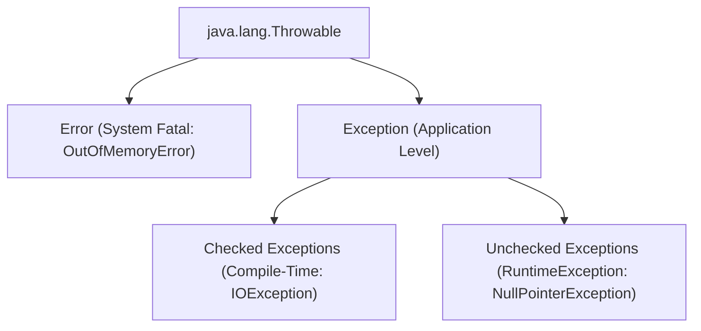
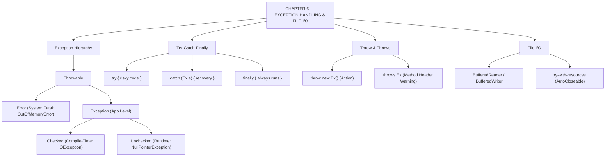

# JAVA - CHAPTER 6
## Exception Handling and File I/O

> “Professional Java applications anticipate disaster, intercept errors gracefully, and persist critical data safely to disk.” — A First Lesson in System Resilience

### Learning Objectives
By the end of this chapter, you will be able to:
* Understand the `Throwable` hierarchy and distinguish between Checked and Unchecked Exceptions.
* Safely intercept runtime errors using `try`, `catch`, and `finally` blocks.
* Propagate errors up the call stack using `throws` and manually trigger them using `throw`.
* Create custom Exception classes for domain-specific business rules.
* Read and write data to physical files using Java I/O and modern `try-with-resources` syntax.

---

### Introduction
In a perfect world, networks never go down, users always type valid numbers, and hard drives never run out of space. In the real world, software encounters catastrophic failures constantly. If your Java application crashes and closes entirely just because a user uploaded the wrong file format, that is a poorly engineered system. Professional Java applications anticipate disaster. By using **Exception Handling**, you build an invisible safety net that catches errors before they crash your program, logs the issue, and gracefully recovers.

### Why This Topic Matters
Without exception handling, reading or writing data to a physical file (File I/O) is impossible in Java. The compiler strictly forces you to acknowledge that "talking to the hard drive might fail." Mastering exceptions and file streams allows your applications to break out of temporary RAM and permanently save data—logs, user profiles, and configuration files—to the disk, making your software truly persistent and enterprise-ready.

---

### Chapter Roadmap
* Concept 1: The Exception Hierarchy
* Concept 2: The `try-catch-finally` Block
* Concept 3: Throwing and Propagating Exceptions
* Concept 4: File I/O and `try-with-resources`
* Learning Support Elements
* Debugging and Problem Solving
* Practical Application & Mini Project
* Practice and Evaluation
* Chapter Conclusion

---

> [!NOTE]
> **Real-Life Analogy: The Restaurant, the Tightrope, and the Safety Net**
> A customer dropping a fork in a restaurant is a minor, fixable issue (an **Exception**). The waiter brings a clean fork. But if the kitchen catches on fire, there is nothing the waiter can do; the restaurant must evacuate (**Error**). 
> **Try-catch** is like walking a tightrope with a safety net below. **Finally** is taking off your safety harness and packing up the equipment after the performance, whether you made it across safely or fell into the net.

---

### Real-World Applications

| Domain | How this chapter's ideas appear in practice |
| :--- | :--- |
| **Enterprise Audit Logging** | Security backends write access attempt timestamps and user IDs to permanent audit `.log` files. |
| **Database Connections** | `try-with-resources` guarantees database sockets are closed automatically, preventing connection leaks. |
| **REST API Frameworks** | Custom exceptions convert backend validation errors into standardized HTTP 400/404 JSON responses. |
| **File Import Pipelines** | FileReader buffers ingest CSV transactions line-by-line without overloading application RAM. |
| **Financial Gateways** | Insufficient funds or invalid PIN entries trigger domain exceptions rather than terminating the server. |
| **Cloud Storage SDKs** | Checked exceptions force developers to handle intermittent network disconnects during file uploads. |

---

### Core Learning Sections

#### CONCEPT 1: The Exception Hierarchy
*Sub-topics Covered: 6.1 Throwable, Errors vs. Exceptions, Checked vs. Unchecked*

##### 6.1 The Hierarchy
In Java, every problem inherits from the `java.lang.Throwable` class. It splits into two main branches:
* **`Error`**: Severe systemic problems that your application *cannot and should not* try to catch (e.g., `OutOfMemoryError`, `StackOverflowError`). If these occur, the JVM dies.
* **`Exception`**: Fixable problems that your code *can* catch and recover from. These split into two categories:
  * **Checked Exceptions (Compile-Time)**: Problems outside your program's direct control (like a missing file). The Java compiler *forces* you to write code to handle these before compilation (e.g., `IOException`, `SQLException`).
  * **Unchecked Exceptions (Runtime)**: Logic bugs caused by bad programming (like dividing by zero or accessing a null pointer). The compiler does *not* force handling (e.g., `NullPointerException`, `ArithmeticException`). They inherit from `RuntimeException`.



---

#### CONCEPT 2: The `try-catch-finally` Block
*Sub-topics Covered: 6.2 Intercepting Crashes and Ensuring Cleanup*

##### 6.2 Using the Blocks
* `try`: Contains the risky code that might throw an exception.
* `catch (ExceptionType e)`: The safety net. If code inside `try` fails, execution jumps immediately here. You can chain multiple catch blocks for different exception types.
* `finally`: An optional block that **always executes**, regardless of whether an exception occurred or was caught. It is primarily used to close file streams, database links, or network sockets to prevent memory leaks.

---

#### CONCEPT 3: Throwing and Propagating Exceptions
*Sub-topics Covered: 6.3 throw, throws, and Custom Exceptions*

##### 6.3 Managing the Error Flow
* **`throw` (Action)**: Used explicitly inside a method to trigger an exception when a business rule is violated:
  `if (age < 18) throw new IllegalArgumentException("Must be 18+");`
* **`throws` (Warning)**: Placed on a method signature to warn callers that the method might fail, delegating exception handling responsibility up the call stack:
  `public void readFile() throws IOException { ... }`
* **Custom Exceptions**: Create domain-specific errors by extending `Exception` (Checked) or `RuntimeException` (Unchecked).

---

#### CONCEPT 4: File I/O and `try-with-resources`
*Sub-topics Covered: 6.4 Reading/Writing Files and Resource Management*

##### 6.4 Interacting with the Hard Drive
Java provides the `java.io` package to handle data streams:
* **Writing**: `FileWriter` wrapped in a `BufferedWriter` is the standard way to write text efficiently.
* **Reading**: `FileReader` wrapped in a `BufferedReader` (or using a `Scanner` passing a `File` object) reads text line-by-line.
* **`try-with-resources`**: Introduced in Java 7, this modern syntax automatically closes any resource implementing `AutoCloseable` opened inside `try(...)` parentheses, eliminating manual `finally` cleanup.

##### Code Example: Safe File Creation and Parsing
```java
import java.io.File;
import java.io.FileWriter;
import java.io.IOException;
import java.util.Scanner;

public class ExceptionDemo {
    public static void main(String[] args) {
        System.out.println("=== SYSTEM START ===");

        File myDataFile = new File("config.txt");

        // 6.4: try-with-resources (automatically closes the FileWriter)
        try (FileWriter writer = new FileWriter(myDataFile)) {
            writer.write("User: Admin\n");
            writer.write("Timeout: 300\n");
            System.out.println("File written successfully.");

        } catch (IOException e) {
            System.out.println("CRITICAL: Failed to write to disk. " + e.getMessage());
        }

        // 6.2: Standard try-catch-finally for reading
        Scanner fileScanner = null;
        try {
            fileScanner = new Scanner(myDataFile);
            System.out.println("\n--- Reading Configuration ---");
            while (fileScanner.hasNextLine()) {
                System.out.println(fileScanner.nextLine());
            }

            // 6.1: Forcing an Unchecked Exception (ArithmeticException)
            int mathError = 10 / 0;

        } catch (IOException e) { // Catches file missing errors
            System.out.println("Error: File not found.");

        } catch (ArithmeticException e) { // Catches math errors
            System.out.println("Error: Attempted to divide by zero!");

        } finally {
            // 6.2: The finally block ALWAYS runs to clean up resources
            if (fileScanner != null) {
                fileScanner.close();
                System.out.println("Scanner closed securely in finally block.");
            }
        }

        System.out.println("=== SYSTEM SHUTDOWN ===");
    }
}
```

##### Expected Output:
```text
=== SYSTEM START ===
File written successfully.

--- Reading Configuration ---
User: Admin
Timeout: 300
Error: Attempted to divide by zero!
Scanner closed securely in finally block.
=== SYSTEM SHUTDOWN ===
```

---

### Learning Support Elements

> [!TIP]
> **Tips: Catch Specific Exceptions First**
> When stacking multiple catch blocks, always catch the most specific exceptions (like `FileNotFoundException`) first, and the most general (`Exception`) last. Placing `catch (Exception e)` at the top will swallow every error, rendering specific blocks below unreachable.

> [!NOTE]
> **Important Notes: `throw` vs. `throws`**
> `throw` (singular) is an **action**. It actually instantiates and hurls the exception object right now inside a method body. `throws` (plural) is a **declaration label** on a method signature warning callers that the method might fail.

> [!WARNING]
> **Warnings: Swallowing Exceptions**
> Never write an empty catch block (e.g., `catch (Exception e) {}`). This is known as "swallowing an exception." The program will crash silently without logging, making production debugging nearly impossible. At minimum, call `e.printStackTrace();`.

#### Common Misconceptions
* **Misconception:** "The `finally` block doesn't run if the `catch` block contains a `return` statement."
* **Reality:** The `finally` block is ironclad. Even if `try` or `catch` executes a `return`, the JVM suspends the return, executes `finally`, and then completes the return operation.

#### Best Practices
* **Use `try-with-resources`:** For any class implementing `AutoCloseable` (Scanners, FileWriters, DB Connections), always prefer `try-with-resources` over manual `finally` block closure to guarantee leak-free resource release.

---

### Debugging and Problem Solving

#### Compiler Error: `unreported exception IOException; must be caught or declared to be thrown`
* **Cause:** Calling a method that throws a Checked Exception (like `new FileWriter()`) without wrapping it in `try-catch` or adding `throws IOException` to the enclosing method signature.
* **Fix:** Wrap the risky operation in `try-catch` or add `throws IOException` to your method header.

#### Runtime Error: `NullPointerException` (NPE)
* **Cause:** Attempted to call a method or access a field on a reference variable currently holding `null` (e.g., `String name = null; name.length();`).
* **Fix:** Inspect stack trace line number, initialize the object, or check `if (variable != null)` before dereferencing.

---

### Practical Application & Mini Project

#### Mini Project: Secure Audit Logger
This project creates a custom Exception for security violations, combined with a file logging service utilizing `try-with-resources`.

```java
import java.io.BufferedWriter;
import java.io.FileWriter;
import java.io.IOException;
import java.time.LocalDateTime;

// 1. Custom Exception (Unchecked)
class SecurityViolationException extends RuntimeException {
    public SecurityViolationException(String message) {
        super(message);
    }
}

class AuditLogger {
    private static final String LOG_FILE = "security_audit.log";

    // Method declares that it might throw an IOException
    public void logEvent(String eventDetails) throws IOException {
        // try-with-resources ensures BufferedWriter is safely closed automatically
        try (BufferedWriter writer = new BufferedWriter(new FileWriter(LOG_FILE, true))) {
            String timestamp = LocalDateTime.now().toString();
            writer.write("[" + timestamp + "] " + eventDetails + "\n");
        }
    }
}

class AuthenticationService {
    private AuditLogger logger = new AuditLogger();

    public void loginUser(String username, String password) {
        System.out.println("Attempting login for: " + username);
        try {
            // Simulating a failed login attempt
            if (!password.equals("SecurePass123")) {
                // Manually trigger custom exception
                throw new SecurityViolationException("Invalid credentials provided.");
            }

            System.out.println("Login successful.");
            logger.logEvent("SUCCESS: User " + username + " logged in.");

        } catch (SecurityViolationException e) {
            // Intercepting custom business logic error
            System.out.println("ACCESS DENIED: " + e.getMessage());

            try {
                // Logging failure to physical file
                logger.logEvent("FAILURE: Failed login attempt for user " + username);
            } catch (IOException ioException) {
                System.out.println("CRITICAL: Failed to write to audit log!");
            }
        } catch (IOException e) {
            System.out.println("CRITICAL: Audit log file write error!");
        }
    }
}

public class SecuritySystemApp {
    public static void main(String[] args) {
        System.out.println("=== SYSTEM ONLINE ===\n");

        AuthenticationService auth = new AuthenticationService();

        // Simulating a bad login
        auth.loginUser("Alice", "WrongPassword");

        System.out.println();

        // Simulating a good login
        auth.loginUser("Bob", "SecurePass123");

        System.out.println("\nCheck the 'security_audit.log' file in your project directory.");
    }
}
```

##### Expected Output:
```text
=== SYSTEM ONLINE ===

Attempting login for: Alice
ACCESS DENIED: Invalid credentials provided.

Attempting login for: Bob
Login successful.

Check the 'security_audit.log' file in your project directory.
```

---

### Practice and Evaluation

#### Coding Exercises
* Create a method `divide(int a, int b)`. Inside it, use a `try-catch` block. If `b` is `0`, catch `ArithmeticException` and print `"Cannot divide by zero."` Otherwise, print the quotient.
* Write a program using `Scanner` and `try-with-resources` to read a text file `data.txt`. Catch `FileNotFoundException` and print a friendly message if missing.

#### Interview Questions & Answers

1. **(Junior) What is the difference between an `Error` and an `Exception` in Java?**
   * **Answer:** Both inherit from `Throwable`. `Error` represents unrecoverable system failures (`OutOfMemoryError`) that applications should not catch. `Exception` represents recoverable conditions (`IOException`) that applications should handle.

2. **(Junior) What happens if an exception is thrown in a method but not caught anywhere?**
   * **Answer:** The exception propagates up the call stack. If it reaches `main()` uncaught, the JVM's Default Exception Handler prints the stack trace to the console and forcefully terminates the application.

3. **(Junior) Explain the difference between `throw` and `throws`.**
   * **Answer:** `throw` is an action keyword used inside a method body to instantiate and trigger an exception. `throws` is a declaration clause on a method signature warning callers that the method might throw specified exceptions.

4. **(Mid-Level) Why is it bad practice to catch generic `Exception` first in multi-catch blocks?**
   * **Answer:** Polymorphism applies to exceptions. `Exception` is the superclass of all exceptions. Catching it first acts as a universal net, making specific subclass catch blocks below unreachable and causing compile errors.

5. **(Mid-Level) Can a `finally` block ever fail to execute?**
   * **Answer:** Under normal operation, `finally` always runs. Extreme exceptions include calling `System.exit(0)`, host JVM crashes (power failure), or OS killing the thread process.

6. **(Mid-Level) How does `try-with-resources` know how to close resources automatically?**
   * **Answer:** Objects declared in `try(...)` must implement `java.lang.AutoCloseable` or `java.io.Closeable`. The JVM automatically invokes `.close()` on these resources when the block exits.

7. **(Senior) What is a Stack Trace, and how do you read it?**
   * **Answer:** A stack trace is a list of active method calls when an exception occurred. Read top-to-bottom: the top line states the Exception type and message, while following lines indicate exact class names, methods, and line numbers.

8. **(Senior) What are performance implications of using Exceptions for regular control flow?**
   * **Answer:** Using exceptions for normal control flow is an anti-pattern. Instantiating an `Exception` is expensive because the JVM halts execution to capture a snapshot of the entire call stack.

9. **(Senior) What are Multi-Catch blocks, and when were they introduced?**
   * **Answer:** Introduced in Java 7, multi-catch allows catching multiple unrelated exceptions in a single block using the `|` operator (e.g., `catch (IOException | SQLException e)`).

10. **(Senior) If you override a method declaring `throws IOException`, what rules apply to the child method?**
    * **Answer:** The child method can declare `throws IOException`, declare a subclass (`FileNotFoundException`), or declare no exceptions. It **cannot** declare broader checked exceptions (`Exception`), respecting Liskov Substitution.

---

### Chapter Conclusion
In Chapter 6, you learned how to build resilient Java software. Instead of allowing invalid data or missing files to crash your application, you now know how to build a safety net using `try-catch-finally`, master Checked vs Unchecked exceptions, and use `try-with-resources` for persistent file streams.

#### Key Takeaways
* **Handle the Unexpected:** Use `try-catch` to intercept predictable runtime failures.
* **Clean Up Resources:** Always close file streams and scanners using `try-with-resources`.
* **Don't Swallow Errors:** Never leave catch blocks empty; always log errors or print stack traces.
* **Know Your Hierarchy:** `Error` = System Death; `RuntimeException` = Logic Bug; `Checked Exception` = Environmental Hazard.

#### What to Learn Next
Up to this point, all programs have executed synchronously on a single pathway. In **Chapter 7: Multithreading and Concurrency**, you will learn how to split your Java application into independent concurrent threads operating simultaneously across CPU cores.

---

### Progressive Code Examples: Four Tiers

#### TIER 1 · BEGINNER
##### Intercepting Division by Zero
**Goal:** Intercept arithmetic runtime crashes and provide clean feedback.

```java
public class BasicCatch {
    public static void main(String[] args) {
        try {
            int result = 10 / 0;
            System.out.println("Result: " + result);
        } catch (ArithmeticException e) {
            System.out.println("Handled Error: Cannot divide by zero.");
        }
        System.out.println("Program continues executing safely.");
    }
}
```

##### Expected Output
```text
Handled Error: Cannot divide by zero.
Program continues executing safely.
```

> **What this tier adds:** Baseline. Basic `try-catch` block handling `ArithmeticException`.

---

#### TIER 2 · INTERMEDIATE
##### Try-With-Resources File Writing
**Goal:** Automatically manage file writer resources using Java 7 `try-with-resources`.

```java
import java.io.BufferedWriter;
import java.io.FileWriter;
import java.io.IOException;

public class AutoCloseDemo {
    public static void main(String[] args) {
        // Resource closed automatically upon block exit
        try (BufferedWriter writer = new BufferedWriter(new FileWriter("output.txt"))) {
            writer.write("Line 1: Hello Java File I/O");
            writer.newLine();
            writer.write("Line 2: Automatic resource management.");
            System.out.println("Successfully wrote to output.txt");
        } catch (IOException e) {
            System.err.println("File I/O Error: " + e.getMessage());
        }
    }
}
```

##### Expected Output
```text
Successfully wrote to output.txt
```

> **What this tier adds:** `try-with-resources` syntax, `BufferedWriter`, and `IOException` handling.

---

#### TIER 3 · ADVANCED
##### Custom Business Exception and Propagation
**Goal:** Create a domain-specific checked exception and enforce caller handling via `throws`.

```java
class InvalidAgeException extends Exception {
    public InvalidAgeException(String msg) { super(msg); }
}

public class CustomExceptionDemo {
    public static void validateVoterAge(int age) throws InvalidAgeException {
        if (age < 18) {
            throw new InvalidAgeException("Age " + age + " is under the legal voting threshold of 18.");
        }
        System.out.println("Voter age " + age + " validated.");
    }

    public static void main(String[] args) {
        try {
            validateVoterAge(16);
        } catch (InvalidAgeException e) {
            System.out.println("Registration Rejected: " + e.getMessage());
        }
    }
}
```

##### Expected Output
```text
Registration Rejected: Age 16 is under the legal voting threshold of 18.
```

> **What this tier adds:** Custom Checked Exception class, `throw` triggering, and `throws` declaration propagation.

---

#### TIER 4 · PROFESSIONAL
##### Multi-Catch and Chained Logging Pipeline
**Goal:** Handle multiple distinct exception types in a single block and chain exception causes for enterprise diagnostics.

```java
import java.io.FileReader;
import java.io.IOException;

class DataParseException extends Exception {
    public DataParseException(String msg, Throwable cause) { super(msg, cause); }
}

public class EnterpriseErrorPipeline {
    public static void processDataFile(String path) throws DataParseException {
        try (FileReader reader = new FileReader(path)) {
            int data = reader.read();
            if (data == -1) throw new IOException("File empty.");
        } catch (IOException | NullPointerException e) {
            // Chained Exception preserving root cause stack trace
            throw new DataParseException("Failed processing pipeline for file: " + path, e);
        }
    }

    public static void main(String[] args) {
        try {
            processDataFile("non_existent_data.json");
        } catch (DataParseException e) {
            System.err.println("Pipeline Alert: " + e.getMessage());
            System.err.println("Root Cause: " + e.getCause().toString());
        }
    }
}
```

##### Expected Output
```text
Pipeline Alert: Failed processing pipeline for file: non_existent_data.json
Root Cause: java.io.FileNotFoundException: non_existent_data.json (No such file or directory)
```

> **What this tier adds:** Multi-catch `|` syntax, exception chaining (`super(msg, cause)`), and root cause extraction.

---

### Common Mistakes and How to Fix Them

| The mistake | Why it happens | What you see (class) | The fix |
| :--- | :--- | :--- | :--- |
| **Swallowing exceptions** | Writing empty `catch (Exception e) {}` | Silent crashes, un-debuggable bugs *(LOGIC)* | Log error or print stack trace: `e.printStackTrace()` |
| **Generic catch placed first** | `catch (Exception e)` before specific types | `exception [X] has already been caught` *(COMPILER)* | Order catch blocks from most specific subclass to most general |
| **Forgetting to close file streams** | Omitted `close()` in manual code | Locked files & memory leaks *(RUNTIME)* | Use `try-with-resources` syntax: `try (Resource r = ...)` |
| **Using `==` on Exception messages** | String reference comparison | `false` when matching exception text *(LOGIC)* | Use `e.getMessage().contains(...)` or `equals()` |
| **Throwing NullPointerException manually** | Anti-pattern for invalid arguments | Confusing stack trace *(STYLE)* | Throw `IllegalArgumentException` or `NullPointerException` with explicit message |
| **Ignoring checked exception warnings** | Called method declaring `throws` | `unreported exception; must be caught or declared` *(COMPILER)* | Wrap call in `try-catch` or declare `throws` on current method |

---

### Chapter Mind Map



---

> [!TIP]
> **Prepare for your Chapter Exam!**
> You have completed reading Chapter 6. Head to the **Take Chapter Quiz** assessment below to test your knowledge and unlock Chapter 7!
