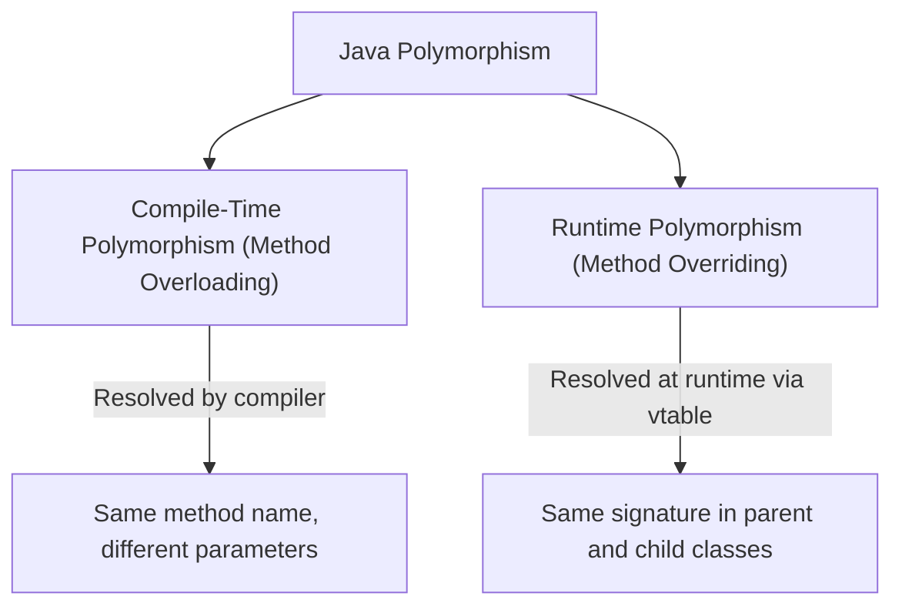
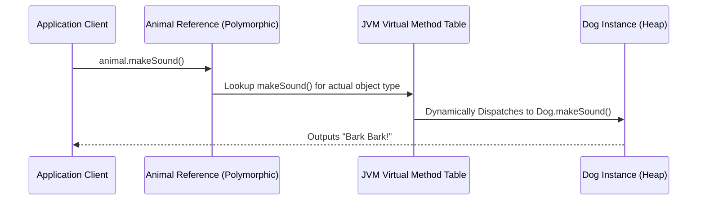

# JAVA - CHAPTER 6
## Polymorphism & Method Binding

> "Polymorphism grants a single interface the flexibility to execute context-specific behavior at runtime, decoupling callers from concrete implementations."

### By the End of This Chapter, You Will Be Able To:
* Master Method Overloading (Compile-Time Polymorphism) and identify valid/invalid overloading signatures.
* Master Method Overriding (Runtime Polymorphism) using `@Override` and adhere to access modifier rules.
* Explain Static (Early) Binding versus Dynamic (Late) Method Binding inside the JVM.
* Safely perform Object Upcasting and Downcasting using the `instanceof` operator.
* Avoid common polymorphism pitfalls like return type ambiguity and static method hiding.

---

### 1. Compile-Time vs. Runtime Polymorphism

Polymorphism in Java manifests in two distinct forms:



| Dimension | Method Overloading | Method Overriding |
| :--- | :--- | :--- |
| **Binding Type** | Static / Early Binding | Dynamic / Late Binding |
| **Resolution Time** | Compile Time | Runtime |
| **Class Scope** | Within the **same class** | Across **Parent and Subclass** |
| **Method Signature** | Must differ in parameter count or types | Must be **identical** in parameters and return type |
| **Private/Static Methods** | Can be overloaded | **Cannot** be overridden (Static methods are hidden) |

---

### 2. Method Overloading Rules & Return Type Conflicts

**Method Overloading** occurs when a class has multiple methods with the exact same name but different parameter lists.

#### Overloading Criteria
To overload a method, signatures **MUST** differ by:
1. Number of parameters (e.g., `add(int a, int b)` vs `add(int a, int b, int c)`).
2. Data types of parameters (e.g., `draw(int radius)` vs `draw(double radius)`).
3. Order of parameter types (e.g., `process(String name, int id)` vs `process(int id, String name)`).

> [!WARNING]
> **Return Type Ambiguity Error**
> Changing **ONLY** the return type or access modifier of a method without altering parameter types is **NOT** valid method overloading and results in a compilation error:
> ```java
> int calculate(int x) { return x * 2; }
> double calculate(int x) { return x * 2.0; } // COMPILATION ERROR!
> ```

#### Program 6.1 — Method Overloading & Type Promotion

```java
public class Calculator {
    // 1. Two Integer Parameters
    public int add(int a, int b) {
        System.out.println("Executing int add(int, int)");
        return a + b;
    }

    // 2. Three Integer Parameters
    public int add(int a, int b, int c) {
        System.out.println("Executing int add(int, int, int)");
        return a + b + c;
    }

    // 3. Two Double Parameters
    public double add(double a, double b) {
        System.out.println("Executing double add(double, double)");
        return a + b;
    }

    public static void main(String[] args) {
        Calculator calc = new Calculator();
        calc.add(10, 20);         // Invokes int add(int, int)
        calc.add(10, 20, 30);     // Invokes int add(int, int, int)
        calc.add(10.5, 20.5);     // Invokes double add(double, double)
        calc.add(10, 20.5f);      // Automatic Type Promotion: float promoted to double
    }
}
```

---

### 3. Dynamic Method Dispatch & Virtual Method Table (vtable)

**Method Overriding** allows a subclass to provide a specific implementation of a method already declared in its parent class.

#### Rules for Method Overriding
1. Method name, parameter list, and return type must be **identical** (or covariant return type).
2. The access modifier in the child class **cannot be more restrictive** than in the parent class (e.g., overriding a `protected` parent method with a `private` child method is illegal).
3. `final`, `static`, and `private` methods **cannot** be overridden.



#### Program 6.2 — Dynamic Method Binding & Upcasting

```java
class Animal {
    void makeSound() {
        System.out.println("Animal makes a generic sound");
    }
}

class Dog extends Animal {
    @Override
    void makeSound() {
        System.out.println("Dog barks: Woof Woof!");
    }
}

class Cat extends Animal {
    @Override
    void makeSound() {
        System.out.println("Cat meows: Meow Meow!");
    }
}

public class DynamicBindingDemo {
    public static void main(String[] args) {
        // Polymorphic Upcasting: Parent reference holding child objects
        Animal myPet = new Dog();
        myPet.makeSound(); // Dynamically binds to Dog's makeSound() at runtime

        myPet = new Cat();
        myPet.makeSound(); // Dynamically binds to Cat's makeSound() at runtime
    }
}
```

---

### 4. Object Typecasting & The `instanceof` Operator

#### Upcasting vs. Downcasting
- **Upcasting**: Casting a child object to a parent reference (Safe, done implicitly).
- **Downcasting**: Casting a parent reference back to a child reference (Requires explicit cast `(ChildType)`).

> [!CAUTION]
> **ClassCastException Danger**
> Attempting to downcast an object reference to an incompatible child class at runtime throws `ClassCastException`. Always check object type using `instanceof` before downcasting.

#### Program 6.3 — Safe Downcasting with Pattern Matching for `instanceof` (Java 16+)

```java
class Notification {
    void send() {
        System.out.println("Sending generic notification...");
    }
}

class EmailNotification extends Notification {
    void sendEmail() {
        System.out.println("Dispatching SMTP Email...");
    }
}

class SMSNotification extends Notification {
    void sendSMS() {
        System.out.println("Dispatching Twilio SMS...");
    }
}

public class TypecastingDemo {
    public static void processNotification(Notification n) {
        n.send();

        // Modern Pattern Matching for instanceof (Java 16+)
        if (n instanceof EmailNotification emailNotif) {
            emailNotif.sendEmail(); // Direct access without explicit manual cast!
        } else if (n instanceof SMSNotification smsNotif) {
            smsNotif.sendSMS();
        }
    }

    public static void main(String[] args) {
        processNotification(new EmailNotification());
        processNotification(new SMSNotification());
    }
}
```

---

### ✏ Try It Yourself
1. Create a base class `Employee` with a method `double calculateBonus(double salary)`.
2. Create two derived classes `Manager` (bonus 20%) and `Developer` (bonus 10%) overriding `calculateBonus`.
3. Create an array of `Employee[]` containing a mix of managers and developers, and calculate the total bonus payload using dynamic runtime binding.

---

### Chapter Summary

#### Key Takeaways
* **Method Overloading** provides compile-time polymorphism through different parameter signatures in the same class.
* **Method Overriding** provides runtime polymorphism by substituting parent method implementations in derived classes.
* **Static Binding** (early binding) resolves calls to `static`, `private`, or `final` methods at compile time.
* **Dynamic Binding** (late binding) resolves overridden virtual methods at runtime via JVM **vtables**.
* Use **Pattern Matching for `instanceof`** (Java 16+) to safely test and downcast polymorphic objects without throwing `ClassCastException`.

---

### Chapter Quiz & Exercises

#### Multiple Choice Questions
1. Which combination of method signatures inside the same class is a valid example of Method Overloading?
   - A) `void execute(int x)` and `int execute(int x)`
   - B) `void execute(int x)` and `void execute(double x)`
   - C) `public void execute(int x)` and `private void execute(int x)`
   - D) `static void execute(int x)` and `void execute(int x)`
   *Correct Answer: B*

2. What runtime exception is thrown if you downcast `Animal a = new Cat()` using `Dog d = (Dog) a`?
   - A) `NullPointerException`
   - B) `IllegalArgumentException`
   - C) `ClassCastException`
   - D) `IllegalStateException`
   *Correct Answer: C*

#### Practice Exercise
Create a shape renderer framework:
1. Base class `Shape` with method `void draw()`.
2. Subclasses `Circle`, `Rectangle`, `Triangle` overriding `draw()`.
3. Demonstrate polymorphic upcasting by iterating through `List<Shape>` and rendering each shape.
