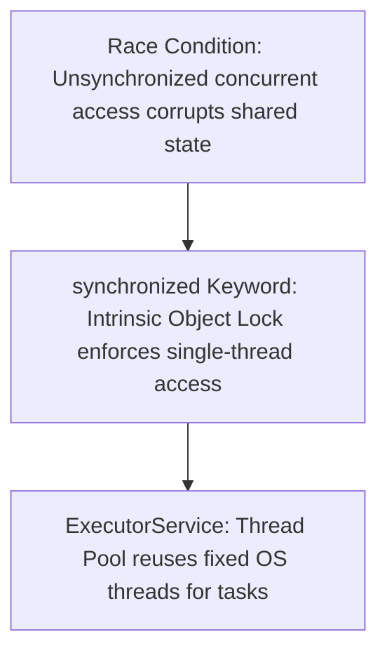
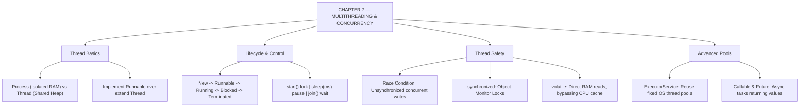

# JAVA - CHAPTER 7
## Multithreading and Concurrency

> “Two threads sharing one variable without synchronization is not a bug you can test for. It is a bug you must design out.” — A First Lesson in Concurrent Architecture

### Learning Objectives
By the end of this chapter, you will be able to:
* Understand the core difference between a Process and a Thread.
* Create and launch threads by extending the `Thread` class or implementing the `Runnable` interface.
* Manage the Thread Lifecycle using `start()`, `sleep()`, and `join()`.
* Prevent data corruption using the `synchronized` keyword and Object Locks.
* Understand and avoid concurrency traps like Deadlocks.
* Introduce modern thread management using the `ExecutorService` (Thread Pools).

---

### Introduction
Imagine a web browser that freezes entirely while downloading a file, preventing you from scrolling or opening new tabs. Or a video game where graphics halt completely while the computer calculates AI moves. That is what happens when software runs on a single thread—it can only do one thing at a time. Modern CPUs have multiple cores capable of executing multiple tasks simultaneously. Java was built from the ground up to harness this power through **Multithreading**, allowing you to split your application into independent workers executing concurrently.

### Why This Topic Matters
Writing multithreaded code unlocks extreme performance and creates highly responsive applications. However, it is also considered one of the most challenging topics in software engineering. When multiple threads access and mutate shared data at the exact same millisecond, it causes **Race Conditions**—subtle, catastrophic bugs that corrupt data and are notoriously hard to reproduce. Mastering Java's synchronization tools ensures you write fast, concurrent software without compromising data integrity.

---

### Chapter Roadmap
* Concept 1: Introduction to Threads and Runnable
* Concept 2: The Thread Lifecycle and Control Methods
* Concept 3: Synchronization and Thread Safety
* Concept 4: Inter-Thread Communication & Thread Pools
* Learning Support Elements
* Debugging and Problem Solving
* Practical Application & Mini Project
* Practice and Evaluation
* Chapter Conclusion

---

> [!NOTE]
> **Real-Life Analogy: The Shared ATM and the Bathroom Key**
> Imagine two people at two different ATMs checking a joint bank account containing $100. They both press "Withdraw $100" at the exact same millisecond. Both ATMs verify the balance is $100 and dispense the cash. The bank just lost $100. That is a **Race Condition**. 
> 
> To fix race conditions, Java uses **Object Locks** (Monitors). Think of a bathroom with only one key. If Thread A takes the key and goes inside (**`synchronized`**), Thread B must wait outside until Thread A comes out and returns the key.

---

### Real-World Applications

| Domain | How this chapter's ideas appear in practice |
| :--- | :--- |
| **Web Servers (Tomcat/Netty)** | `ExecutorService` thread pools handle thousands of concurrent client HTTP requests without creating OS threads per request. |
| **High-Frequency Trading** | Market data feeds process incoming price ticks on dedicated background threads linked via lock-free queues. |
| **Game Development** | Rendering, game physics, and audio playback run on separate threads synchronized at frame boundaries. |
| **Database Engines** | Transaction managers use object monitors and lock ordering to maintain ACID guarantees across concurrent transactions. |
| **Mobile Applications** | Android offloads heavy API network requests and disk database reads to background worker threads to keep UI responsive. |
| **Microservice Engines** | Message queue consumers (Kafka/RabbitMQ) process incoming event batches in parallel across worker pools. |

---

### Core Learning Sections

#### CONCEPT 1: Introduction to Threads and Runnable
*Sub-topics Covered: 7.1 Processes vs. Threads, Creating Threads*

##### 7.1 Creating Threads in Java
A **Process** is an independent program running on your computer with its own isolated memory space. A **Thread** is a smaller unit of execution inside a process. Threads inside the same process share the same **Heap memory**, making communication fast but dangerous.

There are two ways to create a thread in Java:
1. **Extending `Thread` Class**: Inherit from `java.lang.Thread` and override its `run()` method. (Not recommended, because Java prohibits multiple class inheritance).
2. **Implementing `Runnable` Interface (Best Practice)**: Implement `Runnable`, put your code inside `run()`, and pass that task object into a new `Thread` instance. This separates the *task* from the *worker*.

---

#### CONCEPT 2: The Thread Lifecycle and Control Methods
*Sub-topics Covered: 7.2 Thread States, start(), sleep(), join()*

##### 7.2 Thread States and Control
A thread transitions through several states:
`New` $\rightarrow$ `Runnable` $\rightarrow$ `Running` $\rightarrow$ `Blocked/Waiting` $\rightarrow$ `Terminated`.

* **`start()`**: Launches a new physical thread of execution. (Calling `.run()` directly executes code synchronously on the calling thread, defeating multithreading).
* **`Thread.sleep(ms)`**: Pauses the current thread for specified milliseconds, freeing CPU cores for other work. Throws `InterruptedException`.
* **`join()`**: Forces the calling thread (e.g., `main`) to pause and wait until the target thread completely finishes execution.

---

#### CONCEPT 3: Synchronization and Thread Safety
*Sub-topics Covered: 7.3 Race Conditions, synchronized Keyword, Object Locks*

##### 7.3 Ensuring Thread Safety
To prevent race conditions, Java enforces mutual exclusion using Object Locks:
* **The `synchronized` Keyword**: When added to a method signature (`public synchronized void withdraw(...)`), Java guarantees that only **one thread at a time** can execute that method for that object instance.
* **Synchronized Blocks**: Lock a specific critical section using `synchronized (this) { ... }`, keeping locked code as short as possible to optimize performance.



---

#### CONCEPT 4: Inter-Thread Communication & Thread Pools
*Sub-topics Covered: 7.4 Wait/Notify, The ExecutorService*

##### 7.4 Managing Advanced Concurrency
* **`wait()` and `notify()`**: Inter-thread messaging inside synchronized blocks. If a queue is empty, a Consumer thread calls `wait()` to sleep. When a Producer adds an item, it calls `notify()` to wake up the sleeping Consumer.
* **The `ExecutorService` (Modern Approach)**: Manually spawning `new Thread()` for every short task is expensive. `ExecutorService` creates a reusable pool of OS threads (e.g., `Executors.newFixedThreadPool(4)`), processing thousands of tasks efficiently without thread creation overhead.

##### Code Example: The Race Condition and Synchronization
```java
// The shared resource (Bank Account)
class BankAccount {
    private int balance = 100;

    // The 'synchronized' keyword prevents Race Conditions!
    public synchronized void withdraw(int amount, String threadName) {
        if (balance >= amount) {
            System.out.println(threadName + " is about to withdraw...");

            // Simulating network delay to force potential race condition
            try {
                Thread.sleep(100);
            } catch (InterruptedException e) {}

            balance -= amount;
            System.out.println(threadName + " successfully withdrew. Remaining balance: $" + balance);
        } else {
            System.out.println("Transaction failed for " + threadName + ". Insufficient funds.");
        }
    }
}

// The Task (Implementing Runnable)
class WithdrawalTask implements Runnable {
    private BankAccount account;

    public WithdrawalTask(BankAccount account) {
        this.account = account;
    }

    @Override
    public void run() {
        // Every thread attempts to withdraw $100
        account.withdraw(100, Thread.currentThread().getName());
    }
}

public class ConcurrencyDemo {
    public static void main(String[] args) {
        System.out.println("=== ATM SYSTEM ONLINE ===\n");

        BankAccount sharedAccount = new BankAccount();

        // Pass the SAME account object to two different threads
        Thread husband = new Thread(new WithdrawalTask(sharedAccount), "Husband");
        Thread wife = new Thread(new WithdrawalTask(sharedAccount), "Wife");

        // 7.2: Launch both threads simultaneously
        husband.start();
        wife.start();
    }
}
```

##### Expected Output (with `synchronized`):
```text
=== ATM SYSTEM ONLINE ===

Husband is about to withdraw...
Husband successfully withdrew. Remaining balance: $0
Transaction failed for Wife. Insufficient funds.
```

*(Note: If `synchronized` is removed, both threads evaluate `balance >= amount` as true simultaneously, causing balance to drop to `-100`).*

---

### Learning Support Elements

> [!TIP]
> **Tips: Favor `Runnable` Over `Thread`**
> Always implement `Runnable` rather than extending `Thread`. Because Java prohibits multiple class inheritance, extending `Thread` consumes your single allowed inheritance slot. `Runnable` cleanly separates your task logic from thread execution mechanics.

> [!NOTE]
> **Important Notes: The `volatile` Keyword**
> If one thread updates a boolean flag (e.g., `boolean isRunning = true;`) and another thread reads it inside a loop, the reading thread might cache the variable in its CPU cache line and miss updates. Marking the field `private volatile boolean isRunning;` forces all threads to read directly from main RAM.

> [!WARNING]
> **Warnings: Deadlocks**
> A deadlock happens when Thread A locks Resource 1 and waits for Resource 2, while Thread B locks Resource 2 and waits for Resource 1. Both threads freeze forever. Prevent deadlocks by always acquiring multiple locks in the **exact same global order** across your entire application.

#### Common Misconceptions
* **Misconception:** "Calling `thread.run()` starts a new execution thread."
* **Reality:** Calling `.run()` directly behaves like a normal method call, executing synchronously on the *current* calling thread. You must call `.start()` to tell the JVM to fork a new physical execution thread.

#### Best Practices
* **Minimize Synchronized Code:** Avoid placing `synchronized` on massive methods if only two lines touch shared state. Use `synchronized (lock) { ... }` blocks to protect only critical sections.

---

### Debugging and Problem Solving

#### Runtime Error: `IllegalThreadStateException`
* **Cause:** Called `.start()` on a `Thread` object that has already been started or completed. A `Thread` instance is a one-time-use item.
* **Fix:** Instantiate a brand-new `Thread` object wrapping your `Runnable` task before calling `.start()`.

#### Runtime Error: `IllegalMonitorStateException`
* **Cause:** Attempted to call `wait()`, `notify()`, or `notifyAll()` on an object without holding its intrinsic monitor lock (calling outside a `synchronized` block).
* **Fix:** Ensure `wait()` and `notify()` are called exclusively inside code blocks `synchronized` on that exact object.

---

### Practical Application & Mini Project

#### Mini Project: Multithreaded Ticket Booking System
This project simulates a high-traffic concert ticketing server using an `ExecutorService` thread pool to manage concurrent buyer requests securely.

```java
import java.util.concurrent.ExecutorService;
import java.util.concurrent.Executors;
import java.util.concurrent.TimeUnit;

class TicketServer {
    private int availableTickets;

    public TicketServer(int totalTickets) {
        this.availableTickets = totalTickets;
    }

    // Synchronized ensures no double-booking race conditions
    public synchronized void bookTicket(String customerName) {
        if (availableTickets > 0) {
            System.out.println(customerName + " is attempting to book... (Tickets left: " + availableTickets + ")");

            // Simulating server processing time
            try { Thread.sleep(50); } catch (InterruptedException e) {}

            availableTickets--;
            System.out.println("SUCCESS: Ticket booked for " + customerName + "! Tickets remaining: " + availableTickets);
        } else {
            System.out.println("FAILED: Sorry " + customerName + ", the show is sold out.");
        }
    }
}

// The task that threads will execute
class BookingTask implements Runnable {
    private TicketServer server;
    private String customerName;

    public BookingTask(TicketServer server, String customerName) {
        this.server = server;
        this.customerName = customerName;
    }

    @Override
    public void run() {
        server.bookTicket(customerName);
    }
}

public class ConcertBookingApp {
    public static void main(String[] args) {
        System.out.println("=== TICKET MASTER ONLINE ===\n");

        // Only 3 tickets exist
        TicketServer server = new TicketServer(3);

        // 7.4: Using ExecutorService (Thread Pool) to manage 5 concurrent users
        ExecutorService threadPool = Executors.newFixedThreadPool(5);

        String[] customers = {"Alice", "Bob", "Charlie", "Dave", "Eve"};

        // Submit 5 concurrent booking tasks to thread pool
        for (String customer : customers) {
            threadPool.submit(new BookingTask(server, customer));
        }

        // Shut down the pool (prevents new tasks, finishes existing ones)
        threadPool.shutdown();

        try {
            // Wait up to 10 seconds for all threads to finish
            threadPool.awaitTermination(10, TimeUnit.SECONDS);
        } catch (InterruptedException e) {
            e.printStackTrace();
        }

        System.out.println("\n=== SALES CLOSED ===");
    }
}
```

##### Expected Output:
```text
=== TICKET MASTER ONLINE ===

Alice is attempting to book... (Tickets left: 3)
SUCCESS: Ticket booked for Alice! Tickets remaining: 2
Bob is attempting to book... (Tickets left: 2)
SUCCESS: Ticket booked for Bob! Tickets remaining: 1
Charlie is attempting to book... (Tickets left: 1)
SUCCESS: Ticket booked for Charlie! Tickets remaining: 0
FAILED: Sorry Dave, the show is sold out.
FAILED: Sorry Eve, the show is sold out.

=== SALES CLOSED ===
```

---

### Practice and Evaluation

#### Coding Exercises
* Create a class `Countdown` implementing `Runnable`. In its `run()` method, loop from 10 down to 1, printing numbers and calling `Thread.sleep(1000)`. Launch this task in `main` using a `Thread` object.
* Write a program with shared `int counter = 0`. Create two threads looping 10,000 times incrementing `counter`. Run without `synchronized` to observe corrupted totals, then add `synchronized` to fix it.

#### Interview Questions & Answers

1. **(Junior) What is the difference between a Process and a Thread?**
   * **Answer:** A Process is an independent execution environment with its own memory space provided by the OS. A Thread is a lightweight sub-unit of execution within a Process. Threads share Heap memory, enabling fast communication but requiring synchronization.

2. **(Junior) Why should we implement `Runnable` instead of extending `Thread`?**
   * **Answer:** Java prohibits multiple class inheritance. Extending `Thread` consumes your single allowed inheritance slot. Implementing `Runnable` keeps your class flexible and separates task logic from thread infrastructure.

3. **(Junior) What is the difference between `start()` and `run()`?**
   * **Answer:** `start()` instructs the JVM to allocate a new physical execution thread and run `run()` asynchronously on it. Calling `run()` directly executes code synchronously on the current calling thread.

4. **(Mid-Level) Explain the concept of a Race Condition.**
   * **Answer:** A race condition occurs when two or more threads concurrently access and mutate shared data without synchronization. The final data state depends unpredictably on thread scheduling timing.

5. **(Mid-Level) How does the `volatile` keyword differ from `synchronized`?**
   * **Answer:** `volatile` guarantees memory visibility across threads by reading/writing directly to RAM, bypassing CPU caches. `synchronized` guarantees both visibility **and** atomicity by using exclusive object locking.

6. **(Mid-Level) What happens when a `synchronized` method is declared `static`?**
   * **Answer:** An instance `synchronized` method locks the instance object (`this`). A `static synchronized` method locks the `java.lang.Class` object (class-level lock), preventing any two threads from running static synchronized methods for that class concurrently.

7. **(Senior) What are `wait()`, `notify()`, and `notifyAll()`? Why are they in `Object` instead of `Thread`?**
   * **Answer:** They are inter-thread communication mechanisms. They reside in `Object` because they operate on the intrinsic monitor lock of a specific shared object, not the thread itself.

8. **(Senior) Explain the difference between `Callable` and `Runnable`.**
   * **Answer:** Both define concurrent tasks. `Runnable.run()` returns `void` and cannot throw checked exceptions. `Callable.call()` returns a generic value `V` and can throw checked exceptions, used with `ExecutorService` returning a `Future`.

9. **(Senior) What is a `CountDownLatch`?**
   * **Answer:** A synchronization utility in `java.util.concurrent` allowing one or more threads to block via `await()` until a set of operations executing in other threads calls `countDown()` reducing the latch count to zero.

10. **(Senior) What is a Deadlock and how can you prevent it programmatically?**
    * **Answer:** A deadlock occurs when Thread A holds Lock 1 and waits for Lock 2, while Thread B holds Lock 2 and waits for Lock 1. Prevent it using **Lock Ordering**—ensuring all threads acquire multiple locks in the exact same global order.

---

### Chapter Conclusion
In Chapter 7, you transitioned from writing linear, single-lane applications to building high-performance multithreaded architectures. You learned how to launch threads using `Runnable`, manage lifecycles with `sleep()` and `join()`, prevent race conditions with `synchronized`, and manage worker pools with `ExecutorService`.

#### Key Takeaways
* **Use `Runnable`:** Separate task logic (`Runnable`) from execution workers (`Thread`).
* **Beware Shared State:** Synchronize access whenever multiple threads mutate shared data.
* **Use Thread Pools:** Prefer `ExecutorService` over manual `new Thread()` creation for task execution.
* **Order Your Locks:** Prevent deadlocks by acquiring multiple locks in a consistent, global order.

#### What to Learn Next
Now that you can run tasks asynchronously, we need to modernize how we express those tasks. In **Chapter 8: Advanced Java – Lambdas and the Streams API**, you will learn how Java 8 revolutionized data processing using functional expressions and streams pipelines.

---

### Progressive Code Examples: Four Tiers

#### TIER 1 · BEGINNER
##### Launching a Thread with Runnable
**Goal:** Create and start an asynchronous background task using `Runnable`.

```java
public class SimpleThreadDemo {
    public static void main(String[] args) {
        Runnable task = () -> {
            System.out.println("Async Worker running on: " + Thread.currentThread().getName());
        };

        Thread thread = new Thread(task, "Worker-1");
        thread.start();

        System.out.println("Main thread executing on: " + Thread.currentThread().getName());
    }
}
```

##### Expected Output
```text
Main thread executing on: main
Async Worker running on: Worker-1
```

> **What this tier adds:** Baseline. Creating a `Thread` with `Runnable`, setting a thread name, and invoking `.start()`.

---

#### TIER 2 · INTERMEDIATE
##### Thread Lifecycle Management with `join()`
**Goal:** Coordinate thread execution so `main` waits for worker completion.

```java
public class ThreadJoinDemo {
    public static void main(String[] args) throws InterruptedException {
        Thread worker = new Thread(() -> {
            try {
                System.out.println("Worker starting computation...");
                Thread.sleep(200);
                System.out.println("Worker completed computation.");
            } catch (InterruptedException e) {}
        });

        worker.start();
        System.out.println("Main waiting for worker...");
        worker.join(); // Main thread blocks until worker finishes
        System.out.println("Main resumed. All tasks complete.");
    }
}
```

##### Expected Output
```text
Main waiting for worker...
Worker starting computation...
Worker completed computation.
Main resumed. All tasks complete.
```

> **What this tier adds:** `Thread.sleep()` handling and thread synchronization using `.join()`.

---

#### TIER 3 · ADVANCED
##### Fine-Grained Synchronized Block
**Goal:** Protect shared counter mutation using fine-grained object lock blocks.

```java
class SynchronizedCounter {
    private int count = 0;
    private final Object lock = new Object();

    public void increment() {
        synchronized (lock) { // Locks only the critical section
            count++;
        }
    }

    public int getCount() {
        synchronized (lock) {
            return count;
        }
    }
}

public class FineGrainedLockDemo {
    public static void main(String[] args) throws InterruptedException {
        SynchronizedCounter counter = new SynchronizedCounter();

        Runnable task = () -> {
            for (int i = 0; i < 10000; i++) counter.increment();
        };

        Thread t1 = new Thread(task);
        Thread t2 = new Thread(task);

        t1.start(); t2.start();
        t1.join(); t2.join();

        System.out.println("Final Safe Count (Should be 20000): " + counter.getCount());
    }
}
```

##### Expected Output
```text
Final Safe Count (Should be 20000): 20000
```

> **What this tier adds:** Dedicated lock objects, fine-grained `synchronized (lock)` blocks, and race condition elimination.

---

#### TIER 4 · PROFESSIONAL
##### Fixed Thread Pool Execution with `Callable` and `Future`
**Goal:** Execute concurrent tasks returning futures via `ExecutorService` and collect results safely.

```java
import java.util.concurrent.Callable;
import java.util.concurrent.ExecutionException;
import java.util.concurrent.ExecutorService;
import java.util.concurrent.Executors;
import java.util.concurrent.Future;

public class ExecutorServiceDemo {
    public static void main(String[] args) throws ExecutionException, InterruptedException {
        ExecutorService executor = Executors.newFixedThreadPool(2);

        Callable<Integer> computeTask = () -> {
            System.out.println("Task running in thread pool: " + Thread.currentThread().getName());
            Thread.sleep(100);
            return 42 * 2;
        };

        Future<Integer> futureResult = executor.submit(computeTask);

        System.out.println("Main thread doing parallel work...");
        Integer result = futureResult.get(); // Blocks until task completes

        System.out.println("Future Result Received: " + result);
        executor.shutdown();
    }
}
```

##### Expected Output
```text
Main thread doing parallel work...
Task running in thread pool: pool-1-thread-1
Future Result Received: 84
```

> **What this tier adds:** `ExecutorService` fixed thread pools, `Callable<V>` returning values, and `Future.get()` asynchronous synchronization.

---

### Common Mistakes and How to Fix Them

| The mistake | Why it happens | What you see (class) | The fix |
| :--- | :--- | :--- | :--- |
| **Calling `.run()` instead of `.start()`** | Confusing method execution with thread launch | Code runs synchronously on caller thread *(LOGIC)* | Always invoke `thread.start()` to fork execution |
| **Restarting a finished thread** | Calling `.start()` twice on same `Thread` | `IllegalThreadStateException` *(RUNTIME)* | Instantiate a new `Thread` object for subsequent launches |
| **Calling `wait()` outside `synchronized`** | Missing monitor lock ownership | `IllegalMonitorStateException` *(RUNTIME)* | Wrap `wait()` and `notify()` inside `synchronized (obj) { ... }` |
| **Shared mutable state without sync** | Missing synchronization on shared fields | Corrupted totals & non-reproducible race bugs *(LOGIC)* | Synchronize methods/blocks or use `AtomicInteger` / `volatile` |
| **Acquiring multiple locks out of order** | Thread A locks (1,2) while B locks (2,1) | Program freezes in permanent Deadlock *(RUNTIME)* | Establish global lock ordering across all execution paths |
| **Forgetting `executor.shutdown()`** | Active pool keeps worker threads alive | JVM process refuses to exit after `main` finishes *(RUNTIME)* | Always call `executor.shutdown()` after submitting tasks |

---

### Chapter Mind Map



---

> [!TIP]
> **Prepare for your Chapter Exam!**
> You have completed reading Chapter 7. Head to the **Take Chapter Quiz** assessment below to test your knowledge and unlock Chapter 8!
