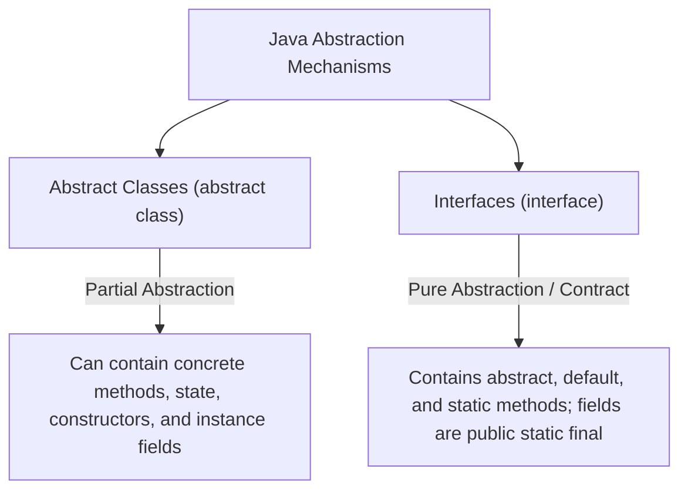
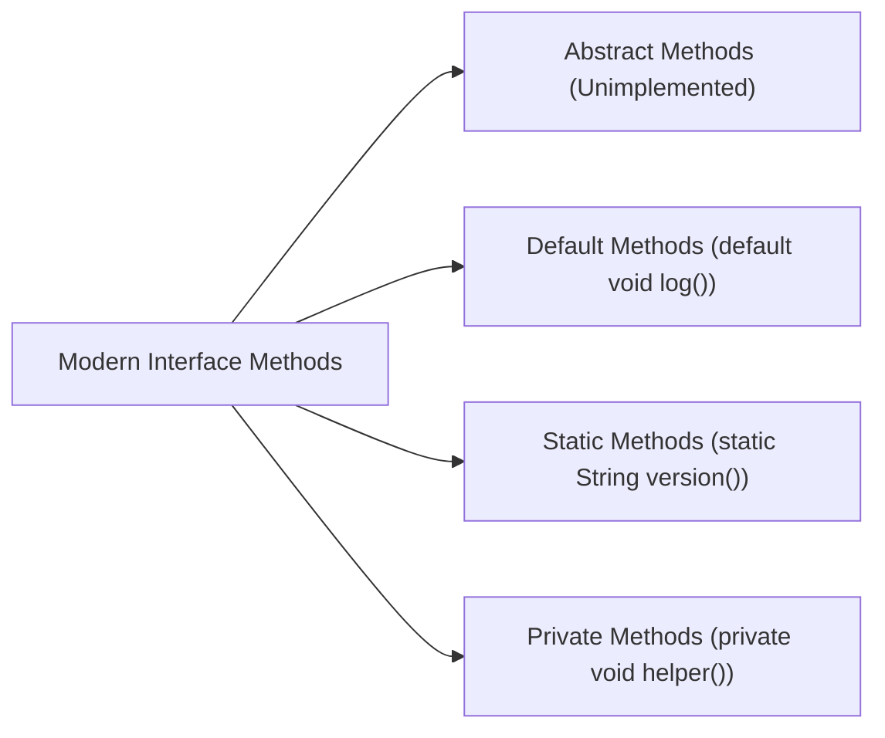

# JAVA - CHAPTER 7
## Abstraction (Abstract Classes vs. Interfaces)

> "Abstraction defines the essential contractual behavior of software systems while hiding implementation details behind immutable boundaries."

### By the End of This Chapter, You Will Be Able To:
* Design software using Abstract Classes (0% to 100% partial abstraction) and Interfaces (100% full abstraction).
* Analyze a comprehensive comparison matrix between Abstract Classes and Interfaces.
* Utilize Marker Interfaces (`Serializable`, `Cloneable`) to convey meta-level capabilities to the JVM.
* Implement modern Java 8+ Interface features including `default` methods, `static` methods, and Java 9 `private` interface methods.
* Resolve the "Diamond Problem" associated with multiple interface inheritance using explicit `InterfaceName.super.method()` syntax.

---

### 1. Abstract Classes vs. Interfaces

Abstraction in Java is realized through two distinct constructs: **Abstract Classes** and **Interfaces**.



#### Comprehensive Feature Matrix

| Feature / Capability | Abstract Class | Interface (Java 8+) |
| :--- | :--- | :--- |
| **Abstraction Level** | Partial (0% to 100%) | Pure Contract (100% before default methods) |
| **Multiple Inheritance** | **No** (Single inheritance via `extends`) | **Yes** (Multiple inheritance via `implements`) |
| **Instance Fields** | Can have `private`, `protected`, `public` instance fields | Fields are implicitly `public static final` (constants) |
| **Constructors** | **Yes** (Can have constructors to initialize parent state) | **No** (Interfaces cannot have constructors) |
| **Method Implementation** | Can contain concrete, final, or static methods alongside abstract ones | Abstract methods by default; can have `default` & `static` methods |
| **Access Modifiers** | Methods can be `public`, `protected`, or `private` | Methods are implicitly `public` (or `private` starting Java 9) |
| **Speed / Overhead** | Slightly faster (Direct Virtual Method Invocation) | Minor lookup overhead (Interface Method Table resolution) |

---

### 2. Deep Dive: Code Implementation

#### A. Abstract Class Example

```java
abstract class Vehicle {
    private String modelName;

    // Abstract Class Constructor
    public Vehicle(String modelName) {
        this.modelName = modelName;
    }

    // Concrete method shared by all child classes
    public void displayModel() {
        System.out.println("Vehicle Model: " + modelName);
    }

    // Abstract method: MUST be overridden by concrete subclasses
    public abstract void startEngine();
}

class ElectricCar extends Vehicle {
    public ElectricCar(String modelName) {
        super(modelName);
    }

    @Override
    public void startEngine() {
        System.out.println("Push-button start: Quiet electric motor initialized.");
    }
}
```

#### B. Interface & Multiple Inheritance Example

```java
interface Flyable {
    void fly();
}

interface Autonomous {
    void navigateGPS();
}

// Drone implements multiple interfaces simultaneously
class Drone implements Flyable, Autonomous {
    @Override
    public void fly() {
        System.out.println("Drone rotors spinning up for vertical takeoff.");
    }

    @Override
    public void navigateGPS() {
        System.out.println("Drone calculating waypoint trajectories via GPS.");
    }
}
```

---

### 3. Java 8+ Interface Enhancements

Prior to Java 8, interfaces could only contain abstract methods and constants. Modern Java introduced powerful extensions:

1. **`default` Methods (Java 8)**: Allows adding new concrete methods to interfaces without breaking existing implementing classes.
2. **`static` Methods (Java 8)**: Utility methods associated directly with the interface.
3. **`private` Methods (Java 9)**: Helper methods used internally inside interface `default` or `static` methods to reduce code duplication.



#### Program 7.1 — Demonstrating Default, Static, and Private Methods

```java
interface SmartDevice {
    // 1. Abstract Method
    void performTask();

    // 2. Default Method (Can be overridden by implementing class if needed)
    default void diagnostics() {
        logEvent("Running diagnostic check...");
        System.out.println("Diagnostics Status: OK");
    }

    // 3. Static Utility Method
    static String getManufacturer() {
        return "KnowledgeStream IoT Corp";
    }

    // 4. Private Helper Method (Java 9+)
    private void logEvent(String message) {
        System.out.println("[LOG]: " + message);
    }
}

public class InterfaceDemo implements SmartDevice {
    @Override
    public void performTask() {
        System.out.println("SmartDevice executing automated task.");
    }

    public static void main(String[] args) {
        InterfaceDemo device = new InterfaceDemo();
        device.performTask();
        device.diagnostics(); // Invokes default method

        System.out.println("Manufacturer: " + SmartDevice.getManufacturer());
    }
}
```

> [!NOTE]
> **Resolving the Interface Diamond Problem**
> If a class implements two interfaces that contain identical `default` method signatures, the compiler throws an error. The class MUST override the conflicting method explicitly and specify which interface to use via `InterfaceName.super.methodName()`.

---

### 4. Marker Interfaces

A **Marker Interface** (or Tagging Interface) is an interface that contains **no methods or fields**. It acts as a flag conveying runtime instructions to the JVM or compiler.

#### Common Built-in Marker Interfaces
- **`java.io.Serializable`**: Signals to `ObjectOutputStream` that objects of this class can be converted into a byte stream for storage or network transport.
- **`java.lang.Cloneable`**: Signals to `Object.clone()` that duplicate copies of an object instance can be safely created.
- **`java.util.RandomAccess`**: Signals that a List implementation (e.g., `ArrayList`) supports fast $O(1)$ constant-time random access.

```java
import java.io.Serializable;

// Custom class tagged with Serializable marker interface
public class CustomerProfile implements Serializable {
    private static final long serialVersionUID = 1L;
    
    private int customerId;
    private String name;

    public CustomerProfile(int id, String name) {
        this.customerId = id;
        this.name = name;
    }
}
```

---

### ✏ Try It Yourself
1. Create an interface `DatabaseDriver` with abstract method `connect()`, default method `disconnect()`, and static method `getDriverVersion()`.
2. Implement two classes: `MySQLDriver` and `PostgreSQLDriver`.
3. Create an abstract class `AbstractQueryBuilder` containing a concrete field `String table` and an abstract method `String buildQuery()`.

---

### Chapter Summary

#### Key Takeaways
* **Abstract Classes** provide partial implementation (0-100%), state variables, and constructors for single-inheritance hierarchies.
* **Interfaces** define pure behavioral contracts and support multiple inheritance (`implements A, B`).
* Java 8+ added **`default`** and **`static`** methods to interfaces; Java 9 added **`private`** interface methods.
* **Marker Interfaces** (`Serializable`, `Cloneable`) contain no methods but pass metadata instructions to the JVM execution runtime.

---

### Chapter Quiz & Exercises

#### Multiple Choice Questions
1. What keyword is required when adding a method with a concrete body inside a Java 8 Interface?
   - A) `abstract`
   - B) `default`
   - C) `native`
   - D) `synchronized`
   *Correct Answer: B*

2. Which of the following statements about Marker Interfaces is TRUE?
   - A) They must contain at least one static method.
   - B) They contain zero methods or fields and serve as a tag for the JVM.
   - C) They can only be extended by abstract classes.
   - D) They require classes to implement a `clone()` method.
   *Correct Answer: B*

#### Practice Exercise
Create a pluggable storage plugin architecture:
1. Interface `StoragePlugin` with default method `void initialize()`, abstract method `void save(String key, String data)`.
2. Implementing classes `CloudStoragePlugin` and `LocalStoragePlugin`.
3. Demonstrate interface polymorphism by saving data across multiple plugin instances.
