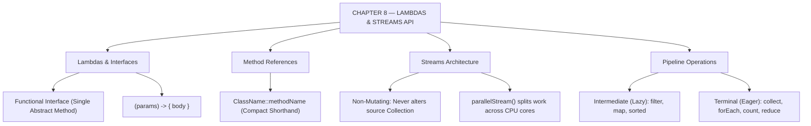

# JAVA - CHAPTER 8
## Advanced Java: Lambdas and the Streams API

> “Declarative programming allows you to describe what you want computed, letting the library decide how to compute it.” — A First Lesson in Functional Style

### Learning Objectives
By the end of this chapter, you will be able to:
* Understand Functional Interfaces and the `@FunctionalInterface` annotation.
* Master the syntax of Lambda Expressions (`->`) to pass behavior as data.
* Simplify code further using Method References (`::`).
* Create data processing pipelines using the Streams API.
* Differentiate between Intermediate operations (lazy) and Terminal operations (eager).

---

### Introduction
For nearly two decades, Java was strictly an object-oriented, imperative language. If you wanted to filter a list of users, you had to write a `for` loop, create a temporary list, check an `if` condition, and manually add matching items to the new list. It was verbose and tedious. In 2014, Java 8 changed the landscape of the language forever by introducing **Functional Programming** paradigms. With Lambdas and the Streams API, Java allows you to shift from imperative programming (telling the computer *how* to loop) to declarative programming (telling the computer *what* you want the final result to be).

### Why This Topic Matters
If you look at any modern Java codebase, Spring Boot backend, or Android application, you will see Lambdas and Streams everywhere. They reduce what used to take 15 lines of clunky loop code into a single, highly readable, and mathematically elegant line. Furthermore, the Streams API can process massive datasets in parallel across multi-core CPUs automatically, making your data transformations blazingly fast with almost zero extra effort.

---

### Chapter Roadmap
* Concept 1: Functional Interfaces and Lambdas
* Concept 2: Method References
* Concept 3: The Streams API Architecture
* Concept 4: Intermediate and Terminal Operations
* Learning Support Elements
* Debugging and Problem Solving
* Practical Application & Mini Project
* Practice and Evaluation
* Chapter Conclusion

---

> [!NOTE]
> **Real-Life Analogy: The Floating Hand and the Factory Assembly Line**
> In old Java, to hire someone to press a button, you built an entire office (**Class**), hired an employee (**Object**), and wrote a job description (**Method**). A **Lambda Expression** is a floating hand that manifests, presses the button, and disappears.
> A **Collection** (like an `ArrayList`) is a bucket holding data. A **Stream** is an assembly line in a factory. Items flow down a conveyor belt, robotic arms transform or filter them (**Intermediate Operations**), and a boxing machine packages the final items into a container (**Terminal Operation**).

---

### Real-World Applications

| Domain | How this chapter's ideas appear in practice |
| :--- | :--- |
| **Spring Boot Repositories** | Streams filter, map, and collect database entities returned from JPA repositories in fluid pipelines. |
| **Financial Analytics** | Parallel streams aggregate millions of ledger records across CPU cores without complex multithreading code. |
| **REST API DTO Mapping** | `.map(UserMapper::toDto)` transforms domain entities into light JSON transfer objects effortlessly. |
| **Event Stream Engines** | Reactive extensions (RxJava, Project Reactor) extend Stream concepts to continuous live event pipelines. |
| **Security Authorization** | Lambdas evaluate dynamic security permission rules passed as predicates to access controllers. |
| **Data Warehousing** | Stream reduction (`.reduce()`, `.collect()`) aggregates transaction sums, averages, and group-by reports. |

---

### Core Learning Sections

#### CONCEPT 1: Functional Interfaces and Lambdas
*Sub-topics Covered: 8.1 Functional Interfaces, Lambda Syntax*

##### 8.1 Functional Interfaces and Lambdas
* **Functional Interface**: An interface that contains **exactly one abstract method** (Single Abstract Method - SAM). It can contain multiple default or static methods. Java provides the `@FunctionalInterface` annotation to enforce this rule.
* **Lambda Syntax**: `(parameters) -> { body }`
  * No parameters: `() -> System.out.println("Hello");`
  * One parameter: `name -> System.out.println(name);` (Parentheses optional for single params).
  * Multiple parameters: `(a, b) -> a + b;` (Curly braces and `return` keyword optional for single-line expressions).

---

#### CONCEPT 2: Method References
*Sub-topics Covered: 8.2 Method References (::)*

##### 8.2 Method References
When a lambda expression does nothing but invoke an existing method, **Method References (`::`)** provide an even shorter, cleaner shorthand:
* Lambda: `name -> System.out.println(name)`
* Method Reference: `System.out::println`
* Syntax: `ClassName::staticMethodName` or `instance::instanceMethodName`

---

#### CONCEPT 3: The Streams API Architecture
*Sub-topics Covered: 8.3 What is a Stream?, Creating Streams*

##### 8.3 Understanding Streams
* **Creation**: Turn almost any `Collection` into a stream by calling `.stream()` (e.g., `myList.stream()`).
* **Not a Data Structure**: A stream does **not** store data. It only moves data through a computational pipeline.
* **Parallelism**: Calling `.parallelStream()` splits data processing across multi-core CPUs automatically.

---

#### CONCEPT 4: Intermediate and Terminal Operations
*Sub-topics Covered: 8.4 Intermediate Operations, Terminal Operations, Lazy Evaluation*

##### 8.4 Building the Pipeline
Stream operations fall into two strict categories:
1. **Intermediate Operations (The Assembly Line Machines)**: Return *another Stream*, allowing operation chaining. They are **lazy**—they execute zero processing until a Terminal operation is called.
   * `filter(Predicate)`: Retains elements matching a boolean condition.
   * `map(Function)`: Transforms elements into new values/types (e.g., mapping `User` $\rightarrow$ `String name`).
   * `sorted()`: Sorts elements according to natural order or a custom `Comparator`.
2. **Terminal Operations (The Boxing Department)**: Trigger the assembly line to start processing. They return a final non-Stream result (a `List`, `int`, `boolean`) and **close the stream**.
   * `collect(Collectors.toList())`: Packages surviving elements back into a standard `List`.
   * `forEach(Consumer)`: Performs an action for every element.
   * `count()`: Returns total element count.
   * `reduce()`: Combines elements into a single aggregated value (like calculating a sum).

```mermaid
graph TD
    Source["Source Collection (List<T>)"] -->|stream()| Pipe["Stream Pipeline"]
    Pipe -->|filter(Predicate)| Int1["Intermediate: Filter (Lazy)"]
    Int1 -->|map(Function)| Int2["Intermediate: Map (Lazy)"]
    Int2 -->|collect(Collectors.toList())| Term["Terminal: Collect (Eager)"]
    Term --> Output["Final Result List<R>"]
```

##### Code Example: Imperative vs. Declarative
```java
import java.util.Arrays;
import java.util.List;
import java.util.stream.Collectors;

public class StreamDemo {
    public static void main(String[] args) {
        List<String> names = Arrays.asList("Alice", "Bob", "Charlie", "David", "Anna");

        System.out.println("--- 1. THE OLD IMPERATIVE WAY (Pre-Java 8) ---");
        for (String name : names) {
            if (name.startsWith("A")) {
                System.out.println(name.toUpperCase());
            }
        }

        System.out.println("\n--- 2. THE MODERN DECLARATIVE WAY (Streams & Lambdas) ---");
        // We declare WHAT we want, not HOW to loop
        names.stream()
            .filter(name -> name.startsWith("A")) // Intermediate: Keep names starting with 'A'
            .map(name -> name.toUpperCase())     // Intermediate: Convert to uppercase
            .forEach(System.out::println);       // Terminal: Print each one (Method Reference)

        System.out.println("\n--- 3. COLLECTING RESULTS INTO A NEW LIST ---");
        List<Integer> nameLengths = names.stream()
            .map(String::length) // Convert String to Integer length
            .collect(Collectors.toList()); // Terminal: Package into List

        System.out.println("Lengths of names: " + nameLengths);
    }
}
```

##### Expected Output:
```text
--- 1. THE OLD IMPERATIVE WAY (Pre-Java 8) ---
ALICE
ANNA

--- 2. THE MODERN DECLARATIVE WAY (Streams & Lambdas) ---
ALICE
ANNA

--- 3. COLLECTING RESULTS INTO A NEW LIST ---
Lengths of names: [5, 3, 7, 5, 4]
```

---

### Learning Support Elements

> [!TIP]
> **Tips: Reading Stream Pipelines**
> Read stream pipelines vertically, line-by-line. Place the dot `.` at the start of each line for `.filter()`, `.map()`, and `.collect()`. This aligns the assembly line visually, making data flow clear.

> [!NOTE]
> **Important Notes: Streams are Single-Use**
> A `Stream` is **not** a reusable variable. Once a Terminal operation (`count()`, `collect()`) is called, the stream is closed and consumed. Attempting to call another operation on the same stream object throws `IllegalStateException`.

> [!WARNING]
> **Warnings: Parallel Streams Overhead**
> Do not use `.parallelStream()` blindly. Splitting data, managing thread pools, and merging results introduces overhead. Use parallel streams only for gigantic datasets (100,000+ items) or CPU-heavy mathematical computations.

#### Common Misconceptions
* **Misconception:** "Streams modify the original source `List`."
* **Reality:** Streams **never** mutate source data. The original collection remains completely untouched. A stream pipeline generates a brand-new result.

#### Best Practices
* **Keep Lambdas Short:** A lambda should ideally be a single clean line. If logic requires complex `if-else` blocks, extract it into a helper method and use a Method Reference instead.

---

### Debugging and Problem Solving

#### Runtime Error: `IllegalStateException: stream has already been operated upon or closed`
* **Cause:** Stored a stream in a variable, called a terminal operation, then tried to reuse the stream variable.
* **Fix:** Create a fresh stream directly from the collection source whenever processing data (`myList.stream().filter(...)`).

#### Logical Bug: Stream Pipeline Does Nothing
* **Cause:** Chained intermediate operations (`.filter()`, `.map()`), but omitted a Terminal operation at the end.
* **Fix:** Attach a Terminal operation (`.collect()`, `.forEach()`) to trigger pipeline execution.

---

### Practical Application & Mini Project

#### Mini Project: Corporate HR Stream Processor
This project models an HR data engine processing employee records using advanced filtering, mapping, sorting, and aggregate stream pipelines.

```java
import java.util.Arrays;
import java.util.Comparator;
import java.util.List;
import java.util.stream.Collectors;

class Employee {
    private String name;
    private String department;
    private double salary;

    public Employee(String name, String department, double salary) {
        this.name = name;
        this.department = department;
        this.salary = salary;
    }

    public String getName() { return name; }
    public String getDepartment() { return department; }
    public double getSalary() { return salary; }

    @Override
    public String toString() {
        return name + " (" + department + ") - $" + salary;
    }
}

public class HRStreamProcessor {
    public static void main(String[] args) {
        System.out.println("=== HR STREAM DASHBOARD ===\n");

        List<Employee> employees = Arrays.asList(
            new Employee("Alice", "Engineering", 120000),
            new Employee("Bob", "Sales", 85000),
            new Employee("Charlie", "Engineering", 95000),
            new Employee("David", "Marketing", 70000),
            new Employee("Eve", "Engineering", 140000)
        );

        System.out.println("1. All Engineering Employees earning > $100k:");
        employees.stream()
            .filter(e -> e.getDepartment().equals("Engineering"))
            .filter(e -> e.getSalary() > 100000)
            .forEach(e -> System.out.println("  " + e.getName()));

        System.out.println("\n2. Extracting names of Sales/Marketing, sorted alphabetically:");
        List<String> nonEngineers = employees.stream()
            .filter(e -> !e.getDepartment().equals("Engineering"))
            .map(Employee::getName) // Transform Employee -> String name
            .sorted()                // Sort names alphabetically
            .collect(Collectors.toList());

        System.out.println("  " + nonEngineers);

        System.out.println("\n3. Calculating Total Payroll for the entire company:");
        double totalPayroll = employees.stream()
            .mapToDouble(Employee::getSalary)
            .sum();

        System.out.println("  $" + totalPayroll);

        System.out.println("\n4. Finding the highest paid employee:");
        Employee topEarner = employees.stream()
            .max(Comparator.comparing(Employee::getSalary))
            .orElse(null);

        System.out.println("  " + topEarner);
    }
}
```

##### Expected Output:
```text
=== HR STREAM DASHBOARD ===

1. All Engineering Employees earning > $100k:
  Alice
  Eve

2. Extracting names of Sales/Marketing, sorted alphabetically:
  [Bob, David]

3. Calculating Total Payroll for the entire company:
  $510000.0

4. Finding the highest paid employee:
  Eve (Engineering) - $140000.0
```

---

### Practice and Evaluation

#### Coding Exercises
* Create a `List<Integer>` containing numbers 1 to 10. Write a single stream pipeline that filters out odd numbers, multiplies remaining even numbers by 10, and prints them using `forEach`.
* Given a `List<String>` of animal names (`"Dog"`, `"Cat"`, `"Elephant"`, `"Tiger"`, `"Ant"`), write a stream pipeline to collect all names longer than 3 characters into a new `List<String>`.

#### Interview Questions & Answers

1. **(Junior) What was the main motivation for introducing Lambdas and Streams in Java 8?**
   * **Answer:** To bring functional programming capabilities to Java, enabling concise, declarative code, reducing boilerplate anonymous inner classes, and simplifying multi-core parallel processing.

2. **(Junior) What is the `@FunctionalInterface` annotation used for?**
   * **Answer:** It instructs the compiler to verify that an interface contains exactly one abstract method (SAM rule), throwing a compile-time error if a second abstract method is added.

3. **(Junior) Describe the concept of "Lazy Evaluation" in Streams.**
   * **Answer:** Lazy evaluation means intermediate operations (`filter`, `map`) do not process data when declared; they build an execution recipe. Data flows through the pipeline only when a Terminal operation is invoked.

4. **(Mid-Level) Differentiate between `map()` and `filter()`.**
   * **Answer:** `filter(Predicate)` tests elements against a boolean condition, retaining only matching items (same data type). `map(Function)` transforms every element into a new value or data type ($1$-to-$1$ mapping).

5. **(Mid-Level) Explain the difference between a `Collection` and a `Stream`.**
   * **Answer:** A `Collection` is an in-memory data structure storing elements. A `Stream` is a computational pipeline that processes data on-the-fly without modifying the underlying collection.

6. **(Mid-Level) What does the `reduce()` operation do?**
   * **Answer:** `reduce()` is a terminal operation that repeatedly combines stream elements into a single aggregated result (such as summing numbers or finding maximum values) using an associative accumulation function.

7. **(Senior) When would you choose NOT to use a parallel stream (`.parallelStream()`)?**
   * **Answer:** Avoid parallel streams on small datasets, simple non-blocking tasks, or ordered streams. Thread pool management overhead (Fork/Join framework) makes parallel execution slower than sequential execution for small inputs.

8. **(Senior) What are `Optional` objects, and why do operations like `findFirst()` or `max()` return them?**
   * **Answer:** `Optional<T>` is a container that may or may not hold a non-null value. Streams return `Optional` because results might be empty (e.g., filtering yields zero matches), forcing developers to handle empty cases safely without `NullPointerException`.

9. **(Senior) What is a Method Reference, and what are its different types?**
   * **Answer:** A method reference (`::`) is a compact shorthand for lambdas that call existing methods. Types include: static methods (`Math::max`), instance methods of specific objects (`System.out::println`), arbitrary object instance methods (`String::toLowerCase`), and constructors (`ArrayList::new`).

10. **(Senior) What is the difference between `map()` and `flatMap()`?**
    * **Answer:** `map()` applies a $1$-to-$1$ element transformation. `flatMap()` applies a $1$-to-many transformation where each element yields a stream, and then flattens nested streams (e.g., `List<List<T>>` $\rightarrow$ `List<T>`) into a single stream.

---

### Chapter Conclusion
In Chapter 8, you experienced the modern functional evolution of Java. By adopting Lambdas, you treat behavior as data. Through the Streams API, you construct elegant declarative pipelines that filter, map, and collect datasets lazily and efficiently.

#### Key Takeaways
* **Functional Interfaces:** The foundation of lambdas; must contain exactly one abstract method.
* **Lambda Syntax:** Use `->` for inline functional behavior; use `::` for compact method references.
* **Streams are Pipelines:** Streams do not store data; they move and transform data.
* **Lazy vs. Eager:** Intermediate operations build the pipeline lazily; Terminal operations execute it eagerly.

#### What to Learn Next
Now that you master core syntax, OOP architecture, concurrency, and functional programming, we will move to **Chapter 9: The Collections Framework**, deepening your mastery of dynamic data structures.

---

### Progressive Code Examples: Four Tiers

#### TIER 1 · BEGINNER
##### Inline Lambda Expression
**Goal:** Define and execute a simple functional interface using a lambda expression.

```java
@FunctionalInterface
interface Greeting {
    void sayHello(String name);
}

public class SimpleLambdaDemo {
    public static void main(String[] args) {
        Greeting greet = name -> System.out.println("Hello, " + name + "!");
        greet.sayHello("Alice");
    }
}
```

##### Expected Output
```text
Hello, Alice!
```

> **What this tier adds:** Baseline. `@FunctionalInterface` declaration and single-parameter lambda expression.

---

#### TIER 2 · INTERMEDIATE
##### Filtering and Collecting with Streams
**Goal:** Filter a list of integers and collect transformed values using Streams.

```java
import java.util.List;
import java.util.stream.Collectors;

public class StreamFilterDemo {
    public static void main(String[] args) {
        List<Integer> numbers = List.of(1, 2, 3, 4, 5, 6, 7, 8, 9, 10);

        List<Integer> evenSquares = numbers.stream()
            .filter(n -> n % 2 == 0)
            .map(n -> n * n)
            .collect(Collectors.toList());

        System.out.println("Even Squares: " + evenSquares);
    }
}
```

##### Expected Output
```text
Even Squares: [4, 16, 36, 64, 100]
```

> **What this tier adds:** Intermediate operations `.filter()` and `.map()`, and `.collect()` terminal packaging.

---

#### TIER 3 · ADVANCED
##### Stream Reduction and Custom Comparator Sorting
**Goal:** Sort custom objects and aggregate total values using `.reduce()`.

```java
import java.util.Comparator;
import java.util.List;

class BookItem {
    String title;
    double price;

    BookItem(String title, double price) {
        this.title = title;
        this.price = price;
    }
}

public class StreamAdvanceDemo {
    public static void main(String[] args) {
        List<BookItem> books = List.of(
            new BookItem("Java Guide", 45.0),
            new BookItem("Spring Microservices", 55.0),
            new BookItem("Algorithms", 35.0)
        );

        double totalCost = books.stream()
            .map(b -> b.price)
            .reduce(0.0, Double::sum);

        System.out.println("Total Cart Cost: $" + totalCost);

        System.out.println("\nBooks sorted by price:");
        books.stream()
            .sorted(Comparator.comparingDouble(b -> b.price))
            .forEach(b -> System.out.println("  " + b.title + " - $" + b.price));
    }
}
```

##### Expected Output
```text
Total Cart Cost: $135.0

Books sorted by price:
  Algorithms - $35.0
  Java Guide - $45.0
  Spring Microservices - $55.0
```

> **What this tier adds:** Stream reduction via `.reduce()`, and sorting with `Comparator.comparingDouble()`.

---

#### TIER 4 · PROFESSIONAL
##### Nested Stream Flattening via `flatMap`
**Goal:** Unbox nested collection hierarchies into a single flattened stream.

```java
import java.util.List;
import java.util.stream.Collectors;

class OrderCart {
    List<String> items;
    OrderCart(List<String> items) { this.items = items; }
}

public class FlatMapProfessionalDemo {
    public static void main(String[] args) {
        List<OrderCart> orders = List.of(
            new OrderCart(List.of("Laptop", "Mouse")),
            new OrderCart(List.of("Keyboard", "Monitor")),
            new OrderCart(List.of("Headphones"))
        );

        List<String> allProducts = orders.stream()
            .flatMap(order -> order.items.stream()) // Flattens List<List<String>> -> Stream<String>
            .map(String::toUpperCase)
            .sorted()
            .collect(Collectors.toList());

        System.out.println("All Products (Flattened & Sorted): " + allProducts);
    }
}
```

##### Expected Output
```text
All Products (Flattened & Sorted): [HEADPHONES, KEYBOARD, LAPTOP, MONITOR, MOUSE]
```

> **What this tier adds:** `.flatMap()` transformation for nested collections ($1$-to-many flattening).

---

### Common Mistakes and How to Fix Them

| The mistake | Why it happens | What you see (class) | The fix |
| :--- | :--- | :--- | :--- |
| **Reusing a closed Stream** | Stored stream in a variable & called terminal op twice | `IllegalStateException: stream has already been operated upon` *(RUNTIME)* | Re-create stream from source collection for each operation |
| **Missing Terminal operation** | Pipeline ends with `.filter()` or `.map()` | Stream executes nothing & produces no output *(LOGIC)* | Attach `.collect()`, `.forEach()`, or `.reduce()` at pipeline end |
| **Modifying source inside lambda** | Lambda mutates external collection | `ConcurrentModificationException` or side-effects *(LOGIC)* | Keep lambdas pure and stateless; use `.collect()` for output |
| **Calling `.get()` blindly on Optional** | Optional wrapped `null` value | `NoSuchElementException: No value present` *(RUNTIME)* | Use `.orElse("fallback")` or check `.isPresent()` first |
| **Using `.parallelStream()` on small list** | Thread pool overhead | Slower processing speed than sequential stream *(PERFORMANCE)* | Use standard `.stream()` unless dataset is massive |
| **Attempting to mutate non-final local var** | Lambda reads mutated local stack var | `local variables referenced from a lambda must be final` *(COMPILER)* | Ensure captured local variables are `final` or effectively final |

---

### Chapter Mind Map



---

> [!TIP]
> **Prepare for your Chapter Exam!**
> You have completed reading Chapter 8. Head to the **Take Chapter Quiz** assessment below to test your knowledge and unlock Chapter 9!
