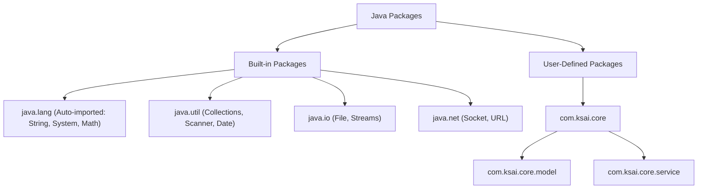
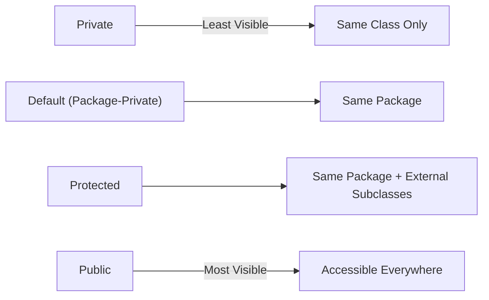
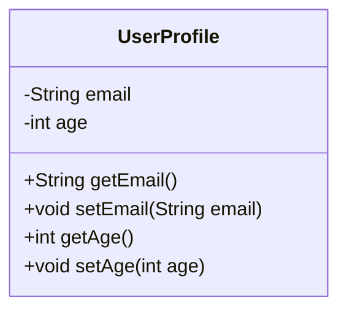

# JAVA - CHAPTER 8
## Packages, Access Modifiers & Encapsulation

> "Access modifiers build structural walls around soft-ware modules, exposing clean encapsulation interfaces while keeping internal state protected."

### By the End of This Chapter, You Will Be Able To:
* Organize Java code into Built-in and User-Defined Packages and Sub-packages.
* Apply the 4 Java Access Modifiers (`private`, `default` package-private, `protected`, `public`).
* Analyze the Access Modifier Visibility Matrix across same class, same package, subclasses, and external packages.
* Implement robust Encapsulation using getters, setters, and validation logic.
* Use `import` statements, static imports, and resolve package naming collisions.

---

### 1. Java Packages & Sub-Packages

A **Package** is a namespace that groups related classes, interfaces, and sub-packages together. Packages prevent naming collisions and facilitate modular code access control.



#### Package Conventions & Declaration Rules
1. Package names are written entirely in **lowercase** to avoid conflicts with class names.
2. Reverse domain name conventions are used (e.g., `com.companyname.projectname`).
3. The `package` declaration **MUST** be the very first non-comment line inside a `.java` file.

```java
package com.ksai.core.model;

public class Employee {
    private String empId;
    // ...
}
```

> [!NOTE]
> **Static Imports**
> Static imports allow accessing static fields/methods directly without prefixing the class name:
> ```java
> import static java.lang.Math.PI;
> import static java.lang.Math.sqrt;
> double area = PI * sqrt(16);
> ```

---

### 2. The 4 Access Modifiers

Java provides 4 levels of visibility control to govern access to classes, constructors, variables, and methods:

1. **`private`**: Visible **ONLY** within the declaring class itself. Most restrictive.
2. **`default` (Package-Private)**: No modifier keyword specified. Visible within the **same package**.
3. **`protected`**: Visible within the **same package** AND across **subclasses** located in external packages.
4. **`public`**: Visible **everywhere** across all packages in the project.



#### Complete Visibility Scope Matrix

| Access Modifier | Same Class | Same Package | Subclass (Outside Pkg) | External Package (Non-Subclass) |
| :--- | :--- | :--- | :--- | :--- |
| **`private`** | **YES** | NO | NO | NO |
| **`default`** | **YES** | **YES** | NO | NO |
| **`protected`** | **YES** | **YES** | **YES** | NO |
| **`public`** | **YES** | **YES** | **YES** | **YES** |

---

### 3. Encapsulation & Data Hiding

**Encapsulation** is the practice of bundling data fields and operations into a single unit (class) while hiding internal state details from external direct manipulation.

#### Steps to Implement Encapsulation
1. Declare instance fields as `private`.
2. Provide public `getter` and `setter` methods to inspect and update field values safely.
3. Incorporate validation checks inside setter methods to preserve object invariant validity.



#### Program 8.1 — Encapsulation with Invariant Validation

```java
package com.ksai.core.model;

public class UserProfile {
    private String username;
    private String email;
    private int age;

    public UserProfile(String username, String email, int age) {
        setUsername(username);
        setEmail(email);
        setAge(age);
    }

    // Getter & Setter for Username
    public String getUsername() {
        return username;
    }

    public void setUsername(String username) {
        if (username == null || username.trim().isEmpty()) {
            throw new IllegalArgumentException("Username cannot be blank.");
        }
        this.username = username;
    }

    // Getter & Setter for Email
    public String getEmail() {
        return email;
    }

    public void setEmail(String email) {
        if (email != null && email.contains("@")) {
            this.email = email;
        } else {
            throw new IllegalArgumentException("Invalid email format.");
        }
    }

    // Getter & Setter for Age with business validation
    public int getAge() {
        return age;
    }

    public void setAge(int age) {
        if (age >= 18 && age <= 120) {
            this.age = age;
        } else {
            throw new IllegalArgumentException("Age must be between 18 and 120.");
        }
    }
}
```

> [!WARNING]
> **Avoid Public Instance Fields**
> Making instance fields `public` breaks encapsulation because any code in any package can corrupt state without validation (e.g., setting `user.age = -500;`).

---

### 4. Resolving Package Naming Collisions

When two imported packages contain classes with identical names (e.g., `java.util.Date` and `java.sql.Date`), you must resolve the collision using fully qualified class names:

```java
import java.util.Date;
// import java.sql.Date; // Ambigous! Causes compiler collision error

public class DateTest {
    public static void main(String[] args) {
        // Simple name uses java.util.Date
        Date utilDate = new Date();

        // Fully qualified package name specifies java.sql.Date explicitly
        java.sql.Date sqlDate = new java.sql.Date(System.currentTimeMillis());

        System.out.println("Util Date: " + utilDate);
        System.out.println("SQL Date: " + sqlDate);
    }
}
```

---

### ✏ Try It Yourself
1. Create a package `com.ksai.security` containing a class `TokenManager` with a `protected` method `generateToken()`.
2. Create a sub-package `com.ksai.security.auth` containing a subclass `OAuthHandler` extending `TokenManager`. Verify that `OAuthHandler` can call `generateToken()`.
3. Try calling `generateToken()` from an unrelated class in `com.ksai.service` to verify that `protected` blocks non-subclasses in external packages.

---

### Chapter Summary

#### Key Takeaways
* **Packages** organize Java classes into namespaces to prevent naming collisions and enforce visibility boundaries.
* The 4 access modifiers are **`private`** (class only), **`default`** (package only), **`protected`** (package + subclasses), and **`public`** (everywhere).
* **Encapsulation** protects object state by combining `private` instance fields with validated public `getters` and `setters`.
* Duplicate class names across packages must be referenced using **Fully Qualified Class Names** (e.g., `java.util.Date`).

---

### Chapter Quiz & Exercises

#### Multiple Choice Questions
1. Which access modifier allows a class member to be accessed by subclasses in a different package, but blocks access from non-subclasses in that same external package?
   - A) `default`
   - B) `private`
   - C) `protected`
   - D) `public`
   *Correct Answer: C*

2. What is the visibility level of a variable declared without any access modifier (e.g., `int count = 10;`)?
   - A) Visible only inside the declaring method.
   - B) Visible to all classes within the same package.
   - C) Visible everywhere in the project.
   - D) Visible only to subclasses.
   *Correct Answer: B*

#### Practice Exercise
Design a secure `BankAccount` model in package `com.ksai.bank`:
1. `private` fields: `accountNumber`, `balance`, `pin`.
2. Public getters for `accountNumber` and `balance` (no getter for `pin`).
3. Methods `boolean validatePin(int enteredPin)` and `void withdraw(double amount, int pin)` with proper security validation.
