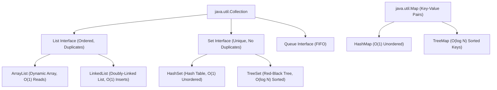
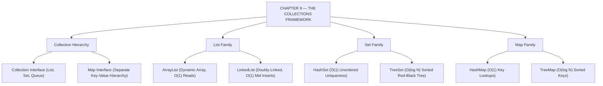

# JAVA - CHAPTER 9
## The Collections Framework

> “The Java Collections Framework provides the workhorse data structures of enterprise software development.” — A First Lesson in Data Engineering

### Learning Objectives
By the end of this chapter, you will be able to:
* Understand the root interfaces of the Collection hierarchy (`List`, `Set`, `Queue`, `Map`).
* Master the implementations of `List` and understand dynamic resizing mechanics.
* Enforce data uniqueness using `Set` implementations (`HashSet`, `TreeSet`).
* Store and retrieve data rapidly using key-value pairs in a `Map` (`HashMap`, `TreeMap`).
* Safely traverse collections using Iterators and avoid `ConcurrentModificationException`.

---

### Introduction
When you first learned about storing multiple values, you used standard Arrays (e.g., `int[] numbers = new int[5];`). While fast, arrays have a fatal flaw: their size is permanently fixed. If your array holds 5 items and you need to add a 6th, your program crashes. In the real world, data is dynamic. Shopping carts grow, active user lists shrink, and game lobbies expand. To handle dynamic data efficiently, Java provides the **Collections Framework**—a massive, highly optimized library of data structures designed to store, sort, and manipulate groups of objects effortlessly.

### Why This Topic Matters
The Collections Framework is the workhorse of Java programming. Whether you are building a mobile app, an enterprise web server, or a data-processing pipeline, you will use Collections every single day. Understanding the performance differences between an `ArrayList` and a `LinkedList`, or knowing when to use a `HashSet` instead of a `TreeSet`, is what separates junior programmers who write slow software from senior engineers who write highly optimized systems.

---

### Chapter Roadmap
* Concept 1: Collection Hierarchy and Interfaces
* Concept 2: List Implementations
* Concept 3: Set Implementations
* Concept 4: Map Implementations
* Concept 5: Iterators and the Collections Utility Class
* Learning Support Elements
* Debugging and Problem Solving
* Practical Application & Mini Project
* Practice and Evaluation
* Chapter Conclusion

---

> [!NOTE]
> **Real-Life Analogy: The Toolbox and Its Compartments**
> Think of the Collections Framework as a master toolbox:
> * **List**: A notebook with numbered pages. Order matters, and you can write the exact same thing on multiple pages (**duplicates allowed**).
> * **Set**: A strict bouncer at a club. Order doesn't matter, but if you are already inside, you cannot enter again (**no duplicates**).
> * **Queue**: A line at a grocery store counter (**First-In, First-Out / FIFO**).
> * **Map**: A dictionary. You look up a specific word (**Key**) to find its definition (**Value**).

---

### Real-World Applications

| Domain | How this chapter's ideas appear in practice |
| :--- | :--- |
| **User Authentication** | `HashSet` checks session token uniqueness in $O(1)$ time during high-concurrency requests. |
| **E-Commerce Catalogs** | `TreeMap` keeps product price categories automatically sorted for frontend navigation. |
| **Order Queue Processing** | `LinkedList` / `ArrayDeque` queues process incoming fulfillment requests in exact arrival sequence. |
| **Database Caching** | `LinkedHashMap` maintains least-recently-used (LRU) cache eviction order automatically. |
| **Inventory Search** | `HashMap` indexes inventory items by barcode SKU for instant scanning lookups. |
| **Leaderboard Systems** | `TreeSet` automatically orders game player high scores in ascending or descending rank order. |

---

### Core Learning Sections

#### CONCEPT 1: Collection Hierarchy and Interfaces
*Sub-topics Covered: 9.1 Iterable, Collection, List, Set, Queue, Map*

##### 9.1 Hierarchy Overview
The framework is rooted in two main branches:
1. `java.util.Collection`: The root interface for single-element collections, extended by `List`, `Set`, and `Queue`. (Inherits from `Iterable`).
2. `java.util.Map`: Represents key-value pairs. *Note: `Map` is part of the framework but does not inherit from `Collection` because key-value pairs behave differently than single elements.*

---

#### CONCEPT 2: List Implementations
*Sub-topics Covered: 9.2 ArrayList, LinkedList, Vector*

##### 9.2 The List Family
Lists maintain the insertion order of elements and allow duplicate values.
* **`ArrayList` (Most Common)**: Backed by a dynamic array. Excellent for reading data quickly ($O(1)$ index access), but slower for middle insertions/deletions ($O(N)$) due to array element shifting.
* **`LinkedList`**: Backed by a doubly-linked list. Excellent for middle insertions/deletions ($O(1)$ node pointer updates), but slower for reading data at an index ($O(N)$) due to sequential traversal.
* **`Vector`**: Legacy thread-safe (synchronized) dynamic array. Slower due to locking overhead; rarely used in modern single-threaded Java.

---

#### CONCEPT 3: Set Implementations
*Sub-topics Covered: 9.3 HashSet, LinkedHashSet, TreeSet*

##### 9.3 The Set Family
Sets guarantee that **no duplicate elements** exist within them.
* **`HashSet` (Most Common)**: Backed by a Hash Table. Fastest way to store and retrieve data ($O(1)$ time), but completely ignores insertion order.
* **`LinkedHashSet`**: Maintains a linked list through the hash table, preserving exact insertion order.
* **`TreeSet`**: Backed by a Red-Black Tree. Automatically sorts elements in natural ascending order (or alphabetically for strings) as inserted ($O(\log N)$ time).

---

#### CONCEPT 4: Map Implementations
*Sub-topics Covered: 9.4 HashMap, LinkedHashMap, TreeMap*

##### 9.4 The Map Family (Key-Value Pairs)
Maps store data in pairs (`K` $\rightarrow$ `V`). Keys must be strictly unique; values can be duplicated.
* **`HashMap` (Most Common)**: Unordered keys. $O(1)$ constant time for lookups and insertions.
* **`LinkedHashMap`**: Preserves the insertion order of keys.
* **`TreeMap`**: Automatically sorts keys in ascending/alphabetical order ($O(\log N)$ time).

---

#### CONCEPT 5: Iterators and the Collections Utility Class
*Sub-topics Covered: 9.5 Iterator, ListIterator, Collections utility*

##### 9.5 Iterating and Utilities
* **`Iterator`**: An object allowing safe collection traversal and element removal during iteration via `iterator.remove()`.
* **`Collections` Class**: Utility class providing static algorithms operating on collections, such as `Collections.sort(list)`, `Collections.reverse(list)`, and `Collections.max(list)`.



##### Code Example: Utilizing the Collections Framework
```java
import java.util.ArrayList;
import java.util.Collections;
import java.util.HashMap;
import java.util.HashSet;
import java.util.List;
import java.util.Map;
import java.util.Set;

public class CollectionsDemo {
    public static void main(String[] args) {

        System.out.println("--- 1. LIST (ArrayList) ---");
        // Always program to the Interface (List) rather than Implementation (ArrayList)
        List<String> names = new ArrayList<>();
        names.add("Charlie");
        names.add("Alice");
        names.add("Alice"); // Lists allow duplicates

        Collections.sort(names); // Sorting using utility class
        System.out.println("Sorted List: " + names);

        System.out.println("\n--- 2. SET (HashSet) ---");
        Set<Integer> uniqueNumbers = new HashSet<>();
        uniqueNumbers.add(10);
        uniqueNumbers.add(20);
        uniqueNumbers.add(10); // Sets silently reject duplicates!

        System.out.println("Set Contents: " + uniqueNumbers);

        System.out.println("\n--- 3. MAP (HashMap) ---");
        Map<String, String> capitalCities = new HashMap<>();
        capitalCities.put("England", "London");
        capitalCities.put("Japan", "Tokyo");
        capitalCities.put("USA", "Washington DC");

        // Iterating through a Map
        for (Map.Entry<String, String> entry : capitalCities.entrySet()) {
            System.out.println("Key: " + entry.getKey() + " | Value: " + entry.getValue());
        }
    }
}
```

##### Expected Output:
```text
--- 1. LIST (ArrayList) ---
Sorted List: [Alice, Alice, Charlie]

--- 2. SET (HashSet) ---
Set Contents: [20, 10]

--- 3. MAP (HashMap) ---
Key: Japan | Value: Tokyo
Key: USA | Value: Washington DC
Key: England | Value: London
```

---

### Learning Support Elements

> [!TIP]
> **Tips: Program to the Interface**
> Always declare variables using the Interface type on the left, and instantiate the concrete class on the right:
> * **Good:** `List<String> list = new ArrayList<>();`
> * **Bad:** `ArrayList<String> list = new ArrayList<>();`
> This allows swapping `ArrayList` for `LinkedList` later with only a one-word change.

> [!NOTE]
> **Important Notes: Generics (`<T>`)**
> Collections in modern Java strictly use Generics (`<T>`). Generics enforce compile-time type safety. If you declare `List<String>`, the compiler guarantees nobody can accidentally insert an `Integer` into that list.

> [!WARNING]
> **Warnings: Hashing and Custom Objects**
> If you create a custom class (like `Student`) and store it in a `HashSet` or use it as a Key in a `HashMap`, you **must** override `.equals()` and `.hashCode()` in your class. Otherwise, Java compares memory addresses, resulting in duplicate data and lost keys.

#### Common Misconceptions
* **Misconception:** "`Map` is part of the `Collection` interface."
* **Reality:** `java.util.Map` stands entirely on its own. It does not inherit from `java.util.Collection` because key-value pairs behave fundamentally differently than single elements.

#### Best Practices
* **Default to `ArrayList` and `HashMap`:** Unless you have a specific algorithmic reason (like constant sorting), `ArrayList` and `HashMap` cover 95% of standard programming scenarios with optimal overall performance.

---

### Debugging and Problem Solving

#### Runtime Error: `ConcurrentModificationException`
* **Cause:** Called `.remove()` or `.add()` on a collection while iterating through it using a standard `for-each` loop.
* **Fix:** Use an explicit `Iterator` object and call `iterator.remove()`, or use Java 8's `list.removeIf(predicate);`.

#### Runtime Error: `NullPointerException` with `TreeMap`
* **Cause:** Attempted to insert a `null` key into a `TreeMap`.
* **Fix:** `HashMap` allows one `null` key, but `TreeMap` attempts to sort keys immediately upon insertion. It cannot compare `null`, throwing an NPE. Do not use null keys in tree-based collections.

---

### Practical Application & Mini Project

#### Mini Project: Student Registry System
This project demonstrates mixing Maps and Sets to build a fast, logical university registry system that prevents duplicate enrollments and sorts student names automatically.

```java
import java.util.HashMap;
import java.util.Map;
import java.util.Set;
import java.util.TreeSet;

public class StudentRegistry {
    public static void main(String[] args) {
        System.out.println("=== UNIVERSITY REGISTRY SYSTEM ===\n");

        // 1. Map to store Student ID -> Name
        Map<Integer, String> studentDatabase = new HashMap<>();
        studentDatabase.put(101, "Alice Smith");
        studentDatabase.put(102, "Bob Jones");
        studentDatabase.put(103, "Charlie Davis");

        // Overwrites Key 102
        studentDatabase.put(102, "Robert Jones");
        System.out.println("Fast Lookup (ID 102): " + studentDatabase.get(102));

        // 2. Set to store Course Enrollments (TreeSet sorts automatically)
        Set<String> physicsClass = new TreeSet<>();

        physicsClass.add(studentDatabase.get(103)); // Adds Charlie
        physicsClass.add(studentDatabase.get(101)); // Adds Alice
        physicsClass.add(studentDatabase.get(103)); // Rejected duplicate!

        System.out.println("\n--- Physics 101 Roster ---");
        for (String student : physicsClass) {
            System.out.println("- " + student);
        }

        System.out.println("\nTotal Enrolled: " + physicsClass.size());
    }
}
```

##### Expected Output:
```text
=== UNIVERSITY REGISTRY SYSTEM ===

Fast Lookup (ID 102): Robert Jones

--- Physics 101 Roster ---
- Alice Smith
- Charlie Davis

Total Enrolled: 2
```

---

### Practice and Evaluation

#### Coding Exercises
* Create an `ArrayList<String>` of fruits. Add 4 items, sort them using `Collections.sort()`, and iterate printing each item.
* Create a `HashSet<String>` to store unique email addresses. Add duplicates and verify that `.size()` reflects unique entries only.

#### Interview Questions & Answers

1. **(Junior) What is the difference between an `ArrayList` and a standard Array?**
   * **Answer:** A standard Array has a fixed size defined at creation. An `ArrayList` is a dynamic data structure from the Collections Framework that resizes automatically (creating a larger array under the hood and copying elements) as data is added.

2. **(Junior) What is the difference between a `List` and a `Set`?**
   * **Answer:** A `List` is an ordered collection maintaining insertion order and allowing duplicate elements. A `Set` is an unordered collection strictly forbidding duplicates.

3. **(Junior) How do you iterate over a `HashMap`?**
   * **Answer:** You cannot iterate directly over a `Map`. Extract a `Set` of its entries using `map.entrySet()`, then iterate over that set using a `for-each` loop, accessing `.getKey()` and `.getValue()`.

4. **(Mid-Level) Explain the internal working of a `HashMap`.**
   * **Answer:** A `HashMap` is backed by an array of buckets. Calling `put(K,V)` computes `key.hashCode()` to locate the array index. If different keys hash to the same bucket (collision), entries are stored as a LinkedList (or Red-Black tree in Java 8+ if chain depth $>8$).

5. **(Mid-Level) Why is it critical to override `.equals()` and `.hashCode()` for custom Map keys?**
   * **Answer:** By default, Java compares objects by memory address. Overriding these methods teaches Java how to logically compare objects, ensuring `HashSet` and `HashMap` locate and deduplicate keys accurately.

6. **(Mid-Level) What causes a `ConcurrentModificationException`, and how do you fix it?**
   * **Answer:** It occurs when a collection is structurally modified (adding/removing items) while a thread iterates over it using a fail-fast iterator (`for-each`). Fix it using `Iterator.remove()`, `list.removeIf()`, or concurrent collections.

7. **(Senior) What is the time complexity difference between `ArrayList` and `LinkedList`?**
   * **Answer:** `ArrayList` offers $O(1)$ time for reading by index (`get(i)`), but $O(N)$ for middle inserts/deletes due to element shifting. `LinkedList` offers $O(N)$ for reading (sequential traversal), but $O(1)$ for middle inserts/deletes given node references.

8. **(Senior) What is the difference between Fail-Fast and Fail-Safe iterators?**
   * **Answer:** Fail-Fast iterators (`ArrayList`, `HashMap`) operate directly on the collection and throw `ConcurrentModificationException` if modified during iteration. Fail-Safe iterators (`ConcurrentHashMap`, `CopyOnWriteArrayList`) operate on a clone/snapshot, avoiding exceptions.

9. **(Senior) How does a `TreeSet` or `TreeMap` know how to sort custom objects?**
   * **Answer:** It uses a Red-Black tree under the hood. Custom objects must either implement `java.lang.Comparable` (defining `compareTo`), or a custom `java.util.Comparator` must be passed into the constructor.

10. **(Senior) Explain load factor and initial capacity in a `HashMap`.**
    * **Answer:** Initial capacity is starting bucket count (default 16). Load factor is threshold percentage (default 0.75). When entries exceed `Capacity * LoadFactor`, the map triggers "rehashing"—doubling array size and redistributing entries.

---

### Chapter Conclusion
In Chapter 9, you learned how to organize dynamic data. You explored the Collections Framework and learned to select the right structure: `ArrayList` for fast reads, `LinkedList` for mid-list edits, `HashSet` for uniqueness, and `HashMap` for lightning-fast key lookups.

#### Key Takeaways
* **Interface Programming:** Always use `List`, `Set`, or `Map` as variable types, not concrete class names.
* **List vs. Set:** `List` allows duplicates; `Set` strictly forbids duplicates.
* **Power of Maps:** `HashMap` provides $O(1)$ constant-time data retrieval using key lookups.
* **Beware Modification:** Never structurally modify a collection inside a standard `for-each` loop.

#### What to Learn Next
Now that you can store, sort, and search dynamic data in memory, it is time to persist it. In **Chapter 10: File I/O and Streams**, you will learn how to read data from local files, write logs to disk, and serialize Java objects.

---

### Progressive Code Examples: Four Tiers

#### TIER 1 · BEGINNER
##### List Creation and Sorting
**Goal:** Create a dynamic `ArrayList` of strings, add items, and sort them.

```java
import java.util.ArrayList;
import java.util.Collections;
import java.util.List;

public class BasicListDemo {
    public static void main(String[] args) {
        List<String> cities = new ArrayList<>();
        cities.add("Tokyo");
        cities.add("Paris");
        cities.add("New York");

        Collections.sort(cities);
        System.out.println("Sorted Cities: " + cities);
    }
}
```

##### Expected Output
```text
Sorted Cities: [New York, Paris, Tokyo]
```

> **What this tier adds:** Baseline. Dynamic `ArrayList` instantiation, `.add()`, and `Collections.sort()` utility.

---

#### TIER 2 · INTERMEDIATE
##### HashSet Uniqueness Enforcement
**Goal:** Verify duplicate rejection using `HashSet`.

```java
import java.util.HashSet;
import java.util.Set;

public class SetUniquenessDemo {
    public static void main(String[] args) {
        Set<String> tags = new HashSet<>();
        tags.add("java");
        tags.add("backend");
        tags.add("java"); // Rejected duplicate

        System.out.println("Unique Tag Count: " + tags.size());
        System.out.println("Tags: " + tags);
    }
}
```

##### Expected Output
```text
Unique Tag Count: 2
Tags: [java, backend]
```

> **What this tier adds:** `HashSet` duplicate rejection behavior and set size reporting.

---

#### TIER 3 · ADVANCED
##### Safe Traversal via Iterator
**Goal:** Safely remove elements during iteration without triggering `ConcurrentModificationException`.

```java
import java.util.ArrayList;
import java.util.Iterator;
import java.util.List;

public class SafeIteratorDemo {
    public static void main(String[] args) {
        List<Integer> numbers = new ArrayList<>(List.of(10, 15, 20, 25, 30));

        Iterator<Integer> it = numbers.iterator();
        while (it.hasNext()) {
            Integer val = it.next();
            if (val % 2 != 0) {
                it.remove(); // Safe removal during iteration
            }
        }

        System.out.println("Even Numbers Only: " + numbers);
    }
}
```

##### Expected Output
```text
Even Numbers Only: [10, 20, 30]
```

> **What this tier adds:** `Iterator` pattern, `.hasNext()`, `.next()`, and `it.remove()` mutation safety.

---

#### TIER 4 · PROFESSIONAL
##### Sorted Map Key Iteration with TreeMap
**Goal:** Maintain automatically sorted keys in a dictionary map structure.

```java
import java.util.Map;
import java.util.TreeMap;

public class SortedMapDemo {
    public static void main(String[] args) {
        Map<String, Double> stockPrices = new TreeMap<>();
        stockPrices.put("GOOGL", 140.50);
        stockPrices.put("AAPL", 185.20);
        stockPrices.put("MSFT", 375.10);

        System.out.println("=== AUTOMATICALLY SORTED STOCKS ===");
        for (Map.Entry<String, Double> entry : stockPrices.entrySet()) {
            System.out.println(entry.getKey() + ": $" + entry.getValue());
        }
    }
}
```

##### Expected Output
```text
=== AUTOMATICALLY SORTED STOCKS ===
AAPL: $185.2
GOOGL: $140.5
MSFT: $375.1
```

> **What this tier adds:** `TreeMap` automatic key sorting ($O(\log N)$ Red-Black tree backend) and map entry iteration.

---

### Common Mistakes and How to Fix Them

| The mistake | Why it happens | What you see (class) | The fix |
| :--- | :--- | :--- | :--- |
| **Modifying list in for-each** | Called `list.remove()` during loop | `ConcurrentModificationException` *(RUNTIME)* | Use `Iterator.remove()` or `list.removeIf(...)` |
| **Inserting null key in TreeMap** | `TreeMap` compares keys immediately | `NullPointerException` *(RUNTIME)* | Use `HashMap` if null keys are required |
| **Declaring concrete variable types** | `ArrayList list = new ArrayList()` | Tight coupling to concrete class *(STYLE)* | Declare with interface: `List<T> list = new ArrayList<>()` |
| **Missing `equals`/`hashCode` on keys** | Used default Object identity | Duplicate keys in `HashSet`/`HashMap` *(LOGIC)* | Override both methods on custom key classes |
| **Assuming HashSet preserves order** | `HashSet` uses hash table indices | Items print out of insertion order *(LOGIC)* | Use `LinkedHashSet` if insertion order must be preserved |
| **Unneeded LinkedList for reads** | Chose `LinkedList` by default | Slower $O(N)$ index access performance *(PERFORMANCE)* | Default to `ArrayList` for read-heavy workloads |

---

### Chapter Mind Map



---

> [!TIP]
> **Prepare for your Chapter Exam!**
> You have completed reading Chapter 9. Head to the **Take Chapter Quiz** assessment below to test your knowledge and unlock Chapter 10!
