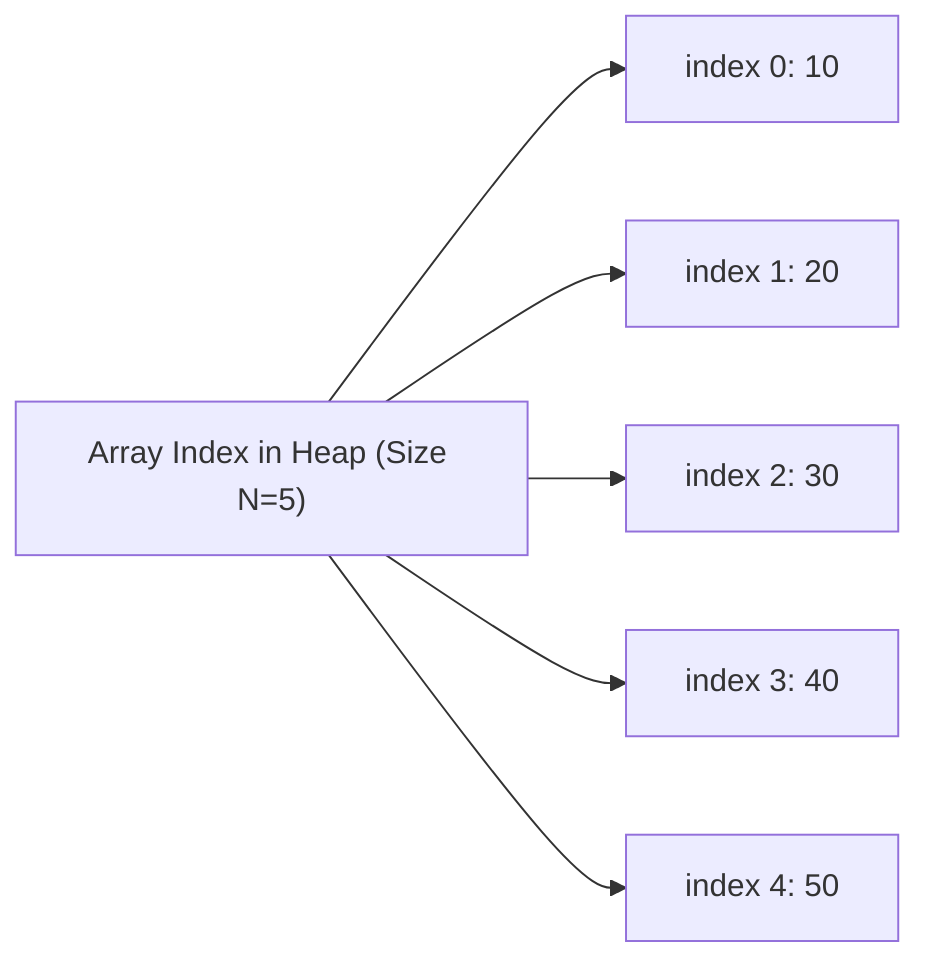
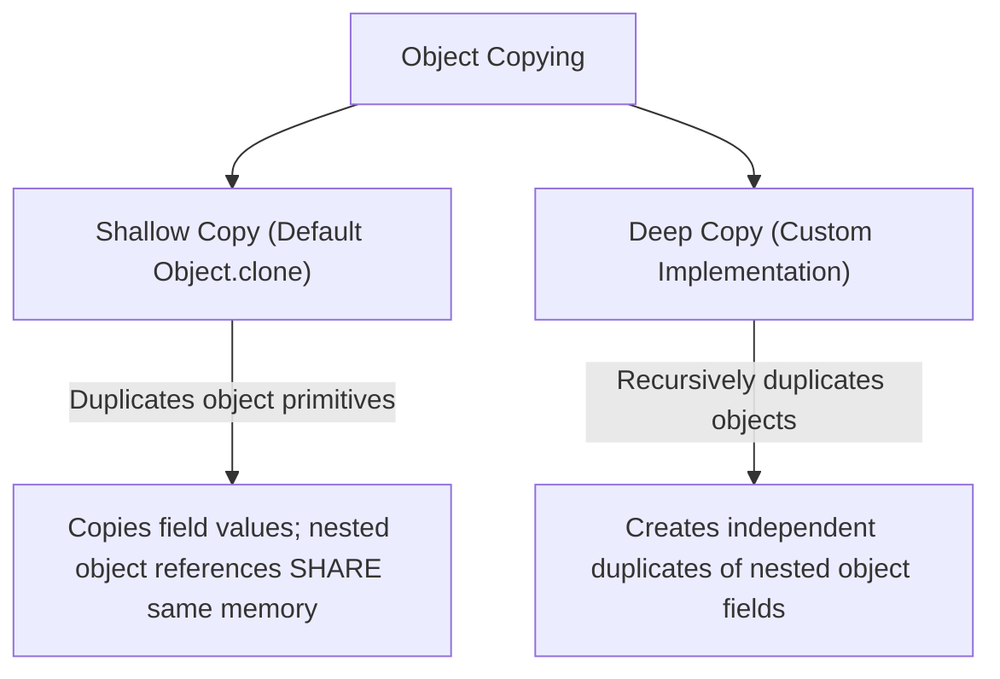

# JAVA - CHAPTER 9
## Arrays, Object Cloning & Math Utilities

> "Arrays establish low-level, contiguous memory blocks, while wrapper classes and cloning mechanisms bridge primitives to object-oriented frameworks."

### By the End of This Chapter, You Will Be Able To:
* Construct and manipulate single-dimensional, multi-dimensional, and jagged arrays in Java.
* Evaluate array trade-offs (fast indexing vs. fixed memory allocation limits).
* Override `Object` class methods (`equals()`, `hashCode()`, `toString()`) and implement object cloning using `Cloneable`.
* Perform Autoboxing and Unboxing between primitive types and their Wrapper objects.
* Explain the role of IEEE 754 floating-point standards and the `strictfp` keyword.

---

### 1. Java Arrays

An **Array** is a homogeneous data structure that stores a fixed-size sequential collection of elements of the same type in contiguous memory locations.



#### Advantages & Disadvantages of Arrays

| Category | Description |
| :--- | :--- |
| **Advantages** | • **$O(1)$ Random Access**: Instant element lookup via index.<br>• **Memory Efficiency**: Low memory overhead compared to collections. |
| **Disadvantages** | • **Fixed Size**: Size cannot grow or shrink dynamically after creation.<br>• **Homogeneous**: Only stores elements of declared type.<br>• **Contiguous Memory Requirement**: Requires continuous memory block allocation. |

#### Program 9.1 — Multi-Dimensional and Jagged Arrays

A **Jagged Array** is a multi-dimensional array where member sub-arrays can have varying row lengths.

```java
public class ArrayDemo {
    public static void main(String[] args) {
        // 1. Single-Dimensional Array
        int[] scores = {85, 90, 78, 92, 88};

        // 2. Jagged 2D Array Declaration (Varying column lengths per row)
        int[][] jaggedArray = new int[3][];
        jaggedArray[0] = new int[]{1, 2};          // Row 0 has 2 columns
        jaggedArray[1] = new int[]{3, 4, 5, 6};    // Row 1 has 4 columns
        jaggedArray[2] = new int[]{7, 8, 9};       // Row 2 has 3 columns

        System.out.println("Printing Jagged Array:");
        for (int r = 0; r < jaggedArray.length; r++) {
            for (int c = 0; c < jaggedArray[r].length; c++) {
                System.out.print(jaggedArray[r][c] + " ");
            }
            System.out.println();
        }
    }
}
```

---

### 2. The `Object` Class & Object Cloning

The `java.lang.Object` class is the root superclass of all Java classes. Every class implicitly inherits methods like `equals()`, `hashCode()`, `toString()`, and `clone()`.

#### Shallow Copy vs. Deep Copy



#### Implementing `Cloneable`
To enable object cloning, a class MUST implement the `java.io.Serializable` / `java.lang.Cloneable` marker interface and override `Object.clone()`. Otherwise, calling `clone()` throws `CloneNotSupportedException`.

```java
class Address implements Cloneable {
    String city;

    Address(String city) { this.city = city; }

    @Override
    protected Object clone() throws CloneNotSupportedException {
        return super.clone();
    }
}

public class Person implements Cloneable {
    String name;
    Address address;

    public Person(String name, String city) {
        this.name = name;
        this.address = new Address(city);
    }

    // Deep Copy Implementation
    @Override
    public Object clone() throws CloneNotSupportedException {
        Person clonedPerson = (Person) super.clone(); // Shallow clone primitive fields
        clonedPerson.address = (Address) this.address.clone(); // Deep clone nested object
        return clonedPerson;
    }

    public static void main(String[] args) throws CloneNotSupportedException {
        Person p1 = new Person("Alice", "New York");
        Person p2 = (Person) p1.clone(); // Deep clone

        p2.address.city = "San Francisco"; // Does NOT alter p1's address!

        System.out.println("P1 City: " + p1.address.city); // New York
        System.out.println("P2 City: " + p2.address.city); // San Francisco
    }
}
```

---

### 3. Wrapper Classes & Autoboxing / Unboxing

Java provides **Wrapper Classes** (`Integer`, `Double`, `Boolean`, etc.) in `java.lang` to encapsulate primitive data inside objects, allowing primitives to be used in generic collections (`ArrayList<Integer>`).

```mermaid
graph LR
    Primitive["Primitive: int x = 10"] -->|Autoboxing (Compiler)| Wrapper["Wrapper: Integer obj = x"]
    Wrapper -->|Unboxing (Compiler)| Primitive
```

| Primitive Type | Wrapper Class | Size | Autoboxing Example |
| :--- | :--- | :--- | :--- |
| `byte` | `Byte` | 8 bits | `Byte b = 5;` |
| `short` | `Short` | 16 bits | `Short s = 100;` |
| `int` | `Integer` | 32 bits | `Integer i = 250;` |
| `long` | `Long` | 64 bits | `Long l = 1000L;` |
| `float` | `Float` | 32 bits | `Float f = 3.14f;` |
| `double` | `Double` | 64 bits | `Double d = 99.9;` |
| `char` | `Character` | 16 bits | `Character c = 'K';` |
| `boolean` | `Boolean` | 1 bit | `Boolean flag = true;` |

---

### 4. The `strictfp` Keyword

The **`strictfp`** (Strict Floating-Point) keyword restricts floating-point calculations (`float` and `double`) to strictly adhere to the IEEE 754 standard across all target operating systems and CPU architectures.

- **Purpose**: Prevents platform-specific floating-point CPU register precision variance (e.g., 80-bit x87 coprocessor vs 64-bit SSE2).
- **Usage**: Can be applied to classes, interfaces, or methods.

```java
public strictfp class FinancialCalculator {
    public double calculateInterest(double principal, double rate) {
        return principal * Math.pow(1 + rate, 5); // Identical result across Intel, ARM, and RISC-V CPUs
    }
}
```

---

### ✏ Try It Yourself
1. Create a 2D array representing a $3 \times 3$ matrix and write a function to calculate its transpose.
2. Create an `Order` object with a list of item prices. Implement both shallow cloning and deep cloning methods, and verify that modifying the cloned order does not corrupt the original order state.

---

### Chapter Summary

#### Key Takeaways
* **Arrays** provide $O(1)$ fast indexed access but have a fixed size allocated at creation time.
* **Jagged Arrays** have rows with varying numbers of columns.
* **Shallow Copy** duplicates primitive fields but shares nested object references; **Deep Copy** duplicates all nested objects recursively.
* **Autoboxing** automatically converts primitive types to Wrapper objects (`int` to `Integer`); **Unboxing** does the reverse.
* **`strictfp`** enforces strict IEEE 754 floating-point evaluation consistency across diverse CPU hardware.

---

### Chapter Quiz & Exercises

#### Multiple Choice Questions
1. What exception is thrown if you call `clone()` on an object whose class does NOT implement `Cloneable`?
   - A) `NullPointerException`
   - B) `CloneNotSupportedException`
   - C) `IllegalStateException`
   - D) `ClassCastException`
   *Correct Answer: B*

2. Which process automatically converts an `Integer` object into a primitive `int`?
   - A) Widening
   - B) Autoboxing
   - C) Unboxing
   - D) Downcasting
   *Correct Answer: C*

#### Practice Exercise
Create a program `ArrayAnalytics.java` that initializes an array of 100 random integers, calculates min, max, average, and standard deviation using `Math` utilities, and displays the results.
